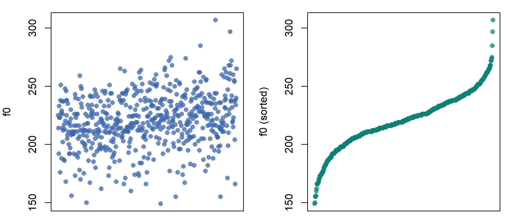
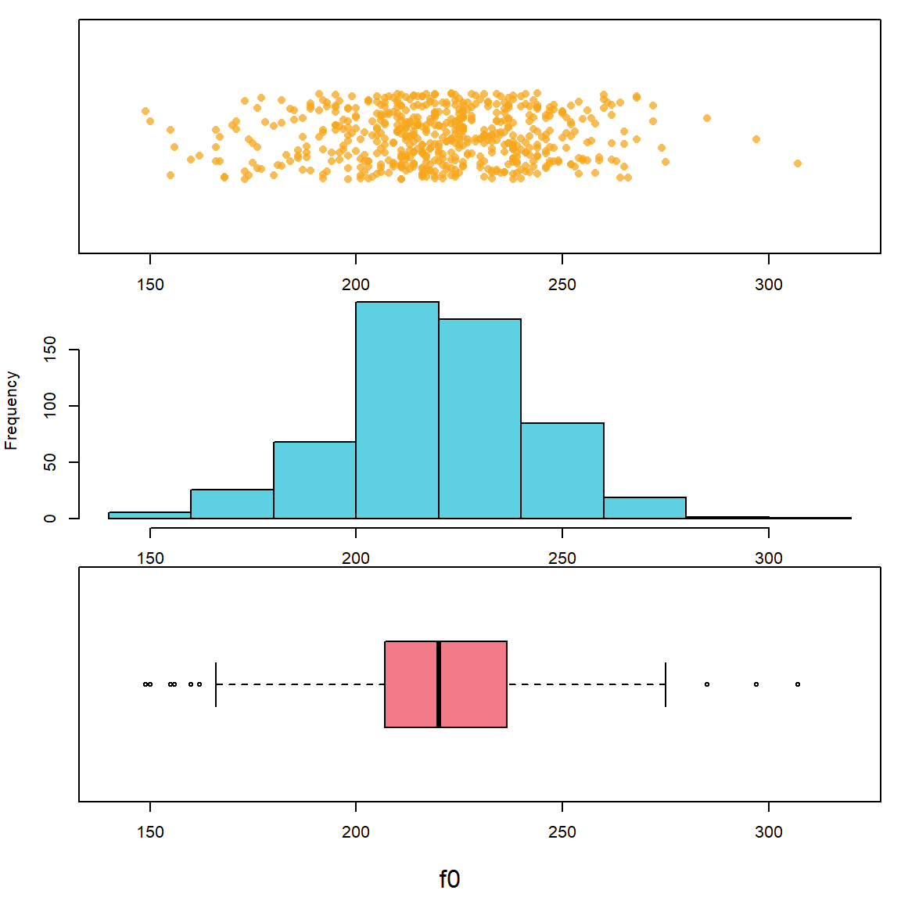
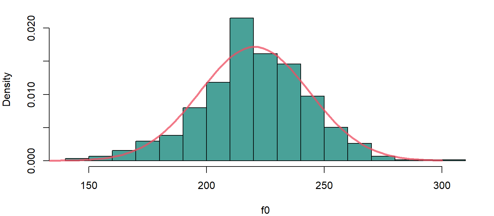
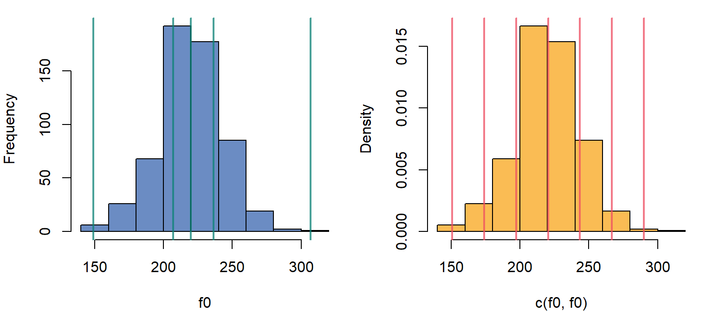
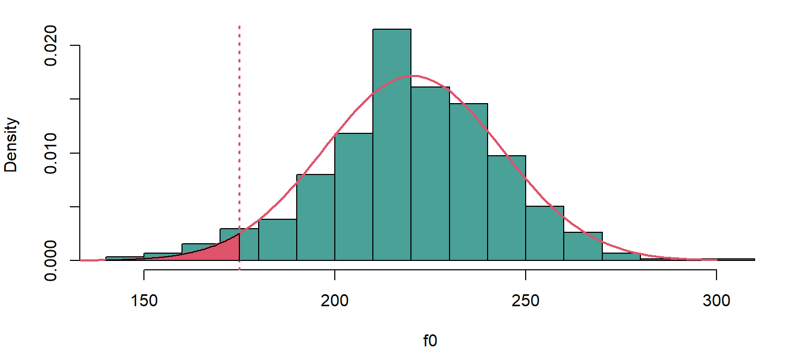
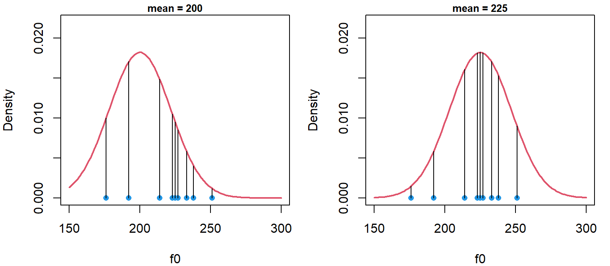
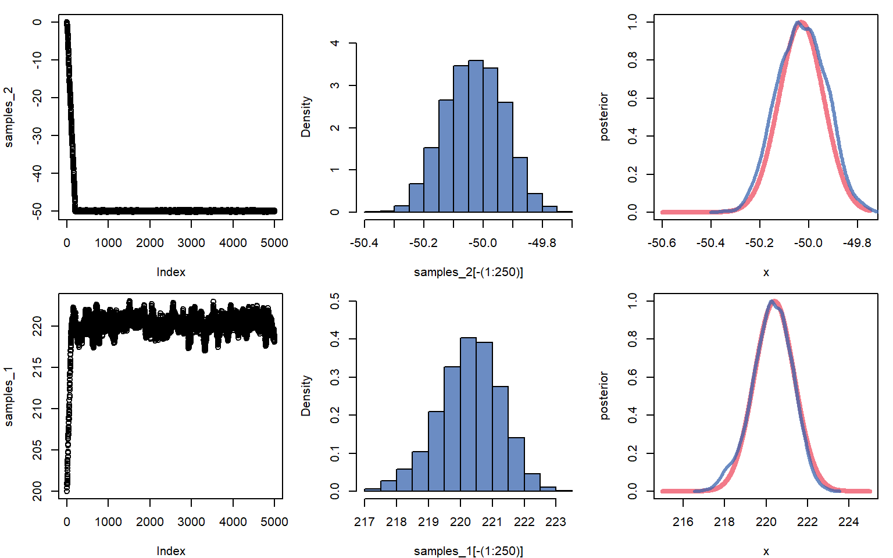

# Inspecting a single group of observations  

In this chapter I am going to present an introduction to some fundamental statistical concepts (i.e, probability, likelihood). We will discuss how to use these concepts to make inferences about our observations. The things I talk about in this chapter will be come up in every chapter, so if things don't all make snese right now that's fine, things will make more sense bit by bit as we learn how to use more and more complicated models.  

## Data and research questions 

Basically the simplest question a researcher can ask is: what is the value of a single number? What is the average ________ ? As an example of this, we are going to investigate variation in voice fundamental frequency (f0) in a sample of speakers. The f0 of a voice is the primary determinant of perceived pitch, and is a very important cue in speech communication. It relates to phoneme identification, prosody, and to the communication of social and indexical information (speaker gender, age, ...etc.). 

We are going use a well-known data set, the [Hillenbrand et al. (1995)](https://homepages.wmich.edu/~hillenbr/Papers/HillenbrandGettyClarkWheeler.pdf) data of Michigan English. We are going to focus on a single vector (f0),  representing the f0 produced by a set of female speakers. 


```r
url1 = "https://raw.githubusercontent.com/santiagobarreda"
url2 = "/stats-class/master/data/h95_vowel_data.csv"
## read data from my Github page
h95 = read.csv (url(paste0 (url1, url2)))
## set up colors for plotting
source (url(paste0 (url1, "/stats-class/master/data/colors.R")))

# select the 'f0' vector, for women only (speaker type = 'w')
f0 = h95[['f0']][h95$group == 'w']
```

These speakers represent a sample from a larger population. The sample is a finite set of observations that you actually have. The population is the (hypothetical) larger group of all possible observations that you are *actually* interested in. For example, Hillenbrand et al. collected this data not to study these speakers in particular, but instead to make inferences about Michigan speakers more generally. 

Similarly, we want to answer a few basic questions about the population of female speakers from Michigan, not about the sample itself:

1) What is the average f0 of the whole *population* likely to be?

2) Can we set bounds on likely mean f0 values based on the data we collected?

The second point is crucial. First, our sample will never exactly match the population. But it should be *representative* of it, meaning it should not be *too* far off from the real mean. If it is too far off, then is it really a representative sample from that population? For example, the mean f0 in the data we will discuss below is 220 Hz. This seems to suggest that, for example, a *true* mean of 100 Hz is unlikely. Is a true mean of 150 Hz also unlikely? What about 190 Hz? 

### Inspecting the central location and spread of values 

We can easily find important information about our sample like the sample mean ($\bar{x}$), the number of observations, the sample standard deviation ($s_x$), and important quantiles for this sample of f0 values. The quantiles below correspond to the values of ordered observations, like in the right plot in Figure \@ref(fig:initialplot). The 0% quantile is the smallest (leftmost) observation, while 100% is the highest (rightmost) observation. Any other quantile is found by ordering the observations and selecting the observation that is higher than x% of the sample values. For example, the 50% quantile (the median) is higher than 50% of values, and the 25% quantile is higher than 1/4 of the values in the sample. 


```r
par (mfrow = c(1,2), mar = c(1,4,1,1))
plot (f0, xaxt='n',xlab='', ylab = 'f0', pch = 16, col = skyblue)
plot (sort (f0), xaxt='n',xlab='',ylab='f0 (sorted)', pch=16, col = deepgreen)
```

<div class="figure">

<p class="caption">(\#fig:initialplot)(left) Plot of values in the order they appear in the original data. (right) Observations ordered by increasing value.</p>
</div>


```r
## calculate basic descriptive statistics
mean (f0)
```

```
## [1] 220.401
```

```r
length (f0)
```

```
## [1] 576
```

```r
sd (f0)
```

```
## [1] 23.22069
```

```r
quantile (f0)
```

```
##     0%    25%    50%    75%   100% 
## 149.00 207.00 220.00 236.25 307.00
```

We can look at the distribution of productions of f0 in several ways, as seen in Figure \@ref(fig:distributioncomparison). In the top row, points indicate individual productions, and are jittered along the y axis to make them easier to see. In the middle row we see a histogram of the same data. The histogram divides the x axis into a set of discrete sections ('bins'), and gives you the count of observations in each bin. In the bottom row we see a box plot of the same data. The edges of the box correspond to the 25 and 75% quantiles of the distribution, and the line in the middle of it corresponds to the median. As a result, 50% of observations are contained in the box.   


```r
par (mfrow = c(3,1), mar = c(1,4,1,1), oma = c(4,0,0,0))
plot (f0, jitter (rep(1,length(f0))), xlim = c(140, 320), ylim = c(.95,1.05),
      yaxt='n',ylab='', pch = 16, col = yellow)
hist (f0,main="", col = teal)
boxplot (f0, horizontal = TRUE, ylim = c(140, 320), col = coral)
mtext (side =1, outer = TRUE, text = "f0", line = 2.5)
```

<div class="figure">

<p class="caption">(\#fig:distributioncomparison)Different ways to consider our distribution of f0 values.</p>
</div>

## Probability Distributions

Histograms are particularly useful to understand because of how they relate to probability distributions. For our purposes, the probability is the number of times an event is expected to occur, out of all the other observed events and outcomes. This can also be thought of as the *percent* of times an event is expected to occur. 

The total probability of all events is always equal to 1. This is like using 100 to communicate percent, its just easier that way. As a result of this convention, you know that a probability of 0.5 means something is expected to occur half the time (i.e., on 50% of trials). For example, suppose we want to know the probability of being an adult female in our sample who produces an f0 under 175 Hz. Finding the probability of observing this event is easy:


```r
# the evaluation in the parenthesis will return 1 if true, 0 if false
sum (f0 < 175)  ## number of observations the fall below threshold
```

```
## [1] 22
```

```r
sum (f0 < 175) / length (f0)  ## divided by total number of events
```

```
## [1] 0.03819444
```

```r
mean (f0 < 175) ## a shortcut to calculate probability, mean = total/length
```

```
## [1] 0.03819444
```

The top value is the frequency of the occurrence. This is not so useful because this number can mean different things given different sample sizes (e.g., 22/23, 22/10000). The middle and bottom values have been divided by the total number of observations. As a result, these now represent a proportion, or probability. 

Histograms can also show this difference between total counts and probabilities. Below, the histogram on the left shows the number of observations in each bin. The histogram on the right shows *density* on the y axis. When you see *density* on the y axis, that means that y axis values have been scaled to make the area under the curve equal to 1. This has two benefits:

  1) It lets you compare the distribution of values across different sample sizes. 
  2) It makes the histogram more comparable to a probability distribution. 
  

```r
par (mfrow = c(1,2), mar = c(4,4,1,1))

hist (f0, main="", col = lavender)
hist (f0, freq = FALSE, main = "", col = deepgreen)
```

<div class="figure">

<p class="caption">(\#fig:twohists1)(left) A histogram of our f0 data showing counts in each bin. (right) A histogram of our f0 data showing densities.</p>
</div>

The density is just the thickness of the distribution at a certain location. In probability theory, the sum of the probabilities of all possible outcomes is 1, by definition. So, the fact that the area under the curve of a density is equal to 1 means that the density contains all your *stuff*, all the possible outcomes of the variable we are discussing.

Imagine a circle like in a Venn diagram that contains all possible productions of female f0. This circle has an area of 1 since it contains all possible instances of the variable. Imagine we spread out this circle along the x axis so that its shape reflected the relative frequencies of different values of the variable. For example, if some outcomes were 5 times more probable than others, the shape should be 5 times taller there, and so on. If we managed to do this, the height (or 'density') of this shape would exactly correspond to a probability distribution like that seen in the right plot above.   

Below I've repeated the data, doubling the counts. Notice that the y axis in the right panel does not change. This is because increasing the number of observations changes your counts but not the relative frequencies of observations. For instance, increasing the number of coin flips will not change the fact that 50% will be heads, but it will change the number of heads observed. 


```r
par (mfrow = c(1,2), mar = c(4,4,1,1))
hist (c(f0,f0), breaks = 10, main = "", col = lavender)
hist (c(f0,f0), freq = FALSE, breaks = 10, main = "", col = deepgreen)
```

<div class="figure">

<p class="caption">(\#fig:twohists2)The counts have been doubled relative to above.</p>
</div>

### The normal distribution

The distribution of [many variables](https://www.youtube.com/watch?v=4HpvBZnHOVI) (including f0) follows what's called a [normal distribution](https://en.wikipedia.org/wiki/Normal_distribution). This means if you take a random sample of a variable and arrange observations into bins, they will tend to resemble the shape of a normal distribution. This distribution is also called a Gaussian distribution and has a familiar, bell-shaped curve.  

The normal distribution has the following important characteristics. 

1. The distribution is approximately symmetrical - i.e., producing a higher or lower than average f0 is about equally likely.  

2. The probability of observing a given value decreases as you get further from the mean. 

3. It's easy to work with, very well understood, and naturally arises in basically all domains. 

Normal distributions have two parameters. This means they vary from each other in only two ways. These parameters are:

1. A mean, $\mu$, which determines where the distribution is located along the x axis. The mean is the 50% halfway point of the 'mass' of the distribution. If the distribution were an physical object, its mean would be its center of gravity. 

2. A standard deviation, $\sigma$, that determines its *spread* along the x axis. Since every distribution has an area under the curve equal to one (they all have the same 'volume'), the smaller the variance the higher the peak of the density along the y axis must be. 

Below, I compare the histogram of f0 values to the density of a normal distribution with a mean equal to our sample mean ($\mu = \bar{f0}$) and a standard deviation equal to our sample standard deviation ($\sigma = s_{f0}$). The density was drawn using the `dnorm` function. This function will help draw a curve representing the shape of a theoretical normal distribution with a given mean and standard deviation. 


```r
par (mfrow = c(1,1), mar = c(4,4,1,1))
hist (f0, freq = FALSE, main = "", breaks = 20, col = deepgreen)
abline (v = 63.8, lwd = 2, col = 2, lty=3)
## plots the normal density (red line) using stats calculated form our sample. 
curve (dnorm (x, mean(f0), sd(f0)), from = 100, to = 300, 
       lwd=3, col = coral, add = TRUE)
```

<div class="figure">

<p class="caption">(\#fig:theoretical)A comparison of the data distribution with a theoretical normal distribution.</p>
</div>

When you are dealing with normally-distributed data, summary statistics can tell you a lot about the shape of your distribution, and about where you can expect the bulk of the density/distribution to lie. The left panel shows the locations of quantiles (0%, 25%, 50%, 75%, 100%), the right panel shows you the mean and standard deviations from the mean (-3, -2, 0, +1, +2, +3). Notice that ±2 standard deviations enclose most of the distribution (around 95%), and ±3 standard deviations enclose almost all of it (99%).


```r
par (mfrow = c(1,2), mar = c(4,4,1,1))

hist (f0, main = "", col = skyblue)
abline (v = quantile (f0), lwd = 2, col = deepgreen)
hist (c(f0,f0), freq = FALSE, breaks = 10, main = "", col = yellow)
abline (v = seq (mean(f0)-3*sd(f0),mean(f0)+3*sd(f0),sd(f0)), lwd = 2, 
        col = coral)
```

<div class="figure">

<p class="caption">(\#fig:quantiles)Quantiles and standard deviations help understand the shape of a distribution.</p>
</div>

### Referring to the normal distribution to make inferences  

In general, it is impossible to know what the 'true' data distribution is, so that *perfect* inference is not possible. As a result, scientists often use theoretical probability distributions to make inferences about real-life populations and observations. Notice that our real life measurements follow the 'shape' predicted by the theoretical normal distribution. This suggests that we may be able to use the characteristics of an appropriate normal distribution to make inferences about female f0 (and other variables).

Using a normal distribution to make inferences about your data is like using a mathematical model for spheres to understand the behavior of billiard balls. In reality the balls are not perfect spheres. However, their shapes will be spherical enough to allow us to make useful predictions based on the simplified model. In general, it is useful to keep in mind that reality will never exactly conform to our model. This can result in unpredictable errors in our conclusions. In general, the things you don't know you don't know are the things that will cause the most problems. If you know where your model went wrong, you would have fixed it!

Since we expect the distribution of f0 values to have the shape of the normal distribution, we can use the shape of the normal distribution to make inferences about the distribution of f0 values, even the ones we did not observe. For example, we can use the theoretical normal density to estimate the probability of observing a female production with an f0 of under 175 Hz, from among *all* possible observable productions of f0 in this *population*.

We do this by referring to the proportion of values expected to be less 175 Hz in the normal distribution that has the same 'shape' as our sample. This can be found by finding the area under the curve of the probability density to the left of that point (the red area below). Since the *total* area is always equal to 1, the area of the red portion below corresponds to a percentage/probability. 

Below, I use the function `pnorm` to find the proportion of values that are expected to be greater/less than 175 Hz. I use the parameters estimated form our sample to run the `pnorm`function, as these are our best guesses of the population parameters. As we can see, this value is reasonably close to our empirical proportion, which was 0.038 (3.8%). 


```r
par (mfrow = c(1,1), mar = c(4,4,1,1))
hist (f0, freq = FALSE, main = "", breaks = 20, col = deepgreen)
abline (v = 175, lwd = 2, col = 2, lty=3)
## plots the normal density (red line) using stats calculated form our sample. 
curve (dnorm (x, mean(f0), sd(f0)),from=100, to=300, lwd=2, col = 2, add=TRUE)

x = c(140,seq(140,175,length.out = 100),175)
y = c(0,dnorm(seq(140,175,length.out = 100), mean (f0), sd (f0)),0)
polygon(x, y, col='2')
abline (v = 63.8, lwd = 2, col = 2, lty=3); abline (v = 70, lwd = 2,col=1,lty=3)
```

<div class="figure">

<p class="caption">(\#fig:prediction)The read area relects the distribution of outcomes that satisfy f0 < 175 Hz.</p>
</div>

```r
## probability of observing a production below 175 Hz
pnorm (175, mean (f0), sd(f0))
```

```
## [1] 0.02527988
```

```r
## probability of observing a production greater than 175 Hz
1 - pnorm (175, mean (f0), sd(f0))
```

```
## [1] 0.9747201
```

Imagine you had 1 pound of clay and I asked you to make a shape **exactly** like the normal density (red curve) above with a constant depth. The 'area under the curve' would just correspond to the amount of clay in a certain area. So, if you made the density just right and I took a knife and cut the shape left of 175 Hz (the red part) and we weighed it, it should weigh 2.5% of a pound. So, the area under the curve, the probability, is just the amount of the *stuff* in the density that falls below/above a certain point, or between two points. 
  
Since the total number of observations is always one. This helps us compare across many different actual numbers of observations. The probability above suggests the following:    


```r
## probability of observing a production with an f0 under 175 Hz
pnorm (175, mean (f0), sd(f0)) 
```

```
## [1] 0.02527988
```

```r
## expected count
pnorm (175, mean (f0), sd(f0)) * length (f0)
```

```
## [1] 14.56121
```

```r
## actual count
sum (f0 < 175)
```

```
## [1] 22
```

We can also use this theoretical distribution to think about other possible outcomes:


```r
min (f0)
```

```
## [1] 149
```

```r
pnorm (149, mean (f0), sd(f0)) # probability of observing our smallest value
```

```
## [1] 0.001052907
```

```r
pnorm (140, mean (f0), sd(f0)) # probability of observing a smaller value
```

```
## [1] 0.0002676171
```

```r
## predicted number of tokens below 175 Hz if we was had 5500 observations
pnorm (175, mean (f0), sd(f0)) * 5500
```

```
## [1] 139.0394
```

## Probabilities of events and likelihoods of parameters

We are going to switch from talking about *probabilities* to talking about *likelihoods*. A probability is the odds of observing some data/event/outcome, given some parameter(s). A likelihood places odds on different *parameters* given some observed data. Every parameter for every probability distribution has a likelihood function, given some data. I am only going to talk about the likelihood of the normal mean parameter, $\mu$, in detail. 

The *likelihood function* is a curve showing the relative likelihoods of different parameter values, given a fixed set of data. The likelihood function tells you what values are *believable* given your data. If a value is very unlikely, that means that it is not supported by your data. In other words, unlikely parameter estimates represent conclusions that your data is rejecting as not viable. 
Here are three useful properties of the likelihood functions of $\mu$, the mean parameter of the normal distribution:
 
1. The likelihood function of $\mu$ will tend to be a normal distribution. 

2. The mean (and peak) of the likelihood function of $\mu$ given some sample $x$ is equal to the arithmetic mean of the sample ($\bar{x}=mean(x)$).

3. The standard deviation of the likelihood of $\mu$ is equal to the standard deviation of the data ($s_x=sd(x)$), divided by the square root of N (the sample size). 

The first point tells us that we can use the normal distribution to make inferences about likely, and unlikely values for means, given some data. 

The second point says that if you are wondering what the best (most likely) estimate of $\mu$ is given your sample, the answer is the arithmetic mean of your sample ($\bar{x}$). 

The third point means that the likelihood function for $\mu$ will tend to be *much* narrower than the distribution of our original data. This is because a mean based on, for example, 50 samples will contain many positive and negative deviations from the average that will tend to cancel out. As a result, the more data you have the more *precise* your estimates are, and the less *uncertainty* is associated with any estimate. 

The left panel in Figure \@ref(fig:likelihood1) (code at end of chapter) shows the likelihood function for $\mu$ based on the first 10 observations of our f0 vector, shown by the blue points at the bottom of the plot. I chose this small sample just to make this example clearer. Notice that the most likely mean values of $\mu$ for these points like over the bulk of the sampled values. The vertical dotted lines show three possible mean values that will be highlighted. 

The likelihood of any parameter estimate (e.g., $\mu$ = 175 Hz in the right panel of Figure \@ref(fig:likelihood1)) is equal to the product of the density of each observation in the sample, if we assume that the estimate were true. For example, to calculate the likelihood that $\mu=175$, we: 

  1) Assume that the data is generated by a normal distribution with a $\mu$ equal to 175 Hz, and $\sigma$ equal to the sample standard deviation ($s_{f0}$). 

  2) Find the the height of the curve of the probability distribution (the density) over each point (indicated by lines in the right panel below). 

  3) The likelihood is the product of all of these densities (heights). In practice, the logarithms of the individual probabilities are added together, yielding the *log-likelihood*. This is because multiplying together too many fractions can lead to numbers so small computers have a hard time representing them, and adding logarithms is equivalent to multiplying the original values.  

Imagine I follow the steps above for each position along the x axis, recording the likelihood values I calculate. I then plot the product of the densities for each corresponding x value. If I do this I have just plotted a likelihood function for $\mu$ given our data. 
  
&nbsp;
<div class="figure">

<p class="caption">(\#fig:likelihood1)(Left) The likelihood of the population mean given the blue points in the figure. (right) The probability of the points given an assumed mean of 175 Hz.</p>
</div>
&nbsp;

In the right panel in Figure \@ref(fig:likelihood1) we see that a normal distribution with a $\mu$ of 175 Hz is very unlikely to generate this data. Many points are extremely improbable and have densities close to zero. As a result, the product of these values (the heights of the lines) will be a very small number. This is reflected in the extremely small values in the likelihood function at 175 Hz in the left panel above. 

In the left panel in Figure \@ref(fig:likelihood2) (code at end of chapter), we see that a normal distribution with a $\mu$ of 200 Hz is more likely to generate this data, and the probability distribution is clearly a much better fit. However a distribution with a mean of 200 Hz is still not very likely to have generated this data. 

Finally, in the right panel below we see the the maximum likelihood estimate of 225 Hz, the value representing the peak of the likelihood function (in the left panel above). When we say that 225 Hz is the most likely mean for this data, we are saying that this data is most probably the outcome of a normal distribution centered at 225 Hz, relative to the alternatives. 

&nbsp;
<div class="figure">

<p class="caption">(\#fig:likelihood2)(Left) The probability of the points given an assumed mean of 200 Hz. (right) The probability of the points given an assumed mean of 225 Hz.</p>
</div>
&nbsp;

### Making inferences using likelihoods

Previously, I mentioned using the normal distribution to make inferences. When variables are normally distributed we can use the theoretical normal distribution and functions such as `pnorm` to answer questions about values we expect, and don't expect, to see. 

We can take this same approach to make inferences about *parameters* when their likelihood functions follow a normal distribution. For example, we can use the results of the calculations below:


```r
mean (f0)   ## sample mean
```

```
## [1] 220.401
```

```r
sd (f0)     ## sample standard deviation
```

```
## [1] 23.22069
```

```r
length (f0)  ## sample size
```

```
## [1] 576
```

```r
sd (f0) / sqrt ( length (f0) ) ## the standard deviation of the likelihood function
```

```
## [1] 0.9675289
```

To draw the expected likelihood function for $\mu$ given our data and our model. You may be thinking, what model? It may seem too simple to be a model, but by assuming that our data can be understood as coming from a normal distribution with some given $\mu$ and $\sigma$, we have already created a simple model for our data. I'll return to this below. 

We can take our model and our parameter estimates and draw the likelihood function for $\mu$. We can then use the `qnorm` function to calculate quantiles for our likelihood, presented below. I added vertical lines at the 2.5% and 97.5% quantiles of our distribution. These vertical lines enclose 95% of the likelihood density, and so represent the range of values representing the 95% most likely values of $\mu$. I chose an interval enclosing 95% of the likelihood because this is used by convention. This is a commonly-used interval but otherwise has no special significance.  


```r
par (mfrow =c(1,1), mar = c(4,4,1,1))
curve (dnorm (x, mean(f0), sd(f0)/sqrt(length(f0))), xlim = c(216,225),
       ylab = 'Density', xlab = 'f0', col = lavender, lwd = 4)
quantiles = qnorm (c(0.025, 0.975), mean (f0), sd (f0) / sqrt (length (f0) ) )
quantiles
```

```
## [1] 218.5047 222.2974
```

```r
abline (v = quantiles, lwd=2,col=deepgreen)
```

<div class="figure">

<p class="caption">(\#fig:likelihood)Likelihood of population mean given our data. Horizontal lines indicate intervals enclosing 95% of the distribution.</p>
</div>
&nbsp;

The likelihood tells you about the most believable/credible parameter values, given your model and data. Given the information presented in the figure above, we may conclude that the most likely parameter values fall between 218 and 222 Hz. This means that it is reasonable that the true value might be 221 Hz, as this value is very likely given our sample. Basically, maybe our sample mean is wrong and arose by accident, and 221 Hz is the true $\mu$. This outcome is compatible with our data. 

However, a value of 216 Hz is extremely *unlikely* to fit our data. It is just too far from our sample mean relative to the amount of variation in our sample. This is like if you measured the heights of 100 women in a small town (pop. 1500) and found the average was 5'4". You might accept that the actual population average is 5'5", but may find it difficult to accept that it was actually 6'0". It would mean you happened to measure all of the shortest women in the town, an extremely unlikely event. 

So, since we think that 216 Hz is not a plausible mean f0 given our sample, this also means that it is very unlikely that the real $\mu$ is 216 Hz. This is because a distribution centered at 216 would be extremely unlikely to generate a sample mean of 220 Hz. Using this aproach, we can rule out implausible values of $\mu$ based on the characteristics of our data.

At this point we can offer conventional responses to the research questions posed at the start of the Chapter:

  Q1) What is the average f0 of the whole *population* likely to be?

  A1) The most likely value for the population mean is our sample mean, 220.4 Hz. 

  Q2) Can we set bounds on likely mean f0 values based on the data we collected?

  A2) Yes, there is a 95% probability that the population mean is between 218.5 222.3 Hz, given our data and model structure. 

Traditional approaches to statistics (sometimes generally referred to as 'frequentist') estimate parameters by trying to find the most likely values for parameters (i.e., 'maximum likelihood estimation'). They do this by referring to the theoretical likelihood functions such as what we plotted above. Although this works very well for simple data, it is difficult if not impossible for some of the more complicated datasets that often arise for even the simplest research questions in linguistics. 


## Bayesian models

In this class we are going to learn about *multilevel Bayesian models*. These models have many advantages over 'traditional' approaches. They provide researchers with more information, are more robust, and at **worst**, they are as good as traditional models. I may sound biased, but the main reason for all of these advantages is that traditional models were developed over 100 years ago. On the other hand, mathematical and technological advances have only made Bayesian multilevel models possible in the last 10+ years. It is only reasonable that the newer approaches should offer some advantages over methods developed before calculators existed. 

Here, I am going to address what is meant by two aspects of the term 'Bayesian multilevel models': 'Bayesian' and 'models'. 

### What are regression models?

Before beginning this section I just want to say that its ok if a lot of this section doesn't makes sense right now. It will make more sense once you start to actually build models and it becomes less hypothetical and more practical. I will use the terms and concepts described here in later chapters, but I will re-explain it each time. If you think that a model in a later section is not explained in as much detail as you would like, look at this section again!

I have been referring somewhat obliquely to 'models' without really explaining what I mean by this. It's difficult to offer a precise definition because the term is so broad, but 'regression' modeling can be thought of as trying to understand variation the mean parameter ($\mu$) of a normal distributions. Actually, you can use many other probability distributions, but for now we will focus on models based on the normal distribution.

Basically it goes like this:

* you have a variable you are interested in, $y$, which is is a vector containing N observations. We can refer to any one of these observations like this $y_{[i]}$ for the $i^{th}$ observation. In our case this is a vector of 576 f0 values (`f0[1:576]`). Although its not necessary, I am going to put the index variables associated with trial number ($i$) in brackets like this $y_{[i]}$. This is just to make it easier to identify, and to highlight the similarity to vectors (e.g., `f0[i]`).


* you assume that your data is well described by a normal probability distribution. This is a mathematical function ($\mathcal{N}(\mu,\sigma)$) that described what is and is not probable based on two parameters. 

* the mean of this distribution is either fixed, or varies in a logical manner. 

* the variation in the mean of this distribution can be understood using some other variables. 

We can write this model more formally like this:

$$
y_{[i]} \sim \mathcal{N}(\mu,\sigma)
(\#eq:1)
$$

This says that we expect that the tokens of the variable we are interested in is distributed according to ($\sim$) a normal distribution with those parameters. 

Notice hat $y$ gets a subscript while $\mu$ and $\sigma$ do not. This is because for right now, those parameters are fixed for all observations, while the value of $y$ changes for each observation based on the $i$ subscript. For example, below I set $i=2$ and use this index variable to show the second element of the data vector, i.e. $f0_{[i=2]}=214$.


```r
head (f0)
```

```
## [1] 225 211 218 228 227 224
```

```r
i = 2
f0[2]
```

```
## [1] 211
```

Equation \@ref(eq:1) just formalizes the fact that we think the *shape* of our data will be like that of a normal distribution with a mean equal to $\mu$ and a standard deviation equal to $\sigma$.

When you see this, $\mathcal{N}(\mu,\sigma)$, just picture in your mind the shape of a normal distribution, like if you see this $y=x^2$ you may imagine a parabola. $\mathcal{N}(\mu,\sigma)$ Really just represents that shape of the normal distribution, and the associated expectation about more and less probable outcomes. 

The above relationship can also be presented like this:

$$
y_{[i]} = \mu + \mathcal{N}(0,\sigma)
(\#eq:2)
$$

Notice that we got rid of the $\sim$ symbol, moved $\mu$ out of the distribution function ($\mathcal{N}()$), and that the mean of the distribution function is now 0. This breaks up our variable into two components:

1) A systematic component, $\mu$, that contributes the same value to all instances of a variable. 

2) A random component, $\mathcal{N}(0,\sigma)$, that causes unpredictable variation around $\mu$. 

In terms of our data, I might express the distribution in either of the following ways:

$$
f0_{[i]} = \mathcal{N}(220.4,23.2)
(\#eq:3)
$$

$$
f0_{[i]} = 220.4 + \mathcal{N}(0,23.2)
(\#eq:4)
$$

The distribution on the left below is the original data, centered at 220.4 Hz and with a standard deviation of 23.2 Hz. On the right, the mean has been subtracted from each value. The sample now represents random variation around the sample mean, variation that our model can't explain. From the perspective of our model, this is *noise*, or *error*. This doesn't mean that it's unexplainable, it only means that we've structured our model in a way that doesn't let us explain it. 


```r
par (mfrow =c(1,2), mar = c(4,4,1,1))
hist (f0, main="", freq=FALSE, col = yellow)
hist (f0 - mean (f0), main="", freq=FALSE, col = coral)
```

<div class="figure">

<p class="caption">(\#fig:errorhist)(left) Histogram of data. (right) Histogram of centered data, basically the error distribution.</p>
</div>

In regression models, we can decompose systematic variation in $\mu$ into component parts, based on some predictor variables, $\mathrm{x}$. These predictor variables co-vary (vary with) our $y$ variable, and we think help explain the variation in $y$. 

Below, I am saying that I think $\mu$ is actually equal to some combination of $\mathrm{x}_{1}$ $\mathrm{x}_{2}$ and $\mathrm{x}_{3}$. For example, I could think that f0 is affected by the speaker age ($\mathrm{x}_{1}$) and gender of the speaker ($\mathrm{x}_{2}$), and vowel category ($\mathrm{x}_{3}$) of the production. 

$$
\mu = \mathrm{x}_{1} + \mathrm{x}_{2} + \mathrm{x}_{3}
(\#eq:5)
$$

The values of the predictor variables will vary from trial to trial, and are not fixed. Often the whole point of running an experiment is to predict differences in observations based on differing predictor values! So obviously, $\mu$ will need to vary from trial to trial. That means that the equation above should actually include $i$ subscripts indicating that the equation refers to the value of the predictors and expected mean, *for that trial* rather than overall. 

$$
\mu_{[i]} = \mathrm{x}_{1[i]} + \mathrm{x}_{2[i]} + \mathrm{x}_{3[i]} (\#eq:5)
$$

Actually, the mean is very unlikely to just be an equal combination of the predictors, so that a *weighting* of the predictors will be necessary. We can use the symbol $\alpha$ for these weights. For example, maybe $\mathrm{x}_{1}$ is twice as important as the other two predictors and so $\alpha_1$ is 2, while $\alpha_2$ and $\alpha_1$ are 1. 

$$
\mu_{[i]} = \alpha_1*\mathrm{x}_{1[i]} + \alpha_2*\mathrm{x}_{2[i]} + \alpha_3*\mathrm{x}_{3[i]}  
(\#eq:6)
$$

Note that the weight terms ($\alpha$) do not get an $i$ subscript. This is because they do not change from trial to trial. The *values* of the predictors change from trial to trial, but the way that these are combined does not, they are a stable property of the model. 

Decomposition of $\mu$ into sub-components makes our model something more like:

$$
y_{[i]} = \mu_{[i]} + \mathcal{N}(0,\sigma)  
(\#eq:7)
$$
  
$$
y_{[i]} =  (\alpha_1*\mathrm{x}_{1[i]} + \alpha_2*\mathrm{x}_{2[i]} + \alpha_3*\mathrm{x}_{3[i]} ) + \mathcal{N}(0,\sigma)  
(\#eq:8)
$$
  
Often, $\varepsilon$ is used to represent the random component, as in:

$$
y_{[i]} = \alpha_1*\mathrm{x}_{1[i]} + \alpha_2*\mathrm{x}_{2[i]} + \alpha_3*\mathrm{x}_{3[i]}+ \varepsilon_{[i]}
(\#eq:9)
$$

Notice that the error term *does* get a, $i$ subscript, as in $\varepsilon_{[i]}$. That is because the exact value of the error changes from trial to trial, even of the general characteristics of the error (i.e., $\mathcal{N}(0,\sigma)$) do not.  

When expressed in this manner, this is now a 'regression equation' or a 'regression model'. 'Fitting' a regression model basically consists of trying to guess the most likely values of $\alpha_1$, $\alpha_2$, and $\alpha_3$ given our data. 

Notice that the above formulation means that regression models do not require that our *data* be normally distributed, but only that the *random variation* in our data ($\varepsilon$) be normally distributed. For example, in the left panel below I plot the distribution of f0 from among the entire Hillenbrand et al. data, including boys, girls, men and women. The data is not normally distributed, however, we can still use a regression based on normally-distributed data to model this as long as we expect that:

  1) There is systematic variation in the $\mu_{[i]}$ of f0 across different groups, speakers, conditions, etc.
  
  2) The *random variation* around these predicted values of $\mu_{[i]}$ more or less follows a normal distribution.

In the right panel I plot the individual densities for different speaker classes. We see that although the data is not normally distributed, the within-group variation is. This suggests a regression model is appropriate for this data. 


```r
par (mfrow =c(1,2), mar = c(4,4,1,1))
hist (h95$f0, main="", freq=FALSE, xlim = c(80,320), col = yellow)
plot (density (h95$f0[h95$group=='b']),col=2,lwd=4, main='',
      xlim = c(80,320),ylim=c(0,0.025), xlab = 'f0')
lines (density (h95$f0[h95$group=='g']),col=3,lwd=3)
lines (density (h95$f0[h95$group=='m']),col=4,lwd=3)
lines (density (h95$f0[h95$group=='w']),col=5,lwd=3)
```

<div class="figure">

<p class="caption">(\#fig:allf0s)(left) Distribution of f0 across all speakers. (right) Densities of distributions of f0 for different speaker classes: boys (red), girls (green), men (blue) and women (cyan).</p>
</div>

### What's 'Bayesian' about these models?

The major difference between Bayesian and traditional models is that Bayesian models rely on *posterior distributions* rather than likelihood functions. I am going to define some terms:

* prior probability distribution: the distribution of possible/believable parameter values **prior** to the *current* experiment. This *a priori* expectation can come from world knowledge, previous experiments, or some combination of the two.

* the likelihood: this is the distribution of possible/credible parameter values given the **current** data and probability model, and nothing else. 

* posterior probability distribution: the distribution of possible/believable parameter values you have **after** your current experiment. You get this by combining the prior distribution and the likelihood. 

Traditional models make inferences based on the likelihood functions of parameters. Bayesian models make inferences based on the posterior distributions of parameters. To do this, they have to have to actually combine information about likelihood with information about the prior probabilities of parameters. 


## Posterior distributions

The combination of probability distributions is straightforward conceptually: you just multiply the values of the distributions at each x-axis location, and the result is the new curve. In the figure below (code at end of chapter), I combine several sets of probability distributions, showing the effects of variations in priors and likelihoods. In each plot, I scale the posterior density so that it is the same height as the likelihood. This is only to make the figures interpretable but does not affect any of the points I make below. 

In the top-left panel, I plot the likelihood function for $\mu$ given a sample of size 5 with a mean of 220 Hz. I show what happens when I combine this with a relatively weak but very different prior: the standard deviation is the same as our f0 data, however the mean is much higher (250 Hz). With only 5 data points the likelihood already dominates the posterior, though the prior distribution is exerting a pull. 

In the top-right panel, the posterior is almost identical to the likelihood. The likelihood represents a sample of size 100, which is actually a tiny sample in experimental linguistics work where you may have 200+ samples from each of 50+ subjects. As you might imagine, when the sample size is that large the prior exerts almost no influence on results. 

In the bottom-left panel we see a situation where the prior dominates the estimate. Consider a situation where we actually have really good reasons to think that the mean is 250 Hz. If we really *know* this, why would we accept and estimate of 220 Hz based on only 5 samples? In this case, the posterior distribution is basically saying: your estimate is great, but come back when you have more evidence and I might believe you.

In the bottom-right panel we see a situation where the likelihood and the prior are equal. In this case the posterior represents compromise between new and prior knowledge.


<div class="figure">

<p class="caption">(\#fig:posterior)Demonstration of the effect of different types of priors and likelihoods on posterior distributions.</p>
</div>

The use of prior probabilities is often said to make Bayesian models 'subjective' but its not really a big deal. First, every model involves arbitrary decisions which can substantially affect our results. Second, a researcher will always use common sense to interpret a model. For example, before collecting my sample I can say that I expect my female average f0 to be 200 Hz or so, but think its reasonable to expect anything from 100 to 300 Hz. Based on everything we know about human speech, even these bounds are too wide, and anything outside would suggest something is very wrong. So, even if I did not use a prior, I would use my expectations to 'screen' my results, and be very wary of anything that did not meet my expectations. 

A Bayesian model simply requires that you build your expectation into your model. It formalizes it, makes it definable and replicable. Also, being 'objective' does not quite make sense in many cases. Is it really being objective to ignore common sense and act as if a mean f0 of 250 is exactly as likely a priori as one of 20,000 Hz? Because not using a prior is equivalent to using a 'flat' prior and acting like almost any value is equally likely a priori, when this is hardly the case. 

### Sampling from the posterior

We want to understand the posterior distribution of parameters. How do we get this information? It is difficult to get this 'analytically', that is, using exact methods and solving a bunch of equations. Many traditional methods can actually be solved in this way, and that is a big part of their popularity. 

Understanding the characteristics of posterior probabilities is not possible analytically for many Bayesian models. As a result, these questions are answered 'numerically', basically by using a bunch of 'guesses'. To understand the properties of posterior distributions, we use 'sampling' software that knows how to investigate these distributions. 

The way these samplers work is you specify a set of data and some relationships you think are represented in your data (i.e., a model). The sampler then 'walks around' the parameter space, which is the range of possible values a parameter (or set of parameters) can take. For example, for a single parameter the parameter space is a line (like the x axis in the plots above) along which the parameter varies. 

The sampler then does some variant of the following algorithm:

1) Pick a random value for the parameter (i.e., $\mu_{tmp}$ = 221 Hz).

2) Calculate the posterior probability for the current estimate of $\mu_{tmp}$.

3) If the posterior estimate meets some criteria (e.g., it is better than the last one, it is not too low, etc.), then the value of $\mu_{tmp}$ is recorded, and becomes $\mu_{estimate}$. If not it is just discarded.

4) Go back to step 1. 

As incredible as it may seem, under a very reasonable set of conditions if you do the above enough times, the distribution of $\mu_{estimate}$ that results from the above process will converge on the posterior distribution of $\mu$ given your data and model structure (including prior probabilities). 

Below I have made a small example of this process. I use the Metropolis-Hastings algorithm, which is an algorithm to sample from probability distributions. The small example below assumes the standard deviation of the population is known, and just tries to investigate the posterior distribution of $\mu$. It uses a very broad prior distribution ($\mu = 0$, $\sigma = 5000$) so that it will have a very weak effect on the outcomes. 


```r
# the function below takes a random sample, an initial mean estimate and a fixed
# standard deviation. It then takes a certain amount of samples from the 
# posterior distribution of the parameter, assuming a broad prior centered at 0
sampler_example = function (sample, mu_estimate = 0, stdev = 1, nsamples = 1000){
  # initial posterior calculation. This is the sum of the log likelihood and
  # the logarithm of the prior probability.
  prior = log (dnorm (mu_estimate[1],0, 500))
  loglik = sum (dnorm (sample, mu_estimate[1],stdev,log=TRUE))
  old_posterior = loglik + prior
  
  for (i in 2:nsamples){
    accept = FALSE
    ## this loop will keep proposing new steps until one gets accepted. 
    while (!accept){
      ## (step 1 above)
      ## draw new proposal by randomly changing the previous mu_estimate
      mu_tmp = mu_estimate[i-1] + rnorm (1, 0, .3)
      ## (step 2 above)
      ## find prior probability for new mu_tmp proposal
      prior = log (dnorm (mu_tmp,0, 500))
      ## find log likelihood for new mu_tmp proposal
      loglik = sum (dnorm (sample, mu_tmp,stdev,log=TRUE))
      ## calculate the new posterior probability
      new_posterior = prior + loglik
      ## (step 3 above)
      ## if better accept always. If worse, accept sometimes
      if ( ( new_posterior - old_posterior ) >= log ( runif (1,0,1) ) ){
        mu_estimate[i] = mu_tmp
        ## if you accept, the new estimate becomes the current estimate
        old_posterior = new_posterior
        accept = TRUE
      }
    }
  } 
  return (mu_estimate)
}
```

In the plots below (code at end of chapter), I show this algorithm at work. In the top row, a random sample with a mean of -50 is used. You can see that the sampler starts at 0 but quickly finds the sample mean (left column). In the middle, I show the distribution of the samples on the left, minus the burn-in phase (arbitrarily chosen by me). On the right, I compare our samples (blue) to the theoretical posterior distribution for the mean given the data and prior (red). I toss out the samples during the 'burn in' phase, as there are used up in trying to 'find' the correct location in the parameter space.   

In the bottom row, I use this algorithm on our f0 data! This is a 'Bayesian' analysis since it combines information about parameter likelihood and prior probabilities. We can also see that even this simple approach yields a good correspondence to the theoretical posterior distribution of the parameter, and results in broadly the same conclusions we have arrived at by other means.

<div class="figure">

<p class="caption">(\#fig:mcmc)Demonstration of parameter estimation using a random walk, yielding a good approximation of analytically-derived values.</p>
</div>

The results clearly coincide, but aren't perfect. But this sampler isn't very sophisticated! The samplers we will be using in this class *do* provide an excellent match to the posterior distribution. As a result, we can inspect the distribution of collected $\mu_{estimate}$ to understand the posterior of our parameter. We can use these distributions in the same way that we used the theoretical likelihood functions above, by using them to make statements about likely parameter values and ranges of values. 


## Plot Code

Figure \@ref(fig:likelihood1)


```r
x = f0[1:10]   ## tiny sub sample for example
par (mfrow = c(1,2), mar = c(4,4,1,1))
plot (x,rep(0,10), ylim = c(0,.08), pch=16,col=4, xlim = c(150,300), 
      ylab='Density', main = 'Likelihood of mean',xlab='f0',cex.main=.8)
## here the likelihood sd is divided by the sample size
curve (dnorm (x, mean(x), 21.9 / sqrt (10)), from = c(150,300), 
       add=TRUE, col = 2, lwd = 2)
abline (v = c(175, 200, 225), lwd=2,lty=3)

plot (x,rep(0,10), ylim = c(0,.022), pch=16,col=4,xlim = c(150,300),cex.main=.8, 
      ylab='Density', main = "mean = 175",xlab='f0')
## now it is centered at mean = 175 Hz
curve (dnorm (x, 175, 21.9), from = c(150,300), 
       add=TRUE, col = 2, lwd = 2)
segments (x,rep(0,10),x,dnorm (x, 175, sd (x)))
```

Figure \@ref(fig:likelihood2)


```r
x = f0[1:10]   ## tiny sub sample for exampls
par (mfrow = c(1,2), mar = c(4,4,1,1))
plot (x,rep(0,10), ylim = c(0,.022), pch=16,col=4,xlim= c(150,300),cex.main=.8, 
      ylab='Density', main = "mean = 200",xlab='f0')
## distribution centered ar 200
curve (dnorm (x, 200, 21.9), from = c(150,300), 
       add=TRUE, col = 2, lwd = 2)
segments (x,rep(0,10),x,dnorm (x, 200, sd (x)))

plot (x,rep(0,10), ylim = c(0,.022), pch=16,col=4,xlim =c(150,300),cex.main=.8, 
      ylab='Density', main = "mean = 225",xlab='f0')
## and now at 220
curve (dnorm (x, 225, 21.9), from = c(150,300), 
       add=TRUE, col = 2, lwd = 2)
segments (x,rep(0,10),x,dnorm (x, 225, sd (x)))
```

Figure \@ref(fig:posterior)


```r
x = seq (150, 301, .1)
par (mfrow = c(4,1))
par(mar =c(4,4,.1,.1), oma = c(1,0,1,0))  

## likelihood is a bit stronger than the prior
likelihood = dnorm (x, mean (f0), sd (f0) / sqrt ( 5 ) )
prior = dnorm (x, 250, sd (f0)) ; posterior = likelihood * prior
plot (x, likelihood / max (likelihood), type = 'l', ylab='Density',lwd=2, 
      xlim = c(175, 300), ylim = c(0,1.1))
lines (x, prior / max (prior),lwd=2,col=2)
lines (x, posterior / max (posterior),lwd=2,col=4)
legend (178, 1, legend = c('Prior','Likelihood','Posterior'), col = c(2,1,4),
        lwd = 2, bty = 'n')
## likelihood is much stronger than the prior
likelihood = dnorm (x, mean (f0), sd (f0) / sqrt ( 100 ) )
prior = dnorm (x, 250, sd (f0)) ; posterior = likelihood * prior
plot (x, likelihood / max (likelihood), type = 'l', ylab='Density',lwd=2, 
      xlim = c(175, 300), ylim = c(0,1.1))
lines (x, prior / max (prior),lwd=2,col=2)
lines (x, posterior / max (posterior),lwd=2,col=4)
## prior overwhelms the likelihood
likelihood = dnorm (x, mean (f0), sd (f0) / sqrt ( 5 ) )
prior = dnorm (x, 250, sd (f0)/10) ; posterior = likelihood * prior
plot (x, likelihood / max (likelihood), type = 'l', ylab='Density',lwd=2, 
      xlim = c(175, 300), ylim = c(0,1.1))
lines (x, prior / max (prior),lwd=2,col=2)
lines (x, posterior / max (posterior),lwd=2,col=4)
## prior and likelihood have about equal influence
likelihood = dnorm (x, mean (f0), sd (f0) / sqrt ( 100 ) )
prior = dnorm (x, 250, sd (f0)/10) ; posterior = likelihood * prior
plot (x, likelihood / max (likelihood), type = 'l', ylab='Density',lwd=2, 
      xlim = c(175, 300), ylim = c(0,1.1))
lines (x, prior / max (prior),lwd=2,col=2)
lines (x, posterior / max (posterior),lwd=2,col=4)
```

Figure \@ref(fig:mcmc)


```r
set.seed(1)
## collect samples from the likelihood of the mean for our f0 sample
samples_1 = sampler_example (f0,200,sd(f0), 5000)

## do a second one to show its not a fluke
data_2 = rnorm (100,-50,1)
## collect samples from the likelihood of the mean
samples_2 = sampler_example (data_2,0,sd(data_2), 5000)

# the left column shows the path the sampler took. the middle column shows the
# distribution of these samples, minus the burn in phase. the right column shows
# a comparison of theoretical and observed posterior distributions
par (mfrow = c(2,3), mar = c(4,4,1,1))
plot (samples_2)
hist (samples_2[-(1:250)], freq = FALSE, ylim = c(0,4.5), main="",col=skyblue)
x = seq (-50.6, -49.75,.001)
likelihood = dnorm (x, mean (data_2), sd(data_2) / sqrt (100) )
prior = dnorm (x, 0, 500 ) 
posterior = likelihood * prior
posterior = posterior / max (posterior)
plot (x, posterior, lwd = 4, col = coral, type = 'l')
density_2 = density (samples_2[-(1:250)])
density_2$y = density_2$y / max (density_2$y)
lines (density_2, lwd = 3, col = skyblue)

plot (samples_1)
hist (samples_1[-(1:250)], freq = FALSE, ylim = c(0,0.5), main="",col=skyblue)
x = seq (215,225,.001)
likelihood = dnorm (x, mean (f0), sd(f0) / sqrt ( length(f0) ) )
prior = dnorm (x, 0, 500 ) 
posterior = likelihood * prior
posterior = posterior / max (posterior)
plot (x, posterior, lwd = 4, col = coral, type = 'l')
density_1 = density (samples_1[-(1:250)])
density_1$y = density_1$y / max (density_1$y)
lines (density_1, lwd = 3, col = skyblue)
```
