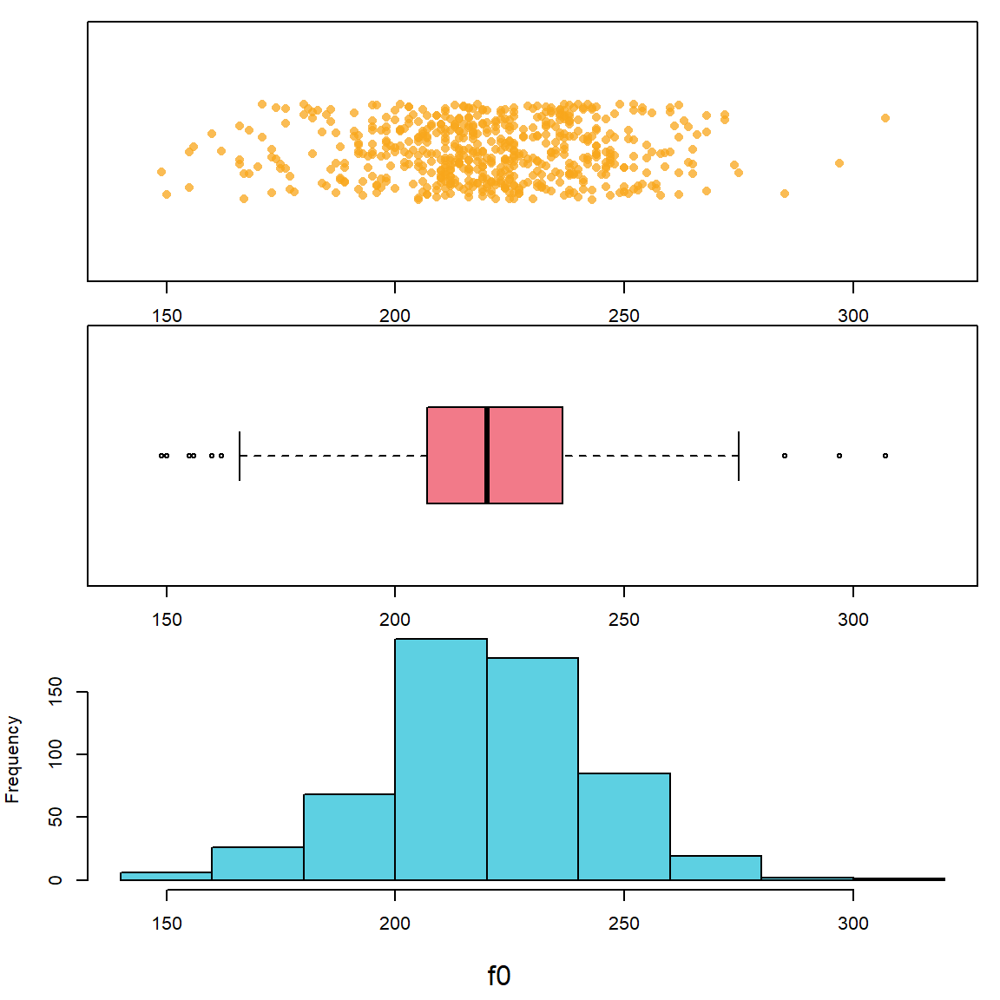
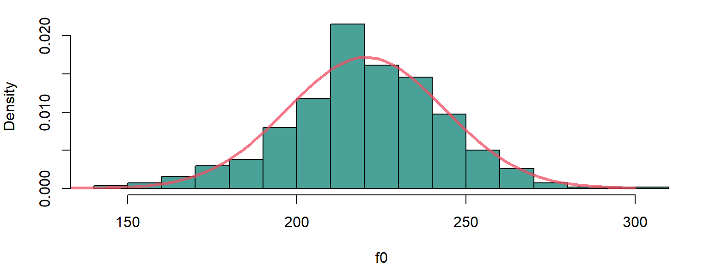
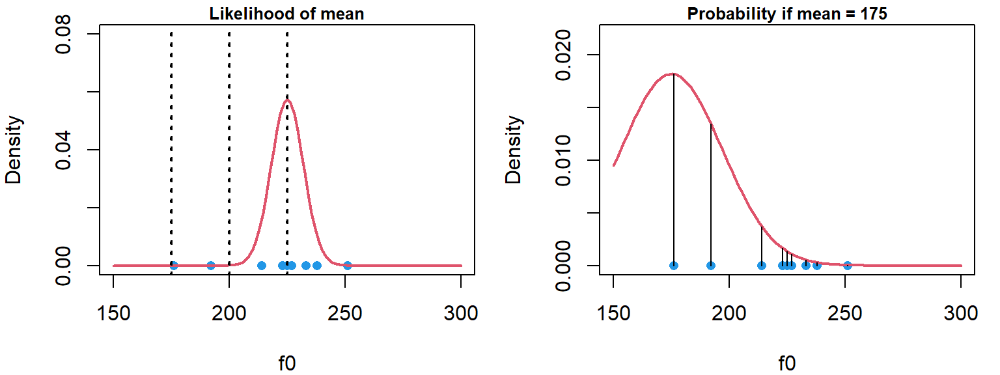
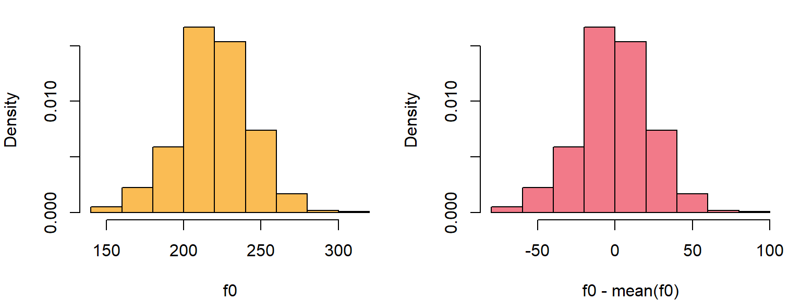
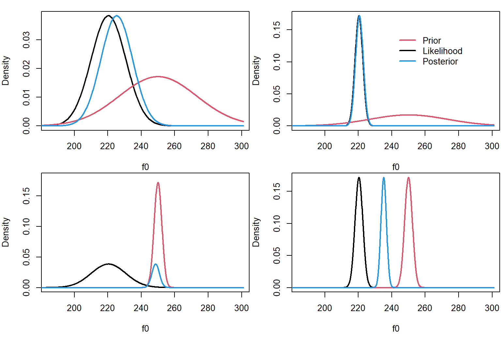

# Inspecting a single group of observations: Introduction to regression models

We'll begin with what is perhaps the simplest question a researcher can ask: What's the average value of (some variable) $x$? We're going to use this basic question to discuss some fundamental statistical concepts, and how to use these concepts to make inferences about the observations we collect. 

Although statistical knowledge might seem like declarative knowledge, in many ways it is more similar to procedural knowledge. You would never read a chapter from a French textbook once and expect to have memorized all the vocabulary and irregular forms. Similarly, you would never practice a piano piece a single time and assume that you are just 'bad at the piano' because you can't play it flawlessly. And yet a student may read a chapter from a statistics book once and feel dissapointed that they do not already understand the concepts.

Think of acquiring statistical knowledge like learning a language. It is normal, and in fact should be expected, that the reader will need to read some parts of the text multiple times, and *practice*, before being able to really *understand* all of the concepts presented here. 

I would like to tell you a little bit about John von Neumann. Von Neumann was perhaps the greatest mathematical mind the world has ever seen, and a glance at his contributions to mathematics on his Wikipedia page reveals an astonishing breadth and depth of mathematical abilities. Some quotes from his contemporaries about von Neumann:

  * "I have sometimes wondered whether a brain like von Neumann's does not indicate a species superior to that of man" - Hans Bethe 

  * "one had the impression of a perfect instrument whose gears were machined to mesh accurately to a thousandth of an inch." - Eugene Wigner  

  * "Johnny was the only student I was ever afraid of. If in the course of a lecture I stated an unsolved problem, the chances were he'd come to me at the end of the lecture with the complete solution scribbled on a slip of paper." - George Pólya 

There is a story about von Neumann that says that he was a late sleeper. One day, one of his theorems was proven correct, and a messenger went to tell him one morning. von Neumann is said to have responded: "You wake me up early in the morning to tell me that I'm right? Please wait until I'm wrong". 

And yet this perfect mathematical mind is said to have said the following to a graduate student who complained about not understanding some mathematical abstraction:

  * "Young man, in mathematics you don't *understand* things. You just get *used to them*" - John von Neumann

This was von Neumann's experience, it has certainly been my experience, and it will likely be yours. Some things will make no sense, and then one day they will. It won't be clear when they did or why they did all of the sudden, but a combination of repetition, practice and *time* will make the difference. No amount or thinking and raw brain power alone will help you *understand* statistics. 

That being said, the things we talk about in this chapter will be come up in every chapter, so if things don't all make sense right now that's fine, you will have plenty of chances to *get used to them*. Things will make more sense bit by bit as we learn how to use more and more complicated models. After reading a few chapters you should come back and read this chapter again (and again). You may notice that a lot of things are discussed in this chapter that you did not notice the first time you read it.

## Data and research questions 

Variables are placeholders for some value, whether we know it or not. For example I can say "my weight is X pounds". Random variables are variables whose value varies from observation to observation based on some unknown process. The classic example is the result of a coin flip or the roll of a die. Neither of the values of these variables can be known *a priori* (i.e., before 'experimentation') and can only be known after an observation has been carried out. 

Anything that is expected to vary slightly from observation to observation can be though of a random variable. For example, your exact weight varies from day to day around your 'average' weight. In principle, you could probably explain exactly why your weight varies from day if you were so inclined. However, in practice you are probably not exactly sure *why* your weight is a bit higher one day and a bit lower the next. So, your weight is a random variable not necessarily because it is *impossible* to know why it varies, but simply because you don't currently have the means to predict its value on any given observation.

We're going to begin by focusing on what are known as *continuous* variables. These variables take on an infinite, or at least reasonably large, set of possible values between the highest and lowest possible values of the variable. Some examples of continuous variables that arise often in linguistics are reaction times, frequencies of words in lexicons, and just about any acoustic measurement in phonetics.  

For example, imagine listeners in an experiment hear a word they are asked to determine whether this is a 'real' word or not (i.e., a lexical decision task). You measure reaction times and are interested in how long people take to answer, on average. The variable of interest here is "reaction time in a lexical decision task". It is a random variable because you don't know what any given reaction time will be on any given trial. 

Keep in mind, this doesn't mean we don't know anything about it. The human body is physically incapable or reacting faster than about 150 ms, and decisions should not be taking more than (let's say) 3 seconds. So, although you don't know what the *exact* value of any observation will be, it is possible to make statements about *where* you expect this variable to be along the number line. In addition, your expectations about the range of the variable can be quite strong. For example, human height is a random variable. However, think of how strong the evidence would need to be before you believe that some person in the world is 30 feet (10 meters) tall. You may need to physically touch this person, and even then you may have doubts.  

In this chapter, we're going to investigate the average voice fundamental frequency (f0) for a group of speakers. The f0 of a voice is the primary determinant of perceived pitch, and is a very important cue in speech communication. It it extremely important in speech prosody, in the relation of emotion in speech, it helps determine vowel quality and is crucial in the communication of social and indexical information (speaker gender, age, ...etc.). In other words, when you hear a person speak, your impression of their gender, age and size are strongly influenced by pitch. As a result, this is a very important variable in linguistics and speech communication more generally. 

We're going use a well-known data set, the [Hillenbrand et al. (1995)](https://homepages.wmich.edu/~hillenbr/Papers/HillenbrandGettyClarkWheeler.pdf) data representing vowels produced by 139 speakers of Michigan English. The data contains information about the productions of 12 vowel phonemes by 48 adult females, 45 adult males, 19 girls and 27 boys, both groups featuring children 10-12 years of age. 

In this chapter we're going to focus only on the f0 values produced by the 48 adult female speakers in the sample, across the 12 vowel phonemes they each produced (n=576=48*12). Below, I get the data from the course GitHub page and pass the relevant information to a vector called `f0` that we will be referring to throughout the chapter. 


```r
url1 = "https://raw.githubusercontent.com/santiagobarreda"
url2 = "/stats-class/master/data/h95_vowel_data.csv"
# read data from the book Github page
h95 = read.csv (url(paste0 (url1, url2)))
# select only 'f0' values produced by adult females (speaker type = 'w')
f0 = h95[['f0']][h95$group == 'w']
```

The individual f0 values produced by any given woman from Michigan for any given utterance cannot be known a priori. In other words, you don't know what pitch a random woman from Michigan will produce until you actually observe and record the production. For this reason, "the f0 produced by adult women from Michigan" is a random variable. 

We're going use the information in our sample to try to answer two questions about the f0 produced by female speakers from Michigan:

1) What is the average f0 of the whole *population* likely to be?

2) Can we set bounds on likely mean f0 values based on the data we collected?

In order to answer questions about reasonable values for random variables, scientists often collect measurements of that variable. These measurements can help us understand the most probable values of this variable, and the expected range of the variable. For example, although you may not know your exact weight in any given day, if you weigh yourself with some regularity you may have enough observations to have a pretty god idea of what your weight might be tomorrow. In addition, your expectation may be so strong that a large deviation from it would be more likely to result in your buying a new scale than believing the measurement.

The measurements you make of a random variable are called *samples*. The sample is a finite set of observations that you actually have. The population is the (hypothetical) larger group of all possible observations that you are *actually* interested in. It is the entire set of possible values of the random variable. For example, the population of "f0 produced by adult women from Michigan" contains all possible values of f0 produced by the entire set of women from Michigan. Our sample is the `f0` vector we read into R above. 

Usually, a linguist will collect a sample to make inferences about the population. In other words, we are interested in the general behavior of the variable itself, not just of the small number of instances that we observed. For example, Hillenbrand et al. collected their data to make inferences about Michigan speakers overall, and not because they were particularly interested in the specific speakers in their sample. They are using their small sample of speakers to make inferences about the whole population of speakers in Michigan.

Scientific research is often focused on questions such as (1) above. For example someone might ask "what's the average f0 produced by adult female speakers?" and you can say, for example, "I have some data that suggests 220 Hz is a reasonable estimate". However, reliable inference requires having good answers to the second sort of questions as well. 

There is no chance that the average of the sample you collected will **exactly** match the population average. After all, the sample is just a (relatively) small collection of random observations! So, if the sample mean is 220 Hz, it seems reasonable that the *population* mean could actually equal 219 Hz. Could it equal 215 Hz? Sure. 200 Hz? Where does it stop? Clearly, we need some principled way to 'guess' reasonable ranges based on our sample of observations. In this chapter we will discuss how statistics provides us with a framework to answer both questions above using only our sample of values. 


### Inspecting the central location and spread of values 

Using R, we can easily find important information about our sample of f0 values. Below, we calculate the sample mean, the number of observations, the sample standard deviation, and important quantiles. The quantiles below correspond to the values of ordered observations, as in the right plot in Figure \@ref(fig:initialplot). The 0% quantile is the smallest (leftmost) observation, while 100% is the highest (rightmost) observation. Any other quantile is found by ordering the observations and selecting the observation that is higher than $x\%$ of the sample values. For example, the 50% quantile (the median) is higher than 50% of values, and the 25% quantile is higher than 1/4 of the values in the sample. 


```r
# calculate basic descriptive statistics
mean (f0)
## [1] 220.401
length (f0)
## [1] 576
sd (f0)
## [1] 23.22069
quantile (f0)
##     0%    25%    50%    75%   100% 
## 149.00 207.00 220.00 236.25 307.00
```

We can use this information to make some basic, and potentially useful statements about our data. The mean and median are 220 Hz, and f0 values range from 149 to 307 Hz. However, there are not many observations at the extremes, and 50% of values are between 207 and 236 Hz. The standard deviation is 23 Hz, indicating that the bulk of observations were within one standard deviation of the mean (220±23 Hz). 

<div class="figure">

<p class="caption">(\#fig:initialplot)(left) Plot of values in the order they appear in the original data. (right) Observations ordered by increasing value.</p>
</div>

We can look at the distribution of our sample of f0 values in several ways, as seen in Figure \@ref(fig:F1-distributioncomparison). In the top row each point indicates an individual production. Points are jittered along the y axis to make them easier to distinguish so that dense and sparse locations can be compared. 

In the middle row we see a box plot of the same data. The edges of the box correspond to the 25% and 75% quantiles of the distribution, and the line in the middle of it corresponds to the median. So, the box spans the *interquartile range* of your observations and 50% of observations are contained in the box. From the edges of the box extend the boxplot 'whiskers'. By default, these extend out 1.5 times the interquartile range. These whiskers are simply intended to give you an estimate of the amount of 'typical' variation in your sample. Beyond the whiskers we see individual *outliers*, points considered to be substantially different from the rest of the sample. We can see that the boxplot does a good job of summarizing the information in the top row, and provides information related to both average f0 values and to the expected variability in these values. 

The bottom row presents what is knows as a *histogram* of the same data. The histogram divides the x axis into a set of discrete sections ('bins'), and gives you the count (or frequency) of observations in each bin. Bins with lots of observations are relatively taller (more *dense*) than bins with few observations in them. As a result, histograms can be used to summarize where observations tend to be. For example, we can see that the bins under the interquartile range have the most observations, and that values further from the mean value become increasingly less frequent. 

<div class="figure" style="text-align: center">

<p class="caption">(\#fig:F1-distributioncomparison)Different ways to consider our distribution of f0 values.</p>
</div>

## Probability Distributions

Histograms are particularly useful to understand because of how they relate to probability distributions. The probability is the number of times an outcome is expected to occur, compared to all the other possible outcomes that can occur. This can also be thought of as the *percent* of times an event is expected to occur. For example, the probability that any given day is Monday is 1/7 (14% of days), while the probability that any given day is a weekday is 2/7 (29% of days).  

By definition, the total probability of all of the possible values in a population is always equal to 1. This is like using 100 to communicate percentages by convention. This is not *correct* or *true*, it is arbitrary just like our base 10 number system. We could make all probabilities add up to 1.37 instead, but why would we want to? Making all probabilities add up to one has many practical advantages and so this convention is actually beneficial for us. As a result of this convention, you know that a probability of 0.5 means something is expected to occur half the time (i.e., on 50% of trials). For example, suppose we want to know the probability of being an adult female in our sample who produces an f0 under 175 Hz. Finding the probability of observing this event is easy:


```r
# the evaluation in the parenthesis will return 1 if true, 0 if false
# number of observations the fall below threshold
sum (f0 < 175)  
## [1] 22

# divided by total number of events
sum (f0 < 175) / length (f0)  
## [1] 0.03819444

# a shortcut to calculate probability, mean = total/length
mean (f0 < 175)
## [1] 0.03819444
```

The top value is the frequency of the occurrence. This is not so useful because this number can mean very different things given different sample sizes (e.g., 22/23, 22/10000). The middle and bottom values have been divided by the total number of observations. As a result, these now represent a proportion, or probability. 

The histogram on the left below shows frequency on the y axis, indicating the total number of observations in each bin. The histogram on the right shows *density* along the y axis. When you see *density* on the y axis, that means that y axis values have been scaled so that the total area of all the rectangles making up the histogram are equal to 1. This has two benefits:

  1) It lets you compare the distribution of values across different sample sizes. 
  2) It makes the histogram more comparable to a probability distribution. 
  
<div class="figure">

<p class="caption">(\#fig:F1-twohists1)(left) A histogram of our f0 data showing counts in each bin. (right) A histogram of our f0 data showing densities.</p>
</div>

Imagine a circle like in a Venn diagram that contains all possible productions of female f0. This circle has an area of 1 since it contains all possible values in the population. Imagine we spread out this circle along the x axis so that its shape reflected the relative frequencies of different values presents in the population. For example, if some outcomes were 5 times more probable than others, the shape should be 5 times taller there, and so on. If we managed to do this, the height (or 'density') of this shape would exactly correspond to a probability distribution like that seen in the right plot above. 

The *density* of a histogram (of probability distribution) is just the thickness of the distribution at a certain location along the number line. A higher density in a certain location tells us values in that vicinity are relatively more probable, and differences in density reflect differences in the relative probability of different values. 

Below I've repeated the data vector, doubling the counts by including each observation twice. Notice that the y axis in the right panel does not change. This is because increasing the number of observations changes your counts but not the relative frequencies of observations with different values. For instance, increasing the number of coin flips should not change the fact that 50% will be heads, but it will change the number of heads you observe. 

<div class="figure">

<p class="caption">(\#fig:F1-twohists2)The counts have been doubled relative to above.</p>
</div>

### The normal distribution

The distribution of many [random variables](https://www.youtube.com/watch?v=4HpvBZnHOVI) (including f0) follows what's called a [normal distribution](https://en.wikipedia.org/wiki/Normal_distribution), also called a Gaussian distribution. So, if you take a sample of a random variable and arrange observations into bins, they resulting histogram will tend to have the familiar, bell-shaped curve common to normally-distributed data.  

The normal distribution has the following important characteristics. 

1. The distribution is symmetrical - i.e., producing a higher or lower than average f0 is about equally likely.  

2. The probability of observing a given value decreases as you get further from the mean (i.e., *average*) value. 

3. It's easy to work with, very well understood, and naturally arises in basically all domains. 

Normal distributions have two parameters. This means they vary from each other in only two ways. Think of parameters like ways that things can be 'set' differently from each other. For example, a radio has three parameters: tuner frequency, band (AM/FM), and volume. A toaster may have only one, a single knob determining the degree of toasting required. The more parameters something has, the more complicated it is (an airplane has thousands!). 

Luckily, the normal distribution only has two parameters:

1. A mean parameter, $\mu$, which determines the location of the distribution along the x axis. When the mean changes, the whole shape of the distribution slides along the number line. The mean is the 50% halfway point of the 'mass' of the distribution. If the distribution were an physical object, its mean would be its center of gravity. You would balance the distribution on your fingertip along this point. 

2. A standard deviation, $\sigma$, that determines its *spread* along the x axis. When the standard deviation changes the distribution is stretched wide or made very narrow, but stays in place. Since every distribution has an area under the curve equal to one (i.e., they all have the same 'volume'), distributions with a small variance must necessarily be very dense. 

The parameters of a probability distribution are used to draw its shape, which can be used to make inferences about likely values. Think back to high school math and the function defining the shape of a parabola $y = ax^2+bx+c$. This function draws a shape based on the settings of its parameters $a, b$ and $c$. In the exact same way, the formula defining the density of the normal distribution draws the shape given the settings of its $\mu$ and $\sigma$ parameters.    

Below, I compare the histogram of f0 values to the density of a normal distribution with a mean equal to our sample mean ($\mu = 220 Hz$) and a standard deviation equal to our sample standard deviation ($\sigma = 23 Hz$), calculated above. The density was drawn using the `dnorm` function, which draws a curve representing the shape of a theoretical normal distribution with a given mean and standard deviation. 

<div class="figure">

<p class="caption">(\#fig:theoretical)A comparison of the data distribution with a theoretical normal distribution.</p>
</div>

Clearly, there is a very good alignment between our random sample of real-world data and the normal density, which is a theoretical mathematical function. This suggests that we could potentially use the *theoretical* shape of the normal distribution to talk about the characteristics of our observed random sample of data. This would be a bit like using the properties of a parabola to predict the path of a projectile in real life: although the actual path will differ form that of a perfect parabola, there are enough similarities to make the comparison worthwhile.


### Referring to the normal distribution to make inferences  

In general, it's impossible to know what the 'true' data distribution is, so that *perfect* inference is not possible. As a result, scientists often use theoretical probability distributions to make inferences about real-life populations and observations. Since  our f0 measurements follow the 'shape' predicted by the theoretical normal distribution, we may be able to use the characteristics of an appropriate normal distribution to make inferences about female f0 (and other variables).

Using a normal distribution to make inferences about your data is like using a mathematical model for spheres to understand the behavior of billiard balls. In reality the balls are not perfect spheres. However, their shapes will be *spherical enough* to allow us to make useful predictions based on the simplified model. In general, it is useful to keep in mind that reality will never exactly conform to our model. This can result in unpredictable errors in our conclusions. In general, the things you don't know you don't know are the things that will cause the most problems. If you had known that your model was wrong, you would have fixed it!

Since we expect the distribution of f0 values to have the shape of the normal distribution, we can use the shape of the normal distribution to make inferences about the distribution of f0 values, even the ones we did not observe. For example, we can use the theoretical normal density to estimate the probability of observing a female production with an f0 of under 175 Hz, from among *all* possible values of this random variable (i.e., all observable productions of f0 in this *population*).

We do this by referring to the proportion of values expected to be less 175 Hz in the normal distribution that has the same 'shape' as our sample. This can be found by finding the area under the curve of the probability density to the left of that point (the red area below). Since the *total* area is always equal to 1, the area of the red portion below corresponds to a percentage/probability. 

Below, I use the function `pnorm` to find the proportion of values that are expected to be greater/less than 175 Hz. We can do this for the normal density because it is very well understood. Think of how easy it is to calculate the area of a circle of the perimeter of a square. The shape of the normal distribution is only a little more complicated to understand, and the `pnorm` function helps you make predictions about it. 

I use the parameters estimated form our sample to run the `pnorm`function, as these are our best guesses of the population parameters. As we can see, this value is reasonably close to our empirical probability of 0.038 (3.8%). 


```r
# Observed probability observing a token with an f0 < 175 Hz
mean (f0 < 175)
## [1] 0.03819444

# Theoretical probability of observing a production below 175 Hz
pnorm (175, mean (f0), sd(f0))
## [1] 0.02527988

# Theoretical probability of observing a production greater than 175 Hz
1 - pnorm (175, mean (f0), sd(f0))
## [1] 0.9747201
```

<div class="figure">

<p class="caption">(\#fig:F1-prediction)The read area relects the distribution of outcomes that satisfy f0 < 175 Hz.</p>
</div>

Imagine you had 1 pound of clay and I asked you to make a shape **exactly** like the normal density (red curve) above. This shape should be perfectly flat, i.e., it should have a constant depth (like a coin). If you had this shape made of clay used a knife to remove the part left of 175 Hz (the red subsection) and weighed it, it should weigh 2.5% of a pound. The 'area under the curve' of this clay sculpture would just correspond to the amount of clay in a certain area, and in this case we know that only 2.5% of the clay should be in that section of the shape. So, the area under the curve, the probability, is just the amount of the *stuff* in the density that falls below/above a certain point, or between two points. 

We can use the probabilities to compare our predicted and expected observations. Since we had 576 observations and there was a probability of 0.025 of observing tokens with an f0 below 175 Hz, we expect about 14 tokens ($576 \times 0.025$) to have an f0 lower than 175 Hz. Instead, we have 22 such observations indicating that our actual data has slightly more extreme values than our theoretical distribution, but seems to be a relatively good fit.


```r
# probability of observing a production with an f0 under 175 Hz
probability = pnorm (175, mean (f0), sd(f0)) 

# expected count
length (f0) * probability
## [1] 14.56121

# actual count
sum (f0 < 175)
## [1] 22
```

## Probabilities of events and likelihoods of parameters

We're going to switch from talking about *probabilities* to talking about *likelihoods*. A probability is the odds of observing some data/event/outcome, given some parameter(s). A likelihood places odds on different *parameter* values given some observed data. These concepts are basically the inverse of each other. For example, you could say "how probable is it that a random person from San Francisco will be over 6 feet tall?". In contrast, you could ask "how likely is it that the average height of people from San Francisco is 6 feet?". 

The *likelihood function* is a curve showing the relative likelihoods of different parameter values, given a fixed set of data. The likelihood function tells you what parameter values are *believable* given your data. If a value is very unlikely, that means that it is not supported by your data. In other words, unlikely parameter estimates represent conclusions that your data is rejecting as not viable. 

For example, suppose that you measured the heights of 100 women in a small town (pop. 1500) and found the average height was 5'4". You might accept that the *actual* population average is 5'5", but may find it difficult to accept that it was actually 6'0". In other words, a true mean of 6'0" is *unlikely* given your observed data. This is because the observations you have are *improbable* given a true mean of 6'0". The logic is quite simple: a true mean of 6'0" is unlikely to 'generate' so many short women. You *know* you observed the short women, therefore, you have no reason to believe that the true mean is 6'0".  

Every parameter for every probability distribution has a likelihood function, given some data. Here, we're only going to discuss the likelihood of the normal mean parameter, $\mu$, in detail. Here are three useful properties of the likelihood functions of $\mu$, the mean parameter of the normal distribution:
 
1. The likelihood function of $\mu$ will tend to be a normal distribution. 

2. The mean (and peak) of the likelihood function of $\mu$ given some sample $x$ is equal to the arithmetic mean of the sample (`mean(x)`).

3. The standard deviation of the likelihood of $\mu$ is equal to the standard deviation of the data (`sd(x)`), divided by the square root of N (the sample size). 

The first point tells us that we can use the normal distribution to make inferences about likely, and unlikely values for means, given some data. 

The second point says that if you are wondering what the best (most likely) estimate of the population mean is given your sample, the answer is the arithmetic mean of your sample ($\bar{x}$). 

The third point means that the likelihood function for $\mu$ will tend to be *much* narrower than the distribution of our original data. This is because a mean based on, for example, 50 samples will contain many positive and negative deviations from the average that will tend to cancel out. As a result, the more data you have the more *precise* your estimates are, and the less *uncertainty* is associated with any estimate. This is why scientists focus so much on sample size when they conduct statistical analyses. 

Explaining the *why* of these characteristic is not too complicated, but it represents an unnecessary excursion at this point.  Instead, we will focus on the practical effect of these characteristics for our statistical models. 

### Calculating likelihood functions

The left panel of Figure \@ref(fig:F1-likelihood1) shows the likelihood function for $\mu$ based on the first 10 observations of our f0 vector (indicated by the blue points at the bottom of the plot). The likelihood (red line) of the mean shows you how believable different mean values are for our points. We can see that the most likely values of $\mu$ are centered on the bulk of the observations, and that values before less likely once we deviate from that. The vertical dotted lines indicate three possible mean values that will be highlighted in this discussion. 

The likelihood of any parameter estimate (e.g., $\mu$ = 175 Hz in the right panel of Figure \@ref(fig:F1-likelihood1)) is equal to the product of the density of each observation in the sample, if we assume that the estimate were true. This sounds like a mouthful but is actually deceptively simple. For example, to calculate the likelihood that $\mu=175$, we: 

  1) Assume that the data is generated by a normal distribution with a $\mu$ and $\sigma$ equal to your sample. 

  2) Find the the height of the curve of the probability distribution (the density) over each point (indicated by the vertical lines in the right panel below). This tells you how probable each observation is if your assumption about the value of the mean were true. 

  3) The likelihood is the product of all of these densities (heights). In practice, often the logarithms of the individual probabilities are added together, yielding the *log-likelihood*. This is because multiplying together too many fractions can lead to numbers so small computers have a hard time representing them, and adding logarithms is equivalent to multiplying the original values.  

So, the value of the likelihood function in the left panel of Figure \@ref(fig:F1-likelihood1) at 175 Hz (firt vertical line) is equal to the product of the probabilities of the point in the right panel (i.e., the heights of the lines in the panel).

Imagine we did this for a range of values along the x axis, recording the likelihood values I calculate. I then plot the product of the densities for each corresponding x value. If I do this I have just plotted a likelihood function for $\mu$ given our data, and the result would be a curve identical to that of the left panel in \@ref(fig:F1-likelihood1). 
  
&nbsp;
<div class="figure">

<p class="caption">(\#fig:F1-likelihood1)(Left) The likelihood of the population mean given the blue points in the figure. (right) The probability of the points given an assumed mean of 175 Hz.</p>
</div>
&nbsp;

In the right panel in Figure \@ref(fig:F1-likelihood1) we see that a normal distribution with a $\mu$ of 175 Hz is very unlikely to generate this data. Many points are extremely improbable and have densities close to zero. As a result, the product of these values (the heights of the lines) will be a very small number. This is reflected in the extremely small values in the likelihood function at 175 Hz in the left panel above. 

In the left panel in Figure \@ref(fig:F1-likelihood2), we see that a normal distribution with a $\mu$ of 200 Hz is more likely to generate this data, and the probability distribution is clearly a much better fit. However a distribution with a mean of 200 Hz is still not very likely to have generated this data (as seen above). 

Finally, in the right panel below we see the the maximum likelihood estimate for this sample of 225 Hz, the value representing the peak of the likelihood function (in the left panel above). When we say that 225 Hz is the most likely mean for this data, we are saying that this data is probably generated by a normal distribution centered at 225 Hz, relative to the alternatives. 

&nbsp;
<div class="figure">

<p class="caption">(\#fig:F1-likelihood2)(Left) The probability of the points given an assumed mean of 200 Hz. (right) The probability of the points given an assumed mean of 225 Hz.</p>
</div>
&nbsp;

Before moving on, I would just like to note that the figures above highlight the three properties of the mean parameter of the normal distribution mentioned in the previous section. First, the likelihood function has a normal distribution. Second, the likelihood is centered over the sample mean. And third, the likelihood is substantially *narrower* than the data distribution, even with only ten data points.  

### Making inferences using likelihoods

Previously, we discussed using the normal distribution to make inferences about the probable values of random variables. When variables are normally distributed we can use the theoretical normal distribution and functions such as `pnorm` to answer questions about values we expect, and don't expect, to see. We can take this same approach to make inferences about *parameters* when their likelihood functions follow a normal distribution. 

It helps to understand this if we start thinking about our parameters as random variables themselves. Think of the average height of the people in a large city. You can go out and sample 100 individual people, and each one of those samples is an observation from a random variables. You can find the mean of your sample, arriving at a single estimate of the population mean. Now imagine that 50 people went out in the same city and each sampled 100 random people. There is no chance that every single of those 50 people would find identical means across all of their samples. Instead, there will be a distribution of sample means, in the same way there is a distribution of the original data used to calculate the means. 

We know that our f0 data is approximately normally distributed. As a result, we know the following information:

  1) The likelihood function of our sample mean parameter follows a normal distribution.
  
  2) The mean of this distribution is equal to the sample mean, the mean of our observations.
  
  3) The standard deviation of this distribution is equal to the standard deviation if the samples, divided by the square root of the sample size (`sqrt(576)=24`). 
  
We can calculate these values and use them to draw the curve representing the likelihood function given our data and model structure. You may be thinking, what model? It may seem too simple to be a model, but by assuming that our data can be understood as coming from a normal distribution with some given $\mu$ and $\sigma$, we have already created a simple model for our data. I'll return to this below. 

We can also use the `qnorm` function to calculate quantiles for our likelihood, presented below. Vertical lines have been added at the 2.5% and 97.5% quantiles of the distribution. These vertical lines enclose 95% of the likelihood density, and so represent the range of values representing the 95% most likely values of $\mu$. I chose an interval enclosing 95% of the likelihood because this is used by convention. This is a commonly-used interval but otherwise has no special significance.  


```r
# sample mean
mean (f0)   
## [1] 220.401
# sample standard deviation
sd (f0)     
## [1] 23.22069
# sample size
length (f0)  
## [1] 576
# the standard deviation of the likelihood function
sd (f0) / sqrt ( length (f0) ) 
## [1] 0.9675289
# the 2.5% and 97.5% quantiles of the likelihood function
qnorm (c(0.025, 0.975), mean (f0), sd (f0) / sqrt (length (f0) ) )
## [1] 218.5047 222.2974
```

<div class="figure">

<p class="caption">(\#fig:F1-likelihood)Likelihood of population mean given our data. Horizontal lines indicate intervals enclosing 95% of the distribution.</p>
</div>
&nbsp;

The likelihood tells you about the most believable/credible parameter values, given your model and data. Given the information presented in the figure above, we may conclude that the most likely parameter values fall between (around) 218 and 222 Hz. This means that it is reasonable that the true population mean might be 221 Hz, as this value is very likely given our sample. Basically, maybe our sample mean is wrong and arose by accident, and 221 Hz is the true population $\mu$. This outcome is compatible with our data. However, a value of 216 Hz is extremely *unlikely* to fit our data. It is just too far from our sample mean relative to the amount of variation in our sample. 

So, since we think that 216 Hz is not a plausible mean f0 given our sample, this also means that it is very unlikely that the real $\mu$ is 216 Hz. This is because a distribution centered at 216 would be extremely unlikely to generate a sample mean of 220 Hz. Using this approach, we can rule out implausible values of $\mu$ based on the characteristics of our data.

At this point we can offer conventional responses to the research questions posed at the start of the Chapter:

  Q1) What is the average f0 of the whole *population* likely to be?

  A1) The most likely value for the population mean is our sample mean, 220.4 Hz. 

  Q2) Can we set bounds on likely mean f0 values based on the data we collected?

  A2) Yes, there is a 95% probability that the population mean is between 218.5 222.3 Hz, based on our data and assuming that our assumptions are correct.

Traditional approaches to statistics (sometimes generally referred to as 'frequentist') estimate parameters by trying to find the most likely values for parameters (i.e., 'maximum likelihood estimation'). They do this by referring to the theoretical likelihood functions such as what we plotted above. Although this works very well for simple data, it is difficult if not impossible for some of the more complicated datasets that often arise for even the simplest research questions in linguistics. 

## Bayesian models

In this class we are going to learn about *multilevel Bayesian models*. These models have many advantages over 'traditional' approaches. They provide researchers with more information, are more robust, and at **worst**, they are as good as traditional models. I may sound biased, but the main reason for all of these advantages is that traditional models were developed over 100 years ago. On the other hand, mathematical and technological advances have only made Bayesian multilevel models possible in the last 10+ years. It's only reasonable that the newer approaches should offer some advantages over methods developed before calculators existed. 

Here, I am going to address what is meant by two aspects of the term 'Bayesian multilevel models': 'Bayesian' and 'models'. 

### What are regression models?

Before beginning this section I just want to say that its ok if a lot of this section doesn't makes sense right now. It will make more sense once you start to actually build models and it becomes less hypothetical and more practical. I will use the terms and concepts described here in later chapters, but I will re-explain it each time. If you think that a model in a later section is not explained in as much detail as you would like, look at this section again!

I have been referring somewhat obliquely to 'models' without really explaining what I mean by this. It's difficult to offer a precise definition because the term is so broad, but 'regression' modeling can be thought of as trying to understand variation the mean parameter ($\mu$) of a normal distributions. Actually, you can use many other probability distributions, but for now we will focus on models based on the normal distribution.

Basically it goes like this:

* you have a variable you are interested in, $y$, which is is a vector containing N observations. We can refer to any one of these observations like this $y_{[i]}$ for the $i^{th}$ observation. In our case this is a vector of 576 f0 values (`f0[1:576]`). Although its not necessary, I am going to put the index variables associated with trial number ($i$) in brackets like this $y_{[i]}$. This is just to make it easier to identify, and to highlight the similarity to vectors (e.g., `f0[i]`).


* you assume that your data is well described by a normal probability distribution. This is a mathematical function ($\mathcal{N}(\mu,\sigma)$) that describes what is and is not probable based on two parameters. 

* the mean of this distribution is either fixed, or varies in a systematic manner. 

* the variation in the mean of this distribution can be understood using some other variables. 

We can write this model more formally like this:

$$
y_{[i]} \sim \mathcal{N}(\mu,\sigma)
(\#eq:1)
$$

This says that we expect that the tokens of the variable we are interested in is distributed according to ($\sim$) a normal distribution with those parameters. 

Notice hat $y$ gets a subscript while $\mu$ and $\sigma$ do not. This is because for right now, those parameters are fixed for all observations, while the value of $y$ changes for each observation based on the $i$ subscript. For example, below I set $i=2$ and use this index variable to show the second element of the data vector, i.e. $f0_{[i=2]}=214$.


```r
f0[1:6]
## [1] 225 214 192 233 223 223
i = 2
f0[i]
## [1] 214
```

Equation \@ref(eq:1) just formalizes the fact that we think the *shape* of our data will be like that of a normal distribution with a mean equal to $\mu$ and a standard deviation equal to $\sigma$.

When you see this, $\mathcal{N}(\mu,\sigma)$, just picture in your mind the shape of a normal distribution, like if you see this $y=x^2$ you may imagine a parabola. $\mathcal{N}(\mu,\sigma)$ Really just represents that shape of the normal distribution, and the associated expectations about more and less probable outcomes. 

The above relationship can also be presented like this:

$$
y_{[i]} = \mu + \mathcal{N}(0,\sigma)
(\#eq:2)
$$

Notice that we got rid of the $\sim$ symbol, moved $\mu$ out of the distribution function ($\mathcal{N}()$), and that the mean of the distribution function is now 0. This breaks up our variable into two components:

1) A systematic component, $\mu$, that contributes the same value to all instances of a variable. 

2) A random component, $\mathcal{N}(0,\sigma)$, that causes unpredictable variation around $\mu$. 

In terms of our data, I might express the distribution in either of the ways below. The first line says: draw random values around 224 Hz. The second one says draw random values around zero, and add 224 Hz to each value. 


$$
f0_{[i]} = \mathcal{N}(220.4,23.2)
(\#eq:3)
$$

$$
f0_{[i]} = 220.4 + \mathcal{N}(0,23.2)
(\#eq:4)
$$

The plots below show the distributions of the random parts of the formulas above. The distribution on the left below is the original data, centered at 220.4 Hz and with a standard deviation of 23.2 Hz. From this perspective all of our variation looks random variation. On the right, the mean has been subtracted from each value. The sample now represents random variation around the sample mean, variation that our model can't explain. From this perspective, the value of 220.4 (the mean) was not random, only the variation around it is. 

Regression models separate variables into their systematic and random components. The random component reresents the is *noise*, or *error* in our data. This doesn't mean that it's unexplainable, it only means that we've structured our model in a way that doesn't let us explain it. Right now our model basically says "I know the mean is 220.4 Hz but the rest of the variation in values of f0 is random".  


<div class="figure">

<p class="caption">(\#fig:F1-errorhist)(left) Histogram of data. (right) Histogram of centered data, basically the error distribution.</p>
</div>

In regression models, we can decompose systematic variation in $\mu$ into component parts, based on some predictor variables, $\mathrm{x}$. These predictor variables co-vary (vary with) our $y$ variable, and we think help explain the variation in $y$. 

Below, I am saying that I think $\mu$ is actually equal to some combination of $\mathrm{x}_{1}$ $\mathrm{x}_{2}$ and $\mathrm{x}_{3}$. For example, I could think that f0 is affected by the speaker age ($\mathrm{x}_{1}$) and gender of the speaker ($\mathrm{x}_{2}$), and vowel category ($\mathrm{x}_{3}$) of the production. 

$$
\mu = \mathrm{x}_{1} + \mathrm{x}_{2} + \mathrm{x}_{3}
(\#eq:5)
$$

The values of the predictor variables will vary from trial to trial, and are not fixed. Often the whole point of running an experiment is to predict differences in observations based on differing predictor values! So obviously, $\mu$ will need to vary from trial to trial. That means that the equation above should actually include $i$ subscripts indicating that the equation refers to the value of the predictors and expected mean, *for that trial* rather than overall. 

$$
\mu_{[i]} = \mathrm{x}_{1[i]} + \mathrm{x}_{2[i]} + \mathrm{x}_{3[i]} (\#eq:5)
$$

Actually, the mean is very unlikely to just be an equal combination of the predictors, so that a *weighting* of the predictors will be necessary. We can use the symbol $\alpha$ for these weights. For example, maybe $\mathrm{x}_{1}$ is twice as important as the other two predictors and so $\alpha_1$ is 2, while $\alpha_2$ and $\alpha_3$ are 1. 

$$
\mu_{[i]} = \alpha_1*\mathrm{x}_{1[i]} + \alpha_2*\mathrm{x}_{2[i]} + \alpha_3*\mathrm{x}_{3[i]}  
(\#eq:6)
$$

Note that the weight terms ($\alpha$) do not get an $i$ subscript. This is because they do not change from trial to trial. The *values* of the predictors change from trial to trial, but the way that these are combined does not, they are a stable property of the model. 

Decomposition of $\mu$ into sub-components makes our model something more like:

$$
y_{[i]} = \mu_{[i]} + \mathcal{N}(0,\sigma)  
(\#eq:7)
$$
  
$$
y_{[i]} =  (\alpha_1*\mathrm{x}_{1[i]} + \alpha_2*\mathrm{x}_{2[i]} + \alpha_3*\mathrm{x}_{3[i]} ) + \mathcal{N}(0,\sigma)  
(\#eq:8)
$$
  
Often, $\varepsilon$ is used to represent the random component, as in:

$$
y_{[i]} = \alpha_1*\mathrm{x}_{1[i]} + \alpha_2*\mathrm{x}_{2[i]} + \alpha_3*\mathrm{x}_{3[i]}+ \varepsilon_{[i]}
(\#eq:9)
$$

Notice that the error term *does* get a, $i$ subscript, as in $\varepsilon_{[i]}$. That is because the exact value of the error changes from trial to trial, even of the general characteristics of the error (i.e., $\mathcal{N}(0,\sigma)$) do not.  

When expressed in this manner, this is now a 'regression equation' or a 'regression model'. 'Fitting' a regression model basically consists of trying to guess the most likely values of $\alpha_1$, $\alpha_2$, and $\alpha_3$ given our data. 

Notice that the above formulation means that regression models do not require that our *data* be normally distributed, but only that the *random variation* in our data ($\varepsilon$) be normally distributed. For example, in the left panel below I plot the distribution of f0 from among the entire Hillenbrand et al. data, including boys, girls, men and women. The data is not normally distributed, however, we can still use a regression based on normally-distributed data to model this as long as we expect that:

  1) There is systematic variation in the $\mu_{[i]}$ of f0 across different groups, speakers, conditions, etc.
  
  2) The *random variation* around these predicted values of $\mu_{[i]}$ more or less follows a normal distribution.

In the right panel I plot the individual densities for different speaker classes. We see that although the data is not normally distributed, the within-group variation is. This suggests a regression model is appropriate for this data. 

<div class="figure">

<p class="caption">(\#fig:F1-allf0s)(left) Distribution of f0 across all speakers. (right) Densities of distributions of f0 for different speaker classes: boys (red), girls (green), men (blue) and women (cyan).</p>
</div>

### What's 'Bayesian' about these models?

The major difference between Bayesian and traditional models is that Bayesian models rely on *posterior distributions* rather than likelihood functions. I am going to define some terms:

* prior probability distribution: the distribution of possible/credible parameter values **prior** to the *current* experiment. This *a priori* expectation can come from world knowledge, previous experiments, common sense, or some combination thereof. Before you measure the height of adults in San Francisco, you know the average is not 4 feet and it is not 7 feet.

* the likelihood: this is the distribution of possible/credible parameter values given the **current** data and probability model, and nothing else. After you go out and measure the heights of some adults, you have more and less believable conclusions based on your data.

* posterior probability distribution: the distribution of possible/believable parameter values you have **after** your current experiment. You get this by combining the prior distribution and the likelihood. Maybe you went in thinking people in San Francisco were relatively short. After sampling many tall people you update your beliefs somewhat, adjusting these based on the new information.

So, more traditional models focus exclusively on how likely different conclusions are given only your data, while Bayesian models combine notions of likelihood with prior beliefs. The use of prior probabilities is often said to make Bayesian models 'subjective' but its not really a big deal. First, every model involves arbitrary decisions which can substantially affect our results. Second, a researcher will always use common sense to interpret a model. For example, before collecting my sample I can say that I expect my female average f0 to be 200 Hz or so, but think its reasonable to expect anything from 100 to 300 Hz. Based on everything we know about human speech, even these bounds are too wide and anything outside this would suggest something is very wrong. So, even if I did not specifically assign prior probabilities to results, I would still use my expectations to 'screen' my results, and be very wary of anything that did not meet my expectations. 

A Bayesian model simply requires that you build your expectations into your model. It *formalizes* it, makes it *definable* and *replicable*. Also, is it really being 'objective' to ignore common sense and act as if a mean f0 of 200 Hz is exactly as likely a priori as one of 20,000 Hz? In any case, in practice the prior probabilities hardly have any effect on our outcomes, and employing them allows our Bayesian models to be extremely flexible and robust. 


## Posterior distributions

The combination of probability distributions is straightforward conceptually: you just multiply the values of the densities at each x-axis location, and the result is the new curve. In the figure below several sets of probability distributions are combined, showing the effects of variations in priors and likelihoods. In each plot, the posterior density has been scaled so that it is the same height as the likelihood. This is only to make the figures visually interpretable but does not affect any of the points made below. 

In the top-left panel, we see the likelihood function for $\mu$ given a sample of size 5 with a mean of 220 Hz. This is combined with a relatively weak but very different prior: the standard deviation is the same as our f0 data, however the mean is much higher (250 Hz). The curve indicating the posterior is nothing more than the product of the prior and the likelihood at each x axis location. We can see that even with only 5 data points the likelihood already dominates the posterior, though the prior distribution is exerting a pull. 

In the top-right panel, the posterior is almost identical to the likelihood. The likelihood represents a sample of size 100, which is actually a tiny sample in experimental linguistics work where you may have 200+ samples from each of 50+ subjects and 10,000 observations overall. As you might imagine, when the sample size is that large the prior exerts almost no influence on results. 

In the bottom-left panel we see the same likelihood as in the top-left panel based on only 5 observations. In this case the prior has been made very narrow and therefore dominates the estimate. Consider a situation where we actually have really good reasons to think that the mean is 250 Hz. If we really *know* this, why would we accept and estimate of 220 Hz based on only 5 samples? In this case, the posterior distribution is basically saying: your estimate is great, but come back when you have more evidence and I might believe you.

In the bottom-right panel we see a situation where the likelihood and the prior are equal. Since they are about equally believable the posterior represents a perfect compromise between new and prior knowledge, forming a distribution exactly between the prior and the likelihood.


<div class="figure">

<p class="caption">(\#fig:F1-posterior)Demonstration of the effect of different types of priors and likelihoods on posterior distributions.</p>
</div>


### Sampling from the posterior

We want to understand the posterior distribution of parameters. How do we get this information? It is difficult to get this *analytically*, that is, using exact methods and solving a bunch of equations. Many traditional methods can actually be solved in this way, and that is a big part of their popularity. 

Understanding the characteristics of posterior probabilities is not possible analytically for many Bayesian models. As a result, these questions are answered 'numerically', basically by using a bunch of 'guesses'. To understand the properties of posterior distributions, we use 'sampling' software that knows how to investigate these distributions. 

You don't need to understand any of this section to use and understand Bayesian multilevel models, the software we will be using will do all of this for us. I am only presenting this to demystify them a little.  

The way these samplers work is you specify a set of data and some relationships you think are represented in your data (i.e., a model). The sampler then 'walks around' the parameter space, which is the range of possible values a parameter (or set of parameters) can take. For example, for a single parameter the parameter space is a line (like the x axis in the plots above) along which the parameter varies. 

The sampler then does some variant of the following algorithm:

1) Pick a random value for the parameter (i.e., $\mu_{tmp}$ = 221 Hz).

2) Calculate the posterior probability for the current estimate of $\mu_{tmp}$.

3) If the posterior estimate meets some criteria (e.g., it is better than the last one, it is not too low, etc.), then the value of $\mu_{tmp}$ is recorded, and becomes $\mu_{estimate}$. If not it is just discarded.

4) Go back to step 1. 

As incredible, and magical, as it may seem, under a very reasonable set of conditions if you do the above enough times, the distribution of $\mu_{estimate}$ that results from the above process will converge on the posterior distribution of $\mu$ given your data and model structure (including prior probabilities). 

Below I have made a small example of this process. I use the Metropolis-Hastings algorithm, which is an algorithm to sample from probability distributions. The small example below assumes the standard deviation of the population is known, and just tries to investigate the posterior distribution of $\mu$. It uses a very broad prior distribution ($\mu = 0$, $\sigma = 5000$) so that it will have a very weak effect on the outcomes. 


```r
# the function below takes a random sample, an initial mean estimate and a fixed
# standard deviation. It then takes a certain amount of samples from the 
# posterior distribution of the parameter, assuming a broad prior centered at 0
sampler_example = function (sample, mu_estimate = 0, stdev = 1, nsamples = 1000){
  # initial posterior calculation. This is the sum of the log likelihood and
  # the logarithm of the prior probability.
  prior = log (dnorm (mu_estimate[1],0, 500))
  loglik = sum (dnorm (sample, mu_estimate[1],stdev,log=TRUE))
  old_posterior = loglik + prior
  
  for (i in 2:nsamples){
    accept = FALSE
    # this loop will keep proposing new steps until one gets accepted. 
    while (!accept){
      # (step 1 above)
      # draw new proposal by randomly changing the previous mu_estimate
      mu_tmp = mu_estimate[i-1] + rnorm (1, 0, .3)
      # (step 2 above)
      # find prior probability for new mu_tmp proposal
      prior = log (dnorm (mu_tmp,0, 500))
      # find log likelihood for new mu_tmp proposal
      loglik = sum (dnorm (sample, mu_tmp,stdev,log=TRUE))
      # calculate the new posterior probability
      new_posterior = prior + loglik
      # (step 3 above)
      # if better accept always. If worse, accept sometimes
      if ( ( new_posterior - old_posterior ) >= log ( runif (1,0,1) ) ){
        mu_estimate[i] = mu_tmp
        # if you accept, the new estimate becomes the current estimate
        old_posterior = new_posterior
        accept = TRUE
      }
    }
  } 
  return (mu_estimate)
}
```

In the plots below, I show this algorithm at work. In the top row, a random sample with a mean of -50 is used. You can see that the sampler starts at 0 but quickly finds the sample mean (left column). In the middle, I show the distribution of the samples on the left, minus the section it uses to 'find' the parameter value (called the 'burn-in phase'). On the right, I compare our samples (blue) to the theoretical posterior distribution for the mean given the data and prior (red). I toss out the samples during the 'burn in' phase, as there are used up in trying to 'find' the correct location in the parameter space.   

In the bottom row, I use this algorithm on our f0 data! This is a 'Bayesian' analysis since it combines information about parameter likelihood and prior probabilities. We can also see that even this simple approach yields a good correspondence to the theoretical posterior distribution of the parameter, and results in broadly the same conclusions we have arrived at by other means.

<div class="figure">

<p class="caption">(\#fig:F1-mcmc)Demonstration of parameter estimation using a random walk, yielding a good approximation of analytically-derived values.</p>
</div>

The results clearly coincide, but aren't perfect. But this sampler isn't very sophisticated! The samplers we will be using in this class *do* provide an excellent match to the posterior distribution. As a result, we can inspect the distribution of collected $\mu_{estimate}$ to understand the posterior of our parameter. We can use these distributions in the same way that we used the theoretical likelihood functions above, by using them to make statements about likely parameter values and ranges of values. 


## Exercises

There is no modeling in this chapter, and the focus is on presenting some fundamental concepts. In Chapter 2 we will begin fitting Bayesian multilevel models to data. This book does not really go into very much detail about the usage of R, and it instead assumes a basic familiarity with the software. 

In place of statistical exercises, the time devoted to this chapter can be used to make sure that the reader (or student or class) has a reasonable understanding of R and a basic familiarity with the important data structures in R (e.g., vectors, dataframes), and some of the more basic functionalities of the software. 


