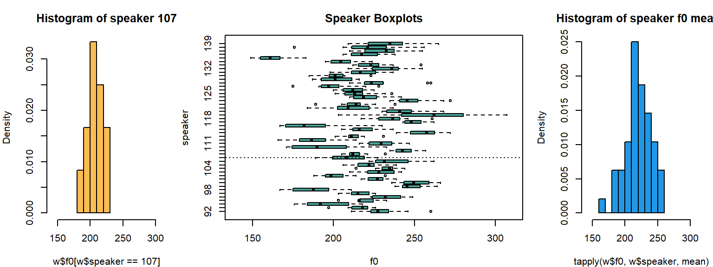
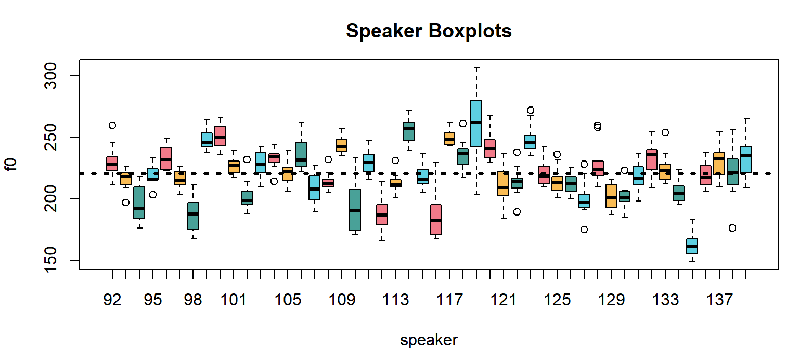
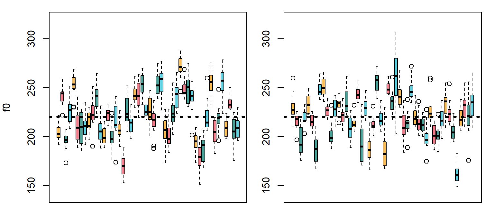

# Inspecting a 'single group' of observations using a Bayesian multilevel model   

The previous chapter introduced some basic terminology and concepts that are required to begin talking about models. In this chapter we're going to return to questions like 'what is the average value of $x$', however, we're going to answer these questions using Bayesian multilevel regression models in R using the `brms` package.  

## Data and research questions 

The models discussed in this chapter can be used for data that comes from a single group of subjects. By a 'single' group I just mean that you are not trying to compare things here, you're just trying to understand the average values of some variable for a single group of observations. The figure below is a visual representation of the structure of this data. It's not really needed for data this simple, but they will become more useful later so we will start talking about them now. Below, subjects are placed in a single group (the box). This group is labeled $A_1$ and each subject gets a unique subscript. The group label is just a stand-in for whatever label you have applied to your group of participants or observations.

<div class="figure" style="text-align: center">

<p class="caption">(\#fig:F2-interactionfig)Data from a single group of subjects (S) put into a single group Labelled (A).</p>
</div>
  
To analyze this data in R, you will need it to be in a dataframe. One column should contain observations, one on each row, and another column should contain information about the source of this data. Usually, for linguists the 'source' is a person, or perhaps it is a book or some other written source if one is analyzing a corpus. 

We're going to keep analyzing the female f0 data from the Hillenbrand et al. (1995) dataset, discussed in Chapter 1. These are 576 observations, 12 production collected from each of 48 women in the sample. So, our data comes from multiple speakers and we have multiple observations from each speaker. These women can be thought of as representatives of the group "adult women form Michigan". Of course, we could divide these women into any number of smaller groups based on hair color, handedness, and so on. These women are considered to be in a single group only because our model, our *conceptualization* of these speakers, places them in a single group. 

We're going to try to address the same questions we talked about last week:

1) What is the average f0 of the whole *population* likely to be?

2) Can we set bounds on likely mean f0 values based on the data we collected?

However, this time we are going to do this with a Bayesian multilevel model. We're going to see how the model provides us with the same information we got in the last chapter, in addition to providing us with additional useful information.


## Estimating a single mean with the `brms` package

The `brms` [('Bayesian regression models')](https://github.com/paul-buerkner/brms) package in R lets you fit Bayesian models using the STAN probabilistic programming language using R. The package is really amazing and makes Bayesian multilevel modeling easy and accessible for anyone. It also includes a lot of helper functions that make working with these models very convenient. 

`brms` should be installed in R so that the models described below will work. Make sure you have the latest version of R (and Rstudio) and the latest version of the `brms` package installed. Sometimes using older versions can cause R to crash when fitting models. Anecdotal experience suggests that if all of the sudden trying to fit these models causes crashes or mysterious errors, it's time to update one or more of R, Rstudio, or `brms`. 

### Description of the model

We're going to learn to read and write formal descriptions of our models. The notation we will learn will help us describe our models efficiently, and it will help us understand the models used by other people.

The relationship between statistical concepts and the formal notation used to represent them is very similar to the ability to play music and musical notation. Someone who can play a song undoubtedly *knows* that song. However, in the absence of formal musical training that same person might not recognize sheet music representing the song. This person would also lack the vocabulary to discuss components of the song, and may find it difficult to learn to play new pieces. In the same way, most people have an excellent intuitive understanding of many statistical concepts such as slopes, interactions, error, and so on. However, they lack the notational knowledge to understand these relations when expressed in the formal notation often used to express these ideas. 
Recall from Chapter 1 that our 'model' for a single group of normally distributed values can be thought of in one of two two ways:

\begin{equation}
\begin{split}
\\
y_{[i]} = \mu_{[i]} + \varepsilon_{[i]} \\ \\
y_{[i]} \sim \mathcal{N}(\mu_{[i]},\sigma) \\ \\
\end{split}
(\#eq:21)
\end{equation}

The top line says that your observed variable for any given trial $y_{[i]}$ is the sum of some of some average expected value for that trial, ($\mu_{[i]}$) and some specific random error for that trial ($\varepsilon_{[i]}$). The random error is expected to be normally distributed with a mean of 0 and some unknown standard deviation (as in: $\varepsilon_{[i]} \sim \mathcal{N}(0,\sigma)$). The second line presents the $y$ variable as being a normally-distributed variable with a trial-specific mean of $\mu_i$, and a fixed standard deviation $\sigma$

In general, we use regression models to understand orderly variation in $\mu_{[i]}$ from trial to trial by breaking it up into predictors ($\mathrm{x}_{1}, \mathrm{x}_{2},...$) that are combined using some weights ($\alpha_1, \alpha_2,...$). If this statement makes no sense please see Chapter 1!. 

$$
\mu_{[i]} = \alpha_1*\mathrm{x}_{1{[i]}} + \alpha_2*\mathrm{x}_{2i}+...+\alpha_j*\mathrm{x}_{j{[i]}}
(\#eq:22)
$$

'Fitting' a regression model consists of trying to 'guess' the values of the weighing factors ($\alpha$), called the *model coefficients*. When we are only trying to estimate a single average, we don't have any predictors to explain variation in $\mu_{[i]}$. In fact, our model structure suggests we expect no variation in $\mu_{[i]}$ from trial to trial. 

Mathematically, we can't just say 'we have no predictor' since everything needs to be represented by a number. As a result, we use a single 'predictor' $\mathrm{x}$ with a value of 1 so that our regression equation is:

$$
\mu_{[i]} = \alpha_1*1
(\#eq:23)
$$

Now our model is trying to guess the value of a single coefficient ($\alpha_1$), and we expect this coefficient to be equal to $\mu_{[i]}$ since it is being multiplied by a 'predictor' with a constant value of 1. 

This kind of model is called an 'Intercept only' model. Regression models are really about representing *differences*, differences between groups and across conditions. When you are encoding differences, you need an overall reference point. For example, saying that something is 5 miles north is only interpretable given some reference point. The 'reference point' used by your model is called your 'Intercept', and it is the center of your model's universe. 

Basically, our model consists *only* of a single reference point, and the $\alpha_1$ parameter reflects its value (as shown in Equation \@ref(eq:23)). As a result, the $\alpha_1$ coefficient is called the 'intercept' in our model. When a coefficient is just being multiplied by a 'fake' predictor that just equals 1, we can omit it from the regression model (but its still secretly there). 

Based on the above, our model investigating the f0 produced by adult women from Michigan can be thought of like this:

\begin{equation}
\begin{split}
\\
f0_{[i]} \sim \mathcal{N}(\mu_{[i]},\sigma) \\ \\ 
\mu_{[i]} = Intercept \\ \\
\end{split}
(\#eq:24)
\end{equation}

Put in plain English, each line in the model says the following:
 
  * We expect that f0 for a given observation $i$ is normally distributed according to some trial-specific expected value and some unknown (but fixed) standard deviation. 

  * The expected value for any given trial ($\mu_{[i]}$) is equal to the intercept of the model for all trials. This means its fixed and we have the same expected value for all tokens!
  
What the model also implicitly says that the error is drawn from a normal distribution with a mean of 0 and a standard deviation of $\sigma$. This distribution represents all deviations in f0 around the mean f0 for the sample ($\mu_{[i]}$). In other words, the error for this model is expected to look like:

$$
\varepsilon_{[i]} \sim \mathcal{N}(0,\sigma)
(\#eq:25)
$$
  
### The model formula

Model structures are expressed in R using a very specific syntax. Think of writing a model formula as writing a language within R. Generally, model formulas in R have the form:

`y ~ predictors`

The variable we are interested in understanding ($y$) goes on the left hand side of the $\sim$, and on our predictors go on the right hand side. Notice that the random term ($\varepsilon$) is not included in the model formula. 

The formula above can be read as 'y is distributed according to some predictor', which really means "we think there is systematic variation in our y variable that can be understood by considering its joint variation with our predictor variable(s)."

For intercept only models, the number `1` is included in the model formula to indicate that a single constant value is being estimated (as in  \@ref(eq:23)). As a result, our model formula will have the form:

`f0 ~ 1`

This model could be said out loud like "we are trying to estimate the mean of f0" or "we are predicting mean f0 given only an intercept". 

### Fitting the model: Calling the `brm` function

Below, I load the `brms` package, which contains the `brm` function. The `brm` function takes a model specification, data and some other information, and fits a model that estimates all the model parameters. Unless otherwise specified, `brm` assumes that the error component ($\varepsilon$) of your model is normally distributed. The first argument in the function call is the model formula, and the second argument tells the function where to find the data (a dataframe called `w`). The other arguments tell the function to estimate a single set of samples (chains = 1) using a single processor on your CPU (cores = 1). These arguments will be discussed more later.


```r
# Get data from course website
url1 = "https://raw.githubusercontent.com/santiagobarreda"
url2 = "/stats-class/master/data/h95_vowel_data.csv"
h95 = read.csv (url(paste0 (url1, url2)))
# select women only
w = h95[h95$group == 'w',]

# To ensure predictable results in examples, I will be using the same random  
# seed throughout, and resetting it before running any 'random' process.  
set.seed (1)
model = brms::brm (f0 ~ 1, data = w, chains = 1, cores = 1)

## SAMPLING FOR MODEL '77bdac4488ef47de193e19dae81fc150' NOW (CHAIN 1).
## Chain 1: 
## Chain 1: Gradient evaluation took 0 seconds
## Chain 1: 1000 transitions using 10 leapfrog steps per transition would take 0 seconds.
## Chain 1: Adjust your expectations accordingly!
## Chain 1: 
## Chain 1: 
## Chain 1: Iteration:    1 / 2000 [  0%]  (Warmup)
## Chain 1: Iteration:  200 / 2000 [ 10%]  (Warmup)
## Chain 1: Iteration:  400 / 2000 [ 20%]  (Warmup)
## Chain 1: Iteration:  600 / 2000 [ 30%]  (Warmup)
## Chain 1: Iteration:  800 / 2000 [ 40%]  (Warmup)
## Chain 1: Iteration: 1000 / 2000 [ 50%]  (Warmup)
## Chain 1: Iteration: 1001 / 2000 [ 50%]  (Sampling)
## Chain 1: Iteration: 1200 / 2000 [ 60%]  (Sampling)
## Chain 1: Iteration: 1400 / 2000 [ 70%]  (Sampling)
## Chain 1: Iteration: 1600 / 2000 [ 80%]  (Sampling)
## Chain 1: Iteration: 1800 / 2000 [ 90%]  (Sampling)
## Chain 1: Iteration: 2000 / 2000 [100%]  (Sampling)
## Chain 1: 
## Chain 1:  Elapsed Time: 0.08 seconds (Warm-up)
## Chain 1:                0.058 seconds (Sampling)
## Chain 1:                0.138 seconds (Total)
## Chain 1: 
```

By default, `brms` takes 2000 samples, throwing out the first 1000 and returning the last 1000. The output above shows you that the sampler is working, and tells you about the progress as it works. This is a small amount of data so it should be pretty fast.

This is the last time I will be actually fitting a model in the code chunks. I am going to be relying on pre-fit models that you can load after downloading from the course GitHub. Models can be found in the folder corresponding to each chapter.


```r
# download pre-fit model from: 
# github.com/santiagobarreda/stats-class/tree/master/models
# and load after placing in working directory
model = readRDS ('2_model.RDS')
```


### Interpreting the model: the print statement

Typing the model name into the console and hitting enter prints the default `brms` model print statement:


```r
# inspect model
model
##  Family: gaussian 
##   Links: mu = identity; sigma = identity 
## Formula: f0 ~ 1 
##    Data: w (Number of observations: 576) 
## Samples: 1 chains, each with iter = 2000; warmup = 1000; thin = 1;
##          total post-warmup samples = 1000
## 
## Population-Level Effects: 
##           Estimate Est.Error l-95% CI u-95% CI Rhat Bulk_ESS Tail_ESS
## Intercept   220.40      0.97   218.33   222.30 1.00      851      557
## 
## Family Specific Parameters: 
##       Estimate Est.Error l-95% CI u-95% CI Rhat Bulk_ESS Tail_ESS
## sigma    23.24      0.69    21.99    24.61 1.00      653      550
## 
## Samples were drawn using sampling(NUTS). For each parameter, Bulk_ESS
## and Tail_ESS are effective sample size measures, and Rhat is the potential
## scale reduction factor on split chains (at convergence, Rhat = 1).
```

The first part just tells you some technical details that we don't have to worry about for now (though some are obvious). 


```r
##  Family: gaussian 
##   Links: mu = identity; sigma = identity 
## Formula: f0 ~ 1 
##    Data: w (Number of observations: 576) 
## Samples: 1 chains, each with iter = 2000; warmup = 1000; thin = 1;
##          total post-warmup samples = 1000
```

Next we see estimated effects for out predictors, in this case only an intercept. This is a 'population' level effect because is is shared by all observations in our sample, and not specific to any one observation. 


```r
## Population-Level Effects: 
##           Estimate Est.Error l-95% CI u-95% CI Rhat Bulk_ESS Tail_ESS
## Intercept   220.40      0.97   218.33   222.30 1.00      851      557
```

The information above provides the mean (Estimate) and standard deviation (Est. Error) of the posterior distribution of $\mu$ (`Intercept`). The values of `l-95% CI` and `u-95% CI` represent the upper and lower '95% credible intervals' for the posterior distribution of this parameter. 

The *X% credible interval* for a parameter is the smallest interval that encloses X% of the posterior distribution, meaning the parameter has an X% chance (0.X probability) of falling inside the X% credible interval. So, there is a 95% probability that $\mu$ is between 218 and 222 Hz given our data and model structure. 

Notice that the parameter estimate and intervals almost exactly match the estimate and intervals we obtain by referencing the theoretical likelihood function (discussed in Chapter 1):


```r
# sample mean
mean (f0)
## [1] 220.401

# theoretical quantiles for likelihood of mean
qnorm (c(0.025, 0.975), mean (f0), sd (f0) / sqrt (length (f0) ) )
## [1] 218.5047 222.2974
```

As noted in Chapter 1, 'frequentist' and 'Bayesian' estimation differ in terms of whether they rely on the posterior or likelihoods to make inferences. However, for most real cases we expect the posterior to be dominated by the likelihood (see \@ref(fig:F1-posterior), and as a result we expect Bayesian and frequentist estimation to provide roughly equivalent answers given equivalent model structures. 

Our model also provides us an estimate of the error standard deviation($\sigma$), under 'Family Specific Parameters: sigma'. This estimate closely matches our sample standard deviation estimate (`sd(f0)`) of 23.2 Hz. In addition, we also get a 95% credible interval for this parameter (2.5% = 21.99, 97.5% = 24.61). 


```r
## Family Specific Parameters: 
##       Estimate Est.Error l-95% CI u-95% CI Rhat Bulk_ESS Tail_ESS
## sigma    23.24      0.69    21.99    24.61 1.00      653      550
```

This last section is just boilerplate and contains some basic reminders. This text will look the same after all models. 


```r
## Samples were drawn using sampling(NUTS). For each parameter, Bulk_ESS
## and Tail_ESS are effective sample size measures, and Rhat is the potential
## scale reduction factor on split chains (at convergence, Rhat = 1).
```

### Seeing the samples

In Chapter 1 I discussed that samplers (like `brm`, or STAN) take samples of the posterior distributions of parameters given the data and model structure. It's helpful to see that this is quite literally what is happening, and that the print statement above just summarizes the information contained in the posterior samples. Actually, one of the great things about Bayesian models is that you can make your own summaries of the posterior samples, and summarize them in several ways as required.

Below I get the posterior samples from the model. We have 1000 samples, as indicated in the model output above. The first column represents the model intercept (`b_Intercept`), the middle column is the error (`sigma`), and the third column is a statistic related to model fit (`lp__`). 


```r
# get posterior samples from model
samples = brms::posterior_samples (model)
str (samples)
## 'data.frame':	1000 obs. of  3 variables:
##  $ b_Intercept: num  221 221 220 222 220 ...
##  $ sigma      : num  22.1 21.9 23.2 21.9 22.9 ...
##  $ lp__       : num  -2635 -2635 -2634 -2637 -2634 ...
```

We can plot the individual samples for the mean parameter on the left below. On the right I plot a histogram of the same samples, superimposed with the theoretical distribution of the likelihood we calculated in Chapter 1. 

<div class="figure">

<p class="caption">(\#fig:F2-1)(left) Individual samples from posterior of mean f0 parameter. (right) a histogram of the same samples.</p>
</div>

Recall that our model output provides information about expected values for the mean parameter:


```r
## Population-Level Effects: 
##           Estimate Est.Error l-95% CI u-95% CI Rhat Bulk_ESS Tail_ESS
## Intercept   220.40      0.97   218.33   222.30 1.00      851      557
```

These simply correspond to the quantiles of the posterior samples! We can confirm this by checking the quantiles on the vector containing the posterior samples for the mean parameter as below:


```r
quantile (samples[,"b_Intercept"], c(.025, .5, .975))
##     2.5%      50%    97.5% 
## 218.3288 220.3997 222.3001
```

And we can see that these exactly correspond to the values of `Estimate`, `l-95% CI`, and `u-95% CI` in the model print statement above. There is no special status for these quantiles. We can check the values of other ones: 


```r
quantile (samples[,"b_Intercept"], c(.25, .75))
##      25%      75% 
## 219.8043 221.0296
```

Or even use the posterior distribution to find the probability that the mean parameter is over/under any arbitrary value:


```r
sum (samples[,"b_Intercept"] < 221) / 576
## [1] 1.284722
```

Let's take a second to think about why this works. Recall that the probability is the odds that something will occur out of all the possible outcomes. Our vector `samples[,"b_Intercept"]` represents 1000 observations of a random variable, 1000 possible values of the average f0 produced by adult women from Michigan. If we find the total number of these observations that were below 221 Hz and then divide by the total number of observations (576), we are calculating the probability of observing a mean estimate below 221 Hz. As a result, the calculation above says that there is a 0.74 probability (a 74% chance) that the mean f0 for female speakers in this population is under 221 Hz, given our data and model structure. We come to this conclusion by finding that 74% of the posterior samples of the parameter of interest are below 221 Hz. 

## Repeated measures data

The model we fit above is a reasonable starting point, but it has many weaknesses. Importantly, our data consists of 12 productions from each speaker in our sample, meaning we have 'repeated measures' data. However, our model does not contain this information an thinks that the 576 observations in our data are entirely independent. Treating repeated measures data as if it were *not* repeated measures data can cause problems for our inferences. This is because it can give us a warped perspective of how much variability there really is in the sample. 

For example, if I told you I had 1,000,000 samples of speech from male speakers from Los Angeles, you may be confident that I can estimate the average f0 male speakers from Los Angeles very accurately. But what if I told you that all these samples were from only three different people? You know instinctively that this makes my data less reliable for making inferences about Los Angeles in general, although it may provide excellent information about these three speakers. 

The reason repeated-measures data can cause problems is because the measurements are correlated: multiple measurements from the same person are obviously going to be related to each other. If you measure the height of a tall person today, they will still be tall tomorrow. This can be seen quite clearly below. The top panel shows the distribution of all our f0 measurements. The bottom panel shows speaker boxplots (one for each speaker's data). If we were to 'push down' on the bottom panel and collapse all our boxplots into a single distribution, we would end up with the boxplot in the top panel.

These boxplots shows that each speaker has their own average f0, and that their productions tend to vary around their 'natural average. As a result, we might have something closer to 48 independent observations (one average value per speaker) than 576. For example, if we look at the top boxplot there appear to be 'outliers' around 150 Hz. In the bottom plot we see that these productions all come from one speaker, and actually reflect her average f0. As a result, it seems that the *speaker* is the outlier, and that the values are actually perfectly average for this speaker.  

<div class="figure">

<p class="caption">(\#fig:F2-2)(top) Boxplot of overall distribution. (bottom) Speaker-specific boxplot of our f0 data.</p>
</div>

### Multilevel models

In linguistics (and many other similar fields) almost all of our data is repeated measures data. The methods most commonly-used by linguists (e.g., experiments, interviews, corpora, ... etc.) yield many observations per person, and typically all involve data from multiple people/sources. As a result, the analysis of this data requires that models be able to account for within *and* between speaker variation in our data. Multilevel models address the correlated nature of repeated measures data by estimating multiple sources of variation simultaneously. 

We can think about how this applies to our f0 sample. Each person picked at random has some average f0 they produce. This is *between-speaker* variation: If you pick to people at random they will differ. However, each person also produces a different random f0 every time they speak, so that they will never produce exactly their average f0: this is *within-speaker* variation. 

Repeated-measures data leads to random variation in parameters that is *indistinguishable* from that of our 'data'. For example, consider the figure below. First we consider a single speaker's production (left) and produce a histogram that suggests a normal distribution reminiscent in shape to the overall aggregated data. In the middle, we see individual boxplots showing variation in speaker averages. Here we see that although each speakers productions are a distribution, variation in the distribution of the speaker averages is its own sort of distribution. Finally, on the right we see a histogram of the speaker averages and see that these are also normally distributed.

To a large extent, whether something is a parameter or a data point depends somewhat on your perspective. For example, consider the figure below. If you are trying to estimate a speaker's mean f0, then the individual productions might be 'data' and the mean can be thought of as a 'parameter'. If you were instead only interested in the population average, maybe now your subject mean is actually just a single data point, and the *population* mean is actually your 'parameter'. 


<div class="figure">

<p class="caption">(\#fig:F2-3)(top left) All the f0 data (top right) A boxplot of the same data. (bottom left) Speaker-specific boxplots, with a vertical line for speaker 107. (bottom right) The histogram of data produced by speaker 107.</p>
</div>

A multilevel model is able to simultaneously estimate variation at multiple 'levels'. This is actually why it's called a *multilevel* model! For our f0 data, our 'levels' are: 

* The 'upper' level: Between-speaker variation in mean f0. This can be thought of as variation in a new variable, which we will call $\mu_{speaker}$. Speakers have an average f0 ($\mu_{speaker}$) that they produce over time. However, speakers are chosen randomly from a larger population, and so any given speaker's $\mu_{speaker}$ is unpredictable a priori. 

* The 'lower' level: Within-speaker variation, random error analogous to $\varepsilon$. When an individual speaker produces speech, their productions will vary around their average from token to token. Our model cannot explain this and so this is 'error'

As seen in the figure above, the variation at the lower and upper levels are analogous. Just like individual speakers will rarely have an average f0 exactly like the population average, individual speakers will rarely produce f0 values exactly at their speaker average. Importantly, variation at the two levels is independent and logically distinct: within-speaker variation can be small or large independently of whether between-speaker variation is large or small. 

Basically, each subject's productions form a little normal distribution around their average, and the mix of these little distributions results in the overall 'big' distribution of data across all subjects. By using multilevel models, we can estimate the effects of multiple sources of variation at the same time.


## Estimating a multilevel model with `brms`

We're now going to fit the same model we fit above, but with a structure that reflects the repeated-measures nature of the data. Whereas the last model was a pedagogical device, this model structure is actually appropriate to analyze this particular dataset. 

### Description of the model 

We're going to keep working on developing an intuitive understanding for model notation, and using it to describe models. Just keep in mind that this is nothing more than an efficient way to denote the concepts being discussed in the text.

To specify a multilevel model, you need to write a slightly more complicated model formula. This explanation assumes that you have a dataframe or matrix where one column contains the variable you are interested in predicting (in this case `f0`), and another column contains a vector containing unique labels for each speaker/listener/participant (in this case a unique speaker label `speaker`). 

To indicate that your model contains an 'upper' level where you have clusters of data coming from different individuals, you have to put another model inside your main model!

Before, the model formula looked like this:

`f0 ~ 1` 

which meant 'predict f0 using only an intercept'. Now the model formula will look like this:

`f0 ~ 1 + ( 1 | speaker)` 

When you place a predictor in the formula in parenthesis and on the right-hand-side of a pipe, like this `( | predictor )`, you tell `brm` that you expect data to be clustered according to each category represented in the grouping vector. In this case, we are telling `brm` that each unique speaker is a cluster of data. Whatever you put in the left-hand-side of the parentheses `( in here | predictor )` is the model for each subcluster! 

So what does this model formula mean: `f0 ~ 1 + ( 1 | speaker)`? Remember a model formula consisting only of a `1` tells `brm` that we have an Intercept-only model. So, our new formula tells `brm`: predict f0 based on only an overall intercept, but also estimate a different intercept for each speaker. Effectively, this model formula is telling `brm` to figure out all the information presented in the figures above.

This regression model is now something like this:

\begin{equation}
\begin{split}
\\
f0_{[i]} \sim \mathcal{N}(\mu_{[i]},\sigma) \\ \\
\mu_{[i]} = Intercept + \alpha_{speaker_{[i]}} \\
\\
\end{split}
(\#eq:26)
\end{equation}

In plain English, the model above says: we expect f0 to be normally distributed. The f0 value we expect for any given token is equal to some overall average ($Intercept$), and some value associated with the individual speaker ($\alpha_{speaker_{[i]}}$) who uttered the trial. 

We now have another term $\alpha_{speaker}$, in addition to the intercept. This coefficient is actually a set of coefficients since it has a different value for each speaker (it's a vector). Notice that the although the Intercept is fixed, value of $\alpha_{speaker}$ that should be used will vary from trial to trial based on the speaker associated with the trial. We will discuss coefficients like these in more detail later, we don't really need to worry about it for now. 

The value of $\alpha_{speaker}$ has a different value for each speaker because it will reflect variation in $\mu_{speaker}$, the average f0 value produced by each speaker. However, $\mu_{speaker}$ is a random variable since it reflects the random average f0 of each person drawn from the population. If $\mu_{speaker}$ behaves like a random variable, then the coefficients that reflect this value in our model ($\alpha_{speaker}$) will behave in the same way. 

This means that our model actually has *two* random variables. The first one is the error term $\varepsilon_{[i]} \sim \mathcal{N}(0,\sigma_{error})$, which has a mean of 0 and a standard deviation which we can refer to as $\sigma_{error}$. The second is the random coefficients that allow for speaker-specific adjustments to the intercept ($\alpha_{speaker}$). These can also be thought of as random draw from a normal distribution.

A careful consideration of the model in equation 2.4 suggests that the ($\alpha_{speaker}$) coefficients can't actually be exactly equal to $\mu_{speaker}$, the average f0 for a speaker. If the overall mean (the intercept) is 220 Hz and a speaker's average is 230, this would suggest a predicted average of 450 ($Intercept + \mu_{speaker}$) for this speaker. Clearly that is not how the model should be working. 

Recall that regression models encode *differences*, rather than absolute values. Our model already represents the overall data average in the intercept parameter. Thus, the speaker-specific averages only need to contain information about *differences* to this reference value. As a result, coefficients such as $\alpha_{speaker}$ are modelled as being normally distributed with a mean of 0, and with some population-specific standard deviation. 

Since our model coefficients reflect speaker-specific *deviations* rather than the actual mean f0 of different speakers, people often use this symbol, $\gamma$, for them instead of $\mu$, where $\gamma$ reflects the difference between the speaker means and the mean for the population of speakers,  $\gamma_{speaker} = \mu_{speaker} - \mu_{population}$. 

We can show the expected distribution of this variable below, where $\sigma_{speakers}$ is a population-specific standard deviation term. Note the similarity of this to the expected variation in our original data in Equation \@ref(eq:24).

\begin{equation}
\begin{split}
\\
\gamma_{speaker} \sim \mathcal{N}(0,\sigma_{speakers}) \\ \\ 
\gamma_{speaker} = \alpha_{speaker} \\ \\
\end{split}
(\#eq:27)
\end{equation}

Our overall model is now as shown below, made specific for the data we have, and using expected parameter names.

\begin{equation}
\begin{split}
\\
f0_{[i]} \sim \mathcal{N}(\mu_{[i]},\sigma_{error}) \\ \\
\mu_{[i]} = Intercept + \alpha_{speaker_{[i]}} \\ \\
\alpha_{speaker} \sim \mathcal{N}(0,\sigma_{speakers}) \\ \\
\end{split}
(\#eq:28)
\end{equation}

Each line in the model says the following:
 
  * observed f0 is expected to be normally distributed around a trial-specific mean, with some unknown but fixed standard deviation ($\sigma_{error}$). 

  * the expected value for a given trial ($\mu_{[i]}$) is equal to the model intercept, plus some speaker-specific deviation/difference from the intercept for the speaker that produced that trial ($\alpha_{speaker_{[i]}}$). 

  * the speaker effects ($\alpha_{speaker}$) are also drawn from a normal distribution with a mean of 0 and a standard deviation of $\sigma_{speakers}$. This distribution represents the random, but systematic, between-speaker variation in average productions that exists within any population of speakers.  
  
All of this information can be seen in the speaker boxplots below. The model intercept (horizontal dotted line) represents the overall mean, and the variation in $\alpha_{speaker}$ is what causes the middle of each little box to differ from the mean. Finally, the error causes there to be a spread, a *distribution*, around each speaker's individual mean.
  
<div class="figure">

<p class="caption">(\#fig:F2-4)Speaker-specific boxplots for the f0 data.</p>
</div>
  
There is a very important difference in how the first and second models we fit view and partition the variation in our model. The initial model we fit broke down the total variation in the model ($\sigma_{total}$) like this:

$$
\sigma_{total} = \sigma_{error}
(\#eq:29)
$$

In other words, all variation was error. We don't know why values vary from the mean. Our multilevel model views the variation in our data like this:

$$
\sigma_{total} = \sigma_{speaker} + \sigma_{error}
(\#eq:210)
$$

From the perspective of this model, only the variation *within* a speaker's individual boxplot is error. The differences from box to box represent random (but systematic) between-speaker variation in f0. 

### Fitting the model  

We can fit a model with a formula that appropriately specifies the clustering we expect in our data. As a result, this model can estimate both between- and within-speaker variability. 


```r
# Fit the model yourself, or
set.seed (1)
multilevel_model =  
  brm (f0 ~ (1|speaker), data = w, chains = 1, cores = 1)

# download pre-fit model from: 
# github.com/santiagobarreda/stats-class/tree/master/models
# and load after placing in working directory
multilevel_model = readRDS ("2_multilevel_model.RDS")
```


```r
# inspect model
multilevel_model
##  Family: gaussian 
##   Links: mu = identity; sigma = identity 
## Formula: f0 ~ (1 | uspeaker) 
##    Data: w (Number of observations: 576) 
## Samples: 1 chains, each with iter = 2000; warmup = 1000; thin = 1;
##          total post-warmup samples = 1000
## 
## Group-Level Effects: 
## ~uspeaker (Number of levels: 48) 
##               Estimate Est.Error l-95% CI u-95% CI Rhat Bulk_ESS Tail_ESS
## sd(Intercept)    20.19      2.10    16.65    25.06 1.00      135      192
## 
## Population-Level Effects: 
##           Estimate Est.Error l-95% CI u-95% CI Rhat Bulk_ESS Tail_ESS
## Intercept   220.39      3.10   214.49   226.13 1.03       51      108
## 
## Family Specific Parameters: 
##       Estimate Est.Error l-95% CI u-95% CI Rhat Bulk_ESS Tail_ESS
## sigma    12.54      0.39    11.83    13.34 1.01      400      700
## 
## Samples were drawn using sampling(NUTS). For each parameter, Bulk_ESS
## and Tail_ESS are effective sample size measures, and Rhat is the potential
## scale reduction factor on split chains (at convergence, Rhat = 1).
```

This new model contains one new chunk its print statement. This section tells us about the standard deviation for the Intercept (`sd(Intercept)`) for the `~speaker` cluster:


```r
## Group-Level Effects: 
## ~speaker (Number of levels: 48) 
##               Estimate Est.Error l-95% CI u-95% CI Rhat Bulk_ESS Tail_ESS
## sd(Intercept)    20.19      2.10    16.65    25.06 1.00      135      192
```

This parameter corresponds to $\sigma_{speaker}$ above, the standard deviation of between-speaker averages ($\alpha_{speaker}$) in the sample. Below, we calculate the speaker mean f0 values, the standard deviation of these, and the amount of within-speaker variation in f0s. 


```r
# find mean f0 for each speaker
speaker_means = aggregate (f0 ~ speaker, data = w, FUN = mean) 
# find the within speaker standard deviation This is the within-talker 'error'.
speaker_sigmas = aggregate (f0 ~ speaker, data = w, FUN = sd) 

# the mean of the speaker means corresponds to our overall mean estimate
mean (speaker_means$f0)
## [1] 220.401

# the standard deviation of the speaker means corresponds to 'sd(Intercept)', the 
# estimate of the standard deviation of speaker intercepts
sd (speaker_means$f0)
## [1] 20.07397

# the average within-speaker standard deviation corresponds to 'sigma', the 
# estimated error
mean (speaker_sigmas$f0)
## [1] 11.6791
```

We are going to discuss the calculations we made above in terms of what they represent in the boxplots below. The overall mean f0 in our data (220.4) corresponds quite well to our model estimate of 220.4. This reflects the central location of the overall distribution below (the horizontal line in the figure below). The standard deviation of the speaker means (20.1) is again very similar to our model estimate (sd(Intercept) = 20.2). This reflects the average distance from each speaker's average to the overall average. Finally, the average of the within speaker standard deviation in our data (11.7) corresponds closely to our model's error estimate (sigma = 12.5). This reflects the average spread of each speaker's data relative to their own mean, within their own little boxplot. We can see that the information provided by `brms` is quite similar to what we can estimate directly using our data. However, *brms* does this all for us, in addition to giving us a lot more information. 


<div class="figure">

<p class="caption">(\#fig:F2-5)Speaker-specific boxplots for the f0 data we are analyzing.</p>
</div>

## Checking model convergence

Remember that our parameter estimates are based of a set of samples from the posterior distribution of a parameter. If we don't take enough of these samples, our parameter estimates will be unreliable. 

For this reason, it's important to look at the ESS values (the 'expected sample size'), and the 'Rhat' values provided by `brm`. ESS tells you about how many independent samples you have taken from the likelihood. Bulk ESS is how many samples the sampler took in the thick part of the density, and Tail ESS reflects how much time the sampler spent in the thin part, the 'tails'. Rhat tells you about whether your 'chains' have converged (more on this later). As noted above, values of Rhat near 1 are good, and values higher than around 1.1 are a bad sign. 

We haven't really taken many samples here, so we can't be confident in our parameter estimates. Ideally we would like several hundred samples (at least) for mean estimates, and thousands to be confident in the 95% confidence intervals. If you fit a model and get a warning message like this:


```r
## Warning messages:
## 1: Bulk Effective Samples Size (ESS) is too low, indicating posterior means and medians may be unreliable.
## Running the chains for more iterations may help. See
## http://mc-stan.org/misc/warnings.html#bulk-ess
## 2: Tail Effective Samples Size (ESS) is too low, indicating posterior variances and tail quantiles may be unreliable.
## Running the chains for more iterations may help. See
## http://mc-stan.org/misc/warnings.html#tail-ess
```

That is `brms` telling you that you need to collect more samples in order to be confident in your parameter estimates. To get more samples we can run the model longer, or we can use more *chains*. A chain is basically a separate set of samples for your parameter values. A model can be fit in parallel across several chains, and then the estimates can be merged across chains. When you do this across multiple cores, you can get N times as many samples when you use N cores. Since many computers these days have 4-8 (or more) cores, we can take advantage of parallel processing to fit models faster.

Before fitting a model across multiple cores, you should confirm how many you have. You can use the following command (you may need to install the `parallel` package):


```r
parallel::detectCores()
```

I will be using four cores to fit models throughout. If you only have 4 total cores, consider changing the model fits to 2-3 chains and cores. One thing to keep in mind is that these models are computationally intensive to fit. As the datasets become larger and the models become more complicated, more powerful computers are needed in order to fit a model in a reasonable amount of time.

Below, I refit the same model from above but run it on 4 chains, and on 4 cores at once. 


```r
# Fit the model yourself, or
set.seed (1)
multilevel_multicore =  
  brms::brm (f0 ~ 1 + (1|speaker), data = w, chains = 4, cores = 4)

# download pre-fit model from: 
# github.com/santiagobarreda/stats-class/tree/master/models
# and load after placing in working directory
multilevel_multicore = readRDS ('2_multilevel_multicore.RDS')
```


```r
# inspect model
multilevel_multicore
##  Family: gaussian 
##   Links: mu = identity; sigma = identity 
## Formula: f0 ~ 1 + (1 | uspeaker) 
##    Data: w (Number of observations: 576) 
## Samples: 4 chains, each with iter = 2000; warmup = 1000; thin = 1;
##          total post-warmup samples = 4000
## 
## Group-Level Effects: 
## ~uspeaker (Number of levels: 48) 
##               Estimate Est.Error l-95% CI u-95% CI Rhat Bulk_ESS Tail_ESS
## sd(Intercept)    20.22      2.19    16.54    25.19 1.02      345      615
## 
## Population-Level Effects: 
##           Estimate Est.Error l-95% CI u-95% CI Rhat Bulk_ESS Tail_ESS
## Intercept   220.47      2.91   214.67   226.14 1.02      228      543
## 
## Family Specific Parameters: 
##       Estimate Est.Error l-95% CI u-95% CI Rhat Bulk_ESS Tail_ESS
## sigma    12.54      0.39    11.81    13.34 1.00     3427     2943
## 
## Samples were drawn using sampling(NUTS). For each parameter, Bulk_ESS
## and Tail_ESS are effective sample size measures, and Rhat is the potential
## scale reduction factor on split chains (at convergence, Rhat = 1).
```

If we compare the ESS for this new model to the previous model, we see that using 4 chains has substantially increased our ESS, without taking up any more computing time. 

One final tweak that I will be using going forward is to 'thin' samples. Notice that we have collected `total post-warmup samples = 4000`. This means our model has 4000 samples for every parameter in the model. However, for some parameter we have only about 400 'effective samples'. This means that a lot of our samples are basically dead weight, taking up space and slowing down future computations for no good reason.

The discrepancy between the number of samples and the 'effective' number of samples is due to something called *autocorrelation*. Sometimes consecutive samples can be too similar and so don't given you that much *independent* information. When this happens you end up with less information about a parameter than you might think based on the number of samples you have. One way to fix this is to run longer chains and keep only every Nth one. This lets your models be smaller while containing approximately the same information. 

To do this you have to change the `iter`, `warmup` and `thin` parameters. You will keep every sample after the warmup is done, up to the `iter` maximum. So if `iter=3000` and `warmup=1000` you will end up with 2000 samples. After this, you keep only one every `thin` samples. Basically, you will end up with $(iter-warmup) / thin$ samples per chain. If you are doing this across `Ncores` cores, then you will end up with $((iter-warmup) / thin) \times Ncores$ samples in total. 

Below, I ask for 11,000 sample per chain. Since the warmup is 1000 this means we will keep 10,000 post warm-up. However, since `thin=10`, we will keep only 1000 of these. Finally, since we are fitting the model on four cores, we will end up with 4000 samples in total. As a resul, despite having the same number of samples as the `multilevel_multicore`, the ESS for this model is much higher for important parameters such as the model intercept. 


```r
# Fit the model yourself, or
set.seed (1)
multilevel_thinned =  
  brm (f0 ~ 1 + (1|speaker), data = w, chains = 4, cores = 4,
       warmup = 1000, iter = 11000, thin = 10)

# download pre-fit model from: 
# github.com/santiagobarreda/stats-class/tree/master/models
# and load after placing in working directory
multilevel_thinned = readRDS ('2_multilevel_thinned.RDS')
```


```r
# inspect model
multilevel_thinned
##  Family: gaussian 
##   Links: mu = identity; sigma = identity 
## Formula: f0 ~ 1 + (1 | uspeaker) 
##    Data: w (Number of observations: 576) 
## Samples: 4 chains, each with iter = 11000; warmup = 1000; thin = 10;
##          total post-warmup samples = 4000
## 
## Group-Level Effects: 
## ~uspeaker (Number of levels: 48) 
##               Estimate Est.Error l-95% CI u-95% CI Rhat Bulk_ESS Tail_ESS
## sd(Intercept)    20.06      2.23    16.24    24.98 1.00     2775     3392
## 
## Population-Level Effects: 
##           Estimate Est.Error l-95% CI u-95% CI Rhat Bulk_ESS Tail_ESS
## Intercept   220.40      2.95   214.57   226.19 1.00     1987     2625
## 
## Family Specific Parameters: 
##       Estimate Est.Error l-95% CI u-95% CI Rhat Bulk_ESS Tail_ESS
## sigma    12.54      0.38    11.81    13.31 1.00     3908     3891
## 
## Samples were drawn using sampling(NUTS). For each parameter, Bulk_ESS
## and Tail_ESS are effective sample size measures, and Rhat is the potential
## scale reduction factor on split chains (at convergence, Rhat = 1).
```

## Specifying prior probabilities

In Chapter 1 we discussed that Bayesian models require that prior probabilities be specified for all parameters. You may have noticed that to this point I haven't discussed priors at all. 

If you don't specify prior probabilities for your parameters, `brm` will use a 'flat/uniform' prior for all parameters. When you do this, you are basically relying only on the likelihood for your analysis. You are also telling your model that, a priori, *any* value of average f0 is equally believable. Empirically, this is false. As a practical matter this can cause problems for samplers like STAN (which is what `brm` relies on). Basically, in the absence of proper priors the sampler has a harder time figuring out the most likely values when you tell it to look anywhere from positive to negative infinity. Even a bit of guidance can help.

`brms` makes it really easy to specify prior probabilities for specific parameters or whole groups of parameters. Below, I set priors for whole classes of parameters. In the example below, I use this information to set reasonable bounds on the parameters in the model. I do this by class of parameter:

* `Intercept`: this is a unique class, only for intercepts.
* `b`: this is for all the non-intercept predictors. There are none in this model for now.
* `sd`: this is for our standard deviation parameters that relate to 'batches' of parameters. In our example this is `sd(Intercept)` for `speaker` ($\sigma_{speakers}$).
* `sigma`: this is for any error parameters. Our only has one (but it could have more!), that is `sigma` ($\sigma_{error}$).

We're not going to worry about priors too much for now, and we're just going to set what are called 'weakly informative' prior probabilities for our parameters. These are priors that encode a bit of information about our prior beliefes for a parameter, but are not *too* strong. To set these, you have to use what you know about your variables, the world, and a healthy does of 'common sense'. We will see a lot of examples of, and strategies for, setting priors in this book so you will get a chance to build your intuitions about it.  

Both priors below use a 't' distribution, which is just like a normal distribution but it's more pointy, and has more density in the outer parts of the distribution. You can use normal priors, or any other priors that you think work for your model. Rather than focusing on the *mathematical* properties of priors, the most important thing is that their *shape* reflect the distribution of credible parameter values a priori (before you conducted your experiment). 

The code to set the priors for our model looks like this:


```r
  prior = c(set_prior("student_t(3, 220, 50)", class = "Intercept"),
            set_prior("student_t(3, 0, 100)", class = "sd"),
            set_prior("student_t(3, 0, 100)", class = "sigma"))
```

The format for the priors is like this `student_t(nu, mean, sd)`, where `nu` is a parameter that determines how pointy the distribution is, and `mean` and `sd` are the same mean and standard deviation parameters from the normal distribution. The nu parameter ranges from 1 to infinity, and large numbers result in a more normal-like distribution. We will talk about the t-distribution ins more detail later.

For the overall model intercept we set a prior probability of `student_t(3, 220, 110)`. Around 90-95% of the distribution of normal and t distributions is within two standard deviations of the mean. This means that I am saying the intercept should be between around 0 and 440 Hz. Since this range is higher than the range of human speaker f0s (about 80-300 Hz), this prior is not going to affect our outcomes very much. 

The prior for the speaker standard deviation parameter ($\sigma_{speakers}$) is `student_t(3, 0, 100)`, which specifies a t distribution centered at 0, with a standard deviation of 100. Since standard deviations can only be positive, the sampler (STAN) used by `brm` ignores the negative half, and uses only the positive values in the prior distribution. This prior just says that we expect the average difference between speakers to be less than 200 Hz (which it definitely is).   

Finally, the prior for the random error is also `student_t(3, 0, 100)`. Again, this says that we expect that the standard deviation of our random error to be less than 200 Hz. Since our random error is within-speaker variation, this is a again a massive overestimation of the likely magnitude of the random error in this data. 

The left panel below compares the t distribution we used (blue) to the equivalent normal distribution (red). Although it may not seem like much of a difference, the t distribution can tolerate more extreme values because of its 'fatter' (more dense) tails. As we will discuss later, using t distributions can make our models more robust to outliers. This is really important in linguistics where subjects/speakers sometimes do weird stuff! As we can see, the prior distribution we used for the intercept is much broader (more vague) than the data distribution so that it will have basically no effect on our results (but will help our model fit properly).

The right panel compares the prior for the standard deviation parameters to the absolute value of the centered f0 data. This presentation shows how far each observation is from the mean f0 (at 220 Hz). Obviously, people can't differ from each other by more than deviations differ from the mean. As a result, we see that the prior distribution we have assigned for the `sigma` (i.e., $\sigma_{[speaker]}$) and speaker `sd(Intercept)` parameter (i.e., $\sigma_{[speaker]}$) are much broader than these parameters could be, given the data. As a result, neither of these priors is going to have much of an effect on our parameter estimates.


<div class="figure">

<p class="caption">(\#fig:F2-6)(left) A comparison of the densities of normal and t distributions with the same means and sigma parameters. The histogram shows our f0 data. (right) The distribution of absolute deviations from the mean for our f0 data, compared to the prior distributions of our standard deviation parameters in our model.</p>
</div>

We can fit this new model below, and inspect the output. If we compare the output of this model to `multilevel_thinned`, we see that specifying a prior has has no noticeable effect on our results. This is because the prior matters less and less when you have a lot of data, and because we have set wide priors that are appropriate (but vague) given our data. Although the priors may not matter much for models as simple as these, they can be very important when working with more complex data, and are a necessary component of Bayesian modeling. 


```r
# Fit the model yourself, or
set.seed (1)
multilevel_priors =  
  brm (f0 ~ 1 + (1|speaker), data = w, chains = 4, cores = 4,
       warmup = 1000, iter = 11000, thin = 10,
       prior = c(set_prior("student_t(3, 220, 100)", class = "Intercept"),
                 set_prior("student_t(3, 0, 100)", class = "sd"),
                 set_prior("student_t(3, 0, 100)", class = "sigma")))

# download pre-fit model from: 
# github.com/santiagobarreda/stats-class/tree/master/models
# and load after placing in working directory
multilevel_priors = readRDS ('2_multilevel_priors.RDS')
```


```r
# inspect model
multilevel_priors
##  Family: gaussian 
##   Links: mu = identity; sigma = identity 
## Formula: f0 ~ 1 + (1 | uspeaker) 
##    Data: w (Number of observations: 576) 
## Samples: 4 chains, each with iter = 11000; warmup = 1000; thin = 10;
##          total post-warmup samples = 4000
## 
## Group-Level Effects: 
## ~uspeaker (Number of levels: 48) 
##               Estimate Est.Error l-95% CI u-95% CI Rhat Bulk_ESS Tail_ESS
## sd(Intercept)    20.19      2.24    16.29    25.06 1.00     3114     3663
## 
## Population-Level Effects: 
##           Estimate Est.Error l-95% CI u-95% CI Rhat Bulk_ESS Tail_ESS
## Intercept   220.42      2.97   214.44   226.38 1.00     1796     2841
## 
## Family Specific Parameters: 
##       Estimate Est.Error l-95% CI u-95% CI Rhat Bulk_ESS Tail_ESS
## sigma    12.54      0.39    11.81    13.34 1.00     3968     3972
## 
## Samples were drawn using sampling(NUTS). For each parameter, Bulk_ESS
## and Tail_ESS are effective sample size measures, and Rhat is the potential
## scale reduction factor on split chains (at convergence, Rhat = 1).
```

## Answering our research questions

Let's return to the research questions we posed initially in Chapoter 1, and again at the beginning of this chapter:

1) What is the average f0 of the whole *population* likely to be?

2) Can we set bounds on likely mean f0 values based on the data we collected?

And we can compare the answers provided to this question by our initial model (which contained no priors or information about repeated measured) and final models (which contained information about speakers and appropriate priors). 


```r
model
##  Family: gaussian 
##   Links: mu = identity; sigma = identity 
## Formula: f0 ~ 1 
##    Data: w (Number of observations: 576) 
## Samples: 1 chains, each with iter = 2000; warmup = 1000; thin = 1;
##          total post-warmup samples = 1000
## 
## Population-Level Effects: 
##           Estimate Est.Error l-95% CI u-95% CI Rhat Bulk_ESS Tail_ESS
## Intercept   220.40      0.97   218.33   222.30 1.00      851      557
## 
## Family Specific Parameters: 
##       Estimate Est.Error l-95% CI u-95% CI Rhat Bulk_ESS Tail_ESS
## sigma    23.24      0.69    21.99    24.61 1.00      653      550
## 
## Samples were drawn using sampling(NUTS). For each parameter, Bulk_ESS
## and Tail_ESS are effective sample size measures, and Rhat is the potential
## scale reduction factor on split chains (at convergence, Rhat = 1).

multilevel_priors
##  Family: gaussian 
##   Links: mu = identity; sigma = identity 
## Formula: f0 ~ 1 + (1 | uspeaker) 
##    Data: w (Number of observations: 576) 
## Samples: 4 chains, each with iter = 11000; warmup = 1000; thin = 10;
##          total post-warmup samples = 4000
## 
## Group-Level Effects: 
## ~uspeaker (Number of levels: 48) 
##               Estimate Est.Error l-95% CI u-95% CI Rhat Bulk_ESS Tail_ESS
## sd(Intercept)    20.19      2.24    16.29    25.06 1.00     3114     3663
## 
## Population-Level Effects: 
##           Estimate Est.Error l-95% CI u-95% CI Rhat Bulk_ESS Tail_ESS
## Intercept   220.42      2.97   214.44   226.38 1.00     1796     2841
## 
## Family Specific Parameters: 
##       Estimate Est.Error l-95% CI u-95% CI Rhat Bulk_ESS Tail_ESS
## sigma    12.54      0.39    11.81    13.34 1.00     3968     3972
## 
## Samples were drawn using sampling(NUTS). For each parameter, Bulk_ESS
## and Tail_ESS are effective sample size measures, and Rhat is the potential
## scale reduction factor on split chains (at convergence, Rhat = 1).
```

Our initial model (`model`) and our final model (`multilevel_priors`) agree on what the average f0 is. However, they disagree on a credible interval for that parameter. Our initial model did not specify information about repeated measures. This causes our model to think that it has more independent observations than it does, and so it returns an overly-precise estimate. 

Another difference is that the final model has a much smaller `sigma` parameter (12.5 vs 23.2). This indicates that the error ($\varepsilon$) is much smaller in the final model than in the initial model. Keep in mind that 'error' is just what your model can't explain. Our final model explains much more and so there is less error. The reduced error is a direct consequence of the fact that the final model splits the variation in the data into between-speaker and within-speaker components (i.e., $\sigma_{total}=\sigma_{speaker}+\sigma_{error}$), estimating the between-speaker variation ($\sigma_{speaker}$) to be about 20 Hz. Since $\sigma_{total}$ is a fixed value (given the data), obviously the larger your between-speaker variation is ($\sigma_{speaker}$), the smaller your random error (($\sigma_{error}$)) *must* be.

Usually, when I report parameters I provide the mean and standard deviations of the posterior distribution, in addition to the bounds of the 95% credible interval of the parameter. Based on the result of our final model, I think a thorough description of the general properties of our data might go something like: 

> "Based on our model the average f0 produced by adult females in Michigan is likely to be 220 Hz (s.d. = 2.97, 95% CI = 214.4, 226.4). However, consistent between-speaker variation averages about 20 Hz (s.d. = 2.24, 95% CI = 16.29, 25.06), meaning that we can expect the average f0 produced by individuals to deviate substantially from 220 Hz. Finally, the standard deviation of production error was about 12.5 Hz (s.d. = 0.39, 95% CI = 11.81, 13.34) indicating that the amount of random within-speaker variation in production is about half the magnitude of the systematic between-speaker differences in f0.   

I'm again including the speaker boxplots below because I think this image basically presents the same information as the paragraph above, but in visual form. In general, any data relationship or result can be presented in a figure, and the relationships presented in a figure can also be expressed as a mathematical model. 

When you are thinking about the relationships in your data, or that you expect in your data, its a good idea to think: what kind of picture could illustrate this relationship? Conversely, if you see a figure of your results that you feel really expresses something interesting about your data you should think, how can these relationships be represented in a model?

<div class="figure">

<p class="caption">(\#fig:F2-7)Speaker-specific boxplots for the f0 data.</p>
</div>

## Simulating data using our model parameters

One way to think about what all these numbers mean is to simulate data that has the same characteristics, and build fake data from the individual component parts. The code chunk below does exactly this for the data we have been discussing thus far.  

First, there is an intercept equal to 220.4 Hz. Then, I create effects representing 48 simulated 'female talkers' from a population just like our observed population. These effects are stored in a vector called `alpha_speaker`, and they represent the values of $\alpha_{speaker}$ for our different speakers. These speaker effects come from a population with a mean of 0 and a standard deviation ($\sigma_{speaker}$) equal to 20.4 (like our data). Each of these simulated speakers produces 12 productions, and so we need a `speakers` vector with values that repeat 12 times each to index the `alpha_speaker` vector containing the effects. 

I also draw our error, $\varepsilon$. This error comes from a distribution with a mean of 0 and a standard deviation equal to $\sigma_{error}$. It's important to note that the error is just 48x12 random draws from this population. There is no distinction between one person's productions and another when it comes to the error. If there were, this would indicate differences in sigma between speakers! Our model assumes a single error population for all speakers (but it doesn't *have* to be this way). 


```r
## don't run this line if you want a new simulated dataset. 
set.seed(5)
## this is the value of our intercept
Intercept = 220.4
## this is a vector of 48 speaker effects
alpha_speaker = rnorm (48, 0, 20.2)
## this is a vector indicating which speaker produced which utterance
speaker = rep (1:48, each = 12)
## this vector contains the error
epsilon = rnorm (48 * 12, 0, 12.5)
```

After creating our components, we add the Intercept, speaker deflections and random error to make our fake 'replicated' data. Since this data has the same statistical properties as our real data, it should look a lot like it. 


```r
# the sum of an intercept, speaker deflections and random error makes our fake data
f0_rep = Intercept + alpha_speaker[speaker] + epsilon
```

Below I compare the results of our simulation to our real data. If you didn't have a clear impression of what the data looked like, I doubt you could tell which is the real data. This tells us our model is a good reflection of the data!

<div class="figure">

<p class="caption">(\#fig:F2-8)Comparison of real and simulated f0 production data.</p>
</div>

Below I make two datasets that are 'incomplete' with respect to the variation in our data. The first contains the intercept and noise only, the second contains the intercept and speaker effects only. 


```r
# this fake data is missing between speaker variation
f0_rep_1 = Intercept + epsilon

# this fake data is missing within speaker variation
f0_rep_2 = Intercept + alpha_speaker[speaker]
```

In the figure below, I compare these 'incomplete' datasets to the full simulated data. The top row contains only error ($\varepsilon, \sigma_{error}$). As a result, f0 varies around the intercept, but there is no speaker to speaker variation. This is what that data would look like if there is no random variation in means across subjects.

However, notice that each little box is not centered at 0. Although the error distribution is centered at 0, the small number of errors added to the speaker mean are **extremely** unlikely to add up to exactly 0. So, error contributes some unknown amount to each speaker's apparent average. This makes estimations of the *real* speaker effects impossible in practice. 

In the middle plot, the figure shows only between-speaker variation ($\alpha_{speaker}, \sigma_{speaker}$) but no within-speaker variation (i.e., no noise/error). Now we see that speakers vary from the intercept, but this representation does not show the fact that speakers also vary relative to their own average.  

The final plot is the combination of the variation in the top two figures. The final plot shows the simulated data: the sum of the intercept, the within speaker variation and the between-speaker variation reflected in the values of the speaker intercepts.

<div class="figure" style="text-align: center">

<p class="caption">(\#fig:F2-9)(top) Simulated error variation around the intercept. (middle) Simulated between-speaker variation, but no production error. (bottom) Simulated data containing both within and between-speaker variation in f0.</p>
</div>

## Frequentist corner

We're going to compare the output of `brms` to some more 'traditional' approaches. I'm not going to talk about the traditional models in any detail, the focus of this section is simply to highlight the similarities between different approaches, and to point out where to find equivalent information in the different models. As a result, this section will mostly be useful for people familiar with the traditional approaches.

### Bayesian multilevel modesl vs. lmer

First, we will compare the output of our multilevel Bayesian modesl to the output of the `lmer` ("linear mixed-effects regression") function, a very popular function for fitting multilevel models in the `lme4` R package. 

Below we fit a model just like our `multilevel_priors` model. Note that the model syntax is identical and that, actually, the whole function call is quite similar to how we would fit the model using `brm`. This is a good thing, it means that much of the material we use in this book can also be used to work with the `lmer` function, should you find this more convenient. 


```r
library (lme4)

set.seed (1)
lmer_model = lmer (f0 ~ (1|speaker), data = w)
```

Below I've annotated the print statements for the equivalent `lmer` and `brm` models, and provide explanations for each section below. 


```r
# print model summary
summary (lmer_model)

## (1) Linear mixed model fit by REML ['lmerMod']
## (1) Formula: f0 ~ (1 | speaker)
## (1) Data: w
## (1) 
## (1) REML criterion at convergence: 4705.8
## (1)
## (1) Scaled residuals: 
## (1)     Min      1Q  Median      3Q     Max 
## (1) -4.3792 -0.5962 -0.1005  0.4771  3.9273 
##  
##     Random effects:
##      Groups   Name        Variance Std.Dev.
## (2)  speaker  (Intercept) 389.9    19.75   
## (3)  Residual             156.8    12.52   
##     Number of obs: 576, groups:  speaker, 48
##  
##     Fixed effects:
##                 Estimate Std. Error t value
## (4) (Intercept)  220.401      2.897   76.07
```


```r
multilevel_priors

## (1)  Family: gaussian 
## (1)   Links: mu = identity; sigma = identity 
## (1) Formula: f0 ~ 1 + (1 | speaker) 
## (1)    Data: w (Number of observations: 576) 
## (1) Samples: 4 chains, each with iter = 11000; warmup = 1000; thin = 10;
## (1)          total post-warmup samples = 4000
##  
##     Group-Level Effects: 
## (2) ~speaker (Number of levels: 48) 
## (2)               Estimate Est.Error l-95% CI u-95% CI Rhat Bulk_ESS Tail_ESS
## (2) sd(Intercept)    20.32      2.23    16.44    25.32 1.00     2777     3254
##  
##     Population-Level Effects: 
##               Estimate Est.Error l-95% CI u-95% CI Rhat Bulk_ESS Tail_ESS
## (4) Intercept   220.38      3.00   214.55   226.18 1.00     1639     2497
##  
## (3) Family Specific Parameters: 
## (3)        Estimate Est.Error l-95% CI u-95% CI Rhat Bulk_ESS Tail_ESS
## (3) sigma    12.55      0.38    11.83    13.32 1.00     3963     3892
## 
## (5) Samples were drawn using sampling(NUTS). For each parameter, Bulk_ESS
## (5) and Tail_ESS are effective sample size measures, and Rhat is the potential
## (5) scale reduction factor on split chains (at convergence, Rhat = 1).
```

Section (1) contains basic information about data and model structure, and is unique to each function. Generally, you won't pay much attention to this section when you use either function, but it does contain useful basic information about your model. 

Section (2) in the `lmer` output presents the variance (389.9) and standard deviation (19.75) of the speaker effects ($\alpha_{[speaker]}$). Notice that in the equivalent section, `brm` gives you a mean (20.32) of a very similar values. However, unlike `lmer` which only returns what are called 'point estimates', `brm` also gives you a credible interval around this parameter estimate. So, only `brm` tells you about a range of believable values, in addition to telling you the *most* believable value.

Section (3) in `lmer` presents the variance (156.8) and standard deviation (12.52) of the `Residual`, which is what is calls the random error. In section (2) in the `brms` output we that the error is called `sigma`, although the estimate is about the same (12.55). Just as with the between-speaker variation about, `brm` returns an interval for this parameter while `lmer` returns only a point estimate.  

In section (4) `lmer` and `brm` presents the model intercept. We see that the `Std. Error` estimate provided by `lmer` (2.897) corresponds closely to the standard deviation of the posterior distribution of the intercept parameter provided by `brm` (3.00). In addition, `brm` provides an interval around the intercept whereas `lmer` does not. Finally, in section (5) `brm` presnts some boilerplate that will look almost the same every time you fit a model. 

In general, we see that `lmer` provides a subset of the information provided by `brm`, and that the two approaches provide basically the same values for estimates. This is because in both cases, results are being dominated by the likelihoods of different parameters. Although iit is to be expectem it is still reassuring, we woulnd't want there to be huge differences in our results just by being 'Bayesian'. 


### Bayesian multilevel modesl vs. the one-sample t-test

We can fit a one-sample t-test to our f0 vector. 


```r
t.test (w$f0)
```

```
## 
## 	One Sample t-test
## 
## data:  w$f0
## t = 227.8, df = 575, p-value < 2.2e-16
## alternative hypothesis: true mean is not equal to 0
## 95 percent confidence interval:
##  218.5007 222.3014
## sample estimates:
## mean of x 
##   220.401
```

This usage is incorrect however, since this test requires that all the observations be independent from each other. Since we have 12 samples per speaker, these are not independent of each other. Notice however that the interval provided around the mean (`95 percent confidence interval: 218.5007 222.3014`) corresponds very well to the interval around the intercept provided by our initial model above (`218.33   222.30`). The reason they align so well is because they both (inappropriately) treated all our observations as independent. 

Below we use the one-sample t-test appropriately. We find the average for each speaker, and then use only those 48 values in our test. 


```r
speaker_means = aggregate (f0 ~ speaker, data = w, FUN = mean) 
t.test (speaker_means$f0)
```

```
## 
## 	One Sample t-test
## 
## data:  speaker_means$f0
## t = 76.068, df = 47, p-value < 2.2e-16
## alternative hypothesis: true mean is not equal to 0
## 95 percent confidence interval:
##  214.5722 226.2299
## sample estimates:
## mean of x 
##   220.401
```

Now the interval provided closely resembles that of our final, `multilevel_priors` model (`214.55   226.18`). So, if all we care about is estimating a mean and credible interval around the mean, then a one-sample t-test will help us do that. However, our `multilevel_priors` clearly provides us with substantially more information than is returned by the t-test.

## Exercises

1) Use the code below to fit the final model we considered to the f0s produced by another group of speakers. See if you can get all of the same information out of the model that we considered above. Make a plot of this new data using the plot code provided.

2) See if you can use the information from your new data to update the simulated data created above. This entails finding the intercept, within-speaker, and between-speaker variation estimates in your new data and using this to generate a new batch of fake/replicated data.  

3) Use the code below to fit the model below to your own data. Remember, this data should come from a single group of speakers/participants who each produce one or more data points. You will need to change `f0` and `speaker` in the model below to match the names of the columns containing this information in your data. You may also need to change the priors based on the ranges of your variables. If in doubt, you can just set all the priors to have means of 0 and standard deviations of 10,000 for now. 


```r
# Get data from course website
url1 = "https://raw.githubusercontent.com/santiagobarreda"
url2 = "/stats-class/master/data/h95_vowel_data.csv"
h95 = read.csv (url(paste0 (url1, url2)))

# uncomment only one of the options below

# select women only
# f0_data = h95[h95$group == 'w',]

# select boys only
# f0_data = h95[h95$group == 'b',]

# select girls only
# f0_data = h95[h95$group == 'g',]

# select men only
# f0_data = h95[h95$group == 'm',]

exercise_model =  
  brm (f0 ~ 1 + (1|speaker), data = f0_data, chains = 4, cores = 4,
       warmup = 1000, iter = 11000, thin = 10,
       prior = c(set_prior("student_t(3, 220, 100)", class = "Intercept"),
                 set_prior("student_t(3, 0, 100)", class = "sd"),
                 set_prior("student_t(3, 0, 100)", class = "sigma")))
```


