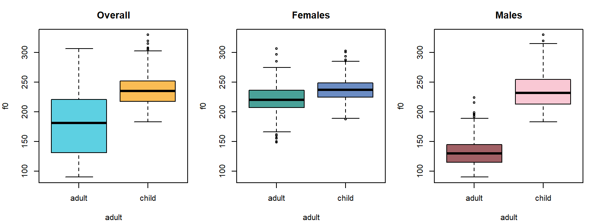
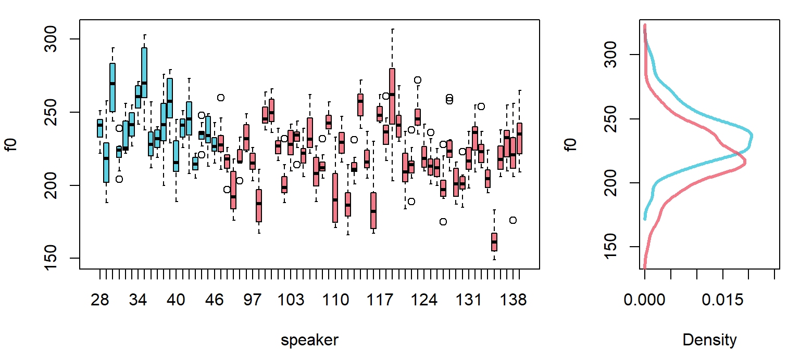
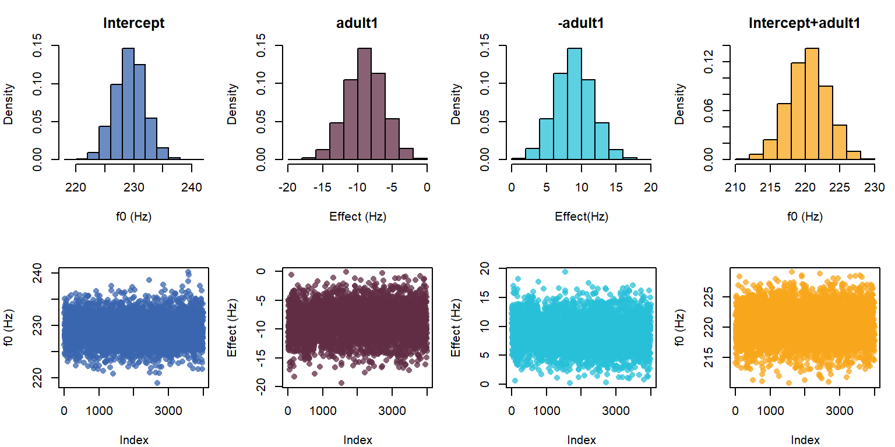
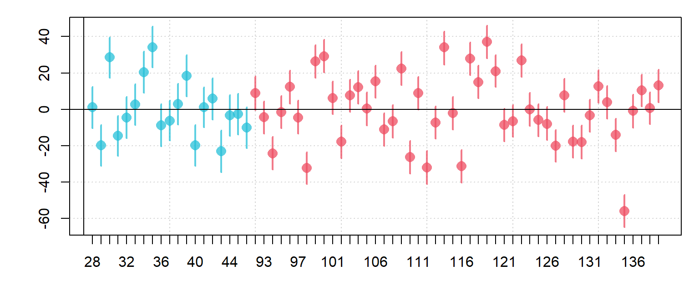
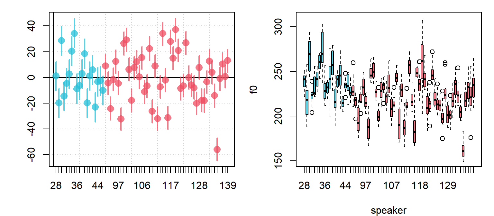
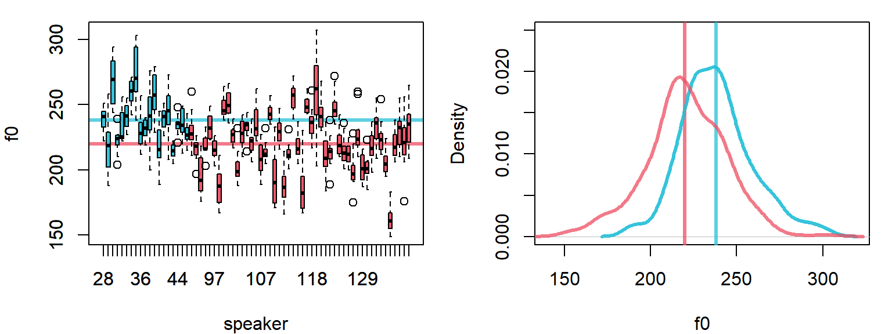
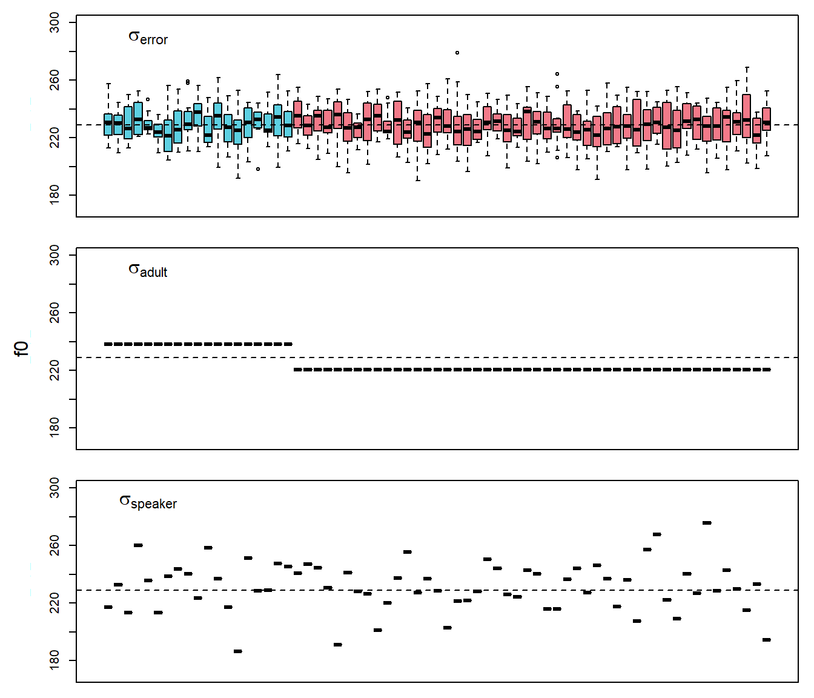
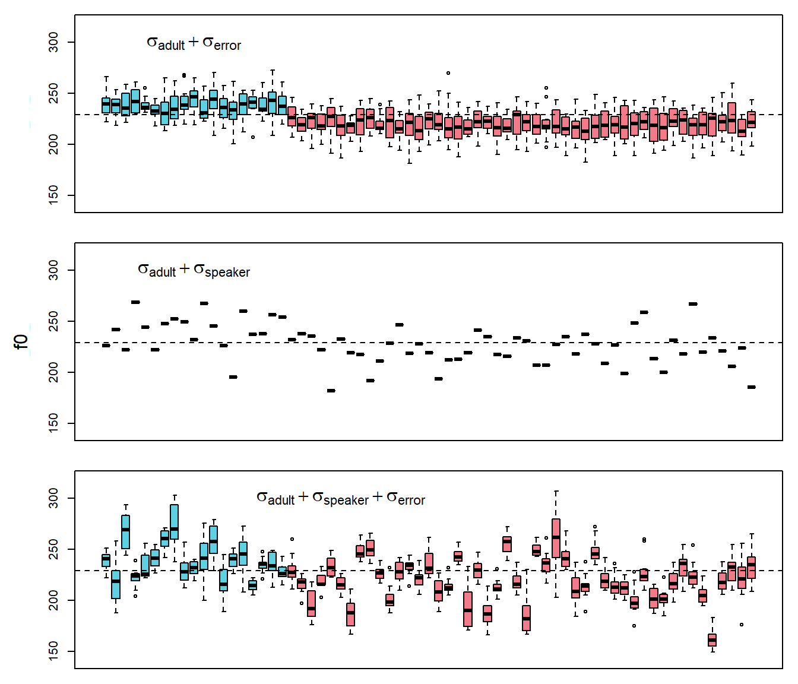
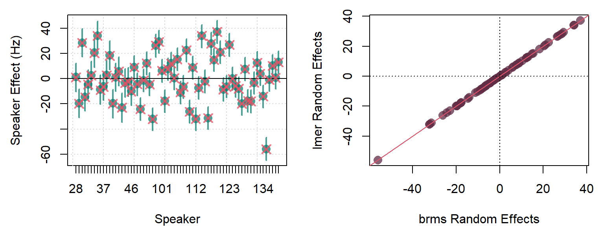

```r
url1 = "https://raw.githubusercontent.com/santiagobarreda"
url2 = "/stats-class/master/data/h95_vowel_data.csv"
# set up colors for plotting
devtools::source_url (paste0 (url1, "/stats-class/master/data/colors.R"))
# source functions
devtools::source_url (paste0 (url1, "/stats-class/master/data/functions.R"))

url1 = "https://raw.githubusercontent.com/santiagobarreda/stats-class/master/data/"
h95 = read.csv (url(paste0 (url1, "03_h95_vowel_data.csv")))
females = read.csv (url(paste0 (url1, "03_h95_vowel_data_females.csv")))
males = read.csv (url(paste0 (url1, "03_h95_vowel_data_males.csv")))
```

# Comparing two groups of observations

In the previous chapter we focused on investigating values from a single group, which is basically the simplest kind data you can deal with. In this chapter we're going to compare data from two groups to see how similar/different they really are. 

The models discussed in this chapter can be used for data that compares observations across two groups. We are using the term 'groups' loosely here. The designs in this chapter are appropriate for data from:  

  * two groups of speakers/listeners that are grouped in different ways because they differ in some characteristic (e.g., gender), or in some experimental condition. Different speakers are in each group.
  
  * the same speakers/listeners are tested in two different experimental condition, with stimuli that vary in two groups, or something of the sort. 
  
  * each speaker/subject can contribute multiple data points, and the number does not need to be balanced across subjects. Also speakers can be missing from one of the conditions (i.e., unbalanced data is ok).

The models we will discuss are similar to two-sample t-tests in the types of research questions they can help investigate (as will be discussed at the end of the chapter). 

## Data and research questions 

We're going to use the Hillenbrand et al. f0 data we used in the other chapters. Previously we only considered the productions of adult females from Michigan, this time we're going to compare the f0 measurements for adult females to those of girls between 10-12 years of age. 


```r
# load brms
library (brms)
```

```
## Loading required package: Rcpp
```

```
## Loading 'brms' package (version 2.15.0). Useful instructions
## can be found by typing help('brms'). A more detailed introduction
## to the package is available through vignette('brms_overview').
```

```
## 
## Attaching package: 'brms'
```

```
## The following object is masked from 'package:stats':
## 
##     ar
```

```r
# get the data from the course website
url1 = "https://raw.githubusercontent.com/santiagobarreda/stats-class/master/data/"
females = read.csv (url(paste0 (url1, "03_h95_vowel_data_females.csv")))
```

To be perfectly honest you won't really use single-group designs very much in your work. Research questions in linguistics most often require linguists to compare at least two conditions or groups of data. In a sense, even a single-group question carries an implicit comparison within it. Caring that the value of some variable is one value sort of presupposes that there is some other potential values of interest that is it not. What I mean by this is that simply saying "the mean f0 produced by adult women from Michigan is 220 Hz" indicates that the mean is *not* 200 Hz, and it is *not* 240 Hz, and thereby makes at least an implicit comparison. 

In this chapter we will directly ask: Are two groups of observations different or are they the same? This kind of question comes up all the time in linguistic research. For example in phonetics, researchers ask questions like, have these vowels merged in this dialect (are these two things different)?  Does visual information speed up speech perception or not (are two sets of reaction times the same)?

A good way to isolate a single difference is to create groups that differ primarily according to the characteristic you are interested in testing, but are otherwise the same 'on average'. For the reaction-time example above, I might present the same listeners with very similar words in the same conditions, but where half of the words are presented with and half are presented without visual information. Any difference in reaction times between the groups should reflect the advantage provided by visual information. The question would then be, are reaction times with visual information *the same thing* as reaction times without visual information? Are these two sets of observations groups sampled from the same population? Or is the set of observations "reaction times for speech recognized *with* visual information" a different set of things than "reaction times for speech recognized *without* visual information"?

In our data we have male and female talkers of the same dialect, who differ primarily in terms of age. Basically, these groups differ mostly in terms of 'adultness', and so we can use the characteristics of these groups to investigate the effect of 'adultness' on average f0. Below I present boxplots that highlight the effect of adultness on f0, first overall and then divided by speaker gender. 

<div class="figure">

<p class="caption">(\#fig:F3-boxplots)Boxplots comparing productions of f0 for different groupings of talkers.</p>
</div>

Clearly there is a difference in f0 between children and adults, but the difference also seems to be gender-dependent: there is more of a difference between men and boys than between women and girls. We are going to focus on the female data for now, and the comparison of men and boys is left as an exercise.

Figure \@ref(fig:F3-boxplots-density) highlights: between-speaker variation, within-speaker variation, and between-group variation. Obviously the distributions seem a *bit* different, but they are also not *that* different. We can also clearly see that there is substantial overlap between individual girls and women (in the figure on the left). Clearly neither "they are totally the same" nor "they are totally different" seems like it is supported by the data. As a result, a cautious analysis of this data will recognize the between-category overlap even if somehow the categories are found to be 'different'. We're going to fit a model that can help us quantify all of the variability shown in the figures below. 

<div class="figure">

<p class="caption">(\#fig:F3-boxplots-density)Comparison of f0 productions by individual girls (cyan) and women (red). Densities compare whole distributions.</p>
</div>

## Estimating the difference between two means with 'brms'

In Chapter 2 the model we fit had the simplest possible formula, just an intercept. Here, we need to extend this to include an actual predictor: a vector indicating 'adultness'. Remember that formulas look like this `y ~ predictor`. Previously, our formula had no predictors and so it looked like this `f0 ~ 1 + (1|speaker)`, where the `1` indicates that this is an intercept-only model. 

If we want to predict f0 based on whether the talker is an adult or not, our model is going to need a formula that looks like this `f0 ~ adult + (1|speaker)`. This assumes that we have a column in our dataframe that indicates whether each data point was produced by an adult or not, and that this column is called `adult`. This model formula basically says 'we expect f0 to vary around the intercept based on whether the talker is an adult or not, in addition to speaker-specific adjustments to the intercept'. Recall that you only need to include a `1` in your model formula if you *only* have an intercept. If you at least one predictor you don't need to specifically add the `1` in your formula, the intercept is added automatically.   

The model specified by this formula `f0 ~ adult + (1|speaker)` calculates an intercept (mean value) for each speaker. However, note that it does **not** include an effect for `adult` for each speaker (i.e., the model does *not* include a term like `(adult|speaker)`). This means that although the model calculates an intercept for each speaker, it does not calculate an effect for `adult` fror each speaker. This is because we can estimate a mean for each speaker, but we cannot estimate the effect for 'adultness' for each speaker. Each speaker is only either an adult or a child, and so we cannot estimate the effect for 'adultness' for each speaker. 

What would happen if you *did* try to fit a model that doesnt 'make sense' like `f0 ~ adult + (adult|speaker)`? Doing things that don't 'make sense' from the model's perspective will cause it to crash or return strange values. Your model will not converge, your parameters will have strange values, or your credible intervals will be enourmous or perhaps too small. It's a good thing to keep in mind: if your model output just makes no sense to you at all and something strange seems to have gone wrong, the model may be specified in a way that is not supportable by the data. 

Usually, I would discuss the specific structure of this model now, *before* fitting the model. We're just going to put this off for a little bit because an explanation involves some of the less intuitive concepts relating to regression. We're going to to fit the model first and discuss its structure, and then get to the details of the model later in the chater, by which point they should make more sense.

### Fitting the model

We load the `brms` package and fit the model, using the formula discussed above. Notice that I now include a prior for `class = "b"`, which is the class for all predictors that are not the intercept. Our model now includes a non-intercept term, and so I need to include this prior. Weakly informative priors of the same kind as discussed in Chapter 2 were used. For example, the prior set for `class = "b"` indicates that we expect the difference between groups in our model, in this case in the f0 of girls and women, to be between -200 and +200 Hz. 


```r
library (brms)
```


```r
# Fit the model yourself, or download pre-fit model from: 
# github.com/santiagobarreda/stats-class/tree/master/models
# and load it using the next line, after placing in working directory
# model = readRDS ('3_model.RDS')

set.seed (1)
model =  
  brms::brm (f0 ~ adult + (1|speaker), data = females, chains = 4, cores = 4,
       warmup = 1000, iter = 11000, thin = 10,
       prior = c(set_prior("student_t(3, 220, 100)", class = "Intercept"),
                 set_prior("student_t(3, 0, 100)", class = "b"),
                 set_prior("student_t(3, 0, 100)", class = "sd"),
                 set_prior("student_t(3, 0, 100)", class = "sigma")))
```


### Interpreting the model

We can inspect the model print statement, which is mostly familiar by now. 


```r
# inspect model
model
##  Family: gaussian 
##   Links: mu = identity; sigma = identity 
## Formula: f0 ~ adult + (1 | speaker) 
##    Data: females (Number of observations: 804) 
## Samples: 4 chains, each with iter = 11000; warmup = 1000; thin = 10;
##          total post-warmup samples = 4000
## 
## Group-Level Effects: 
## ~speaker (Number of levels: 67) 
##               Estimate Est.Error l-95% CI u-95% CI Rhat Bulk_ESS Tail_ESS
## sd(Intercept)    19.13      1.79    15.97    22.94 1.00     2785     3504
## 
## Population-Level Effects: 
##            Estimate Est.Error l-95% CI u-95% CI Rhat Bulk_ESS Tail_ESS
## Intercept    220.47      2.88   214.73   226.00 1.00     1682     2515
## adultchild    17.76      5.21     7.80    28.30 1.00     2104     3184
## 
## Family Specific Parameters: 
##       Estimate Est.Error l-95% CI u-95% CI Rhat Bulk_ESS Tail_ESS
## sigma    12.95      0.34    12.30    13.62 1.00     4005     3775
## 
## Samples were drawn using sampling(NUTS). For each parameter, Bulk_ESS
## and Tail_ESS are effective sample size measures, and Rhat is the potential
## scale reduction factor on split chains (at convergence, Rhat = 1).
```

However, there is a new predictor in the section on `Population-Level Effects`:


```r
##            Estimate Est.Error l-95% CI u-95% CI Rhat Bulk_ESS Tail_ESS
## Intercept    220.47      2.80   215.10   226.16 1.00     1827     2813
## adultchild    17.63      5.22     7.34    27.88 1.00     1987     2068
```

In addition to the 'Intercept' term, we now get estimates for a term called `adultchild`. Admittedly, this is a strange name, but its how R handles predictors that are words (called 'factors' in R). In general, R names predictors like these `factornameFactorlevel`. For example, a factor called `colors` with levels `red`, `green` and `blue` would have the levels `colorsred`, `colorsgreen`, and `colorsblue`. So, the `adultchild` name tells us is that this is the estimate for the `child` level of the `adult` factor. 

A couple of questions arise. First, the 'Intercept' term in the model above seems to correspond to the mean f0 for adult females. We can confirm this: 


```r
# calculate means of f0 based on values of adult vector
aggregate (f0 ~ adult, data = females, FUN = mean)
##   adult       f0
## 1 adult 220.4010
## 2 child 238.3509
```

However, the estimate for children is 17.6 Hz, which is odd, and obviously can't be the actual mean f0 produced by these girls. Why can't it just be the actual value of the girls' f0? Although it might seem like this would be simpler, the fact is it wouldn't really work. To understand why, we're going to have to talk about contrasts

## Contrasts

Contrasts are basically the numerical implementation of factors in your model. Factors are variables like 'adult' vs. 'child' that are not inherently numerical. You may initially think that we can just separately estimate the women's average, the girl's average, and the overall mean. However, our models can't actually do this. The general problem is as follows. If you have two groups then you can't independently calculate all of:

1) group 1 mean.
2) group 2 mean.
3) the overall mean.

Why not? Because once you know 2 of those things you know the 3rd. For example, if the group 1 mean is 5 and the overall mean is 6, obviously the group 2 mean **must** be 7. Why does this matter? Because when things are entirely predictable based on each other, they are not actually separate things, even though they may seem that way to us. When things are entirely predictable in this way we say they are linearly dependent, and regression models don't like this. Here's three perspectives on why this is a problem:

  1) Imagine you were trying to predict a person's weight from their height. You want to include height in centimeters *and* height in meters in your model, and you want to independently estimate effects for both predictors. Since height in centimeters = height in meters / 100, that is obviously not going to be possible. The effect of one must be 100 times the effect of the other! Even though it may be less transparent, this is the same reason why we can't estimate all the group means *and* the overall mean. 

  2) With two groups, or any two points in a space, you can estimate one distance, not two. If each group could really be a different distance from the mean, you would need to estimate *two* distances. How can you estimate two separate distances given only two points? With two points, we are really only in a position to estimate *one* difference, that between our two group averages. 

  3) When we had one group we obviously couldn't get the overall mean independently from the sample mean. All we had was one sample mean, and that was our best estimate of the Intercept too. Adding 1 more group allows us to calculate 1 more mean (the new group mean), not two (the new group mean and the intercept). That would mean adding a second group (with 1 mean) somehow contributed twice as much information as the first group did. Instead, adding a second mean changes our best guess for the population mean: it is now between the two groups. However, this information is not independent from the value of the two group means. 
  
### Treatment coding

The coding scheme you use determines how your model represents the differences it encodes. In the model above we used 'treatment' coding (the default in R). In treatment coding, a 'reference' level is chosen to be the intercept, and all group effects reflect the difference between the mean for that group, and the value of the Intercept (i.e., the mean for the reference level). 

By default, R chooses the alphabetically-lowest level to be the reference level. That is why the Intercept in our model is equal to the mean of the 'adult' group, the average for adult females. The effect for 'child' (`adultchild`) represents the difference between the child mean and the adult mean. This means that our credible intervals also represent the *difference* in the means and not the means themselves. So, we expect the *difference* between girls and women in this sample to be about 17 Hz, and we think there is a 95% chance that the *difference* between the means is between 7.3 and 27.9 Hz in magnitude.

We can see how the effects estimates in our model resemble the means, or differences between means, in our sample.


```r
# calculate group means
tapply (females$f0, females$adult, mean)
##    adult    child 
## 220.4010 238.3509

# find the difference between them
diff (tapply (females$f0, females$adult, mean))
##    child 
## 17.94984
```

To interpret treatment coded coefficients in a regression model:

* The reference category mean is the 'Intercept' in the model. 

* The value of the coefficients of any other group effect are equal to `group mean - Intercept (reference group mean)`.

* So, to recover the mean estimate for any other group, we add `group effect + Intercept (reference group mean)`.

### Sum coding

There are multiple options for coding schemes, and the best one for you depends on what you want to get out of the model. Changing the coding scheme may substantially change the value of your coefficients and the way they should be interpreted. However, they will not change the fundamental relationships encoded in your model. As a result, the selection of a coding scheme best suited for a model depends on which one results in the simplest interpretation of the model given the purpose of the research. 

That being said, going forward we will be focusing exclusively on what is known as 'sum coding'. The reason for a focus on a single coding scheme is in order to save space and minimize confusion for the reader. The reason for selecting sum coding specifically is because it has some desirable mathematical properties and it allows models to be interpreted in a style reminiscent of a traditional ANOVA, which many researchers may find useful. 

In sum coding, there is no reference level. Instead, the model Intercept represents the overall mean of all your groups. The effect for each individual group is then represented as a deviation from the Intercept, and all of these effects are constrained to sum to zero. Just like for treatment coding, you can't estimate all of your group means. When using sum coding, R selects the *alphabetically last* level of your factor, and does not estimate it. However, the values of the missing effect is easy to recover algebraically since the sum of the coefficients must equal zero.

As a result of the sum-to-zero constraint, the missing factor level will always be equal to the *negative sum* of the other factors. This means you add up the values of the levels that *are* present, and flip the sign. The outcome is the value of your missing level. If you think about it, it must be this way. This is because the final missing value must cancel out the sum of the others if the sum of all the values is to equal zero.

As discussed earlier, with only two groups if you know the overall mean and the distance of one group to the mean, you also know the distance of the other group to the mean. This can be seen quite clearly below where the difference of each group to the overall mean is exactly -8.97. So, if our model tells us that the mean is 229.4 and the adult group is -8.97 Hz below this, then the child group *must* be the negative sum of the other coefficients. In this case there is only one so we just flip the sign on it (i.e., - (-8.97)). 


```r
# calculate group means
means = tapply (females$f0, females$adult, mean)
mean (means)
## [1] 229.376

# find the distances to the overall mean
means - mean (means)
##     adult     child 
## -8.974918  8.974918
```

To interpret sum coded coefficients in regression models:

* The overall mean of all your groups is the 'Intercept' in the model. 

* The value of the coefficients of any other group mean will be equal to `group mean - Intercept (overall mean)`.

* To recover the mean estimate for any other group, we add `group effect + Intercept (overall mean)`.

### Comparison of sum and treatment coding

The image below presents a comparison of the way the two coding schemes treat our data. In each case they estimate 1 intercept and one effect, letting you recreate 1 other mean (i.e., they each omit one parameter). In treatment coding the omitted value is the overall mean, which in the 2-group case will always be `Intercept + Effect/2`. In the case of sum coding the omitted value is the effect for the second group, which will always be the same magnitude but have the opposite sign as the effect for the first group (i.e., `-Effect` in a two-group model). 

<div class="figure">

<p class="caption">(\#fig:contrast-figure)Artists rendition of contrast and treatment coding differences for our data</p>
</div>

## Refitting the model with sum coding

We're going to re-fit the model using sum coding, and see how the coefficients change (or don't).

### Fitting the model

To fit a model with sum coding, we change the global contrast options in R. These options will be in effect until we restart R or change the contrasts to something else. If you fit a model with this coding, be sure to set this option every time you start R and want to work with this model. If there is a mismatch between your contrast settings and what the model expects there may be a problem.  


```r
# to change to sum coding
options (contrasts = c('contr.sum','contr.sum'))

# to change back to treatment coding
# options (contrasts = c('contr.treatment','contr.treatment'))
```

We can fit the same model with sum coding using the exact same code since the options have changed. Please keep in mind you will need to set this every time you start R, as it will reset to treatment coding each time it restarts. If fit a model with sum coding, you may need to change the default contrast to sum coding (as above) any time you work with the model, or some things may not work.


```r
# Fit the model yourself, or download pre-fit model from: 
# github.com/santiagobarreda/stats-class/tree/master/models
# and load it using the next line, after placing in working directory
# model_sum_coding = readRDS ('3_model_sum_coding.RDS')

set.seed (1)
model_sum_coding =  
  brms::brm (f0 ~ adult + (1|speaker), data = females, chains = 4, cores = 4,
       warmup = 1000, iter = 11000, thin = 10,
       prior = c(set_prior("student_t(3, 220, 100)", class = "Intercept"),
                 set_prior("student_t(3, 0, 100)", class = "b"),
                 set_prior("student_t(3, 0, 100)", class = "sd"),
                 set_prior("student_t(3, 0, 100)", class = "sigma")))
```


We are going to use the `fixef` function in `brms` to inspect only the `Population-Level Effects` in our model. This is just to save space because the rest of the model should look the same, but feel free to check out the print statement for the whole model. 

The `Population-Level Effects` are also sometimes called *fixed* effects, in part because they are 'fixed' across the population. Forexample, the effect for 'child' doesnt apply only to little Susie or Little Johnny in particular, but to *children* broadly speaking. 


```r
# inspect model
fixef (model_sum_coding)
##             Estimate Est.Error      Q2.5      Q97.5
## Intercept 229.294956  2.655493 224.17507 234.392211
## adult1     -8.907178  2.698205 -14.19731  -3.545559
```

An inspection of the fixed effects shows that, as expected, the Intercept now reflects the overall mean and the single parameter reflects the distance of the adult mean to the overall mean. Note that the parameter is now called `adult1`. This is just how `brm` handles factors under sum coding. Predictors representing factors will be named `factornameN`, where `factorname` is the predictor name and `N` is the level number. Levels are ordered alphabetically starting at one, and the alphabetically-last level will not be estimated. 

You can predict how your factor levels will be ordered by doing something like this:


```r
sort ( unique (females$adult))
## [1] "adult" "child"
```

So, `adult1` in our model corresponds to the "adult" level of our predictor, and `adult2` *would* be "child", but it is not separately estimated by our model (since `adult2 = -adult1`).

### Description of the model

Regression models try to break up values into their components. This is why effects are expressed in terms of differences to some reference value. For example, imagine I say that a person's average f0 is usually 220 Hz and under some condition their average f0 is also 220 Hz. Didn't I just say that this condition has no *effect* on their f0? To say that this condition has no effect on mean f0 is to say, at least in art, that it causes no difference in mean f0. 

On the other hand something that *does* cause a difference in mean f0 *does* have an effect on mean f0. We can express the effect of something in terms of the difference it causes. For example, we can say that under so and so conditions a person will tend to raise their f0 by 20 Hz, relative to some reference value. 

More generally, we can think of any variable as the sum of a bunch of independent *effects*. This is just a way to *think* about variables, to break up observed values into their component parts. It should not be confused with the *reality* of these values and the processes that underlie them (whatever that is!). 

So far we have covered the fact that after picking a value to use as a reference point (the model intercept), our models:
  
  * represent group means as deviations from the intercept.
  
  * represent the speaker-specific deviations from the intercept ($\alpha_{speaker}$) as being centered at 0, with a standard deviation of $\sigma_{speaker}$.
  
  * represent the random error ($\varepsilon$) as having a mean of 0 and a standard deviation of $\sigma_{error}$. 
  
In each case, these model coefficients reflect *deviations* from some reference point. As a result, when the parameters associated with different effects equal 0, this means that no effect is present.

  * when group coefficients are 0 the group lies exactly at the intercept. In sum coding this is the overall mean, meaning that the group is just like the population in general.  
  
  * when a speaker-effect is 0 this speaker is exactly average with respect to their group. This means there is nothing about this speaker (along this dimension) that is unpredictable given knowledge of their group. 
  
  * when an error is 0 this production is exactly as expected for a given speaker.This means the production contains no error since it was an *exactly* average (perfect?) production for that speaker.  
  
If we think of our predictors as representing deviations from some reference value, we can 'break up' any observed value into its component parts. For example, suppose that:

  * the the overall mean is 229 Hz.
  * the adult female mean is 220 Hz.
  * a particular speaker has a mean f0 of 240 Hz. 
  
If we observe a token with an f0 of 256 Hz produced by this speaker, that suggests the following decomposition:

256 = 229 (Intercept) - 9 (adult female effect) + 20 (speaker effect) + 16 (error)

This reflects the following considerations:

  * the average f0 across the groups is 229 Hz.
  * the average for adult females is 9 Hz below the overall mean (229 - 9 = 220).
  * this speaker's average f0 is 20 Hz above the average for adult females (229 - 9 + 20 = 240).
  * this particular production is 16 Hz higher than expected for this particular speaker (229 - 9 + 20 + 16= 256). 

Another observation from this talker might be: 

237 = 229 (Intercept) - 9 (adult female effect) + 20 (speaker effect) - 3 (error)

In this case, the error is -3 since the production is now 3 Hz *below* the speaker average. However, no other part of the equation has change since this is the same speaker in the same group. Regressions models basically carry out these decompositions for us, and reflect information regarding the average of these in their model parameters.

The full model specification, including prior probabilities is below. I used the same ordering format for the t-distributions that `brm` uses (nu, mean, sd). 

The top chunk is labeled 'likelihood' because this chunk specifies the relationships between our parameters and our data. As a result, the relationships specified in this section determine the likelihood of the model parameters. For example, in the first line we say that our data is normally distributed around some mean parameter. In turn, this specifies the shape of the likelihood function for that parameter given the data (as discussed in chapter 1). What I mean by this is that the shape of the likelihood functions for different model coefficients will be based on the relationships laid out in the section of the model description labeled 'likelihood'. 

\begin{equation}
\begin{split}
\textrm{Likelihood:} \\
f0_{[i]} \sim \mathcal{N}(\mu_{[i]},\sigma_{error}) \\
\mu_{[i]} = Intercept + adult1_{[adult_{[i]}]} + \alpha_{[speaker_{[i]}]} \\\\
\textrm{Priors:} \\
\alpha_{speaker} \sim \mathcal{N}(0,\sigma_{speaker}) \\ \\ 
Intercept \sim t(3, 220, 100) \\ 
adult1 \sim t(3, 0, 100) \\ 
\sigma_{error} \sim t(3, 0, 100) \\
\sigma_{speaker} \sim t(3, 0, 100) \\ 
\end{split}
\end{equation}

Here is how I would read this model description aloud in plain English:

> "f0 is expected to vary according to a normal distribution with some unknown mean and standard deviation. Means are expected to vary based on whether the speaker was an adult or a child, and some speaker-dependent variation. The random speaker-dependent variation in means were modeled as coming from a normal distribution with a mean of 0 and an unknown standard deviation. Remaining parameters were given weakly informative t-distributed priors centered at 0, with standard deviations of 100, and with nu parameters equal to 3."

### Interpreting the model

The `brms` package has several functions that make getting information from our models simple. We already mentioned the `fixef` function gets you means and 95% credible intervals for all your 'population level' parameters.


```r
brms::fixef (model_sum_coding)
```

```
##             Estimate Est.Error      Q2.5      Q97.5
## Intercept 229.294956  2.655493 224.17507 234.392211
## adult1     -8.907178  2.698205 -14.19731  -3.545559
```

Using frequentist models, you cannot actually recover the parameters you did not estimate in your model. If you wanted to get these values, you would have to change the way you set the model up and fit it again. In contrast, Bayesian models allow you to compare any two (or more) parameters, as long as you follow some basic rules. This means that you will be able to recover estimates for any coefficient that your model was not able to specifically estimate. 

You can see the individual samples for our parameters by calling the `fixef` function and setting `summary` to `FALSE`. Below, we see the first 6 posterior samples for each parameter. 


```r
samples = brms::fixef (model_sum_coding, summary = FALSE)

head (samples)
##           parameters
## iterations Intercept     adult1
##       [1,]  226.3701 -12.265006
##       [2,]  232.3973 -10.542661
##       [3,]  230.6364 -11.296614
##       [4,]  230.0953  -9.653068
##       [5,]  227.6235  -9.229130
##       [6,]  224.7867  -5.895867
```

To recover the group means for women and girls, we need to combine the Intercept and the group parameters. To do this properly, we need to manipulate these samples as necessary, and only summarize *after* this process is complete. Combining parameters is deceptively simple. If we want to know what the um of `Intercept` and `adult1` is, all we need to do is sum the two columns together. This means we add the elements of each row together, resulting in a single vector as long as the two original columns. 

Below I plot the individual samples and histograms for the `Intercept` (the overall mean), the `adult1` (the effect for adults) parameter, and the negative of the `adult` parameter (the effect for girls). I also present the combination of `Intercept+adult1`, which yields an estimate of the adult female mean.


```
##           parameters
## iterations Intercept     adult1
##       [1,]  226.3701 -12.265006
##       [2,]  232.3973 -10.542661
##       [3,]  230.6364 -11.296614
##       [4,]  230.0953  -9.653068
##       [5,]  227.6235  -9.229130
##       [6,]  224.7867  -5.895867
##       [7,]  224.5292  -8.052164
##       [8,]  228.5024 -12.911775
##       [9,]  230.1220 -11.996447
##      [10,]  235.2036 -13.041191
```

<div class="figure">

<p class="caption">(\#fig:F3-sample-boxplots)Comparison of histogram and trace plots of samples of selected parameters.</p>
</div>

Remember that the summary statistics we make for our model parameters are nothing more than manipulations of these individual samples. In a very real sense, these samples *are* our model. So, when we see the distribution of sample above, what we are looking at is the posterior distribution of more and less likely parameter values as determined by our data and model structure.

We can summarize the sum of the parameters using the `posterior_summary` function, resulting in a mean, standard deviation, and credible interval for the new parameter:


```r
# calculate child mean
adult_mean = samples[,'Intercept'] + samples[,'adult1']

# report mean and spread of samples
brms::posterior_summary (adult_mean)
##      Estimate Est.Error     Q2.5    Q97.5
## [1,] 220.3878  2.854104 214.6722 225.8792
```

Luckily, there is a function in `brms` called `hypothesis` that helps us add terms very easily, without having to do any of the above steps. You can ask the `hypothesis` function to add terms in your model (spelled just as they are in the print statement), and to compare the result to some number. If you compare the result to 0, it just tells you about the result of the terms you added.

For example, the line below says "test my hypothesis that the Intercept plus the adult parameter is equal to zero". This is a slightly convoluted way of saying "tell me what the value of the adult mean is so I can see if it is different from zero. 


```r
brms::hypothesis(model_sum_coding, "Intercept + adult1 = 0")[[1]][,1:5]
##               Hypothesis Estimate Est.Error CI.Lower CI.Upper
## 1 (Intercept+adult1) = 0 220.3878  2.854104 214.6722 225.8792
```

The output above tells us our estimate for `Intercept + adult1`, which we know to be the expected mean f0 for adult females. Whereas the credible interval for the adult1 effect reflected uncertainty in the *difference* between the adult1 mean and the Intercept, the credible interval provided above is now for the actual women's mean f0. 

We can use the hypothesis function to confirm similar results for the model fit using treatment coding (`model`, fit above). In that model, the reference category was the adult female mean. So, if we call the `hypothesis` function on the intercept of the treatment-coding model, we can see that it will present similar values to those seen above.


```r
brms::hypothesis(model, "Intercept = 0")[[1]][,1:5]
##        Hypothesis Estimate Est.Error CI.Lower CI.Upper
## 1 (Intercept) = 0 220.4666  2.876742 214.7257 225.9976
```

We can check several parameter combinations simultaneously. Below I recreate all our mean estimates of interest, first for the sum coding model, and then for the treatment coding model. Notice that these models contain the same information, just represented in different ways.  


```r
brms::hypothesis(model_sum_coding, 
                 c("Intercept = 0",   # overall mean
                   "Intercept + adult1 = 0",  # adult mean
                   "Intercept - adult1 = 0"))[[1]][,1:5] # child mean
##               Hypothesis Estimate Est.Error CI.Lower CI.Upper
## 1        (Intercept) = 0 229.2950  2.655493 224.1751 234.3922
## 2 (Intercept+adult1) = 0 220.3878  2.854104 214.6722 225.8792
## 3 (Intercept-adult1) = 0 238.2021  4.529679 229.2861 247.1643

brms::hypothesis(model, 
                 c("Intercept + adultchild/2 = 0",   # overall mean
                   "Intercept = 0",  # adult mean
                   "Intercept + adultchild = 0"))[[1]][,1:5] # child mean
##                     Hypothesis Estimate Est.Error CI.Lower CI.Upper
## 1 (Intercept+adultchild/2) = 0 229.3454  2.696045 224.0355 234.5056
## 2              (Intercept) = 0 220.4666  2.876742 214.7257 225.9976
## 3   (Intercept+adultchild) = 0 238.2241  4.451373 229.6999 246.9899
```

If I were writing this is in a paper, at this point I could present this information in a paragraph. Based on the sum coded model, I would say something like:

"The overall mean f0 across all speakers was 229 Hz (sd = 2.7, 95% CI = 224, 234). Adult female mean f0 was 220 Hz (sd = 2.9, 95% CI = [215, 226]), while the mean f0 for girls was 228 Hz (sd = 4.28, 95% CI = [230, 246]). The difference between the group means was 18 Hz on average (sd = 5.3, 95% CI = [7,  28]), suggesting a small and noisy difference between groups, on average." 

Notice that to report the difference between groups, I have just doubled the value of the estimated effect for `adult1`. This is because this reflects the distance of each group to the intercept, and therefore *half* of the distance between the two groups.

## 'Random' Effects

Below I present the speaker boxplot, with different colors for each group. So far we've discussed the speaker effects ($\alpha_{speaker}$), but we haven't actually done anything with them. One of the nice things about multilevel models is that we can actually estimate these parameters, and use them to answer our research questions. 

Multilevel models are sometimes also called 'random effects' or 'mixed effects' models. What is 'mixed' about them? Researchers often talk about whether effects are 'fixed' or 'random'. The general idea is that 'fixed' effects are specifically chosen from a small set of possibilities, and we are not necessarily interested in the 'other' levels. 

For example, in this experiment we include children 10-12 and adults. Speaker age-groups don't really come from an infinite set of independent age-groups, not ones that will meaningfully affect our research questions anyways. Instead, categories like 'adult' and 'child' are chosen from a finite set of meaningful categories, and we are *specifically* interested in the categories we've chosen. In this case, I really *do* care about mean f0 for adults and not some other category I didn't sample.

In contrast, 'random' effects are not chosen arbitrarily but at random. The speakers in our sample *do* form part of a practically infinite sample. I am actually *not* interested in the speakers I have but in what their behavior says about the speakers I did *not* observe. In fact, most researchers would gladly trade perfect knowledge about any one speaker for even a small amount knowledge about a large set of speakers from the population. 

Despite, or perhaps because of, this primarily philosophical distinction, in practice the terms 'fixed' and 'random' effects have [several inconsistent and sometimes contradictory definitions](https://statmodeling.stat.columbia.edu/2005/01/25/why_i_dont_use/). 
Luckily, when thinking about these concepts in terms of multilevel models we can be very specific: 'random' effects are parameters that we estimate as coming from distributions with unknown standard deviation terms. We treat speaker average f0 ($\alpha_{speaker}$) as coming from a normal distribution with a standard deviation parameter ($\sigma_{speaker}$) that is unknown and therefore estimated form the data. This is what makes this effect 'random' in the context of a Bayesian multilevel model.  

In contrast, notice that the effect for adultness was given a prior of `student_t(3, 0, 100)`. We simply said the prior for this effect was 100, and we did this arbitrarily in a way that did not related to our data or model structure. For this reason, this effect (and effects estimated in this way) can be thought of as 'random' effects. 

### Random effects, priors and pooling

If you look at our latest `brm` model fit, you'll notice that the standard deviation of the prior ($\sigma_{speakers}$) for the speaker-specific intercept deviations ($\alpha_{speaker}$) is not specifically defined in the model. 

\begin{equation}
\begin{split}
\textrm{Priors:} \\
\alpha_{speaker} \sim \mathcal{N}(0,\sigma_{speaker}) \\ \\ 
Intercept \sim t(3, 220, 100) \\ 
adult1 \sim t(3, 0, 100) \\ 
\sigma_{error} \sim t(3, 0, 100) \\
\sigma_{speaker} \sim t(3, 0, 100) \\ 
\end{split}
\end{equation}

As noted above, the $\sigma_{speaker}$ parameter is actually estimated from the data and not specified a priori. For this reason, the prior you set on $\sigma_{speaker}$ is sometimes called a *hyperprior*, because it's the prior for your prior! 

By definition, the speaker effects are centered around 0 (the average). The only question is, how widely are they distributed? Well, what better way to answer this question than using the distribution present in the data itself? This means that the amount of variation you expect between speakers is based on the amount of between-speaker variation you observe. The idea is basically: is it believable that this one person be this far away from the 'average'? Well, it depends on what everyone else looks like!

By estimating the prior for some parameters from the data itself, multilevel models can help [protect against problems that naturally arise when researchers compare many things](http://www.stat.columbia.edu/~gelman/research/published/multiple2f.pdf). This is because in a Bayesian analysis, the prior influences the estimates of your individual parameters. As a result, the variation in the *other* parameters in your sample can influence any given parameter.

This process is sometimes referred to as 'partial pooling', since it refers to the partial pooling of information across subjects. Using partial pooling means the subject estimates are neither completely independent nor totally merged. They actually end up influencing each other in a logical manner. Broadly speaking, individual observations that deviate from 'typical' values of the population are maintained when there is good enough evidence for them. When there is weak evidence for them relative to the other observations in the sample, estimates may be brought closer to the group averages. As a result, partial pooling results in what is sometimes called 'shrinkage', because extreme values get 'shrunk' towards the overall mean. 

In the context of a multilevel model 'random effects' are those you estimate with partial pooling, meaning the prior is estimated from the data (e.g., $\sigma_{speaker}$), and can affect individual parameter estimates. In contrast, 'fixed effects' are those predictors for which you set arbitrary priors before fitting the model. This means that 'fixed' effects are all estimated independently and will not affect each other (at least through their priors).

Although the terms terms 'fixed' and 'random' effects are useful (and I continue to use them to describe my models), it is important to keep in mind that the philosophical distinction between 'fixed' and 'random' predictors outlined above is not relevant for the models we are discussing here. The real distinction is: do I want to fit every level totally independently as if they were all unrelated? Or do I want to use partial pooling in my estimates, thereby using all of the information present in my sample to protect against spurious findings? 

In general, when you have many levels of a factor, it may be a good idea to include these as 'random' effects, regardless of how 'random' it might actually be. There is not much downside to it: you get more information from the model (e.g., information about $\sigma_{predictor}$), and you can always fit multiple models to see what, if any differences, result form the different approaches. 

Some useful things to consider are also: Do you believe that treating a predictor as a 'random' effect offers a modeling advantage? Does it better reflect the process/relationships you are trying to understand? Does it provide you with information you find useful? Is it realistic to fit this kind of model given the amount of data you have, and the nature of the relationships in the data? Right now the last point is not something we have talked about very much, but it is something we will need to worry about more as our models become more complicated. 

### Inspecting the random effects

The `brms` package has several functions to help understand our 'random' effects. First, there is a function called `ranef` which returns random effects estimates in the same way that `fixef` provides fixed effects estimates. The leftmost column of the output below represents the estimated effects associated with each speaker average value. 


```r
# I am telling it to give me the 'speaker' Intercepts, but only the first 
# 10 rows. This is just so it doesn't take up the whole page.
speaker_effects = brms::ranef (model_sum_coding)$speaker[,,"Intercept"]
speaker_effects[1:10,]
##      Estimate Est.Error       Q2.5     Q97.5
## 28   1.184333  5.735588 -10.186326 12.319648
## 29 -19.671885  5.652084 -30.928433 -8.422325
## 30  28.536109  5.699914  17.484917 39.532266
## 31 -14.595541  5.644469 -25.588406 -3.446464
## 32  -4.510115  5.729995 -15.798335  6.980625
## 33   2.628343  5.700041  -8.534003 13.893796
## 34  20.503843  5.717652   9.210887 31.870600
## 35  34.126366  5.738375  23.049256 45.605675
## 36  -8.766414  5.776124 -20.133993  2.958266
## 37  -6.289746  5.633946 -17.088190  4.926895
```

Notice that the speaker averages vary around 0, and some are even negative. That is because the speaker effects (and all random effects) are coded using sum-coding. Before when we only had an intercept the speaker averages encoded deviation from the overall mean. However, since our model encodes both the overall average *and* the group means, the speaker-effects now represent differences to the group means and not to the overall means. So, the speaker-specific mean terms tell us: what is the average value for this speaker, relative to their group mean? 

For example, we see that the mean for the second speaker above is -19.7 Hz. This means that they have a lower f0 than 'expected', and their mean f0 is 19.7 Hz lower than their group mean f0. In contrast, the first speaker has a speaker mean effect that is nearly zero (1.2). That tells you that this speaker's mean f0 was nearly the same as that of the average for their group. 

We can use a simple plotting function I wrote (`brmplot`) to look at the distribution of speaker effects terms. The function takes in the summaries made by `brms` and plots a point for each parameter mean/median, and lines indicating the credible intervals calculated by `brm` (usually 95% credible intervals).


```r
par (mfrow = c(1,1), mar = c(4,4,1,1))
brmplot(speaker_effects, col = colors)
abline (h=0)
```

<div class="figure">

<p class="caption">(\#fig:brm-random-effects)Posterior estimates of speaker 'random intercepts for girls (cyan) and women (red). Points indicate means, bars indicate 95% credible intervals.</p>
</div>

We can compare the estimates of by-speaker intercepts to the distribution of actual data arranged by subject, indicating a close correspondence. We can also note that all of the speaker random effects are centered at zero so that these do not reflect the 18 Hz group difference seen between the adult females and girls in our data.


```r
## plot comparison of estimates of speaker means to actual data
par (mfrow = c(1,2), mar = c(4,4,1,1))
brmplot( speaker_effects, col = colors)
boxplot (f0 ~ speaker, data=females, col = colors, ylim = c(150,310))
```

<div class="figure">

<p class="caption">(\#fig:brm-boxplot-comparison)Comarisons of random speaker effects to the distribution of productions for the same speakers, for girls (cyan) and women (red).</p>
</div>

## But what does it all mean?

We have fit and interpreted the model, discussed the details of the results and seen several representations of the data. At this point we need to think about what it all 'means'. At this point we need to think about how we might answer our question, "so are the f0s produced by women and girls different?" based on everything we have seen so far. First, consider the distribution of productions between and within speakers and groups, as shown in the figure below. 

<div class="figure">

<p class="caption">(\#fig:F3-final-analysis)(left) Speaker boxplots for f0. Horizontal lines indicate the averages for girls (cyan) and women (red). (right) Densities of overall distributions for girls, and women. </p>
</div>

An impartial look at our results (and figures) so far suggests that: 

* the magnitude of between speaker variation is **larger** than the difference between girls and women (19 Hz vs 18/17 Hz). This means that random people drawn from the two groups largely overlap. 

* the magnitude of within-speaker variation (12 Hz) is almost as large as the group difference and the between-speaker difference (18 Hz)! This means that two random productions from two different people might be the same, even when the speakers average f0s are quite different. 

And yet:

* the mean f0 **is** reliably different between women and girls, and there are well-known anatomical reasons for this that are expected a priori (i.e., adult females are larger than younger women, larger speakers often produce lower f0s). So, it's not like this result would be terribly surprising or unbelievable. 

* the between-speaker differences are 'random' from person to person, but systematic for a given person. So, it's not clear why this would mean we should disregard group differences

* even the within-speaker variation may be systematic given a more-complicated model. Perhaps what seems to be random variation is dependent on vowel quality or some other predictor we have not yet considered.

Ok, so are they different yes or no? Statistics aside, a fair assessment of our data suggests that neither binary conclusion is fully supported: they are distinguishable but overlap substantially. If you want to use this model to highlight the differences between girls and women, I think that is valid. I also think it would be valid to use this data to talk about between and within-speaker variation, highlighting the overlap that exists between speakers. Both are true! To a large extent, the meaning is as much in our heads as it is in the model, and we are free to interpret the results as we see fit, as long as reviewers (and readers in general) will believe us. The model is simply a reflection of the relationships in our data, and the interpretation is up to us. 

Keep in mind that the "as long as reviewers (and readers in general) will believe us" component is crucial. The results of the model will need to be interpreted in the larger context of the work it is presented in, and in terms of scientific and general knowledge that readers have. The results of any model will need to 'make sense' given this, and a statistical result on its own will not be enough to make people (including us) believe outlandish, or even weakly supported claims. 

The model is not reality and should not be confused with reality. This is a very important point! A statistical finding does not *prove* that something is *true*. This kind of thinking has [caused many problems for researchers in the social sciences recently](https://slate.com/health-and-science/2017/06/daryl-bem-proved-esp-is-real-showed-science-is-broken.html). In general, we can imagine that 10 people might approach any given research question in 10 different ways, a concept known as [researcher degrees of freedom](https://en.wikipedia.org/wiki/Researcher_degrees_of_freedom). This would cause slight differences in their results, resulting in a sort of 'distribution' for any given result. How can a fixed underlying reality result in a distribution or results? When they are all slightly wrong! 

For example, we know for a fact that f0 varies, weakly but systematically, across vowel categories, a concept known as [intrinsic f0](https://www.sciencedirect.com/science/article/abs/pii/S0095447095801650). A model that included vowel category as a within-speaker predictor would reduce the apparent error in our model (making $\sigma_{error}$ smaller), and might affect the precision of our other estimates. Would this new model invalidate our current model? Answering yes to this question is generally problematic because there is *always* a better model out there, and so every model would automatically be invalid.  

The solution is to think of your model not as a mathematical implementation of *reality* but instead as a mathematical implementation of your research questions. Your model should include the information and structure that you think are necessary to represent and investigate your questions. Using a different model can result in different results given the same data, but asking a different question can also lead to different results given then same data! One of my favorite phrases to use is "given our data and model structure". This phrase is helpful because it highlights the fact that your results are contingent on:

  1) the data you collected. Given other data you may have come to other conclusions.
  
  2) the model you chose. Given another model you may have come to other conclusions.

## Simulating the two-group model

As in the last chapter, we're going to make fake data that's just like our real data, and break it up into its component parts. I'm going to focus on the sum coding model, and will mostly focus on what's different compared to the model simulated in the last chapter. For more detail about the simulation please see the simulation section in chapter 2.  

First, there is an intercept equal to 229.3 Hz. The next step is to create a vector of length two that contains the effects for the adult and child groups. Notice that I am **not** drawing these values from a probability distribution. I am treating these as effects as fixed, meaning I am acting like they will contribute the same value to any given simulation. In contrast, note that the `alpha_speaker` parameters (representing $\alpha_{speaker}$) *are* drawn from a probability distribution. This is because every time we simulate we may encounter different subjects with different subject-specific effects. 

In the line following the creation of `adult_effect`, we create a vector indicating which adultness effect should be applied to each observation. We have 19 girls and 48 women in our sample, so we set the data up to have the same distribution (and include 12 tokens per speaker). 

I want to highlight something that's very important about the way we are simulating our speaker effects. Just like our draw of $\varepsilon$ do not distinguish between speakers, our draws of $\alpha_{speaker}$ do not distinguish between groups. Notice that all 67 speaker effects are drawn from the same distribution of speakers below. This means that we think all speakers come from basically the same distribution, and that the mean of this distribution varies according to things like 'adultness'. This may not be true, but this is what our model *thinks* is true. [`brms` makes it easy to change, and even test, these assumptions](https://github.com/paul-buerkner/brms/issues/365), but we're not going to talk about that right now.


```r
## don't run this line if you want a new simulated dataset. 
set.seed(1)
## this is the value of our intercept
Intercept = 229.3
## this is a vector of adultness fixed effects
adult_effect = c(-8.9, 8.9)
## this is a vector indicating which speaker produced which utterance
adult = c(rep (2, 19*12), rep (1, 48*12))
## this is a vector of 48 speaker effects
alpha_speaker = rnorm (67, 0, 19.32)
## this is a vector indicating which speaker produced which utterance
speaker = rep (1:67, each = 12)
## this vector contains the error
epsilon = rnorm (67*12, 0, 13.0)
## the sum of the above components equals our observations
f0_rep = Intercept + adult_effect[adult] + alpha_speaker[speaker] + epsilon
```

After creating our components I add them all up and make our simulated data. Below I compare the results of our simulation to our real data, and again there is a good match. 

<div class="figure">

<p class="caption">(\#fig:F3-simulated)Comparison of real and simulated f0 production data for girls (cyan) and women (red).</p>
</div>

Below I make three datasets that are 'incomplete': the first contains the intercept and noise only, the second contains the intercept and adultness effects only, and the third contains the intercept and speaker effects.


```r
# only intercept and error
f0_rep_1 = Intercept + epsilon
# only intercept and adultness
f0_rep_2 = Intercept + adult_effect[adult]
# only intercept and speaker
f0_rep_3 = Intercept + alpha_speaker[speaker]
```

In the figure below, I compare these 'incomplete' datasets to show the contribution that each makes to our data. Notice that the random error variation and speaker variation are centered on the intercept, rather than being affected by the adultness effect. 

<div class="figure">

<p class="caption">(\#fig:F3-sim-incomplete-1)(top) Simulated error variation around the intercept. (middle) Simulated variation according to adultness, but no production error or speaker differences. (bottom) Simulated between-speaker variation, but no production error or adultness effects.</p>
</div>

Below we can make a few more datasets that mix more components, and compare these to our final simulated data. In each of the datasets shown in these figures, we can see what each source of variance contributes to the data by seeing how the figures change when the source is omitted from the replicated data.


```r
# intercept, adultness and error
f0_rep_4 = Intercept + adult_effect[adult] + epsilon
# intercept, adutlness and speaker
f0_rep_5 = Intercept + adult_effect[adult] + alpha_speaker[speaker]
```
<div class="figure">

<p class="caption">(\#fig:F3-sim-incomplete-2)(top) Combination of error variation and effect for adultness. (middle) Combination of between-speaker variation and effect for adultness, but no production error. (bottom) Simulated data containing within and between-speaker variation in f0, in addition to the effects of adultness.</p>
</div>

## Frequentist corner

### Bayesian multilevel modesl vs. lmer

Here I compare the output of `brms` to the output of the `lmer` ("linear mixed-effects regression") function, a very popular function for fitting multilevel models in the lme4 R package. As before, I am not going to talk about the traditional models in any detail. The focus of this section is simply to highlight the potential similarities between different approaches, and to point out where to find this information. 

Below I fit a model that is analogous to our `model_sum_coding` model.


```r
library (lme4)
set.seed (1)
lmer_model = lmer (f0 ~ adult + (1|speaker), data = females)

summary (lmer_model)
## Linear mixed model fit by REML ['lmerMod']
## Formula: f0 ~ adult + (1 | speaker)
##    Data: females
## 
## REML criterion at convergence: 6606.9
## 
## Scaled residuals: 
##     Min      1Q  Median      3Q     Max 
## -4.2253 -0.5862 -0.0669  0.5028  3.8205 
## 
## Random effects:
##  Groups   Name        Variance Std.Dev.
##  speaker  (Intercept) 353.2    18.79   
##  Residual             167.1    12.93   
## Number of obs: 804, groups:  speaker, 67
## 
## Fixed effects:
##             Estimate Std. Error t value
## (Intercept)  229.376      2.597  88.335
## adult1        -8.975      2.597  -3.456
## 
## Correlation of Fixed Effects:
##        (Intr)
## adult1 -0.433
```

We can see that this contains estimates that are very similar to those of our model. The 'fixed' effects above correspond closely to their 'Population-Level' counterparts. 


```r
## Population-Level Effects: 
##           Estimate Est.Error l-95% CI u-95% CI Rhat Bulk_ESS Tail_ESS
## Intercept   229.33      2.71   224.07   234.81 1.00     2169     2758
## adult1       -8.89      2.65   -14.19    -3.55 1.00     2085     2825
```

Now that we've talked about random effects in `brms`, we can pull these out of our `brm` model and compare them to the random effects we get from `lmer`.

As seen below, the random effects estimates we get from `brm` also include credible intervals. As a result, we have some idea regarding the uncertainty in these estimates. Also, since each parameter is estimated by a series of samples, we can compare any two parameters (or groups of parameters) to see how different they are. 


```r
brms_ranefs = brms::ranef (model_sum_coding)$speaker[,,"Intercept"]

head (brms_ranefs)
##      Estimate Est.Error       Q2.5     Q97.5
## 28   1.184333  5.735588 -10.186326 12.319648
## 29 -19.671885  5.652084 -30.928433 -8.422325
## 30  28.536109  5.699914  17.484917 39.532266
## 31 -14.595541  5.644469 -25.588406 -3.446464
## 32  -4.510115  5.729995 -15.798335  6.980625
## 33   2.628343  5.700041  -8.534003 13.893796
```

In contrast, `lmer` gives you what are called *point estimates*. These are single estimates of parameter values with no intervals indicating uncertainty. Because of this, we can't really say to much about these values, nor is there any way to compare the estimates for different speakers/participants in the data. 


```r
lmer_ranefs = lme4::ranef (lmer_model)[["speaker"]]

head (lmer_ranefs)
##    (Intercept)
## 28   0.9451951
## 29 -19.8195602
## 30  28.4444657
## 31 -14.7686738
## 32  -4.6669009
## 33   2.5486511
```

Importantly however, the values we get from both approaches are nearly identical, as seen below. The average absolute difference between the two sets of parameters was only 0.08 Hz, and the *largest* difference between the two is 0.25 Hz. So, analyzing this data using a Bayesian multilevel model provides several advantages, while still providing effectively the same 'answers' as a 'frequentist' approach to the data. 

<div class="figure">

<p class="caption">(\#fig:unnamed-chunk-30) (left) In green, the random speaker intercept estimates provided by brm. The red arrows indicate the estimates of the same provided by lmer. .</p>
</div>

## Exercises

1) Use the code below to analyze the differences in f0 between the men and boys in the Hillenbrand et al. data. See if you can get all of the same information out of the model that we considered above. Make a plots of this new data using the plot code provided.

2) See if you can use the information from your new data to update the simulated data created above. This entails finding the intercept, the effect for adultness, within-speaker, and between-speaker variation estimates in your new data and using this to generate a new batch of fake/replicated data. 

3) Use the code below to fit the model below to your own data. Remember, this data should come two group of speakers/participants who each produce one or more data points. You will need to change `f0`, `adult`, and `speaker` in the model below to match the names of the columns containing this information in your data. You may also need to change the priors based on the ranges of your variables. As noted in the last chapter, if in doubt, you can just set all the priors to have means of 0 and standard deviations of 10,000 for now. We will talk about priors in more detail later. 


```r
url1 = "https://raw.githubusercontent.com/santiagobarreda/stats-class/master/data/"
males = read.csv (url(paste0 (url1, "03_h95_vowel_data_males.csv")))

# set contrasts
options (contrasts = c('contr.sum','contr.sum'))

set.seed (1)
excercise_model =  
  brms::brm (f0 ~ adult + (1|speaker), data = males, chains = 4, cores = 4,
       warmup = 1000, iter = 11000, thin = 10,
       prior = c(set_prior("student_t(3, 220, 100)", class = "Intercept"),
                 set_prior("student_t(3, 0, 100)", class = "b"),
                 set_prior("student_t(3, 0, 100)", class = "sd"),
                 set_prior("student_t(3, 0, 100)", class = "sigma")))
```


