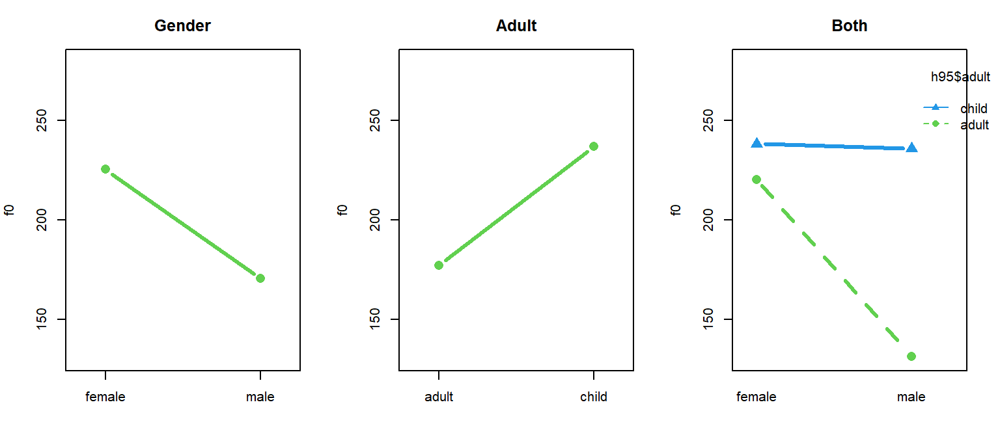

# Comparing many groups

Last chapter we talked about comparing two groups. Although it's very simple, it's also fundamental and used often: more complicated problems are often broken down into sets of several two-group questions. However, real experiments don't usually *begin* as two-group questions. 

In the last chapter we found a reliable, but noisy, difference between women and girls in average f0. In this chapter, we're going to consider the productions of f0 from all four groups in the data. Investigation of these group differences would traditionally be addressed with a repeated-measures ANOVA. Alternatively, the speaker means could have been used as single data points for each speaker and and ANOVA might have been used. I am only pointing this out in case it is useful, we will not be talking about traditional ANOVA here!

## Data and research questions 

We are still going to work with the Hillenbrand et al. data, again focusing on variation in f0. We are again going to add a variable indicating 'adultness', and one indicating gender. However, this time we are going to work with all four groups at the same time: `b` (boys), `g` (girls), `m` (men), and `w` (women).


```r
library (brms)
options (contrasts = c("contr.sum","cont.sum"))

url1 = "https://raw.githubusercontent.com/santiagobarreda"
url2 = "/stats-class/master/data/h95_vowel_data.csv"
h95 = read.csv (url(paste0 (url1, url2)))[,c('f0','speaker','group')]
## set up colors for plotting
devtools::source_url (paste0 (url1, "/stats-class/master/data/colors.R"))
## source functions
devtools::source_url (paste0 (url1, "/stats-class/master/data/functions.R"))

## make variable that indicates if the talker is an adult
h95$adult = ""
h95$adult[h95$group %in% c('w','m')] = "adult"
h95$adult[h95$group %in% c('g','b')] = "child"
## make variable indicating speaker gender
h95$gender = "female"
h95$gender[h95$group %in% c('b','m')] = "male"
## make speaker number a factor
h95$speaker = factor (h95$speaker)  
## see data
head (h95)
```

```
##    f0 speaker group adult gender
## 1 238       1     b child   male
## 2 286       2     b child   male
## 3 214       3     b child   male
## 4 239       4     b child   male
## 5 200       5     b child   male
## 6 262       6     b child   male
```

Our potential research questions are substantially more complicated than in the two-group case. First, there are four groups now, meaning we could potentially make 6 2-group comparisons. Second, the groups also differ along multiple dimensions, making it more difficult to make two-group comparisons that ask one single question. For example, the man and girl groups differ according to adultness *and* gender. How could we know what part of their f0 difference we should attribute to adultness and what part we should attribute to maleness?

<div class="figure">

<p class="caption">(\#fig:F4-datacomparison)(left) Comparison of the four groups (middle) Comparison of productions based on whether the speaker is an adult (right) Comparison of all productions based on whether the speaker is male.</p>
</div>

We can consider our data in several ways: as four independent groups, or as two 2-groups comparisons (adult vs child, female vs male). We are going to focus on the 4-way comparison first. 

<div class="figure">

<p class="caption">(\#fig:F4-speakerboxplots)(left) Boxplots presenting each speaker's production of f0 for boys (red), girls (yellow), men (green), and women (teal). (right) Densities of the overall distributions for each group.</p>
</div>

R treats verbal predictors as 'factors' and assumes that each different label is a different group. Each group of a factor is called a 'level'. Actually, we've been using factors all along because our `speaker` predictor is a factor and the individual participants are levels! As far as our models are concerned, participant/speaker/subject has no special status as a predictor and it is just a factor with many levels. 

A `factor` is actually a data type in R. It's basically the same as a vector of words (or numbers!), but it has some additional properties that are useful. For example, consider our `group` predictor, which tells us which group each speaker falls into. Initially it is a character vector. We see that the first few tokens are produced by men (`m`), and that there is no numerical value associated with these letter labels. The `unique` function returns all unique labels in the vector, in the order that they appear. 


```r
head (h95$group)   ## see the first 6 observations
```

```
## [1] "b" "b" "b" "b" "b" "b"
```

```r
class (h95$group)   ## class starts as a character vector
```

```
## [1] "character"
```

```r
head (as.numeric (h95$group))  ## no numerical values
```

```
## Warning in head(as.numeric(h95$group)): NAs introduced by coercion
```

```
## [1] NA NA NA NA NA NA
```

```r
unique (h95$group)  ## we can see the number of unique groups
```

```
## [1] "b" "g" "m" "w"
```

We can turn the character vector `group` into a factor vector `group_f`. The benefit of this is that these nominal labels now have an inherent ordering, and associated numerical values. Actually, R functions such as `brm` turn your character predictors into factors in the process of fitting the model. Doing this yourself gives you control over how they will be handled. 


```r
h95$group_f = factor(h95$group) ## we can turn it into a factor in R
levels(h95$group_f)  ## now it has official levels
```

```
## [1] "b" "g" "m" "w"
```

```r
head (as.numeric (h95$group_f))  ## now it has nuerical values
```

```
## [1] 1 1 1 1 1 1
```

For example, by default factor levels are ordered alphabetically. This means that if we are using sum coding we will not estimate the `g` parameter (the 'last group') and if we are using treatment coding, the intercept will be equal to `m` (the 'first' group). You can control this behavior by re-ordering the factor levels as below:


```r
h95$group_f2 = factor (h95$group_f, levels = c('w','m','g','b'))
levels (h95$group_f2)
```

```
## [1] "w" "m" "g" "b"
```

```r
head (as.numeric (h95$group_f2))  ## note that 'm' is now the second category
```

```
## [1] 4 4 4 4 4 4
```

## Comparing four (or any number of) groups

We are first going to treat the four groups as four groups with no internal structure. It may not be the best approach for this data, but in many cases you will have several groups with no logical internal divisions.   

### The model

In general, to represent all groups a model needs approximately one variable per group. Our single predictor, `group`, has four levels: `b`,`g`,`m`, and `w`. For models where the predictor is a factor with more than two levels, we can represent the predictor in a vector like this, $group_{[i]}$, where $i$ is a counter variable that goes from 1 to the number of groups. Since we have four groups, our `group` predictor can be thought of as a vector like `[b, g, m, w]` where the letters represent the values of the four groups predictors. When considered this way, we see why it is useful to represent factor levels as numbers. 

Our updated model is now as seen below. 

\begin{equation}
\begin{split}
\textrm{Likelihood:} \\
y_{[i]} \sim \mathcal{N}(\mu_{[i]},\sigma_{error}) \\
\mu_{[i]} = Intercept + group_{group_{[i]}} + \alpha_{speaker_{[i]}} \\\\
\textrm{Priors:} \\
\alpha_{speaker} \sim \mathcal{N}(0,\sigma_{speaker}) \\ \\ 
Intercept \sim t(3, 220, 100) \\ 
group_{[i]} \sim t(3, 0, 100) \\ 
\sigma_{error} \sim t(3, 0, 100) \\
\sigma_{speaker} \sim t(3, 0, 100) \\ 
\end{split}
(\#eq:41)
\end{equation}

Notice that for each trial number $i$ the group predictor is indexed by a variable called `group`. This is a bit confusing, but I am just trying to be consistent with how R does things. As noted above, a factor predictor like `group` is really just a bunch of numbers that represent group effects in a vector. So R really treats `group` as a sequence of numbers representing group numbers. But it also calls the predictor in the model by that name! So, though it may look strange $group_{group_{[i]}}$ just says that you have a predictor in your model called 'group' and it has a few possible values (four in this case). Also, you have a variable in your data with the same name that tells you which value of $group$ to use for each observation! 

For example, above we saw that the first value of the `group` vector is 3. This means this speaker is a member of the `m` group. So, in our model above the equation determining $\mu_{[i]}$ will include the value $group_{[3]}$ in it because $group_{group_{[i]}=3}$.

We can check out the mean and standard deviations for the data to set prior probabilities for the model parameters. 


```r
mean (h95$f0)
```

```
## [1] 197.027
```

```r
sd (h95$f0)
```

```
## [1] 51.76277
```

We are going to use sum coding, which means that the intercept will be the mean of all the groups, and group effects will be represented as differences from this mean. Remember that the missing group effect will be equal to the negative sum of the coefficients that are present. By default, R drops the **last** level from your factor, which in our case will be the `w` level. We cna set R tu use sum coding with the line below:


```r
options (contrasts = c("contr.sum","cont.sum"))
```

And fit the model below: 


```r
options (contrasts = c("contr.sum","cont.sum"))
## Fit the model yourself, or
set.seed (1)
model_four_groups =  
  brm (f0 ~ group + (1|speaker), data = h95, chains = 4, cores = 4, 
       warmup = 1000, iter = 11000, thin = 10, 
       prior = c(set_prior("student_t(3, 200, 100)", class = "Intercept"),
                              set_prior("student_t(3, 0, 100)", class = "b"),
                              set_prior("student_t(3, 0, 100)", class = "sd")))

## download pre-fit model from: 
## github.com/santiagobarreda/stats-class/tree/master/models
## and load after placing in working directory
model_four_groups = readRDS ('4_model_four_groups.RDS')
```


```r
## inspect model
model_four_groups
```

```
##  Family: gaussian 
##   Links: mu = identity; sigma = identity 
## Formula: f0 ~ group + (1 | speaker) 
##    Data: h95 (Number of observations: 1668) 
## Samples: 4 chains, each with iter = 11000; warmup = 1000; thin = 10;
##          total post-warmup samples = 4000
## 
## Group-Level Effects: 
## ~speaker (Number of levels: 139) 
##               Estimate Est.Error l-95% CI u-95% CI Rhat Bulk_ESS Tail_ESS
## sd(Intercept)    20.95      1.34    18.51    23.82 1.00     2080     2564
## 
## Population-Level Effects: 
##           Estimate Est.Error l-95% CI u-95% CI Rhat Bulk_ESS Tail_ESS
## Intercept   206.49      1.93   202.67   210.21 1.00     1474     2270
## group1       29.53      3.52    22.78    36.65 1.00     1253     2236
## group2       31.88      3.98    24.35    39.68 1.00     1565     2392
## group3      -75.18      2.90   -80.89   -69.62 1.00     1246     2383
## 
## Family Specific Parameters: 
##       Estimate Est.Error l-95% CI u-95% CI Rhat Bulk_ESS Tail_ESS
## sigma    11.86      0.22    11.46    12.31 1.00     3882     3814
## 
## Samples were drawn using sampling(NUTS). For each parameter, Bulk_ESS
## and Tail_ESS are effective sample size measures, and Rhat is the potential
## scale reduction factor on split chains (at convergence, Rhat = 1).
```
    
We can see that the intercept is the average of the group means, and our coefficients are equal to the centered group means:


```r
## grop means
means = tapply (h95$f0, h95$group, mean)
## overall mean
mean (means)
```

```
## [1] 206.5111
```

```r
## group means
means
```

```
##        b        g        m        w 
## 236.0741 238.3509 131.2185 220.4010
```

```r
## centered means
means - mean (means)
```

```
##         b         g         m         w 
##  29.56295  31.83975 -75.29261  13.88991
```

```r
## parameters = centered means
hypothesis (model_four_groups, c("group1 = 0",
                                "group2 = 0",
                                "group3 = 0", 
                                "-(group1+group2+group3) = 0"))[[1]][,1:5]
```

```
##                      Hypothesis  Estimate Est.Error   CI.Lower  CI.Upper
## 1                  (group1) = 0  29.53202  3.523919  22.783088  36.64507
## 2                  (group2) = 0  31.87791  3.976443  24.351030  39.68355
## 3                  (group3) = 0 -75.17590  2.903665 -80.888641 -69.61975
## 4 (-(group1+group2+group3)) = 0  13.76598  2.934586   7.923066  19.37857
```

In these Bayesian models, we can actually compare any groups we want in this model, using comparisons of the posterior samples (as shown in chapter 3). For example, the difference between girls and boys can be found by asking if one minus the other equals 0 (which would be true if these were identical): 


```r
hypothesis (model_four_groups, "group1 - group2 = 0")[[1]][,1:5]
```

```
##            Hypothesis  Estimate Est.Error  CI.Lower CI.Upper
## 1 (group1-group2) = 0 -2.345888  6.437511 -15.03817 10.28229
```

The result above suggests that the difference is very small (-2 Hz) and the 95% credible intervals spans a huge range (from -15 to +10)). As a result, the measured difference between these groups is not reliable, and may be very small or close to zero. Notice that in this summary I am focused on minimizing [type S and type M errors](https://statmodeling.stat.columbia.edu/2004/12/29/type_1_type_2_t/). This means I am worried about whether the effect is likely to be small or large, and negative or positive, ratherh than whether it is 'true' or 'false'. 

## Investigating many groups using predictors: Analysis of Variance

### The model

In the previous section, we acted like we just had four different groups with no internal structure. Of course, we know that our groups differ systematically from each other in meaningful ways. For example, we might have chosen to fit two separate models that looked like this:

`brm (f0 ~ gender + (1|speaker)` 

`brm (f0 ~ adult + (1|speaker)` 

For several reasons (some of which we'll see very soon), it is preferable to fit a single model with both predictors at once, rather than fitting two separate models to each research question. Our R model formula wil now look like this, reflecting the influence of both predictors simultaneously:

`f0 ~ adult + gender + (1|speaker)`

This can be read like "f0 is distributed according to effects for speaker adultness and gender, with random intercepts for each speaker". You may have noticed that our model no longer includes the `group` predictor. This is because the `group` label is perfectly predictable on the basis of `adult` and `gender` (a `g` must have values of `female` and `child`, and so on). Basically, we have decomposed the groups into two components to help us understand the effect of each. This is simply and extension of what we have been doing from the start. For example our model was previously: 

$\mu_{[i]} = Intercept + (group_{group_{[i]}}) + \alpha_{speaker_{[i]}}$

However, since group can be exactly represented by combinations of gender and adult, our model sort of always contained this more-complicated model inside of it:

$\mu_{[i]} = Intercept + (adult_{adult_{[i]}} + gender_{gender_{[i]}}) + \alpha_{speaker_{[i]}}$

This is what I often refer to in my work as an 'ANOVA-like' decomposition. ANOVA, the ANalysis Of VAriance, is a technique, or a general approach, to understanding data by focusing on the sources of variance contained in it. We have actually been chipping away at the error variance little by little by making more complicated models.

Recall that our very first approach to understanding f0 looked like this:

$$
\sigma_{total} = \sigma_{error}
$$

In other words, all variation was error. After this we added between-speaker variation to the model, and removed that from the error.

$$
\sigma_{total} = \sigma_{speaker} + \sigma_{error}
$$

Now, our model can individually estimate the variation in observed f0 due adultness, gender, to between-speaker variation and to production error.
 
$$
\sigma_{total} = \sigma_{adult} + \sigma_{gender}+\sigma_{speaker} + \sigma_{error}
$$

Our complete model is now:

\begin{equation}
\begin{split}
\textrm{Likelihood:} \\
y_{[i]} \sim \mathcal{N}(\mu_{[i]},\sigma_{error}) \\
\mu_{[i]} = Intercept + adult_{adult_{[i]}}+gender_{gender_{[i]}} + \alpha_{speaker_{[i]}} \\\\
\textrm{Priors:} \\
\alpha_{speaker} \sim \mathcal{N}(0,\sigma_{speaker}) \\ \\ 
Intercept \sim t(3, 200, 100) \\ 
adult_{[i]} \sim t(3, 0, 100) \\ 
gender_{[i]} \sim t(3, 0, 100) \\ 
\sigma_{error} \sim t(3, 0, 100) \\
\sigma_{speaker} \sim t(3, 0, 100) \\ 
\end{split}
(\#eq:42)
\end{equation}

### Fitting the model and interpreting the results

Below I fit the model using the data statistics outlined above.


```r
## Fit the model yourself, or download pre-fit model from: 
## github.com/santiagobarreda/stats-class/tree/master/models
## and load after placing in working directory
#  model_both = readRDS ('4_model_both.RDS')

set.seed (1)
model_both =  
  brm (f0 ~ adult + gender + (1|speaker), data = h95, chains = 4, cores = 4, 
       warmup = 1000, iter = 11000, thin = 10, 
       prior = c(set_prior("student_t(3, 200, 100)", class = "Intercept"),
                              set_prior("student_t(3, 0, 100)", class = "b"),
                              set_prior("student_t(3, 0, 100)", class = "sd"))) 
## saveRDS (model_both, '4_model_both.RDS')
```


```r
## inspect model
model_both
```

```
##  Family: gaussian 
##   Links: mu = identity; sigma = identity 
## Formula: f0 ~ adult + gender + (1 | speaker) 
##    Data: h95 (Number of observations: 1668) 
## Samples: 4 chains, each with iter = 11000; warmup = 1000; thin = 10;
##          total post-warmup samples = 4000
## 
## Group-Level Effects: 
## ~speaker (Number of levels: 139) 
##               Estimate Est.Error l-95% CI u-95% CI Rhat Bulk_ESS Tail_ESS
## sd(Intercept)    29.33      1.85    26.01    33.29 1.00     2054     3232
## 
## Population-Level Effects: 
##           Estimate Est.Error l-95% CI u-95% CI Rhat Bulk_ESS Tail_ESS
## Intercept   209.13      2.66   203.95   214.38 1.00     1127     1951
## adult1      -32.95      2.73   -38.38   -27.66 1.01     1109     1972
## gender1      30.49      2.50    25.49    35.39 1.00     1064     1962
## 
## Family Specific Parameters: 
##       Estimate Est.Error l-95% CI u-95% CI Rhat Bulk_ESS Tail_ESS
## sigma    11.87      0.22    11.46    12.31 1.00     3872     3613
## 
## Samples were drawn using sampling(NUTS). For each parameter, Bulk_ESS
## and Tail_ESS are effective sample size measures, and Rhat is the potential
## scale reduction factor on split chains (at convergence, Rhat = 1).
```

We can see that the model output is largely familiar, except now we have two non-Intercept 'Population-Level' effects: `adult1` and `gender1`, representing the categories 'adult' and 'female' respectively. Remember that since we used sum coding, the effects for the groups that are not represented ('child', 'male') are just the opposite of the groups that are represented. 

Below we can see that the Intercept is reasonably close to the mean of the group means, and that the adult effect is about half the difference between the mean of the adult and child groups. However, the model seems to overestimate the average differences between male and female groups (30 Hz in model, 23 Hz in the data). 


```r
## grop means
means = tapply (h95$f0, h95$group, mean)
## overall mean in data
mean (means)
```

```
## [1] 206.5111
```

```r
## group means
means
```

```
##        b        g        m        w 
## 236.0741 238.3509 131.2185 220.4010
```

```r
## average adultness difference in data
((means['b']+means['g'])/2 - (means['m']+means['w'])/2) / 2
```

```
##        b 
## 30.70135
```

```r
## average gender difference in data
((means['g']+means['w'])/2 - (means['m']+means['b'])/2) / 2
```

```
##        g 
## 22.86483
```

We can recover the group means by adding up the individual coefficients. This can be tedious and requires you to be careful and methodical, but this isn't actually difficult. Remember that each of the four groups is uniquely identified by a combination of gender and adultness. To recover the group means we need to add the right combination of coefficients to the intercept. 

For example, the second hypothesis we are testing below says `Intercept - adult1 - gender1 = 0`. This could be read like "take the overall mean, add the effect for 'child/adult2' (`-adult1=adult2`), and add the effect for 'male/gender2' (`-gender1=gender2`). If you start at the overall mean f0 and add the effects for a male and a child, you are estimating the mean f0 for a boy. 


```r
tapply (h95$f0, h95$group, mean)
```

```
##        b        g        m        w 
## 236.0741 238.3509 131.2185 220.4010
```

```r
## intercept, boys, girls, men, women
## adult1 = "adult", and gender1="child" because its alphabetical.
## +adult1 = -adult2 since it will be the opposite value
means_pred = hypothesis (model_both, c("Intercept = 0",
                                "Intercept - adult1 - gender1 = 0",
                                "Intercept - adult1 + gender1 = 0",
                                "Intercept + adult1 - gender1 = 0",
                                "Intercept + adult1 + gender1 = 0"))[[1]][,1:5]
means_pred
```

```
##                       Hypothesis Estimate Est.Error CI.Lower CI.Upper
## 1                (Intercept) = 0 209.1341  2.660729 203.9475 214.3788
## 2 (Intercept-adult1-gender1) = 0 211.5892  4.840349 202.1583 221.4233
## 3 (Intercept-adult1+gender1) = 0 272.5741  5.390701 262.0859 283.0745
## 4 (Intercept+adult1-gender1) = 0 145.6940  4.010808 137.7944 153.4169
## 5 (Intercept+adult1+gender1) = 0 206.6789  3.814463 199.1961 214.2051
```

The predictions above are actually not a good match for our group means, suggesting that maybe our model is not capturing something important about our data. 

### Investigating model fit 

So far we have been working with very simple models and not worrying much about how well they 'fit', meaning how well they represent our data. Our reconstruction of the group means above suggests our current model may have some issues. 

We can investigate model fit with what is called a 'posterior predictive check'. The 'posterior predictions' made by your model are the most probable values predicted by your model by each data point. Effectively, these are the $\mu_{[i]}$ predicted by your model for each trial. For example, if our current model looks like this:

$\mu_{[i]} = Intercept + adult_{adult_{[i]}} + gender_{gender_{[i]}} + \alpha_{speaker_{[i]}}$

Then the predicted value ($\mu$) for each trial is the sum of the Intercept and appropriate coefficients for the trial. The `brms` package has a useful `predict` function which can help you make these predictions easily. 


```r
y_pred = predict (model_both)
y_pred_no_re = predict (model_both, re_formula = NA)
head (y_pred)
```

```
##      Estimate Est.Error     Q2.5    Q97.5
## [1,] 243.5561  12.19656 219.8115 268.3380
## [2,] 278.0214  12.21124 254.1821 301.9079
## [3,] 207.2800  12.37763 183.2620 231.1849
## [4,] 246.7159  12.30764 222.6212 270.4167
## [5,] 218.5097  12.28474 194.1936 241.5124
## [6,] 300.7955  12.69626 275.6835 326.1038
```

You will note that the output of prediction, `y_pred`, has four columns, indicating a predicted value but also information about variation. That is because, actually, our model produces a different prediction for each set of samples. This means that if we have 4000 samples we actually have 4000 slightly different models and 4000 slightly different predictions! This means in addition to the most probable estimates, we can get information about expected variation around these estimates

Above in the second line, I make predictions without random effects (`re_formula = NA`). This corresponds to a model like this *without* speaker adjustments:  

$\mu_{[i]} = Intercept + adult_{adult_{[i]}} + gender_{gender_{[i]}}$

These predictions will help us understand how well our model can represent average f0 without the speaker-dependent adjustments, based only on group averages.

Below we can see that the model with speaker adjustments does a very good job of predicting f0, with most credible intervals for most predictions overlapping with the diagonal. On the other hand the predictions without speaker adjustments show systematic biases in prediction. It seems that the f0 of many high f0 speaker lie to the left of the diagonal, meaning the predictions are higher than they should be. 

<div class="figure">

<p class="caption">(\#fig:F4-postpred1)(left) Posterior predicted f0 for the model with speaker random effects. (right) Posterior predicted f0 for the model without speaker random effects</p>
</div>

The above plots are good for basic analysis, but it is hard to get a good picture of how well our groups are being modeled. For that we need an 'interaction plot'. 

## Interactions and interaction plots

[Interactions](http://glimo.vub.ac.be/downloads/interaction.htm) and understanding their graphical representations is so important that it gets its own subsection. In many if not most cases, researchers will need to at least consider the effects of interactions in their models. 

We can think of a single effect representing a difference between groups as a slope. For example, in the left panel below I plotted the means for males and females at x-axis locations 0 and 1. The difference in the group means is 55 Hz (females 225 Hz, males 170 Hz). As a result, the line formed by joining these groups has a slope of -55 (i.e., it drops 55 Hz from 0 to 1). We can use any arbitrary x axis distance to calculate slopes, as long as we are consistent. However, there are obvious practical advantages to choosing to calculate these slopes over the arbitrary 'distance' of 1. In the middle panel we see the effect for adultness, which shows a positive slope for the difference from adult to child: the f0 increases by about 60 Hz. 


```r
par (mfrow = c(1,3), mar = c(4,4,3,2))
plot (0:1,tapply (h95$f0,h95$gender,mean), col = 3, ylim = c(130,280),xaxt='n',
lwd=3,type='b',pch=16,cex=1.5,main="Gender",xlim=c(-.2,1.2),ylab='f0',xlab='')
axis (at=0:1, labels = c('female','male'), side=1)

plot (0:1,tapply (h95$f0,h95$adult,mean), col = 3, ylim = c(130,280),xaxt='n',
lwd=3,type='b',pch=16,cex=1.5, main = "Adult",xlim=c(-.2,1.2),ylab='f0',xlab='')
axis (at=0:1, labels = c('adult','child'),side=1)

interaction.plot (h95$gender, h95$adult, h95$f0,col=3:4, lwd = 3, 
type='b',pch=c(16,17),cex=1.5, ylim = c(130,280),main="Both",ylab='f0',xlab='')
```

<div class="figure">

<p class="caption">(\#fig:interactionplot)Plots showing different ways to consider our f0 data.</p>
</div>

The plots highlighting the effects for adultness and gender are 'main effects' plots. You may have heard things like "the analysis showed a significant main effect for so 'n so...". Main effects are the average effects for one predictor averaged across everything else. Saying 'averaged across everything else' basically means we are ignoring everything else. A person looking only at the left plot would not realize our data also investigates the effect of adultness. 

Another way to think of main effects are that they are 'marginal' effects. They are the overall average difference. Someone might ask you, "whats the average difference between males and females in your sample?" and you can respond "55 Hz". However, sometimes you can't just answer, sometimes the answer is actually "well, it depends". This is one of those cases. 

On the right we see a two-way interaction plot. Interaction plots show you what are called the [simple effects](http://glimo.vub.ac.be/downloads/simpleeffect.htm) of your predictors. The simple effects are the 'conditional probabilities', the effects of your factor, conditional on the level of another factor. For example, the left plot shows the overall (marginal) effect for gender. The right plot also shows the effect for gender. However, it uses a blue line to show the effect for adults and a green line to show this effect for children. As a result, we can consider the effects of gender *conditioned* on adultness. 

So, main effects show you the effect for a factor, and simple main effects show you the effects of the factor *depending* on the value of other things. 

If adultness in no way affected the gender effect, the right panel should look identical to the left panel. If adultness affected f0 in the same way across genders, we would see parallel lines in the right plot. This is because if you are adding a single, consisent value to each gender based on adultness, the line would just slide up and down the f0 axis but would not change in slope. So, an effect for gender that is independent of adultness can only result in parallelism in an interaction plot. 

What we see in the right panel above is that the lines are **not** parallel at all. When we see lines that are not parallel, that means there may be an interaction in our data. In the absence of an interaction, we could just answer the question "whats the average difference between males and females in your sample?" with a number like 55 Hz. In the presence of an interaction we need to consider the *conditional effects* of each predictor, at the levels of the other predictor. 

I think the above may sound complicated, but it's just what we would all do to try to make sense of the plot on the right. There is a large negative slope for gender for adults. This tells us that gender has a large effect on f0 for adults. However, the slope for gender is basically zero for children. So, we might say "there is a large f0 difference for adult males and females in our sample, but basically no gender based difference for children". Alternatively, we might look at the changing effect for gender across adultness levels. If we did this, we might say "there is a small effect for adultness in the average f0 produced by females, but a very large effect for adultness for males.   

In summary, if the answer to "what is the effect of X on Y" is "well, it depends on the values of another one of my predictors", you have an interaction in your data. When you have substantial interactions present in your data and you do not include these in your model, this can cause a problem for your model fit.

### Interactions in our f0 data

We can take the different posterior predictions we made above and make interaction plots out of them. We can see that when the model includes random effects, prediction is quite good. This is not surprising since the speaker-specific intercept adjustments allow for each speaker's mean f0 to be modeled effectively. However, we see that the predictions made by our model are substantially and systematically wrong in the absence of the speaker random effects. 

It's clear that the problem with our predictions in the right panel is that the lines are parallel. As we've just discussed, in the absence of interactions, interaction plots contain only parallel lines. Well, since our model (`model_both`) does not include interaction terms it cannot represent interactions, and so is only capable of producing predictions that result in parallel lines. This means it is not capable of representing the real pattren in our data!


```r
par (mfrow = c(1,3), mar = c(4,4,3,2))

interaction.plot (h95$gender, h95$adult, h95$f0, col = 3:4, ylim = c(130,280),
lwd = 3, type = 'b', pch = c(16,17), cex = 1.5, main = "Data")

interaction.plot (h95$gender, h95$adult, y_pred[,1], col = 3:4,lwd=3, type='b', 
pch = c(16,17), cex = 1.5, ylim = c(130,280),main="Pred. with RE")

interaction.plot (h95$gender, h95$adult, y_pred_no_re[,1],col=3:4, lwd = 3, 
type = 'b', pch = c(16,17), cex = 1.5, ylim = c(130,280),main="Pred. with RE")
```

<div class="figure">

<p class="caption">(\#fig:interactionplot3)Interaction plots showing comparing our f0 data to different posterior predictions, with and without RE (random effects).</p>
</div>

In order to properly model the group differences, and the real effects of gender and adultness on average f0, we need to build a model that can represent the interactions in our data. 

## Investigating interactions with a model

The model presented above (`model_both`) requires only a slight tweak to include a term representing the interaction in our data. There are two ways to include interactions in R model formulas, as shown below:

`f0 ~ adult + gender + adult:gender + (1|speaker)` 
&nbsp;

`f0 ~ adult * gender + (1|speaker)`

The first way includes an explicit interaction term, `adult:gender`. The syntax for these is `X:Z` for an interaction between effects `X` and `Z`, `W:X:Z` for a three-way interaction, and so on. The second way uses `*` between our two predictors. This tells R to include those predictors, and the interactions between them This can be much faster then specifying all interactions, but you lose control over which ones you include. For example the first formula implies the second, but cannot represent the third (since it omits one interaction):

`y ~ Z * X * W` 
 &nbsp;

`y ~ Z + X + W + Z:X + Z:W + X:W + Z:X:W` 
&nbsp;
 
`y ~ Z + X + W + Z:X + X:W + Z:X:W`  

Our full model specification now includes an *interaction* term that can help explain variation that cannot be explained by the independent effects of adultness and gender:

\begin{equation}
\begin{split}
\textrm{Likelihood:} \\
y_{[i]} \sim \mathcal{N}(\mu_{[i]},\sigma_{error}) \\
\mu_{[i]} = Intercept + adult_{\textrm{adult}_{[i]}} + gender_{\textrm{gender}_{[i]}}+ adult:gender + \alpha_{speaker_{[i]}} \\\\
\textrm{Priors:} \\
\alpha_{speaker} \sim \mathcal{N}(0,\sigma_{speaker}) \\ \\ 
Intercept \sim t(3, 200, 100) \\ 
adult_{[i]} \sim t(3, 0, 100) \\ 
gender_{[i]} \sim t(3, 0, 100) \\ 
adult:gender \sim t(3, 0, 100) \\ 
\sigma_{error} \sim t(3, 0, 100) \\
\sigma_{speaker} \sim t(3, 0, 100) \\ 
\end{split}
(\#eq:43)
\end{equation}

### Fitting the model and interpreting the results

Below I fit the model which now includes an interaction term investigating the changing effect of gender and adultness on average f0. 


```r
## Fit the model yourself, or download pre-fit model from: 
## github.com/santiagobarreda/stats-class/tree/master/models
## and load after placing in working directory
#  model_interaction = readRDS ('4_model_interaction.RDS')

set.seed (1)
model_interaction =  
  brm (f0 ~ adult + gender + adult:gender + (1|speaker), data = h95, chains = 4, cores = 4, 
       warmup = 1000, iter = 11000, thin = 10, 
       prior = c(set_prior("student_t(3, 200, 100)", class = "Intercept"),
                              set_prior("student_t(3, 0, 100)", class = "b"),
                              set_prior("student_t(3, 0, 100)", class = "sd"))) 

#  saveRDS (model_interaction, '4_model_interaction.RDS')
```


```r
## inspect model
model_interaction
```

```
##  Family: gaussian 
##   Links: mu = identity; sigma = identity 
## Formula: f0 ~ adult + gender + adult:gender + (1 | speaker) 
##    Data: h95 (Number of observations: 1668) 
## Samples: 4 chains, each with iter = 11000; warmup = 1000; thin = 10;
##          total post-warmup samples = 4000
## 
## Group-Level Effects: 
## ~speaker (Number of levels: 139) 
##               Estimate Est.Error l-95% CI u-95% CI Rhat Bulk_ESS Tail_ESS
## sd(Intercept)    20.92      1.33    18.52    23.77 1.00     3027     3703
## 
## Population-Level Effects: 
##                Estimate Est.Error l-95% CI u-95% CI Rhat Bulk_ESS Tail_ESS
## Intercept        206.56      1.91   202.78   210.27 1.00     2418     3405
## adult1           -30.67      1.94   -34.47   -26.88 1.00     1911     2938
## gender1           22.89      1.97    18.94    26.76 1.00     1851     3038
## adult1:gender1    21.72      1.92    17.87    25.46 1.00     2242     3328
## 
## Family Specific Parameters: 
##       Estimate Est.Error l-95% CI u-95% CI Rhat Bulk_ESS Tail_ESS
## sigma    11.86      0.21    11.46    12.29 1.00     4012     4098
## 
## Samples were drawn using sampling(NUTS). For each parameter, Bulk_ESS
## and Tail_ESS are effective sample size measures, and Rhat is the potential
## scale reduction factor on split chains (at convergence, Rhat = 1).
```
Remember that this line `set_prior("student_t(3, 0, 100)", class = "b")` sets the prior for all non-intercept 'Population-Level' predictors. This allows you to efficiently set priors for the adult, gender, and adult:gender predictors in your model in a single line, and becomes more and more useful as our models grow more complex. 

A look at the model output above indicates that we have a large interaction term. In fact, our interaction is as large as the 'main' effect for gender! In cases with large interactions we have to be careful about interpreting the main effects. In other words, when the answer to a question is "it depends", you should be wary of making blanket statements. 

We need to talk about why there is only a single interaction term. The reason for this is related to the same reason we can't get estimates for all our group effects (i.e., linear dependence). The number of terms you can estimate is generally one fewer than the number of levels. For interaction terms, the number of parameters is equal to (number of levels of factor A - 1)x(number of levels of factor B - 1). Since each of our factors have two levels, we can only estimate one parameter, (2-1)x(2-1). 

Here's another way to think about it. An interaction basically says that sometimes being a male *and* being an adult results in a lower f0 than can be predicted independently by maleness and adultness. So, you need one coefficient to represent the *extra* combined effects of maleness *and* adultness. This same coefficient can also represent the opposite case: not male and not adult. 

The interaction term is just another element of your prediction equation (i.e., $\mu + x_1+x_2...$) intended to help predict variation that can't be predicted by the independent effects of the other predictors in the model. Recovering the predicted group means based on the coefficient values is again tedious but straightforward. The only difference compared to our previous approach is that we must now either add or subtract the value of the interaction term, `adult1:gender1` from each group. We can easily determine which to do for this model because the sign on the interaction term is the product of the signs on the relevant 'main effects' terms.   

For example, the second hypothesis we are testing below says `Intercept - adult1 - gender1 + adult1:gender1 = 0`. This could be read like "take the overall mean, add the effect for 'child' (or `adult2`, since `-adult1=adult2`), and add the effect for 'male' (or `gender2` since `-gender1=gender2`), and add the effect for when the speaker is male *and* a child (`-adult1*-gender1 = +adult1:gender1`)". If you look at the hypotheses below, you will see that the sign on the interaction terms solely depends on the signs of the corresponding main effects terms. We can see that the inclusion of an interaction term allows our model to capture group averages more accurately than the model without intercepts.


```r
## actual data means
tapply (h95$f0, h95$group, mean)
```

```
##        b        g        m        w 
## 236.0741 238.3509 131.2185 220.4010
```

```r
## intercept, boys, girls, men, women
means_pred_interaction = hypothesis (model_interaction, c("Intercept = 0",
                "Intercept - adult1 - gender1 + adult1:gender1 = 0",
                "Intercept - adult1 + gender1 - adult1:gender1 = 0",
                "Intercept + adult1 - gender1 - adult1:gender1 = 0",
                "Intercept + adult1 + gender1 + adult1:gender1 = 0"))[[1]][,1:5]
## predictions with no interaction term
means_pred
```

```
##                       Hypothesis Estimate Est.Error CI.Lower CI.Upper
## 1                (Intercept) = 0 209.1341  2.660729 203.9475 214.3788
## 2 (Intercept-adult1-gender1) = 0 211.5892  4.840349 202.1583 221.4233
## 3 (Intercept-adult1+gender1) = 0 272.5741  5.390701 262.0859 283.0745
## 4 (Intercept+adult1-gender1) = 0 145.6940  4.010808 137.7944 153.4169
## 5 (Intercept+adult1+gender1) = 0 206.6789  3.814463 199.1961 214.2051
```

```r
## predictions with interaction term
means_pred_interaction
```

```
##                                      Hypothesis Estimate Est.Error CI.Lower
## 1                               (Intercept) = 0 206.5611  1.913081 202.7834
## 2 (Intercept-adult1-gender1+adult1:gender1) = 0 236.0571  4.190763 227.9085
## 3 (Intercept-adult1+gender1-adult1:gender1) = 0 238.4038  4.809069 229.0110
## 4 (Intercept+adult1-gender1-adult1:gender1) = 0 131.2809  3.184129 124.9046
## 5 (Intercept+adult1+gender1+adult1:gender1) = 0 220.5027  3.021626 214.4826
##   CI.Upper
## 1 210.2747
## 2 244.4526
## 3 247.6442
## 4 137.3878
## 5 226.4404
```

Below I print the estimates of the 'fixed' effects in the model so we can focus on those. If you fit a model like this and are having trouble interpreting it, I would really encourage you to write down an interpretation using pen and paper, focusing on the decomposition of values provided by the regression model.


```r
fixef (model_interaction)
```

```
##                 Estimate Est.Error      Q2.5     Q97.5
## Intercept      206.56112  1.913081 202.78344 210.27475
## adult1         -30.66934  1.936608 -34.46529 -26.87641
## gender1         22.89211  1.974245  18.93775  26.76101
## adult1:gender1  21.71878  1.918765  17.86664  25.46130
```

For example, the average f0 is 206. The gender difference is 44 Hz (22 * 2) between groups, and there is a gender-based 23 Hz deviation from the mean between groups. This means that, overall, the male and female averages are about 184 and 228 Hz. 

However, the `adult1:gender1` interaction is 22 Hz. This means that when the speaker was an adult (`adult1`), the gender difference was nearly doubled. We know this because the effect for `gender1` is 22.8, and the effect for `gender1` **given** `adult1` (`adult1:gender1`, which is the same thing as `gender1:adult1`) is 21.7 Hz higher than that. So, the total effect for f0 across adults is about  22.8 + 21.7 = 44.5, suggesting a difference in f0 between the groups of 89 Hz (44.5 * 2). 

I am going to basically restate what I just said because it is very important. The effect for `gender` is 22.8, and the effect for `gender1:adult1` is further 21.7 Hz. As a result, the cumulative effect for gender1 (female) given adult1 (adult) is `gender1 + gender1:adult1 = 44.5`. 

In contrast, the fact that `adult1:gender1 = 21.7` indicates that `adult2:gender1 = -21.7`. This is because since `adult1:gender1` represents the effect of `gender1` *given* `adult1`, the effect given `adult2` must be opposite in sign (because of sum coding). So, we can say that although the effect for gender is 22.8 overall, given that the speaker is a child (`adult2`), this effect is 21.7 Hz lower than the 'main effect' estimate. So, for children we expect an f0 effect of 22.8 - 21.7 = 1.1, suggesting a group difference of 2.2 Hz. In other words, the effect of gender is basically zero given that the speakers are children. 

We can consider the effects the other way. The marginal effect for `adult1` is -30, meaning that when speakers are adults, their f0 is 30 Hz lower than the overall average. However, `adult1:gender1 = 21.7`, meaning that *if* the speaker is female (`gender1`), then the expected effect of adultness is reduced (-30 + 21.7 = -8.3) so that the expected group difference is only 17 Hz. On the other hand, when the speaker is a male (`gender2`) then the interaction term should be flipped in sign (`adult1:gender2 =  21.7`). This means that the effect of adultness, conditional on the speaker being male is nearly doubled (-30 + -21.7 = -51.7). 

When considered in this way all these coefficients are just telling us what we already knew from looking at the interaction plot: f0 varies substantially based on gender for adults but not for children. Or: f0 varies substantially as a function of adultness for males but much less for females. 

### Assessing model fit

We can asses model fit for the model including interaction terms by making more posterior predictions wth our new model.


```r
y_pred_int = predict (model_interaction)
y_pred_no_re_int = predict (model_interaction, re_formula = NA)
```

We can make more interaction plots using our data and our posterior predictions. Below I compare our data, the predictions of our original model, and the predictions of our model that includes interactions. Whereas the model with no interactions enforced parallelism on the effects, our new model is able to capture the conditional nature of gender given adultness in our data. 


```r
par (mfrow = c(1,3), mar = c(4,4,3,2))

interaction.plot (h95$gender, h95$adult, h95$f0, col = 3:4, ylim = c(130,280),
lwd = 3, type = 'b', pch = c(16,17), cex = 1.5, main = "Data")

interaction.plot (h95$gender, h95$adult, y_pred_no_re[,1], col = 3:4,lwd=3, type='b', 
pch = c(16,17), cex = 1.5, ylim = c(130,280),main="No Int., no RE")

interaction.plot (h95$gender, h95$adult, y_pred_no_re_int[,1],col=3:4, lwd = 3, 
type = 'b', pch = c(16,17), cex = 1.5, ylim = c(130,280),main="With Int., no RE")
```

<div class="figure">

<p class="caption">(\#fig:interactionplot2)Interaction plots showing comparing our f0 data to posterior predictions, with and without interaction terms (neither contains Random Effects).</p>
</div>

For the first time, we have a model that really does a reasonably-good job of representing the information in our data. The model can capture the gender-dependent nature of age-based f0 differences, and separately estimates between group variation and between group variation. 

### Investigating the interactions the easy way

There are built-in functions in `brms` that help you investigate your effects in the presence of interactions. The `conditional_effects` function calculates the values of effects conditional on the Intercept (for continuous variables). This means it adds the value of the Intercept to all its effects estimates. This function is extremely handy but also limited. You can't get the posterior samples from this function, meaning you can't use this output to compare the values of rows. Also, conditioning on the mean introduces noise to our effects estimates and makes their credible intervals larger. 


```r
tapply (h95$f0, h95$group, mean)
```

```
##        b        g        m        w 
## 236.0741 238.3509 131.2185 220.4010
```

```r
## intercept, boys, girls, men, women
model_effects = conditional_effects (model_interaction)
model_effects[[1]]
```

```
##   adult      f0 gender speaker cond__ effect1__ estimate__     se__  lower__
## 1 adult 197.027 female      NA      1     adult   220.5119 2.950740 214.4826
## 2 child 197.027 female      NA      1     child   238.4238 4.839866 229.0110
##    upper__
## 1 226.4404
## 2 247.6442
```

```r
model_effects[[2]]
```

```
##   gender      f0 adult speaker cond__ effect1__ estimate__     se__  lower__
## 1 female 197.027 adult      NA      1    female   220.5119 2.950740 214.4826
## 2   male 197.027 adult      NA      1      male   131.3351 3.191314 124.9046
##    upper__
## 1 226.4404
## 2 137.3878
```

```r
model_effects[[3]]
```

```
##   adult gender      f0 speaker cond__ effect1__ effect2__ estimate__     se__
## 1 adult female 197.027      NA      1     adult    female   220.5119 2.950740
## 2 adult   male 197.027      NA      1     adult      male   131.3351 3.191314
## 3 child female 197.027      NA      1     child    female   238.4238 4.839866
## 4 child   male 197.027      NA      1     child      male   236.0509 4.175498
##    lower__  upper__
## 1 214.4826 226.4404
## 2 124.9046 137.3878
## 3 229.0110 247.6442
## 4 227.9085 244.4526
```

The `marginal_effects` function returns a list of matrices. Each one contains a different main effect or interaction term. Above I print each one in turn. We can see that these values match those we recreated above using the`hypothesis` function and the individual coefficients:


```r
tapply (h95$f0, h95$group, mean)
```

```
##        b        g        m        w 
## 236.0741 238.3509 131.2185 220.4010
```

```r
hypothesis (model_interaction, c("Intercept = 0",
                "Intercept - adult1 - gender1 + adult1:gender1 = 0",
                "Intercept - adult1 + gender1 - adult1:gender1 = 0",
                "Intercept + adult1 - gender1 - adult1:gender1 = 0",
                "Intercept + adult1 + gender1 + adult1:gender1 = 0"))[[1]][,1:5]
```

```
##                                      Hypothesis Estimate Est.Error CI.Lower
## 1                               (Intercept) = 0 206.5611  1.913081 202.7834
## 2 (Intercept-adult1-gender1+adult1:gender1) = 0 236.0571  4.190763 227.9085
## 3 (Intercept-adult1+gender1-adult1:gender1) = 0 238.4038  4.809069 229.0110
## 4 (Intercept+adult1-gender1-adult1:gender1) = 0 131.2809  3.184129 124.9046
## 5 (Intercept+adult1+gender1+adult1:gender1) = 0 220.5027  3.021626 214.4826
##   CI.Upper
## 1 210.2747
## 2 244.4526
## 3 247.6442
## 4 137.3878
## 5 226.4404
```

### Making plots 

There are many ways to make 'nice' graphics using brms models. Many use packages like `ggplot2` and `bayesplot`. In general these figures are nice but too 'fancy' for many purposes. I also don't really know how to use `ggplot2` ( :| ). As a result, I am going to focus on making simple line plots (like those common in journal articles) using base R graphics.     

The standard information provided in the output of `brm` model summaries can be used to make plots easily. I wrote a small function called `brmplot` that will help draw effects plots easily using these summaries. These summaries always contain (among other things), these four columns in the same order: the mean estimate, the standard deviation, and the lower and upper credible intervals. The `brmplot` function takes in a matrix containing these columns and makes plots showing the means and credible intervals of different effects, assuming that each row is an effect.

Below I get a summary of the fixed effects. I make plots of these effects in two orientations. In each one I omit the Intercept estimate as the magnitude of this is so different that it cannot easily be included on the plot. There is nothing special about these plots, but they are extremely effective at quickly communicating model information.


```r
fixef_interaction = fixef (model_interaction)
fixef_interaction
```

```
##                 Estimate Est.Error      Q2.5     Q97.5
## Intercept      206.56112  1.913081 202.78344 210.27475
## adult1         -30.66934  1.936608 -34.46529 -26.87641
## gender1         22.89211  1.974245  18.93775  26.76101
## adult1:gender1  21.71878  1.918765  17.86664  25.46130
```

```r
par (mfrow =c(1,2), mar = c(8,3,1,1))
brmplot (fixef_interaction[-1,]) ; abline (h = 0,lty=3)
par (mar = c(3,8,1,1))
brmplot (fixef_interaction[-1,], horizontal = FALSE) ; abline (v=0,lty=3)
```


In the left panel below, I use the effects calculated using the `marginal_effects` function to draw figures using the `brmplot` function. First I isolate the columns that represent the information I need. Then I plot the effects using repeated calls to `brmplot`. I can add a second plot over the first by setting `add = TRUE`. 

In the right plot, I do the same thing using the output of the hypothesis function. This will be a plot of the group effects centered at 0, since I have not added the overall Intercept to the means. Note that to get the table of interest out of the hypothesis object we have to first select the element named "hypothesis" from the `group_effects` object. In general, you may have to dig around in the structure of the objects created by `brms` to get the information you want. I usually run a `str` on the resulting object to see what's inside it, and what seems likely to contain the information I'm after. 


```r
model_effects[[3]][,8:11]
```

```
##   estimate__     se__  lower__  upper__
## 1   220.5119 2.950740 214.4826 226.4404
## 2   131.3351 3.191314 124.9046 137.3878
## 3   238.4238 4.839866 229.0110 247.6442
## 4   236.0509 4.175498 227.9085 244.4526
```

```r
par (mfrow = c(1,2), mar = c(4,4,1,1))
brmplot (model_effects[[3]][1:2,8:11], type = 'b', ylim = c(120,250), 
         labels=c("Female","Male"), col = 3, xlim = c(.8,2.2))
brmplot (model_effects[[3]][3:4,8:11], type = 'b', add = TRUE, col = 4,
         labels="", pch=17)

group_effects = hypothesis (model_interaction, c("Intercept = 0",
                "Intercept - adult1 - gender1 + adult1:gender1 = 0",
                "Intercept - adult1 + gender1 - adult1:gender1 = 0",
                "Intercept + adult1 - gender1 - adult1:gender1 = 0",
                "Intercept + adult1 + gender1 + adult1:gender1 = 0"))
group_effects[["hypothesis"]][,2:5]
```

```
##   Estimate Est.Error CI.Lower CI.Upper
## 1 206.5611  1.913081 202.7834 210.2747
## 2 236.0571  4.190763 227.9085 244.4526
## 3 238.4038  4.809069 229.0110 247.6442
## 4 131.2809  3.184129 124.9046 137.3878
## 5 220.5027  3.021626 214.4826 226.4404
```

```r
brmplot (group_effects[["hypothesis"]][5:4,2:5], type = 'b', ylim = c(120,250), 
         labels=c("Female","Male"), col = 3, xlim = c(.8,2.2))
brmplot (group_effects[["hypothesis"]][3:2,2:5], type = 'b', add = TRUE, col = 4,
         labels="", pch=17)
```

<div class="figure">

<p class="caption">(\#fig:brmsplot2)The examples of using parameter summaries to draw plots using the brmplot function.</p>
</div>


## Plot Code


```r
################################################################################
### Figure 4.1
################################################################################

par (mfrow = c(1,3))
boxplot (f0 ~ group, data=h95, main = "Overall", ylim = c(90,330),col=cols[3:6])
boxplot (f0 ~ adult, data=h95, main="Adultness", ylim =c(90,330), col=cols[7:8])
boxplot (f0 ~ gender, data=h95, main="Gender", ylim = c(90,330), col=cols[1:2])

################################################################################
### Figure 4.2
################################################################################

colors = cols[c(3,5,4,6)][ apply (table(h95$speaker, h95$group),1,which.max) ]
## speaker boxplots
par (mar = c(4,4,1,1)); layout (mat = t(c(1,2)), widths = c(.7,.3))
boxplot (f0 ~ speaker, data=h95, col = colors, ylim = c(90,330))
## The density figures are rotated 
tmp = density (h95$f0[h95$group=="b"])
plot (tmp$y, tmp$x, lwd = 3, col = cols[3], ylab = "f0",xlab="Density", 
      ylim = c(90,330), xlim = c(0,0.025), type = 'l')
tmp = density (h95$f0[h95$group=="g"]); lines (tmp$y, tmp$x, lwd=3, col=cols[5])
tmp = density (h95$f0[h95$group=="m"]); lines (tmp$y, tmp$x, lwd=3, col=cols[4])
tmp = density (h95$f0[h95$group=="w"]); lines (tmp$y, tmp$x, lwd=3, col=cols[6])

################################################################################
### Figure 4.3
################################################################################

par (mfrow = c(1,2), mar = c(4,4,3,1))
brmplot (xs = h95$f0, y_pred, xlim = range(h95$f0), 
         main = "With Random Intercepts",labels="");  axis(side=1);
mtext(side=1,text="f0",line=2.5);mtext(side=2,text="f0_pred",line=2.5)
abline (0,1, col = 2, lwd=2)
brmplot (xs = h95$f0, y_pred_no_re, xlim = range(h95$f0),
         main = "Without Random Intercepts" , labels = ""); axis (side=1);
mtext(side=1,text="f0",line=2.5);mtext(side=2,text="f0_pred",line=2.5)
abline (0,1, col = 2, lwd=2)
```


