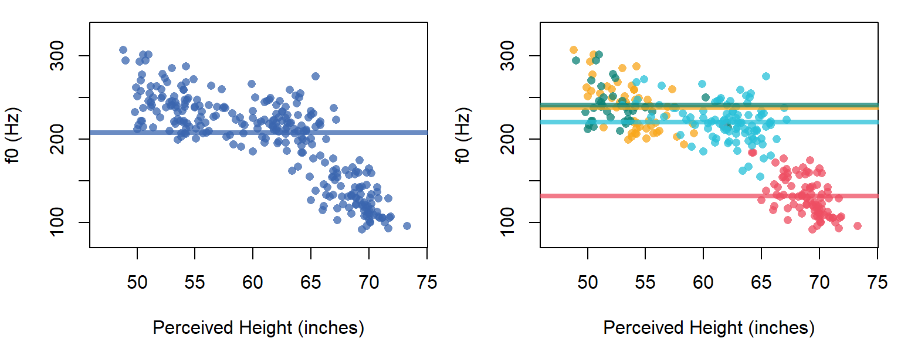
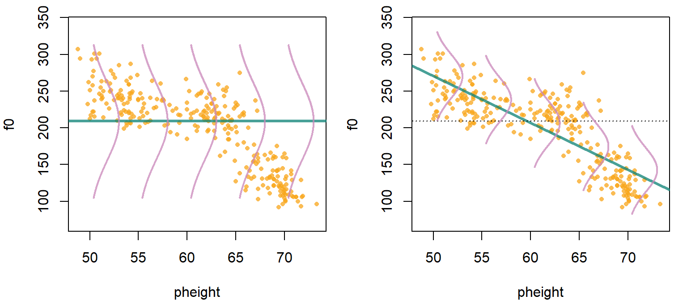
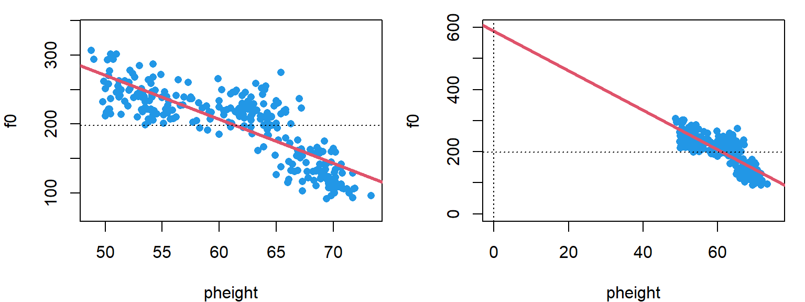
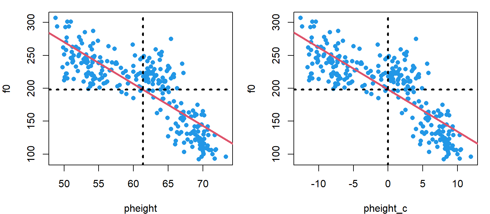
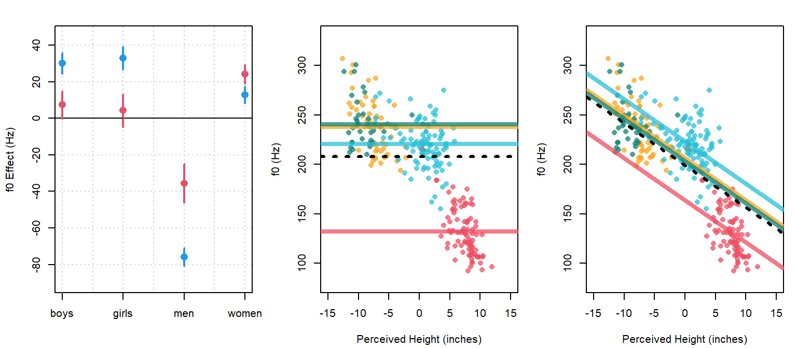
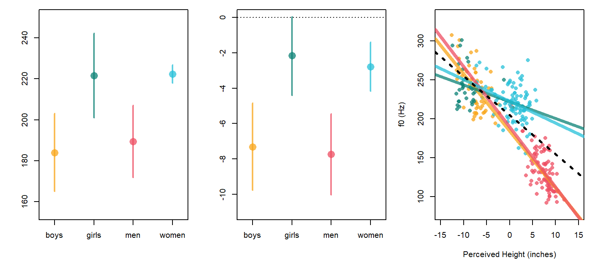
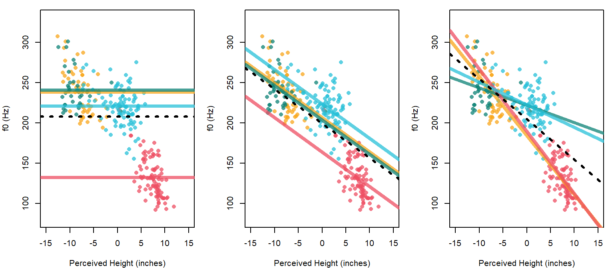

```r
library (brms)
options (contrasts = c("contr.sum","cont.sum"))

url1 = "https://raw.githubusercontent.com/santiagobarreda/stats-class/master/data/"
url2 = "h95_experiment_summary.csv"
h95 = read.csv (url(paste0 (url1, url2)))
# set up colors for plotting
devtools::source_url (paste0 (url1, "colors.R"))
# source functions
devtools::source_url (paste0 (url1, "functions.R"))
```

# Continuous predictors and their interactions with factors

Last chapter we talked about comparing many groups, and including interactions in our models. So far we have only discussed models that include nominal predictors (factors), meaning predictors that split up our observations into discrete groups/categories. In this chapter we're going to talk about including continuous, numerical predictors in our models. 

Just as in chapter 1, we're going to begin by talking about 'single' level (*not* multi-level) models. These models have no random effects, and so are not really appropriate for our data. We're going to focus on the interpretation of model coefficients and what these mean for the geometry of the lines we make, so we are not going to worry about the fact that the credible intervals in these models are not appropriate for inference. The geometric interpretations of different model structures are not specifically "Bayesian". In fact, the concepts presented below are shared by any approach to linear regression. 

Next chapter, armed with an understanding of the geometry of continuous predictors, we'll extend these concepts to understand 'random slopes and intercepts' for variables such as speaker and listener. 

Before continuing, we should note that designs with many continuous predictors, factors, and interactions between these can result in very complicated models, which then have to be interpreted. However, the researcher has a big role to play in the complexity of the eventual analysis that they are faced with. Once when I was buying a backpack for traveling, I was looking for the biggest backpack possible. One of the reviews said "1/5 stars, it was way too heavy when I filled it all the way up with my stuff". However, if we fill a backpack up with heavy things, it doesn't seem fair to blame the poor backpack when it becomes difficult to manage. 

In the same way, if you are faced with an overly complex model that you then need to interpret, you shouldn't blame the model for your predicament. If you design an experiment with a complicated structure (i.e., lot of predictors or interactions). In order to avoid a situation where you end up with data you can't analyze or a model you don't know how to interpret, it's worth considering the following questions before advancing to data collection: 

  * How will I analyze the data? Will I be able to? 
  * What will the model structure be? 
  * What would different results 'mean'? How will this manifest in my regression model?
  * What kind of results am I expecting? 


## Data and research questions 

As noted above we are going to start by just focusing on the geometry of different model structures, so we are not going to worry about what kind of data works for these models yet. For now all we need to worry about is that the data contains at least two columns, each of which contains a continuous variable, that is, variables that can take on an unlimited (or at least large) number of different numerical values.

We're still going to work with the Hillenbrand et al. data, again focusing on variation in f0. However, we're now going to focus on the results of a listening experiment based on this data. Here are the details of the experiment:

  1) Listeners were 10 native speakers of American English. 
  
  2) Listeners were presented with the words "heed" and "hod" produced by all 139 of the speakers in the Hillenbrand et al. data. Stimuli were presented at random and one at a time. 
  
  3) For each trial, listeners were asked to:
    a) estimate the height of the speaker in feet and inches.
    b) indicate whether they though the speaker was a "boy", a "girl", a "man", or a "woman". 

  4) Each participant listened to all 238 stimuli once, for a total of 2380 observtions across all subjects. 

This dataset has two response variables that we are interested in: the perceived height (`pheight`) reported for each trial, and the perceived group (`pgroup`) reported for each trial. We're going to start by talking about a summary of the data, available below:  


```r
url1 = "https://raw.githubusercontent.com/santiagobarreda/stats-class/master/data/"
url2 = "h95_experiment_summary.csv"
h95 = read.csv (url(paste0 (url1, url2)))
```

Rather than every individual response, this dataset contains only the average perceived height (and modal perceived group) for each unique stimulus in the experiment. We're going to begin by using perceived height as a predictor to see if we can use it to guess the f0 of tokens. This asks: given knowledge of the speaker size a person reported, can we predict the f0 they heard? Of course, this is causally backwards as the f0 'causes' the size perception and not vice versa. However, that doesn't actually matter for a regression model as these simply investigate the relationships between variables: if x is linearly related to y then y is linearly related to x. Since we have built up some intuitions about the distribution of f0 between speakers, we will begin by considering f0 as the dependent variable. 

## Continuous predictors: modeling variation along lines

Below I plot the average f0 for each token against its average perceived height in inches. I use a scatter plot with the dependent variable (`f0`, the thing we are interested in) varying along the y axis (this is done by convention). 

The scatter plot clearly shows what is called a *linear relationship* between the two variables. When you make a scatter plot of two variables that are linearly related you will see points you think are suggestive of a line, or a couple of lines.

Our models have so far featured only nominal predictors, things like group membership. Although it might be strange to think of it this way, our regression models have *already* been making lines, however, they are lines with slopes of 0 along all possible x axis variables. What this means is, that for any x-axis variable, variation along the x axis variable **has no effect** on variation along the y axis variable (according to our model). 

Below I show an example of what I mean by this. Figure \@ref(fig:F5-fig1) shows an 'intercept only model' that features a fixed f0 for all tokens. In the right panel we see four lines, one for each group. These lines have different intercepts but have the same slope (0). This means that these lines try to predict f0 based on group, but do not allow this to vary as a function of perceived height.

When we look at lines such as those below, they tell us that our model thinks mean f0 is *independent* of perceived height. This is because perceived height can vary from positive to negative infinity and we don't expect f0 to change (since the line is flat). The same statement could be made for any other x variable we choose because our model does not include slopes for those variables. So, in models like these you can make a bunch of lines, but you only ever change their intercepts. 

<div class="figure">

<p class="caption">(\#fig:F5-fig1)(left) f0 plotted against perceived height for each token. Horizontal line is the mean of the group means. (right) Same as right panel except each group gets its own horizontal line. Groups are boys (yellow), girls (green), women (blue), and men (red).</p>
</div>

Recall (from high school) that the equation for a line is the following:

$$
y = m \times x + b \\ 
(\#eq:51)
$$

Where $y$ is the 'dependent' variable you are 'predicting' using a line with a slope of $m$ and and intercept of $b$. The slope $m$ represents how much of a change you expect in your $y$ variable for a *1 unit change* in your x variable. Obviously, this means that the slope depends on the units of measurement of your $x$ variable. In general, dividing your $x$ predictor by $z$ will increase your slopes by a factor of $z$. For example, imagine measuring the slope of a long hill with a constant rise. The amount of rise measured in meters will necessarily be 1/1000 as large as the rise measured in kilometers. 

We can use the following line equation, which just uses symbols that are more similar to the ones we have been using (and presents them in a different order):

$$
\mu = a + b \times x \\
(\#eq:52)
$$

We can predict f0 in the left panel of Figure \@ref(fig:F5-fig1) using a horizontal line by setting the intercept to the overall grand mean, and setting the slope coefficient to 0. In this case the slope coefficient erases the influence of the continuous predictor $x$ and we would have an 'intercept only' regression model just like the one we saw in chapters 1 and 2. 

$$
a = Intercept, b = 0 \\ \\
f0 = Intercept = Intercept + 0 \times pheight \\
(\#eq:53)
$$

In the right panel of Figure \@ref(fig:F5-fig1) we see four horizontal lines, one for each group of speakers. These lines all differ in terms of intercepts but have the same slope (0). This means that these lines try to predict f0 based on group, but don't allow this to vary as a function of perceived height. So, our four-group model with only nominal predictors in chapter 4 could really be thought of as predicting f0 along a set of lines that are horizontal along the perceived height dimension.  


$$
a = Intercept + group_{[\mathrm{group}]}, b = 0 \\ \\
f0 = Intercept + group_{[\mathrm{group}]} + (0 \times pheight) \\
(\#eq:56)
$$

Ok, so what if we *do* want to think about variation in f0 as a function of variation in perceived height. In Figure \@ref(fig:F5-52) we can see what this might look like. On the left we have a normal distribution sliding along a horizontal line, generating numbers as it slides. The mean of this data does not vary based on the values of perceived height, and so is *independent* of them. The standard deviation of this distribution ($\sigma_{error}$) does not not change as a function of perceived height so its 'width' is stable. 

On the right in Figure \@ref(fig:F5-52) we can imagine that the mean of the normal distribution generating f0 values *does* change as a function of the value of perceived height. We can say that the model on the right predicts f0 *conditional on* values of perceived height.

The model on the right in Figure \@ref(fig:F5-52) places an important constraint on this conditional variation: the mean of f0 varies strictly along a straight line. So, to predict f0 given a certain perceived height, we slide our normal distribution along long the diagonal line in Figure \@ref(fig:F5-52) to the proper x axis location. The y axis value of the line at this x axis location represents our predicted value ($\mu$). The actual value of observations would then vary around this expected value in a normal distribution with a mean of 0 and a standard deviation equal to $\sigma_{error}$.

<div class="figure">

<p class="caption">(\#fig:F5-52)(left) A normal distribution fixed along a horizontal line. (right) A Normal distribution allowed to slide along a diagonal line.</p>
</div>

## Models with a single slope and intercept

We can use the `brm` function to find the intercept and slope of the 'best' line through the points in our two-dimensional space (represented in the scatter plot). Our model formula will look like this:

`f0 ~ pheight`

Which tells `brms` to predict `f0` based on the values of `pheight` and an intercept which does not need to be explicitly included in the model formula. If the variable on the right hand side of the `~` is numeric, `brm` will treat it as a continuous predictor and predict f0 using a line. 

### Description of the model

The structure of a regression model with a single continuous predictor (a 'bivariate' regression) is shown below. The first line says that we have a normally-distributed variable with an unknown mean that varies from trial to trial ($\mu_{[i]}$). The variation in the mean parameter is along a line with an intercept equal to $Intercept$ and a slope of $pheight$ along the x axis. 

Note that the predicted value ($\mu_{[i]}$) and the predictor variable ($x_{[i]}$) receive subscripts, as these change from trial to trial. The coefficients **do not** receive subscripts because these do not vary in this model. This model contains a single intercept and a single slope (i.e. it draws a single line) for *every* trial. Also note that we're simply treating the slope and intercept as 'fixed' effects and specifying prior distributions.

\begin{equation}
\begin{split}
\\
\textrm{Likelihood:} \\
y_{[i]} \sim \mathcal{N}(\mu_{[i]},\sigma_{error}) \\
\mu_{[i]} = Intercept + pheight \times x_{[i]}  \\ \\
\textrm{Priors:} \\
Intercept \sim t(3, 175, 100) \\
pheight \sim t(3, 0, 100) \\
\\
\end{split}
(\#eq:57)
\end{equation}

Here's another two ways to think about this model: we're making a line and then we add noise to it. Each of our observed values is just a line (representing systematic variation) and a random draw from an error distribution ($\mathcal{N}(0,\sigma_{error})$) as below: 

$$
y_{[i]} = a + b * \mathrm{x_{[i]}} + \mathcal{N}(0,\sigma_{error})
(\#eq:58)
$$

Alternatively, we could place the formula for the line *inside* the normal distribution function. There is no particular reason to do this, but it is helpful to see it and realize that it's the same thing as the representation above. In the equation below, we're saying: the data is generated according to a normal distribution whose mean varies along a line ($a + b * \mathrm{x_{[i]}}$), and we expect the variation around this line to have a standard deviation equal to $\sigma_{error}$. 

$$
\mathcal{N}(a + b * \mathrm{x_{[i]}}, \sigma_{error})  \\
(\#eq:59)
$$

Regression models pick the intercept and slope for a line that results in the smallest value of $\sigma_{error}$. This is why 'regular' regression is called ["ordinary least-squares"](https://en.wikipedia.org/wiki/Ordinary_least_squares) regression, because it finds the solution that results in the 'least squares' (i.e., the smallest $(\sigma_{error})^2$) in the prediction errors. 

In a multilevel model, the estimation of the 'best' slopes and intercepts for our lines can be substantially more complicated than in least-squares regression. However, in general the lines estimated by our regression models will tend to minimize the value of $\sigma_{error}$, given our data and model structure. 

### Fitting the model

We can use the `brm` function to find the intercept and slope of the 'best' line through the points in our two-dimensional space (represented in the scatter plot).  


```r
options (contrasts = c("contr.sum","cont.sum"))
# Fit the model yourself, or
# download pre-fit model from: 
# github.com/santiagobarreda/stats-class/tree/master/models
# and load after placing in working directory
# single_line_model = readRDS ('5_single_line_model.RDS')

set.seed (1)
single_line_model =
  brm (f0 ~ pheight, data = h95, chains=1, cores=1,  warmup=1000, iter = 6000,
       prior = c(set_prior("student_t(3, 175, 100)", class = "Intercept"),
                 set_prior("student_t(3, 0, 100)", class = "b"),
                 set_prior("student_t(3, 0, 100)", class = "sigma")))
# save model
# saveRDS (single_line_model, '5_single_line_model.RDS')
```

### Interpreting the model

The model print statement is mostly the same as for our previous models. Our model contains only 'fixed' effects: an `Intercept`, indicating the intercept of our line, and `pheight` indicating the slope of f0 along the perceived height axis. We get credible intervals for our slope coefficient, and our model features an estimate of the error (`sigma`, $\sigma_{error}$) around our line.  


```r
# inspect model
single_line_model
##  Family: gaussian 
##   Links: mu = identity; sigma = identity 
## Formula: f0 ~ pheight 
##    Data: h95 (Number of observations: 278) 
## Samples: 1 chains, each with iter = 6000; warmup = 1000; thin = 1;
##          total post-warmup samples = 5000
## 
## Population-Level Effects: 
##           Estimate Est.Error l-95% CI u-95% CI Rhat Bulk_ESS Tail_ESS
## Intercept   588.68     16.42   556.41   620.73 1.00     5261     3935
## pheight      -6.36      0.27    -6.89    -5.84 1.00     5283     3962
## 
## Family Specific Parameters: 
##       Estimate Est.Error l-95% CI u-95% CI Rhat Bulk_ESS Tail_ESS
## sigma    30.21      1.31    27.78    32.93 1.00     4562     3693
## 
## Samples were drawn using sampling(NUTS). For each parameter, Bulk_ESS
## and Tail_ESS are effective sample size measures, and Rhat is the potential
## scale reduction factor on split chains (at convergence, Rhat = 1).
```

We can see that the line predicting perceived height as a function of f0 has an intercept of 589 and a slope for the `pheight` (perceived height) predictor of -6.4. The fact that the slope of the `pheight` predictor is -6.4 means that for every 1 inch increase in perceived height, we expect a *decrease* of 6.4 Hz in the f0 of the vowel that le to that perception. I draw this line on our set of points in Figure \@ref(fig:F5-53). 

The slope is a *weight* that allows the line to accurately fit the points. In the absence of a slope, regression models would only work if there was a 1 to 1 relationship between the x and y variables. This would mean that for every 1 inch change in perceived height, we would see a 1 Hz change in f0. What are the odds of that? What are the odds that the things we measure will be in a 1 to 1 relationship like that in general? The odds are basically zero. 

Instead, the slope ($b$ coefficient) on regression models allows a single unit change in the predictor to be associated with different units of change in the $y$ variable. In this case, a 1 unit change in perceived height (measured in inches) is associated with a 6 unit change in f0 (measured in Hz).

<div class="figure">

<p class="caption">(\#fig:F5-53)(left) Points and best-fit line. (right) A zoomed-out view of the left panel shows the line intercept at y = 588.7 Hz.</p>
</div>

The intercept is the value of your dependent variable ($y$) when your predictor ($x$) is equal to 0. In our model, the expected value of f0 is 588 Hz when the predicted height is 0 inches. These are not particularly meaningful values for either variable as the f0 is too high and people are never 0 inches tall. In the right panel of Figure \@ref(fig:F5-53) we can see why we get this value: it is simply the y-axis "intercept" (zero crossing) of the line we drew through the points in the left panel. 


## Centering predictors

We can get more useful intercept values by simply centering our predictor variable(s). Centering a variable means subtracting the mean value from all observations. When this is done, each observation will now represent a deviation from 0, and the sum (and mean) of all the observations will equal zero. Since the intercept of the line is the value of the $y$ variable when the $x$ variable is equal to zero, centering our predictor makes the intercept equal to the value of $y$ when $x$ is equal to its mean (now zero). 

Centering predictor variables affects the intercept of the model but does does not affect the slope or error estimates. Thus, centering is basically like choosing the 'coding' (e.g., sum coding vs. dummy coding) for lines, it affects how the information is represented in the model but not the information itself. As a result, centering can be tremendously useful in yielding more interpretable intercept estimates. Below, we center perceived height:


```r
# find mean perceived height
mean_perceived_height = mean(h95$pheight)
mean_perceived_height
## [1] 61.38813

# center perceived height
h95$pheight_c = h95$pheight - mean_perceived_height
```

And fit the same model using this centered predictor:


```r
# Fit the model yourself, or
# download pre-fit model from: 
# github.com/santiagobarreda/stats-class/tree/master/models
# and load after placing in working directory
# single_line_model = readRDS ('5_single_line_centered_model.RDS')

set.seed (1)
single_line_centered_model =
  brm (f0 ~ pheight_c, data=h95, chains=1,cores=1,warmup=1000,iter=6000,
       prior = c(set_prior("student_t(3, 175, 100)", class = "Intercept"),
                 set_prior("student_t(3, 0, 100)", class = "b"),
                 set_prior("student_t(3, 0, 100)", class = "sigma")))
# save model
# saveRDS (single_line_centered_model, '5_single_line_centered_model.RDS')
```


We then inspect the fixed effects for this new model:


```r
# inspect fixed effects
brms::fixef (single_line_centered_model)
##                   Estimate Est.Error       Q2.5      Q97.5
## Intercept        197.98743 1.7748526 194.531738 201.533945
## pheight_centered  -6.36766 0.2676307  -6.890297  -5.842301
```

We can see that the slope coefficient provided by this model is the same as the last model: the slope of the line has not changed. However, our intercept value is now 198. This means that when out predictor is at its mean, we expect f0 to have a value of 198 Hz. The model *thinks* the mean is 0, but we *know* it is 61.4 inches, and the centering of the predictor does not affect our ability to interpret it such.

<div class="figure">

<p class="caption">(\#fig:F5-slope-n-centered)(left) Best fit line for points predicted by perceived height. Horizontal and vertical lines indicated y and x variable means respectively. (right) Same as left but with a centered predictor. </p>
</div>

I'm going to center predictors often, simply out of convenience. However, the decision whether to center or not should really be based on the information you hope to get out of your model, just like the decision of which coding system to use for nominal variables.

## Interactions in our line parameters

Here's something that we've sort of been tip-toeing around up to this point: group effects such as 'boy' and 'girl' are effectively 'interaction' terms. Remember that interactions are *conditional* effects. So, when we say "hey what's the intercept on the horizontal line you use to model f0?", the answer is actually "it depends on the group" (as seen in Figure \@ref:(fig:F5-fig1)). In other words, the intercept in our model is *conditional* on group, which means the intercept of our model interacts with group. So, when we fit a model like:

`f0 ~ group`

The model could be thought of as something like:

`f0 ~ Intercept + Intercept:group`

This is because our model will estimate a 'main effects' (average) intercept term, and also estimate group-dependent deviations from the main effect (i.e., the `Intercept:group` interactions). By convention, we don't actually specify our models like this, however, it's useful to keep this perspective in mind to really understand the structure of your models.

Including a nominal predictor like `group` in our regression models has the effect of allowing for group-specific intercepts in our lines. Consider what happens when a continuous predictor like `pheight` is added to our model formula:

`f0 ~ group + pheight`    (or in our expanded format `f0 ~ Intercept + Intercept:group + pheight`)

This model only includes a slope 'main effect', or an *average* slope effects across all groups. We can see this because the formula does not contain any interactions with our continuous predictor `pheight`. As a result, the model does not include any way for the `pheight` slope to vary (e.g., between groups), an you cannot use this model to discuss variation in the slope term. 

In the last chapter we discussed the fact that without interactions, shared slopes lead to parallel lines in interaction plots. The same principle applies here. If we draw a bunch of lines with different intercepts but a fixed slope, all the lines will be parallel. 

If you want to know about the slope *conditional* on group, then you need to include a group by slope interaction in your model. We add this to out model formula:

`f0 ~ group * pheight`    or  `f0 ~ group + pheight + pheight:group`    

Which could be expanded like this (in our inaccurate but pedagogically useful expansion of the Intercept term):

`f0 ~ Intercept + Intercept:group + pheight + pheight:group`

In plain English, this says: "predict f0 as a function of an intercept, group-dependent variation in Intercepts (modeled by the `Intercept:group` interactions), a mean overall slope (`pheight`), and group-dependent variation in slopes (modeled by the `pheight:group` interactions).

A model like the one above allows us to represent group-dependent variation in lines *and* intercepts. Effectively, this allows us to have entirely different lines representing the relationships between perceived height and f0 in our data. 

In summary, if you have a continuous dependent variable ($y$), a continuous predictor ($x$), and a categorical predictor ($A$), you can define models that:

  1) `y ~ x`: Include only one single line for all groups. 
  2) `y ~ B`: Include different lines for each group but all slopes are 0. 
  3) `y ~ x+B`: Include different lines for each group.  Each group has its own unique intercept but they all share the same slope. 
  4) `y ~ x*B`: Include different lines for each group. Each group has its own unique intercept and slope. 

## Models with group-dependent intercepts, but shared slopes

In the previous sections we focused on models that imposed a single line for all groups. Here, we're going to consider models that allow for differing intercepts between groups. We do this by including our vector specifying group membership `group` into our model formula:

`f0 ~ group + pheight`

The model above says: "model f0 as a function of perceived height, allowing for group-specific variation in the intercept". Note that our model does *not* include the interaction between `pheight` and `group`. this is because this model includes only a single slope across all groups. As a result, these models represent our data with a set of parallel lines, one for each group.

In order to investigate different characteristics for our lines as a function of group, we effectively need to 'cross' our grouping variable with our continuous predictor. For example, imagine we are interested in the effect of lexical frequency on a lexical decision task, and we are interested in how this might vary as a function of age (teenagers vs. retirees). In general, we expect that the high frequency words will be identified faster, resulting in a line with a negative slope. We also expect the teenagers to respond faster meaning their "line" should have a lower intercept. It is unclear a priori whether the slopes of the lines representing the two groups should be different. 

If we are interested in understanding if the lines *are* the same between groups, then it is important that we observe the two groups at approximately the same range of values for the continuous predictor. Imagine that we give only high-frequency words to teens and only low-frequency words to retirees. This is clearly similar to the example of giving coffee only to women and water only to men in the previous chapter. Doing something like this will clearly result in uncertainly with respect to the *source* of any differences between the groups. It is also important to provide a suitable range for the continuous predictor for all groups. There are an infinite number of lines that will go through any given point. The fewer points you have, and the closer together they are, the easier it is to draw lines that go through them. 

So, ensuring that your continuous predictors have approximately the same range across all levels of any factors in your experiment provides many of the benefits of crossing categorical predictors, and should be done when possible.

### Description of the model

The model including group-specific intercepts is presented below. The only difference compared to the previous model is that this now includes a $group$ predictor similar to the one we used initially in Chapter 4. This predictor will allow our groups to be represented by different parallel lines with varying intercepts.  

\begin{equation}
\begin{split}
\\
\textrm{Likelihood:} \\
y_{[i]} \sim \mathcal{N}(\mu_{[i]},\sigma_{error}) \\
\mu_{[i]} = Intercept + group_{[\mathrm{group}_{[i]}]} + pheight \times x_{[i]}  \\ \\
\textrm{Priors:} \\
Intercept \sim t(3, 175, 100) \\
pheight \sim t(3, 0, 100) \\ 
group \sim t(3, 0, 100) \\ 
\\
\end{split}
(\#eq:510)
\end{equation}

Here's another way to think about this model. In the model below we have $a$ and $b$ parameters that vary from trial to trial. The trial-specific intercept is equal to the overall intercept, and the group predictor for that trial. The slope terms does not actually vary from trial to trial in practice, since it simply equals our $pheight$ slope parameter. 

Recall that I suggested that we could perform 'ANOVA-like' decompositions on our intercept predictors. Below, model coefficients which affect the intercept of our prediction lines are separated from those that affect our slopes. The formulation below makes it clear that our $pheight$ parameter basically functions as an 'intercept' for the slope of our predictor. When we incorporate group-specific slopes in our model in the next section, these will be represented as group-specific deviations in the equation predicting $b_{[i]}$ below. 

\begin{equation}
\begin{split}
\\
\textrm{Likelihood:} \\
y_{[i]} \sim \mathcal{N}(\mu_{[i]},\sigma_{error}) \\
\mu_{[i]} = a_{[i]} + b_{[i]} * x_{[i]}  \\ 
a_{[i]} = Intercept + group_{[\mathrm{group}_{[i]}]} \\
b_{[i]} = pheight \\ \\
\textrm{Priors:} \\
Intercept \sim t(3, 175, 100) \\
pheight \sim t(3, 0, 100) \\ 
group \sim t(3, 0, 100) \\ 
\\
\end{split}
(\#eq:511)
\end{equation}

### Fitting the model

We fit a model that contains the group predictor and also includes our continuous predictor, but not the interaction between the two:


```r
# Fit the model yourself, or
# download pre-fit model from: 
# github.com/santiagobarreda/stats-class/tree/master/models
# and load after placing in working directory
# single_line_model = readRDS ('5_group_single_slope_model.RDS')

set.seed (1)
group_single_slope_model =
  brm (f0 ~ group + pheight_c, 
       data=h95, chains=1,cores=1,warmup=1000,iter=6000,
       prior = c(set_prior("student_t(3, 175, 100)", class = "Intercept"),
                 set_prior("student_t(3, 0, 100)", class = "b"),
                 set_prior("student_t(3, 0, 100)", class = "sigma")))
# save model
# saveRDS (group_single_slope_model, '5_group_single_slope_model.RDS')
```


For the sake of comparison, we will also fit a model with only group predictors and no continuous predictor (`pheight`). As noted above, this is effectively a model with a bunch of horizontal lines (slope = 0), one for each group. 


```r
# Fit the model yourself, or
# download pre-fit model from: 
# github.com/santiagobarreda/stats-class/tree/master/models
# and load after placing in working directory
# single_line_model = readRDS ('5_group_intercepts_model.RDS')

set.seed (1)
group_intercepts_model =
  brm (f0 ~ group, data=h95, chains=1,cores=1,warmup=1000,iter=6000,
       prior = c(set_prior("student_t(3, 175, 100)", class = "Intercept"),
                 set_prior("student_t(3, 0, 100)", class = "b"),
                 set_prior("student_t(3, 0, 100)", class = "sigma")))
# save model
# saveRDS (group_intercepts_model, '5_group_intercepts_model.RDS')
```


###  The effect of including a slope

It's useful to think about the geometry of our models because then we can make pictures, which are usually much easier to interpret than coefficient values. The coefficient values in your model have a one-to-one relationship with a set of lines that make up a plot. Seeing (or imagining) what the picture might look like can go a long way towards understanding the meaning of your model parameters. 

Below I recover the overall intercept, and the intercept for each group from our `group_intercepts_model`. Since this model contains no slope terms these values represent the intercepts of horizontal lines, one for each group (and overall). 


```r
group_intercepts_hypothesis = 
  hypothesis (group_intercepts_model,
              hypothesis = 
                c("Intercept = 0",  # overall intercept
                "Intercept + group1 = 0",  # group 1 intercept
                "Intercept + group2 = 0",  # group 2 intercept
                "Intercept + group3 = 0",  # group 3 intercept
                "Intercept -(group1+group2+group3) = 0")) ## group 4 intercept
group_intercepts_hypothesis[[1]][,2:5]
##   Estimate Est.Error CI.Lower CI.Upper
## 1 207.7772  1.619998 204.5869 210.9643
## 2 237.8620  3.388196 231.2805 244.3704
## 3 240.5737  4.043656 232.7012 248.4879
## 4 132.0269  2.648429 126.8261 137.0310
## 5 220.6461  2.491914 215.6652 225.4884
```

We can then recover the intercepts for each group from our `group_single_slope_model`. Again, we do this by adding each group effect to the overall Intercept. Unlike our previous model, this model *does* have a slope. This slope is shared by all of our group lines meaning these differ in their intercepts but not their slopes.


```r
group_single_slope_hypothesis = 
  hypothesis (group_single_slope_model,
              hypothesis = 
                c("Intercept = 0", # overall intercept
                  "Intercept + group1 = 0",  # group 1 intercept
                  "Intercept + group2 = 0",  # group 2 intercept
                  "Intercept + group3 = 0",  # group 3 intercept
                  "Intercept + -(group1+group2+group3)=0", # group 4 intercept
                  "pheight_c = 0") # overall slope
)   
group_single_slope_hypothesis[[1]][,2:5]
```

```
##     Estimate Est.Error   CI.Lower   CI.Upper
## 1 199.179765 1.7911275 195.580187 202.805323
## 2 206.488554 4.9183377 196.650824 216.231669
## 3 203.383898 5.8259319 191.764627 214.944576
## 4 163.628055 4.5384288 154.794447 172.780375
## 5 223.218554 2.2955315 218.678988 227.655562
## 6  -4.267038 0.5208129  -5.306696  -3.266594
```

In Figure \@ref(fig:F5-55) I draw the the lines specified by our two models. On the left, the four group lines share a slope (that just happens to be zero). On the right, we see four lines with a shared slope that is *not* zero. It seems that these diagonal lines provide better fits for our data, and our `group_single_slope_model` lets us represent this.

<div class="figure">

<p class="caption">(\#fig:F5-55)(left) Lines for each distribution in our no-slope model. (right) Lines for each distribution in our shared-slope model. Lines correspond to boys (yellow), girls (green), men (red), and women (blue).</p>
</div>

### Interpreting group effects in the presence of a continuous predictor

The inclusion of a continuous predictor affects the interpretation of the group predictors in a model. When we only had a group predictor in the model, the group effects reflected differences between group means. This meant that if we added our group effect to our intercept, we expected that the result would be the group mean. This is seen in the left plot above. The black line represents the intercept, and the 'effect' for each group is the distance between the line for the group and the intercept. Obviously, if you take the intercept and add the distance to the male group (red line), the resulting line will be located at the mean for males.

However, the inclusion of continuous predictors means that the group effects can no longer be interpreted in this way. When you include a continuous predictor, the group effects *still* represent differences in the line intercepts for each group. However, since lines may have non-zero slopes, the intercepts of these lines may no longer correspond to their respective group means. 

Here's a more direct way to think about it: when lines share a slope, group effects change the spacing between parallel lines. If you look at the right panel of Figure \@ref(fig:F5-55) and tilt your head 45 degrees to the right, its clear that the group effects are responsible for spacing out the parallel lines. This is the same thing the group effects are doing in the panel on the left. However, the *spacing* between the lines is different between the panels due to the inclusion of a slope in one model.

We're going to compare the estimated group effects provided by the two models presented above (`group_intercepts_model`, and `group_single_slope_model`). Below, I use the `hypothesis` function to calculate the group effects according to each model. 


```r
group_intercepts_effects = 
  hypothesis (group_intercepts_model,
              hypothesis = c("group1 = 0", # group 1 effect
                             "group2 = 0", # group 2 effect
                             "group3 = 0", # group 3 effect
                             "-(group1+group2+group3) = 0")) # group 4 effect   
group_intercepts_effects[[1]][,2:5]
##    Estimate Est.Error   CI.Lower  CI.Upper
## 1  30.08481  2.896208  24.310787  35.74068
## 2  32.79653  3.260648  26.583129  39.21910
## 3 -75.75030  2.444318 -80.537948 -70.93498
## 4  12.86896  2.358541   8.181246  17.45949
```

```r

group_single_slope_effects = 
  hypothesis (group_single_slope_model,
              hypothesis = c("group1 = 0", # group 1 effect
                             "group2 = 0", # group 2 effect 
                             "group3 = 0", # group 3 effect
                             "-(group1+group2+group3) = 0") # group 4 effect
)   
group_single_slope_effects[[1]][,2:5]
##     Estimate Est.Error    CI.Lower  CI.Upper
## 1   7.308789  3.820567  -0.3534032  14.64993
## 2   4.204133  4.578811  -4.7655678  13.13831
## 3 -35.551710  5.396041 -46.0762439 -24.96786
## 4  24.038789  2.546818  19.0232649  29.19051
```

We can use the `brmplot` function to visually inspect the differences between the group effects across the models. We see that the groups effects are much smaller when the continuous predictor is included. This is visually apparent in the tighter clustering of the lines in the right panel of Figure \@ref(fig:F5-int-comparison). By the way, since the group effects change the spacing of the lines for each group, in the absence of group effects we would just see four overlapping lines. 

<div class="figure">

<p class="caption">(\#fig:F5-int-comparison) (left) Comparison of estimated group effects for the model without (blue) and with (red) the perceived height predictor. (middle) Line intercepts reflect the blue coefficients in the left panel (without perceived height). (right) the red coefficients in the left panel (with perceived height). Lines correspond to boys (yellow), girls (green), men (red), and women (blue).</p>
</div>

So how can we *interpret* the group effects when there is a continuous predictor? The group effects specify the difference in expected values for the dependent variable ($\mu$, in our case `f0`) between groups, given *any fixed value of the x axis variable*, in this case perceived height. 

To imagine this, pick any arbitrary location along the x-axis in the right panel of Figure \@ref(fig:F5-int-comparison). Then, find the predicted value for f0 for that location by sliding up the y axis until arriving at the black dotted line. The distance along the y axis between the black dotted line (the average line) and the group-specific lines (in different colors) is reflected in the red coefficients in the left panel of Figure \@ref(fig:F5-int-comparison). 

Ok, but what do the effects *mean*? The groups effects tell us that *given a certain perceived height*, f0 is lower than expected when the speaker is an adult male, and higher than expected when the speaker is an adult female. In other words, if you think you are listening to a person who is $x$ inches tall, we predict that you heard an $f0$ of $y$. However, if the speaker was a man then we predict $y-40$ and if the speaker was a woman we predict $y+20$ (based on the effects for the male and female groups for the slope model in the figure above). Importantly, this effect exists *independently* of the relationship between f0 and perceived height. This means that the spacing between lines is stable across values of the predictor (which is necessary for parallelism).

Consider the effects for girls and boys, which are near zero. When something has an effect near zero this means the 'effect' is similar to the intercept (or some other relevant parameter). In this case, the fact that the group effects for girls and boys are near zero tells us that the intercepts for the lines representing these groups of speakers are about the same as that of the overall intercept. 

Keep in mind that the fact that the group effects are zero does not mean that the intercept for that group is zero. Instead it just means that the *difference* between the overall intercept and the group-specific intercept is zero.

## Models with group-dependent slopes and intercepts

The model above is limited because it is constrained to have the same slope across all the groups. If we want to include different slopes for each group, we must consider the *conditional* effect of perceived height given group. To do this, we need to include the interaction between group and perceived height in our model as in the formula below:

`f0 ~ group * pheight`, or `f0 ~ group + pheight + pheight:group`

The model above says: "model f0 as a function of perceived height, allowing for variation in intercepts and the effect for perceived height between groups".

### Description of the model

The 'ANOVA-style' decomposition re-introduced with the previous model becomes more useful now. Below we present the 'expanded' version of our prediction equation, in a format similar to that presented above. Note that each term that relates to the slope ($pheight, pheight \colon group$) is independently multiplied with our predictor ($x_{[i]}$). 

$$
\mu_{[i]} = Intercept + group_{[\mathrm{group}_{[i]}]} + pheight \times x_{[i]} + pheight \colon group_{[\mathrm{group}_{[i]}]} \times x_{[i]}
(\#eq:512)
$$

The above says that our expected value is equal to the intercept ($Intercept$), the group predictor ($group_{[\mathrm{group}_{[i]}]}$), the product of perceived height and the slope coefficient ($pheight \times x_{[i]}$), and the product of perceived height and the interaction of the slope coefficient with group (($pheight \colon group_{[\mathrm{group}_{[i]}]} \times x_{[i]}$)). 

Below, we can group intercept and slope terms in parenthesis. This formulation makes it clear that we expect intercepts and slopes to actually vary trial to trial (whenever the `group` predictor does). 

\begin{equation}
\begin{split}
\mu_{[i]} = (Intercept + group_{[\mathrm{group}_{[i]}]}) + (pheight + pheight \colon group_{[\mathrm{group}_{[i]}]}) \times x_{[i]}
\end{split}
(\#eq:513)
\end{equation}


We can take this one step further and break up our prediction equation into two steps. The three equations below say:

  * Our expected f0 value varies according to trial-dependent intercept and slope parameters. 
  
  * The intercept expected on a given trial is equal to the $Intercept$ (the intercept main effect) and the $group$ predictor (effectively, the $Intercept:group$ interaction). 
  
  * The slope expected on a given trial is equal to the $pheight$ predictor (effectively, the slope 'main effect') and the $pheight:group$ interaction.  

\begin{equation}
\begin{split}
\mu_{[i]} = a_{[i]} + b_{[i]} \times x_{[i]}  \\\\
a_{[i]} = Intercept + group_{[\mathrm{group}_{[i]}]} \\\\
b_{[i]} = pheight + height \colon group_{[\mathrm{group}_{[i]}]}) 
\end{split}
(\#eq:514)
\end{equation}

As our models get more and more complicated, it can help to organize them in this manner. By considering all of our predictors as either 'main effects' or 'interaction' terms for different predictor variables in our data, we can organize the consideration of how different predictors are expected to relate to outcomes. For example, the representation above makes it clear that the $height \colon group$ predictor can affect the slopes of our lines, but has no mechanism by which to affect our line intercepts. 

We can represent our models in either of the following manners. This representation puts all our predictors directly in the prediction equation:

\begin{equation}
\begin{split}
\textrm{Likelihood:} \\
y_{[i]} \sim \mathcal{N}(\mu_{[i]},\sigma_{error}) \\
\mu_{[i]} = Intercept + group_{[\mathrm{group}_{[i]}]} + pheight \times x_{[i]} + pheight \colon group \times x_{[i]}  \\ \\
\textrm{Priors:} \\
Intercept \sim t(3, 175, 100) \\
pheight \sim t(3, 0, 100) \\ 
group \sim t(3, 0, 100) \\ 
pheight \colon group \sim t(3, 0, 100) \\ 
\end{split}
(\#eq:515)
\end{equation}

While this representation reflects the decomposition of line intercepts and slopes into several component parts, but is otherwise an identical model:

\begin{equation}
\begin{split}
\textrm{Likelihood:} \\
y_{[i]} \sim \mathcal{N}(\mu_{[i]},\sigma_{error}) \\
\mu_{[i]} = a_{[i]} + b_{[i]} \times x_{[i]}  \\ 
a_{[i]} = Intercept + group_{[\mathrm{group}_{[i]}]} \\
b_{[i]} = pheight + height \colon group_{[\mathrm{group}_{[i]}]} \\ \\
\textrm{Priors:} \\
Intercept \sim t(3, 175, 100) \\
pheight \sim t(3, 0, 100) \\ 
group \sim t(3, 0, 100) \\ 
pheight \colon group \sim t(3, 0, 100) \\ 
\end{split}
(\#eq:516)
\end{equation}

### Fitting the model

We fit the model with group-dependent intercepts and slopes below:


```r
# Fit the model yourself, or
# download pre-fit model from: 
# github.com/santiagobarreda/stats-class/tree/master/models
# and load after placing in working directory
# single_line_model = readRDS ('5_group_multi_slope_model.RDS')

set.seed (1)
group_multi_slope_model =
  #   f0 ~ group * pheight_c
  brm (f0 ~ group + pheight_c + pheight_c:group, 
       data=h95, chains=1,cores=1,warmup=1000,iter=6000,
       prior = c(set_prior("student_t(3, 175, 100)", class = "Intercept"),
                 set_prior("student_t(3, 0, 100)", class = "b"),
                 set_prior("student_t(3, 0, 100)", class = "sigma")))
# save model
# saveRDS (group_multi_slope_model, '5_group_multi_slope_model.RDS')
```


### Interpreting the model

We can inspect this model below and see that it contains a relatively large number of parameters. This is a necessary outcome of the complexity of our research question. The model we fit looks for an effect for perceived height on f0, and allows the line relating these variables to vary between groups. Necessarily, this will require the model to present you with 4 intercepts and 4 slopes (or equivalent information), one for each of four group lines. In fact, if we look below we see that our model has in fact estimated 8 fixed-effect coefficients: 4 slopes and 4 intercepts.


```r
# inspect fixed effects
brms::fixef (group_multi_slope_model)
##                    Estimate Est.Error        Q2.5       Q97.5
## Intercept        204.371640 4.3888322 195.7008343 213.0166893
## group1           -20.316517 7.9174154 -35.5379249  -4.9370418
## group2            17.311087 8.6955692   0.1498904  33.9660860
## group3           -14.990302 7.4367971 -29.3698773  -0.1998599
## pheight_c         -5.000915 0.5385537  -6.0671119  -3.9634977
## group1:pheight_c  -2.325756 1.0560357  -4.3494531  -0.2545608
## group2:pheight_c   2.840999 0.9771257   0.9543872   4.7543455
## group3:pheight_c  -2.728649 0.9960918  -4.7067134  -0.7419729
```

We can recover the overall (main effects) intercept and slope directly from the model estimates. We can get the group-specific intercept and slopes by adding the 'main effects' and specific interactions.


```r
group_multi_slope_hypothesis = 
  hypothesis (group_multi_slope_model,
              hypothesis = 
                c("Intercept = 0", # overall intercept
                  "Intercept + group1 = 0", # group 1 mean
                  "Intercept + group2 = 0", # group 2 mean
                  "Intercept + group3 = 0", # group 3 mean
                  "Intercept + -(group1+group2+group3) = 0", # group 4 mean
                  "pheight_c = 0", # overall slope
                  "pheight_c + group1:pheight_c = 0", # group 1 slope
                  "pheight_c + group2:pheight_c = 0", # group 2 slope
                  "pheight_c + group3:pheight_c = 0", # group 3 slope
                  # group 4 slope
                  "pheight_c +   
                  -(group1:pheight_c+group2:pheight_c+group3:pheight_c) = 0"))
```

```r
group_multi_slope_hypothesis[[1]][,2:5]
##      Estimate  Est.Error   CI.Lower     CI.Upper
## 1  204.371640  4.3888322 195.700834 213.01668927
## 2  184.055122  9.6549946 165.203107 203.07234380
## 3  221.682726 10.7287066 201.014970 242.32745786
## 4  189.381338  8.8824783 171.980463 207.12968030
## 5  222.367372  2.2426056 218.070029 226.80771577
## 6   -5.000915  0.5385537  -6.067112  -3.96349773
## 7   -7.326671  1.2577261  -9.761930  -4.84173802
## 8   -2.159917  1.1561613  -4.406119   0.04965291
## 9   -7.729564  1.1622074 -10.011286  -5.43739953
## 10  -2.787509  0.6934192  -4.168745  -1.40028689
```

The first four values above are intercepts, and the next four are slopes. These coefficients are presented in Figure \@ref(fig:F5-57). There appear to be gender-specific patterns in the intercept and slope coefficients between our groups. This pattern is evident when we use the line coefficients to draw each group-dependent line in the panel on the right. 

<div class="figure">

<p class="caption">(\#fig:F5-57)(left) Group-specific intercepts. (middle) Group-specific slopes. (right) Lines for each group: boys (yellow), girls (green), men (red), and women (blue).</p>
</div>

Below, we can see the incremental complexity of the models we have considered and how this complexity requires that our models have more and more coefficients. However, in this case the complexity is justified and reveals group-specific relationships between f0 and perceived height in our data.

<div class="figure">

<p class="caption">(\#fig:F5-group-slopes)(left) Group-specific intercepts, slope is zero. (middle) Group-specific intercepts, slope is non-zero but fixed across groups. (right) Group-specific intercepts and group-specific slopes. In each panel, lines correspond to boys (yellow), girls (green), men (red), and women (blue).</p>
</div>


## Exercises


h95$f0_c = h95$f0 - mean(h95$f0)
h95$adult = c("adult","child")[(h95$group == "b" | h95$group == "g")+1]
h95$gender = c("female","male")[(h95$group == "b" | h95$group == "m")+1]

set.seed (1)
height_perception_model =
brm (pheight ~ adult * gender * f0_c, 
       data=h95, chains=1,cores=1,warmup=1000,iter=6000,
       prior = c(set_prior("student_t(3, 60, 24)", class = "Intercept"),
                 set_prior("student_t(3, 0, 0.25)", class = "b"),
                 set_prior("student_t(3, 0, 24)", class = "sigma")))
# save model
# saveRDS (height_perception_model, '5_height_perception_model.RDS')


plot (pheight ~ f0, data=h95, xlim=c(80,330), ylim=c(45,75),
      ylab = "f0 (Hz)", pch=16,col=cols[c(4,5,3,6)][factor(h95$group)], 
      xlab="Perceived Height (inches)") 
      


