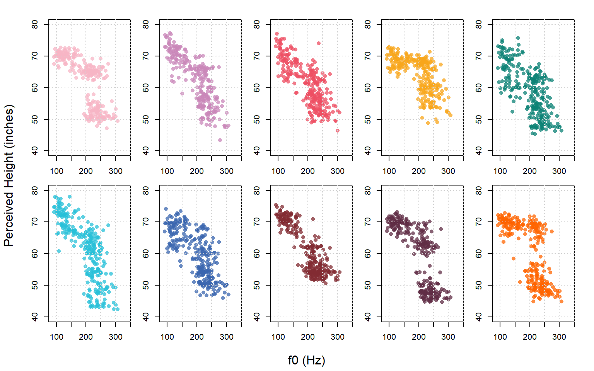
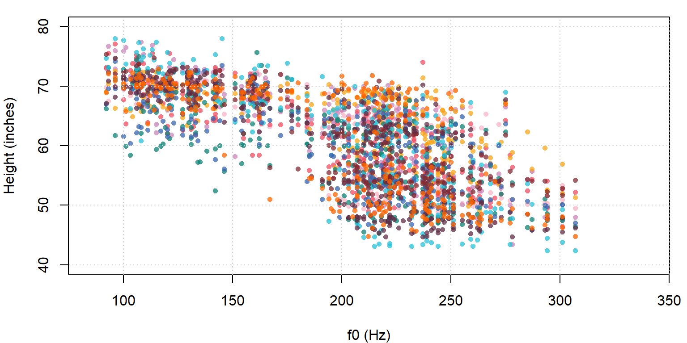
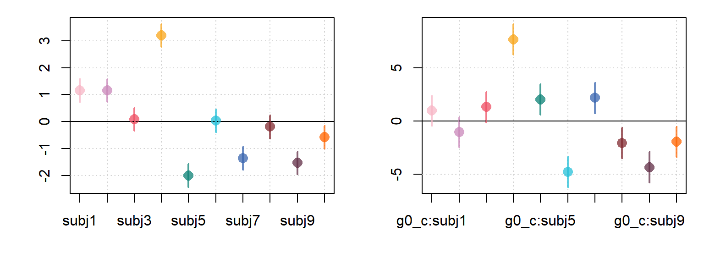
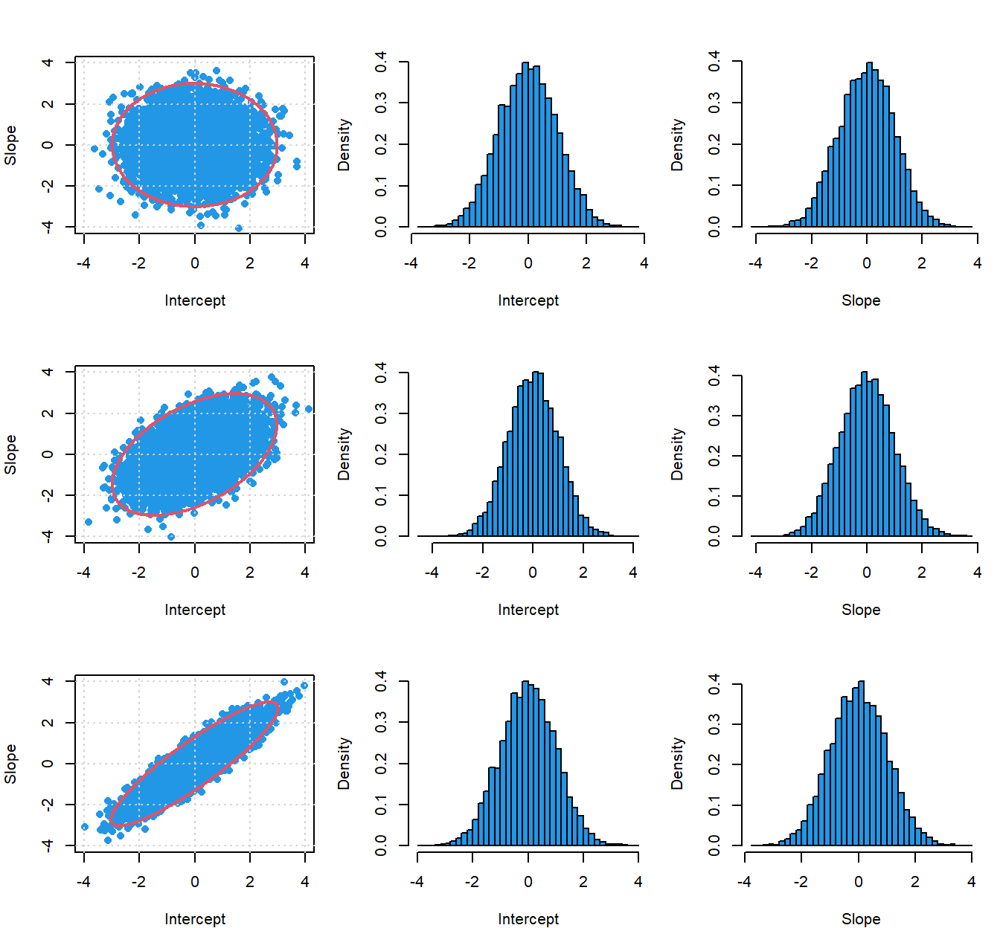

---
output:
  html_document: default
  pdf_document: default
---
# Random slopes 

To this point we've been fitting realistic, but relatively simple models. In this chapter we're going to build models that are more similar to the sorts of models that appear in published articles (i.e. they're more complicated). Fortunately, we have already discussed basically all of the component parts that make up our models. We'll see that the more complicated models we'll consider are just made up of many smaller components, all working together. 

## Data and research questions 

In this chapter we are going to flip the dependent and independent variables from last chapter. We're going to consider variation in perceived height as a function of f0 (and other predictors). 

Our data consists of the results of a listening experiment carried out using the Hillenbrand et al. data. Ten listeners heard productions of 'aw' and 'iy' produced by all 139 speakers in the Hillenbrand et al. data. The stimuli consisted of /hVd/ words presented at random (n = 278). For each trial, listeners reported the height of the speaker (in inches) and guessed whether the speaker was a boy, girl, man or woman. 


```r
library (brms)
options (contrasts = c("contr.sum","cont.sum"))

url1 = "https://raw.githubusercontent.com/santiagobarreda"
url2 = "/stats-class/master/data/h95_experiment_data.csv"
h95 = read.csv (url(paste0 (url1, url2)))
## set up colors for plotting
devtools::source_url (paste0 (url1, "/stats-class/master/data/colors.R"))
## source functions
devtools::source_url (paste0 (url1, "/stats-class/master/data/functions.R"))

h95$pheight = h95$height
## calculate centered log f0
h95$g0_c = log (h95$f0) - mean (log(h95$f0))
```

We're going to try to understand the role of f0 in size perception because f0 is a very important predictor of apparent talker size. Below we can see the distribution of perceived height plotted according to f0, individually for each subject. Clearly, there is a general tendency for perceived height to decrease as f0 increases. This relationship is not really a straight line for most subjects, but is linear enough to try this model as a first step. 

<div class="figure">

<p class="caption">(\#fig:F6-1)Each plot shows responses from a single subject.</p>
</div>
In the plot below, we compare the data from all subjects using the same colors as above. There is clearly quite a bit of general agreement between listeners. However, we can also clearly see that there is between-subject variation in responses. 

<div class="figure">

<p class="caption">(\#fig:F6-2)Distribution of perceived height responses as a function of f0 for all listeners.</p>
</div>

## Repeated measures and speaker-dependent parameter values

In chapter 3 I mentioned that the speaker effects are included in the model using sum coding. In chapter 5 I mentioned that nominal effects like 'group' are basically interactions with the model intercept for each group, resulting in group-specific intercepts in our model. Well, it turns out that the subject factor is also just basically an interaction with our intercept as well. Here we're going to consider two approaches to including subject-specific sloped in our model: one with random slopes by subject, and one with a fixed $predictor \colon subject$ interaction. 

### Description of the model

We're going to predict perceived height (in inches) as a function of centered log-f0 (the logarithm of the fundamental frequency). We're going to let the relationship between f0 and perceived height (related by a line) vary according to subjects. Our model formula is:

`pheight ~ g0_c * subj + (1|speaker)`

This says "model perceived height as a function of centered log-f0 (`g0_c`) and include subject effects (i.e. subject-specific intercepts). Also, allow subject-specific use of centered log-f0 in the perception of height (using the  g0_c:subj interaction)".

We can build this model up from the equation for a single line using the information outlined in the previous chapter. Recall that the formula for a line is:

$$
\mu = a + b * \mathrm{x}
(\#eq:61)
$$

Where our predicted value ($\mu$) varies along a line with an intercept of $a$ and a slope of $b$. We can decompose the intercept and slope terms in an 'ANOVA-like decomposition as below, given predictors $A$ and $B$:

$$
\mu = (Intercept + A + B + ...) + (Slope + Slope \colon A + Slope \colon B + ...) * \mathrm{x}
(\#eq:62)
$$

Above, the line intercept is broken up into a model intercept, and effects for A and B. The slope is broken up into a 'main effect' for slope (basically a slope intercept) and the factor by slope interactions (e.g., $Slope \colon A$). 

Below, the equation is expanded further by removing the parenthesis and multiplying each slope term by our continuous predictor ($\mathrm{x}$). 

$$
\mu = Intercept + A + B + ... + Slope* \mathrm{x} + slope \colon A* \mathrm{x} + Slope \colon B* \mathrm{x} + ...
(\#eq:63)
$$

As our models get bigger and bigger, expressions like the one above can be difficult to interpret. A presentation like the one below can be clearer and easier to interpret (once you get used to it). 

The top line reminds you that you are modeling a line. The second and third lines provide information about expected variation in the intercept and the slope.

$$
\mu = a + b * \mathrm{x} \\
a = Intercept + A + B + ... \\
b = Slope + slope \colon A + Slope \colon B + ... \\
(\#eq:64)
$$

If you prefer the 'expanded' version of the model equation it's easy enough to get this. You simply place all of the components of the $a$ and $b$ equations on the same line, and multiply each term in the $b$ equation by the continuous predictor. 

Below is the structure for our model that treats subject as a fixed effect (just like $group$ in the previous chapter). This model includes subject-specific intercepts for our lines (based on the $subj$ term) and subject-specific slopes for our lines (based on the $g0\_c \colon subj$ term). As with our earlier models, this model includes random intercepts for speakers ($\alpha_{speaker}$), seen in the intercept equation. Note that our model does *not* include any random effects in the slopes equation.  


\begin{equation}
\begin{split}
\textrm{Likelihood:} \\
pheight_{[i]} \sim \mathcal{N}(\mu_{[i]},\sigma_{error}) \\
\mu_{[i]} = a_{[i]} + b_{[i]} * \mathrm{x}_{[i]}  \\ 
a_{[i]} = Intercept + subj_{[\mathrm{subj}_{[i]}]} + \alpha_{[\mathrm{speaker}_{[i]}]}  \\
b_{[i]} =  g0\_c + g0\_c \colon subj_{[\mathrm{subj}_{[i]}]} \\ \\

\textrm{Priors:} \\
\alpha_{speaker} \sim \mathcal{N}(0,\sigma_{speaker}) \\ \\ 

Intercept \sim t(3, 60, 12) \\
g0\_c \sim t(3, 0, 50) \\ 
g0\_c \colon subj \sim t(3, 0, 50) \\ 
subj \sim t(3, 0, 12) \\ 

\sigma_{error} \sim t(3, 0, 12) \\
\sigma_{speaker} \sim t(3, 0, 12) \\ 

\end{split}
(\#eq:65)
\end{equation}


Here's a description of the model in plain English:

> Perceived height is normally distributed with a mean that varies trial to trial but a fixed standard deviation. The mean (expected value) varies along lines. The lines are specified by intercepts and slopes that vary trom trial to trial, and there is a single continuous predictor (g0_c). The intercept of these lines vary based on an overall intercept (the main effect), subject-specific deviations from the mean, and speaker-specific deviations from the mean. The slope of these lines vary based on an overall slope (the main effect) and subject-specific deviations from the average slope. The speaker intercepts were drawn from a normal distribution with a mean of zero and a standard deviation estimated from the data. All other effects (e.g., the Intercept, g0_c, etc.) were treated as 'fixed' and drawn from prior distributions appropriate for their expected range of values (e.g., subj ~ t(3,0,12)). 

### Fitting the model

We fit the model that treats subject as a fixed effect:


```r
## Fit the model yourself, or
## download pre-fit model from: 
## github.com/santiagobarreda/stats-class/tree/master/models
## and load after placing in working directory
## fixed_slopes_model = readRDS ('6_fixed_slopes_model.RDS')

set.seed (1)
fixed_slopes_model =
  brm (pheight ~ g0_c * subj + (1|speaker), data = h95, chains=4, cores=4,  
       warmup=1000, iter = 7500, thin = 4, control = list(adapt_delta = 0.95), 
       prior = c(set_prior("student_t(3, 60, 12)", class = "Intercept"),
                 set_prior("student_t(3, 0, 50)", class = "b"),
                 set_prior("student_t(3, 0, 12)", class = "sd")))

## save model
# saveRDS (fixed_slopes_model, '6_fixed_slopes_model.RDS')
```


### Interpreting the model

We're going to focus on the model fixed effects. Since we're calculating subject-specific intercepts and slopes, we need 20 coefficients to represents all the lines for our ten subjects. The `Intercept` and `g0_c` parameters represent our mean overall intercept and slope across all subjects. The `subj` parameters represent subject-specific deviations from the mean intercept for a given subject, while the `g0_c:subject` interactions represent subject specific deviations from the overall slope.  

For example, the line representing subject 8's responses can be found by calculating `Intercept + subj8` for the intercept and `g0_c + g0_c:subj8` for the slope. 


```r
fixef (fixed_slopes_model)
```

```
##               Estimate Est.Error       Q2.5      Q97.5
## Intercept  60.98678449 0.4784301 60.0484335 61.9134125
## g0_c       -6.28597349 1.4033403 -8.9682111 -3.5214787
## subj1       1.16432587 0.2191837  0.7370882  1.5905736
## subj2       1.15897715 0.2178242  0.7268558  1.5884516
## subj3       0.08484842 0.2191453 -0.3439572  0.5161977
## subj4       3.19209439 0.2196449  2.7737538  3.6216057
## subj5      -1.99350871 0.2183408 -2.4207174 -1.5651102
## subj6       0.03808015 0.2185083 -0.3916037  0.4690840
## subj7      -1.35476612 0.2171118 -1.7884342 -0.9376645
## subj8      -0.18965272 0.2172589 -0.6200814  0.2400315
## subj9      -1.53045427 0.2166533 -1.9543467 -1.1057361
## g0_c:subj1  0.97782028 0.7314227 -0.4547865  2.3773882
## g0_c:subj2 -1.04728394 0.7340484 -2.4842509  0.3662594
## g0_c:subj3  1.33942054 0.7252348 -0.1290505  2.7669004
## g0_c:subj4  7.67663353 0.7400229  6.2212793  9.1142621
## g0_c:subj5  2.00732223 0.7318437  0.5799876  3.4735872
## g0_c:subj6 -4.77805879 0.7323175 -6.1988376 -3.3397408
## g0_c:subj7  2.18304348 0.7355534  0.7304213  3.6183430
## g0_c:subj8 -2.05792955 0.7389462 -3.4984697 -0.6021956
## g0_c:subj9 -4.34455418 0.7365353 -5.7989383 -2.8925264
```

Since we are treating subject as a factor and using sum coding, we don't get the final level for the subject intercepts or slopes. We can recover this using the hypothesis function, though this can be a bit tedious when there are many levels for a factor.

I wrote a couple of functions that can help with recovering missing factor levels. First, there is a function called `divide_factors`. This function takes in a `brm` model and returns a list of matrices. Each matrix represents the samples for a single main effect or interaction term in your model. 

We can use the names function to see that our four matrices correspond to the effects for `(Intercept)`,`g0_c`, `subj`, and `g_c:subj`.   


```r
factors = divide_factors (fixed_slopes_model)
names (factors)
```

```
## [1] "(Intercept)" "g0_c"        "subj"        "g0_c:subj"
```

We can use the `str` function to inspect the output. We can see that `(Intercept)` and `g0_c` are vectors of length 6500 (our number of samples), while `subj` and `g_c:subj` are matrices with 6500 rows, but 9 columns (number of subjects - 1). 


```r
str (factors)
```

```
## List of 4
##  $ (Intercept): num [1:6500] 61.3 61 61.4 60.9 61 ...
##  $ g0_c       : num [1:6500] -6.31 -7.25 -7.65 -6.45 -7.75 ...
##  $ subj       : num [1:6500, 1:9] 1.017 1.185 1.395 1.298 0.962 ...
##   ..- attr(*, "dimnames")=List of 2
##   .. ..$ iterations: NULL
##   .. ..$ parameters: chr [1:9] "subj1" "subj2" "subj3" "subj4" ...
##  $ g0_c:subj  : num [1:6500, 1:9] 0.2202 -0.0829 0.1943 1.3944 1.5306 ...
##   ..- attr(*, "dimnames")=List of 2
##   .. ..$ iterations: NULL
##   .. ..$ parameters: chr [1:9] "g0_c:subj1" "g0_c:subj2" "g0_c:subj3" "g0_c:subj4" ...
```

We can use a function I wrote called `add_missing` which will add missing levels to single factors (it doesn't work for interactions right now). Below, I use this function to recover the missing intercept and slope terms (those of `subj10`). 


```r
factors[["subj"]] = add_missing (factors[["subj"]])
factors[["g0_c:subj"]] = add_missing (factors[["g0_c:subj"]])
```

I then use `brmplot` to plot the speaker intercept and slope effects, including the final recovered set of parameters:


```r
par (mfrow = c(1,2), mar = c(4,4,1,1))
brmplot (factors[["subj"]], col = cols) ; abline (h = 0, lty = 3)
brmplot (factors[["g0_c:subj"]], col = cols) ; abline (h = 0, lty = 3)
```

<div class="figure">

<p class="caption">(\#fig:f6-3)(left) Fixed-effects estimates of subject intercept effects. (right) Fixed-effects estimates of subject slope effects.</p>
</div>

If we want to recover the *actual* speaker-specific intercepts and slopes, we need to add the speaker effects to their corresponding main effects terms. We can do this by adding the column representing each main effect to the matrix representing each set of subject interactions, as below:


```r
subj_intercepts = factors[["(Intercept)"]] + factors[["subj"]]
subj_slopes = factors[["g0_c"]] + factors[["g0_c:subj"]]
```

I want to pause for a moment to highlight that everything to this point has involved the original **samples** from the posterior, not *summaries* of the samples. Any manipulations done to parameters (including any comparisons) need to be carried out on the samples, and then summarized (never summarized, and then compared). 

For example, `subj_intercepts`, the sum of the intercept and the subbject intercept effects is *still* a matrix with ten columns and 6500 rows, representing the individual samples from the posterior distribution of each parameter. 


```r
head( round ( subj_intercepts , 3 ) )
```

```
##       subj1  subj2  subj3  subj4  subj5  subj6  subj7  subj8  subj9 subj10
## [1,] 62.339 62.790 61.641 64.905 59.008 61.347 59.750 60.958 59.741 60.750
## [2,] 62.161 62.134 61.071 64.067 59.011 60.838 59.832 60.910 59.144 60.587
## [3,] 62.785 62.419 61.316 64.498 59.232 61.654 60.327 61.181 59.824 60.667
## [4,] 62.180 62.219 60.886 64.023 59.134 60.946 59.616 60.716 58.898 60.195
## [5,] 61.964 62.323 61.121 64.120 59.261 61.075 59.532 60.542 59.761 60.321
## [6,] 61.905 61.601 60.894 63.631 58.602 61.029 59.257 60.500 59.197 60.035
```

Only after we are done working with it, we can summarize these matrices:


```r
subj_intercepts_summary = posterior_summary (factors[["(Intercept)"]] + factors[["subj"]])
subj_slopes_summary = posterior_summary (factors[["g0_c"]] + factors[["g0_c:subj"]])
```

And compare the summary of the matrix, to the matrix of samples seen above (each row presents a column mean):


```r
subj_intercepts_summary
```

```
##        Estimate Est.Error     Q2.5    Q97.5
## subj1  62.15111 0.5290596 61.10673 63.16930
## subj2  62.14576 0.5255985 61.09036 63.15278
## subj3  61.07163 0.5283570 60.02235 62.10693
## subj4  64.17888 0.5274135 63.14280 65.19576
## subj5  58.99328 0.5243383 57.96506 60.01118
## subj6  61.02486 0.5266767 59.98223 62.03750
## subj7  59.63202 0.5237791 58.60875 60.64282
## subj8  60.79713 0.5233061 59.76867 61.81433
## subj9  59.45633 0.5243279 58.39773 60.45063
## subj10 60.41684 0.5247678 59.37266 61.42216
```

We can plot the effects and the actual parameter estimates side by side as below. Clearly, the pattern is the same, except for two key differences. First, it is shifted along the y axis due to the addition of the appropriate main effect. Second, the error around the estimates is larger. This is because the estimates on the right represent the sum of the uncertainty in the effect and the uncertainty in the corresponding main effect. 


```r
par (mfrow = c(2,2), mar = c(4,4,1,1))
brmplot (factors[["subj"]], col = cols) ; abline (h = 0, lty = 3)
brmplot (subj_intercepts_summary, col = cols)
brmplot (factors[["g0_c:subj"]], col = cols) ; abline (h = 0, lty = 3)
brmplot (subj_slopes_summary, col = cols) ; abline (h = 0, lty = 3)
```

<div class="figure">

<p class="caption">(\#fig:f6-4)(top left) Fixed-effects estimates of subject intercept terms. (top left) Fixed-effects estimates of subject intercept (main effect + subject effect). (bottom left) Fixed-effects estimates of subject slope terms. (bottom right) Fixed-effects estimates of subject slopes (main effect + subject effect).</p>
</div>

Below we can see the distribution of perceived height plotted according to f0 (centered log-f0), individually for each subject that we saw above. We can now add lines indicating predicted perceived height based on our model parameters. 

<div class="figure">

<p class="caption">(\#fig:F6-5)Each plot shows responses from a single subject. Lines indicate best fit line relating variables, as indicated by our fixed slopes model.</p>
</div>
In the plot below, we again compare the data from all subjects using the same colors as above. This time, we add the regression lines for each subject so that we can compare the similarities/differences between them. To be honest the fit of these models is not great: the predictions is makes (on the line) are basically way off for *everyone*, suggesting that our model is really missing important information with respect to size perception. However, we're not going to worry about that for now. 

<div class="figure">

<p class="caption">(\#fig:F6-6)Distribution of perceived height responses as a function of f0 for all listeners. Lines indicate best-fit lines for each subject.</p>
</div>

## Random effects and the multivariate normal distribution

A model formula like this `y ~ 1 + x (1 + x | subject)` tells your model to estimate a random intercept for each subject, and also a random effect for `x` for each speaker. Thus, each level of the clustering factor (`subject`) is represented by two random parameters, the intercept and the slope for `x`. Random effects in multilevel models are usually treated as draws from multivariate normal distributions. What I mean by this is that the random intercept and slope for each speaker are treated as a single multidimensional variable, rather than as two independent variables. 

The main difference between treating our random coefficients as a single variable rather than two variables is that when we do this, we also estimate the correlation between them. The easiest way to imagine this is by drawing a bivariate (2-dimensional) normal variable and plotting it. This is what I've done below, with simulated intercept and slope parameters drawn at random from a multivariate normal distribution. 

In the left column below I compare three bivariate normal variables along the two dimensions. In the absence of any correlation between variables, a plot of this distribution will be *spherical* (or circular in 2 dimensions). When there is a correlation between the two dimensions, the distribution starts looking more and more like a straight line. When there is a negative correlation, the line just points down rather than up. 

Note the the marginal (independent) distributions of the variables (the left and right columns) don't change as the correlation changes. The correlation is a reflection of the *joint* variation in the two variables and will not necessarily be evident in the marginal distributions of each variable.  

<div class="figure">

<p class="caption">(\#fig:unnamed-chunk-12)10,000 bivatiate normal draws of simulated intercept and slope coefficients from distributions with a mean of 0 and a standard deviation of 1. The correlation of the variables is 0 (top), 0.5 (middle) and 0.9 (bottom). The left column presents both variables together, the middle column presents intercepts and the right column presents slopes. </p>
</div>

When our dimensions are uncorrelated they are independent. The value of one does not help you understand the other. However, when the dimensions *are* correlated we can use this to make better predictions using our data. For example, an intercept of 2 in the bottom row in the figure above is very likely to be paired with a slope of 2, but *extremely* unlikely to be seen with a slope of -2. In contrast, in the top row a slope of 2 and -2 seem about equally likely given an intercept of 2. So, when we use multiple random predictors per grouping factor, we are really drawing from a multivariate normal distributions that acknowledes the relationships between random predictors in our data.  

The shape of the multivariate normal distribution is determined by a covariance matrix called $\Sigma$. This matrix is a square $n$ x $n$ matrix for a variable with $n$ dimensions. When we dealt with unidimensional normal distributions for our previous random effects, we specified priors for the (unidimensional) standard deviations using t distributions. The specification of priors for our covariance matrix is only slightly more complicated. 

In our models, we won't actually include priors for $\Sigma$ directly. This is because `brms` (and STAN) build up $\Sigma$ for us from the components we *do* specify. The covariance matrix for our random effects is created by multiplying the standard deviations of our individual dimensions by a correlation matrix ($R$) specifying the correlations between each dimension. The operation is like this:

$$
\begin{equation}
\begin{split}
\Sigma = \begin{bmatrix} \sigma_{\alpha_{[subj]}} & 0 \\ 0 & \sigma_{\beta_{[subj]}} \\ \end{bmatrix} 
* R * 
\begin{bmatrix} \sigma_{\alpha_{[subj]}} & 0 \\ 0 & \sigma_{\beta_{[subj]}} \\ \end{bmatrix} \\
\end{split}
(\#eq:66)
\end{equation}
$$

The values in the outside matrices are the the standard deviations of the random intercepts ($\sigma_{\alpha_{[subj]}}$) and slopes ($\sigma_{\beta_{[subj]}}$) individually. The correlation matrix $R$ contains information about the correlation between the dimensions of the variable (e.g., $\rho_{\alpha_{[subj]} \beta _{[subj]}}$).
  
I am explaining this so that there is no mystery behind it, but you don't actually need to worry about most of this. Here is what *does* need to make sense: when we have multiple random effects we have a multidimensional variable. We need to specify priors for each dimension and for the correlation between all dimensions. 

We provide priors for the standard deviations of the individual dimensions in the same way as we do for 'unidimensional' random effects (like $alpha_{[speaker]}$). 

The correlation matrix will look something like below (for two dimensions). It will contain only values between -1 and 1 and will contain duplicated values in the spots off of the diagonal (since the correlation of a and b equals the correlation of b and a).

We specify priors for variables of this type using the $LKJCorr$ distribution in `brms`. This distribution has a single parameter that determines how peaked the distribution is around 0. Basically, higher numbers make it harder to find larger correlations (and therefore yield more conservative estimates). [See here for an example](https://eager-roentgen-523c83.netlify.app/2014/12/27/d-lkj-priors/).   

$$
\begin{equation}
\begin{split}
R = \begin{bmatrix} x & y \\ y & z \\ \end{bmatrix} \\ \\
R \sim \mathrm{LKJCorr} (2)
\end{split}
(\#eq:67)
\end{equation}
$$

So, any time you have multiple random effects inside any grouping cluster, you need to:

  1) Specify priors for the standard deviation of each dimensions.
  
  2) Specify a prior for the correlation matrix for the multivariate normal used for the random parameters.

## Random slopes

The model above was a demonstration that served primarily as a comparison for the model we are going to fit now No one would actually include subjects as a 'fixed' effect, nor would they include the g0_c by subject interaction as a fixed effect. In both cases, researchers would tend to include these predictors as 'random effects'. Here, we are going to refit the model as a 'random slopes' model, and talk about how this relates to our previous approach (treating subjects as fixed effects). 

### Description of the model

Our previous model formula was:

`pheight ~ g0_c * subj +  ( 1 |subj) + (1|speaker)`

This formula allows for subject-specific random intercepts but not slopes. Our new model formula moves `g0_c` into the parenthesis with subject like this: 

`pheight ~ g0_c + ( g0_c |subj) + (1|speaker)`

This is the first time we've ever put anything other than `1` on the left of the pipe in the section where we define random effects. Recall that the factors in parenthesis represent clustering factors. Each of these clusters gets a little mini-model for every level of the factor. So, if subject is our clustering factor, each subject (i.e. each level) gets their own model.

To this point these models have been very simple and have only included intercepts. So, the `(1|speaker)` term says "we're going to have an intercept for every level of speaker in our model". In the same way, the `( g0_c |subj)` term says "we're going to have an intercept and a g0_c slope for every level of subject in our data" (remember the intercept is assumed even if you don't include a `1`). 

Our model formula could conceivably be written like this (though this won't work because the syntax is wrong):

`pheight ~ 1 + g0_c + (pheight ~ 1 + g0_c |subj) + (pheight ~ 1|speaker)`

Again, this won't actually work, but it might be helpful to think of your formulas this way. Notice that the formula inside the subject parenthesis is the same as the formula outside the parenthesis. In each case we are just estimating perceived height according to a slope and an intercept. The equation outside the parentheses (`pheight ~ 1 + g0_c`) tells our model to estimate an overall slope and intercept, and the part inside the parentheses (`(pheight ~ 1 + g0_c |subj)`) tells our model to do the same thing for each subject. Normally, we omit the `1` for the intercept, and we only include the dependent variable (and the `~`) in the outside formula. However, the formula above is an accurate representation of what our model formula is really doing. 

Ok, so our model has subject specific slopes and intercepts now. You may be thinking "subject specific intercepts and slopes, isn't that what we did in our last model?". The answer is yes, it is what we did in our last model! As we'll see below, our 'random' and 'fixed' effects models are largely the same thing, and provide very similar information. However, there are a few very important differences.

The model description for our random slopes model is given below. The differences relative to our previous model lie in the replacement of our $subj$ predictor with an $\alpha_{[\mathrm{subj}]}$ random effect, and in the $g0 \_ c \colon subj$ predictor with a $\beta_{[\mathrm{subj}]}$ random effect.

\begin{equation}
\begin{split}
\textrm{Likelihood:} \\
y_{[i]} \sim \mathcal{N}(\mu_{[i]},\sigma_{error}) \\
\mu_{[i]} = a_{[i]} + b_{[i]} * \mathrm{x}_{[i]}  \\ 
a_{[i]} = Intercept + \alpha_{[\mathrm{subj}_{[i]}]} + \alpha_{[\mathrm{speaker}_{[i]}]}  \\
b_{[i]} =  g0\_c + \beta_{{[\mathrm{subj}_{[i]}]}} \\ \\

\textrm{Priors:} \\
\alpha_{speaker} \sim \mathrm{Normal}(0,\sigma_{speaker}) \\ \\  

\begin{bmatrix} \alpha_{subj} \\ \beta_{subj} \\ \end{bmatrix}	
\sim \mathrm{MVNormal} ( \begin{bmatrix} 0 \\ 0 \\ \end{bmatrix}, \Sigma) \\ \\

Intercept \sim t(3, 60, 12) \\
g0\_c \sim t(3, 0, 50) \\ \\

\sigma_{error} \sim t(3, 0, 100) \\
\sigma_{\alpha_{speaker}} \sim t(3, 0, 100) \\ 
\sigma_{\alpha_{subj}} \sim t(3, 0, 12) \\ 
\sigma_{\beta_{subj}} \sim t(3, 0, 12) \\ 
R \sim \mathrm{LKJCorr} (2)

\end{split}
(\#eq:68)
\end{equation}

Here's a description of the model in plain English:

> Perceived height is normally distributed with a mean that varies trial to trial but a fixed standard deviation. The mean (expected value) varies along lines. The lines are specified by intercepts and slopes that vary trom trial to trial, and there is a single continuous predictor (g0_c). The intercept of these lines vary based on an overall intercept (the main effect), subject-specific deviations from the mean, and speaker-specific deviations from the mean. The slope of these lines vary based on an overall slope (the main effect) and subject-specific deviations from the average slope. The speaker intercepts were drawn from a normal distribution with a mean of zero and a standard deviation estimated from the data. The subject intercepts and slopes were drawn from a bivariate normal distribution with means of 0 of zero and a covariance matrix estimated from the data. All other effects (e.g., the Intercept, g0_c, etc.) were treated as 'fixed' and drawn from prior distributions appropriate for their expected range of values (e.g., subj ~ t(3,0,12)). 

Note that the prediction equation in our last model:

$$
\begin{equation}
\begin{split}
\mu_{[i]} = a_{[i]} + b_{[i]} * \mathrm{x}_{[i]}  \\ 
a_{[i]} = Intercept + subj_{[\mathrm{subj}_{[i]}]} + \alpha_{[\mathrm{speaker}_{[i]}]}  \\
b_{[i]} =  g0\_c + g0\_c \colon subj_{[\mathrm{subj}_{[i]}]} \\ \\
\end{split}
(\#eq:69)
\end{equation}
$$

Is just like the one for this model, save for a one-to-one replacement of terms ($\alpha_{[\mathrm{subj}]}$ and $\beta_{[\mathrm{subj}]}$ for $subj_{[\mathrm{subj}]}$ and $g0\_c \colon subj_{[\mathrm{subj}]}$):

$$
\begin{equation}
\begin{split}
\mu_{[i]} = a_{[i]} + b_{[i]} * \mathrm{x}_{[i]}  \\ 
a_{[i]} = Intercept + \alpha_{[\mathrm{subj}_{[i]}]} + \alpha_{[\mathrm{speaker}_{[i]}]}  \\
b_{[i]} =  g0\_c + \beta_{{[\mathrm{subj}_{[i]}]}} \\ \\
\end{split}
(\#eq:610)
\end{equation}
$$

Although the prediction equations are largely the same, in the previous model we treated subject as a 'fixed' effect. Remember that in our multilevel Bayesian models, this means that the prior distribution for these was determined entirely a priori and was not estimated from the data. For example our subject effects were drawn from a population of $subj \sim t(3, 0, 12)$ and the subject by g0_c interaction was drawn from a population of $g0\_c \colon subj \sim t(3, 0, 50)$. 

In contrast, random effects are drawn from populations whose standard deviation is estimated from the data. This is the way our current (and previous) models treat the speaker effects. Notice that we estimate, rather than stipulate, the standard deviation for the population of speaker effects ($\sigma_{speaker}$): 

$$
\begin{equation}
\begin{split}
\alpha_{speaker} \sim \mathrm{Normal}(0,\sigma_{speaker}) \\ \\  
\sigma_{speaker} \sim t(3, 0, 100) \\ 
\end{split}
(\#eq:611)
\end{equation}
$$

We might have treated our subject intercepts in the same way, except for the fact that we are also estimating random slopes for subjects. Since we are drawing two random variables for each person, we need to also model the correlation between the variables. 

So, when we have multiple random effects (e.g., intercepts and/or slopes) for a predictor, we draw this from a multivariate normal distribution where each predictor is a different 'dimension' of the variable. This requires that we estimate a standard deviation for each predictor, and a correlation between each pair of predictors. 

As seen below, we draw our predictors from a two-dimensional normal distribution. This distribution has a mean of zero for each dimension, and a covariance matrix equal to $\Sigma$.

$$
\begin{bmatrix} \alpha_{subj} \\ \beta_{subj} \\ \end{bmatrix}	
\sim \mathrm{MVNormal} ( \begin{bmatrix} 0 \\ 0 \\ \end{bmatrix}, \Sigma) \\ \\
(\#eq:612)
$$

### Fitting the model

We now fit the model that includes random intercepts and random by-subject slopes for f0. Notice that my `set_prior` section now includes a new category of parameter `cor` for which I provide a prior using the `lkj_corr_cholesky` distribution. 


```r
## Fit the model yourself, or
## download pre-fit model from: 
## github.com/santiagobarreda/stats-class/tree/master/models
## and load after placing in working directory
## random_slopes_model = readRDS ('6_random_slopes_model.RDS')

set.seed (1)
random_slopes_model =
  brm (pheight ~ g0_c + (g0_c|subj) + (1|speaker), data=h95, chains=4, cores=4,  
       warmup=1000, iter = 7500, thin = 4, control = list(adapt_delta = 0.95), 
       prior = c(set_prior("student_t(3, 60, 12)", class = "Intercept"),
                 set_prior("student_t(3, 0, 50)", class = "b"),
                 set_prior("student_t(3, 0, 12)", class = "sd"),
                 set_prior("lkj_corr_cholesky (2)", class = "cor")))

## save model
# saveRDS (random_slopes_model, '6_random_slopes_model.RDS')
```


### Interpreting the model

When we look at the print statement for our model, we now see multiple entries in the `Group-Level Effects` section. Under `speaker` we see `sd(Intercept)` representing the standard deviation of the talker intercepts. This tells us that we are only estimating random intercepts for our 139 speakers. These intercepts represent systematic variability in perceived height that is independent of the linear effect for f0. 

```
Group-Level Effects: 
~speaker (Number of levels: 139) 
              Estimate Est.Error l-95% CI u-95% CI Rhat Bulk_ESS Tail_ESS
sd(Intercept)     5.52      0.47     4.65     6.51 1.00     1643     2982

~subj (Number of levels: 10) 
                    Estimate Est.Error l-95% CI u-95% CI Rhat Bulk_ESS Tail_ESS
sd(Intercept)           1.81      0.54     1.09     3.18 1.00     4776     5714
sd(g0_c)                4.21      1.22     2.54     7.25 1.00     5435     5917
cor(Intercept,g0_c)     0.34      0.27    -0.27     0.77 1.00     5602     5807
```

We see that there is also a section for `subj`, containing our by-subject random effects, that has three elements. the first is `sd(Intercept)`, representing the standard deviation of our subject intercepts. These intercepts represent differences in the average height responses of different subjects that are independent of f0. The second is `sd(g0_c)` representing the standard deviation of subject *slopes*. This represents variation in by-subject slopes, analogous to the $g0_c \colon subj$ interaction in our fixed effects model. The third item is`cor(Intercept,g0_c)`, representing the correlation of subject intercepts and subject slopes.   

Below, we can compare the fixed effect estimates of our random slopes model:

```
Population-Level Effects: 
          Estimate Est.Error l-95% CI u-95% CI Rhat Bulk_ESS Tail_ESS
Intercept    60.93      0.76    59.44    62.43 1.00     1539     3029
g0_c         -6.34      1.94   -10.17    -2.63 1.00     2883     4064
```

To those of the fixed slopes model. 

```
Population-Level Effects: 
           Estimate Est.Error l-95% CI u-95% CI Rhat Bulk_ESS Tail_ESS
Intercept     60.99      0.48    60.05    61.91 1.00      713     1735
g0_c          -6.29      1.40    -8.97    -3.52 1.00     1963     3303
```

The estimates are quite close in value, though their credible intervals vary. The difference in the credible intervals comes across more clearly when we plot them to compare:

<div class="figure">

<p class="caption">(\#fig:F6-8)(left) Comparison of random effect (RE) and fixed effect (FE) estimates of the intercept main effect. (right) Comparison of random effect (RE) and fixed effect (FE) estimates of the slope main effect.</p>
</div>

We can get the random effects (slopes and intercepts) from our model using the `ranef` function, and asking for the `subj` random effects.


```r
random_effects = ranef (random_slopes_model)$subj
str (random_effects)
```

```
##  num [1:10, 1:4, 1:2] 1.164 1.155 0.116 3.174 -1.914 ...
##  - attr(*, "dimnames")=List of 3
##   ..$ : chr [1:10] "1" "2" "3" "4" ...
##   ..$ : chr [1:4] "Estimate" "Est.Error" "Q2.5" "Q97.5"
##   ..$ : chr [1:2] "Intercept" "g0_c"
```

When we have a look at the output of the `str` function, we can see that this is a 3-dimensional matrix. When we look at this matrix along the third dimension (e.g., `random_effects[,,in here]`), we get a series of 2-d matrices that are a summary of a single random effect. Below we see that the first matrix (`random_effects[,,1]`) corresponds to the random intercepts, and the second matrix (`random_effects[,,2]`) corresponding to the random slopes.

You'll note that we actually get all ten subject effects and there is no omitted value. This is because when you use partial pooling to estimate parameters, you actually *can* estimate all levels of a factor (for technical reasons related to shrinkage).


```r
random_effects
```

```
## , , Intercept
## 
##       Estimate Est.Error        Q2.5       Q97.5
## 1   1.16377527 0.6268821 -0.04942324  2.46153571
## 2   1.15505273 0.6275566 -0.03510937  2.42001233
## 3   0.11623493 0.6231278 -1.10121480  1.38309357
## 4   3.17445575 0.6258360  1.99622247  4.49472090
## 5  -1.91413822 0.6259466 -3.12790488 -0.63922912
## 6   0.04515396 0.6257749 -1.18640204  1.32431108
## 7  -1.28080815 0.6267446 -2.50106938 -0.03644058
## 8  -0.16633822 0.6317497 -1.39801195  1.11656287
## 9  -1.47968132 0.6320220 -2.71728703 -0.21591965
## 10 -0.53282781 0.6300846 -1.74720063  0.75334092
## 
## , , g0_c
## 
##      Estimate Est.Error      Q2.5     Q97.5
## 1   1.0157799  1.577586 -2.117585  4.117939
## 2  -0.9027227  1.566411 -4.070686  2.179692
## 3   1.3279988  1.577451 -1.798952  4.516177
## 4   7.4737121  1.591885  4.444100 10.670002
## 5   1.8695128  1.569712 -1.300681  5.008267
## 6  -4.4944108  1.569323 -7.674207 -1.418619
## 7   2.0829323  1.582772 -1.030887  5.365565
## 8  -1.9113901  1.578336 -5.155632  1.199296
## 9  -4.1408383  1.578127 -7.315184 -1.035547
## 10 -1.8307910  1.561144 -4.991040  1.268622
```

Below we see a comparison of the subject intercept and slope terms provided by the random and fixed slopes models. We can see that the effects are extremely similar, however, credible intervals are substantially wider for the estimates provided by the random effects model.


```r
################################################################################
### Figure 6.10
################################################################################

par (mfrow = c(2,1), mar = c(4,4,1,1))
## plot random intercepts
brmplot (xs = (1:10)-.2,  random_effects[,,1], col=cols, labels = "", pch=15)
## plot fixed intercepts
brmplot (xs = (1:10)+.2, factors[["subj"]], add = TRUE, col=cols)
abline (h=0, lty=3)
## plot random slopes
brmplot (xs = (1:10)-.2, random_effects[,,2], col = cols, labels = "", pch=15)
## plot fixed slopes
brmplot (xs = (1:10)+.2, factors[["g0_c:subj"]], add = TRUE, col=cols)
abline (h=0, lty=3)
```

<div class="figure">

<p class="caption">(\#fig:F6-9)(top) Comparison of random effects (squares) and fixed effect (circles) estimates for speaker intercept effects. (bottom) Same as above but for the slope terms.</p>
</div>

Below, we compare the random and fixed effects for the subject intercept effects. Note that the difference between the random and fixed effect estimates is largest for the effects with the largest magnitude. For example, on the left edge of the right figure below we see that the green effect with a fixed effect estimates near -2 has a random effect that is nearly 0.1 larger than that (near to -1.9). 

<div class="figure">

<p class="caption">(\#fig:F6-10)(left) Comparison of fixed and random estimates for subject effects (intercept terms). (right) Plot of the difference between the estimates for each parameter, plotted against the value of the fixed-effect estimate of the same parameter.</p>
</div>

The same pattern is evident below: more extreme values are 'shrunk' towards the mean. This is partial-pooling and shrinkage in action! Because parameters in a 'random effect' are jointly estimated (to some extent), extreme values can be pulled towards the mean when they are weakly supported. Here we see a tiny bit of shrinkage indicating that: 1) the values were not so extreme, and 2) the 'extreme' values had a reasonable amount of support. 

<div class="figure">

<p class="caption">(\#fig:F6-11)(left) Comparison of fixed and random estimates for g0_c:subject effects (slope terms). (right) Plot of the difference between the estimates for each parameter, plotted against the value of the fixed-effect estimate of the same parameter.</p>
</div>

## More predictors and more random slopes

### Adding another random slope

Imagine we were to add another continuous predictor to our model. We can use the centered logarithm of F1 (`g1_c`) as an example. Inclusion of random slopes for this predictor would mean our equation now looks like: 

`pheight ~ g0_c + g1_c (g0_c + g1_c|subj) + (1|speaker)`

In turn, this means that the likelihood section of our model now looks like below. Basically, we have just added a new continuous predictor ($\mathrm{x}_{2[i]}$) and slope term ($b_{2}$), with its own corresponding decomposition into a main effect and a random subject effect. 

$$
\begin{equation}
\begin{split}
y_{[i]} \sim \mathcal{N}(\mu_{[i]},\sigma_{error}) \\
\mu_{[i]} = a_{[i]} + b_{1[i]} * \mathrm{x}_{1[i]} + b_{2[i]} * \mathrm{x}_{2[i]}  \\ 
a_{[i]} = Intercept + \alpha_{[\mathrm{subj}_{[i]}]} + \alpha_{[\mathrm{speaker}_{[i]}]}  \\
b_{1[i]} =  g0\_c + \beta_{1{[\mathrm{subj}_{[i]}]}} \\ 
b_{2[i]} =  g1\_c + \beta_{2{[\mathrm{subj}_{[i]}]}} \\ 
\end{split}
(\#eq:613)
\end{equation}
$$

The two random slopes ($\beta_{1{[\mathrm{subj}]}},\beta_{2{[\mathrm{subj}]}}$) and the random intercept ($\alpha_{{[\mathrm{subj}]}}$) are all drawn from a multivariate normal distribution:

$$
\begin{equation}
\begin{split}
\begin{bmatrix} \alpha_{[subj]} \\ \beta_{1[subj]} \\ \beta_{2[subj]} \\ \end{bmatrix}	
\sim \mathrm{MVNormal} ( \begin{bmatrix} 0 \\ 0 \\ 0 \\ \end{bmatrix}, \Sigma) \\ 
\end{split}
(\#eq:613)
\end{equation}
$$

Just as for our first random slopes model, we just need to worry about specifying the priors for the effects standard deviations ($\sigma_{\alpha_{[\mathrm{speaker}]}}, \sigma_{\beta_{[\mathrm{speaker}]}}$) and the correlation matrix ($R$) (like below) and `brm` does the rest of the work for us. 

$$
\begin{equation}
\begin{split}

\sigma_{\alpha_{[speaker]}} \sim t(3, 0, 100) \\ 
\sigma_{\beta_{1[subj]}} \sim t(3, 0, 100) \\ 
\sigma_{\beta_{2[subj]}} \sim t(3, 0, 100) \\ 
R \sim \mathrm{LKJCorr} (2)

\end{split}
(\#eq:614)
\end{equation}
$$

### Adding random factors

We can also add random effects for factors. For example, we could include `adult` inside our `subj` parentheses in the model formula. This would tell our model to calculate a subject-specific effect for `adult`:

`pheight ~ g0_c + g1_c + adult (g0_c + g1_c + adult |subj) + (1|speaker)`

The likelihood section of our model will now look like below. Note that the random effect associated with adultness is added to the intercept equation. This is because this effect does not interact with our continuous predictors. Since there are no interactions between our continuous predictors and the adult effect, the slopes cannot vary based on adultness. As a result, the adultness parameter can only affect the intercepts of the shapes being drawn and not the slopes. 

$$
\begin{equation}
\begin{split}
y_{[i]} \sim \mathcal{N}(\mu_{[i]},\sigma_{error}) \\
\mu_{[i]} = a_{[i]} + b_{1[i]} * \mathrm{x}_{1[i]} + b_{2[i]} * \mathrm{x}_{2[i]}  \\ 
a_{[i]} = Intercept + \alpha_{[\mathrm{subj}_{[i]}]} + \alpha_{adult[\mathrm{subj}_{[i]}]} + \alpha_{[\mathrm{speaker}_{[i]}]}  \\
b_{1[i]} =  g0\_c + \beta_{1{[\mathrm{subj}_{[i]}]}} \\ \\
b_{2[i]} =  g1\_c + \beta_{2{[\mathrm{subj}_{[i]}]}} \\ \\
\end{split}
(\#eq:614)
\end{equation}
$$

Since we now have 4 random effects for subject, we draw our subject random effects from a four-dimensional normal distribution like this:

$$
\begin{equation}
\begin{split}
\begin{bmatrix} \alpha_{[subj]} \\ \alpha_{adult[subj]} \\ \beta_{1[subj]} \\ \beta_{2[subj]} \\ \end{bmatrix}	
\sim \mathrm{MVNormal} ( \begin{bmatrix} 0 \\ 0 \\ 0 \\ 0 \\ \end{bmatrix}, \Sigma) \\ \\
\end{split}
(\#eq:615)
\end{equation}
$$


### The independence of continuous predictors

It's important to note that each continuous predictor is treated independently in our model. We could, for example, include an interaction between adultness and F1 in our model. This would make the formula look like this:

`pheight ~ g0_c + g1_c + adult + g1_c:adult + (g0_c + g1_c + adult + g1_c:adult|subj) + (1|speaker)`

Note that this only causes a change for one of our slopes ($b_2$). It causes no change at all for our intercept or the other slope:

$$
\begin{equation}
\begin{split}
y_{[i]} \sim \mathcal{N}(\mu_{[i]},\sigma_{error}) \\
\mu_{[i]} = a_{[i]} + b_{1[i]} * \mathrm{x}_{1[i]} + b_{2[i]} * \mathrm{x}_{2[i]}  \\ 
a_{[i]} = Intercept + \alpha_{[\mathrm{subj}_{[i]}]} + \alpha_{adult[\mathrm{subj}_{[i]}]} + \alpha_{[\mathrm{speaker}_{[i]}]}  \\
b_{1[i]} =  g0\_c + \beta_{1{[\mathrm{subj}_{[i]}]}} \\ \\
b_{2[i]} =  g1\_c + \beta_{2{[\mathrm{subj}_{[i]}]}} + \beta_{2,adult[\mathrm{subj}_{[i]}]} \\ \\
\sim \mathrm{MVNormal} ( \begin{bmatrix} 0 \\ 0 \\ 0 \\ 0 \\ \end{bmatrix}, \Sigma) \\ \\
\end{split}
(\#eq:616)
\end{equation}
$$


Since we now have five random effects, we now draw our subject random effects from a five-dimensional normal distribution like:

$$
\begin{equation}
\begin{split}
\begin{bmatrix} \alpha_{[subj]} \\ \alpha_{adult[subj]} \\ \beta_{1[subj]} \\ \beta_{2[subj]} \\ \beta_{2,adult[\mathrm{subj}_{[i]}]} \\ \end{bmatrix}	
\sim \mathrm{MVNormal} ( \begin{bmatrix} 0 \\ 0 \\ 0 \\ 0 \\ 0 \\ \end{bmatrix}, \Sigma) \\ \\
\end{split}
(\#eq:616)
\end{equation}
$$

Keep in mind that the correlation matrix for this distribution is a 5x5 matrix with 25 elements, meaning we have to estimate 10 correlation parameters and 5 variance parameters in order to estimate these random effects. Many of the convergence problems that `lmer` has seem to relate to the estimation of the correlation parameters for random slopes. Since our Bayesian models have prior distributions on these correlation parameters, they can do a much better job of investigating the random effects correlations and can therefore easily (but perhaps slowly) find solutions for models with even large numbers of random effects.  

## Lmer corner

We can fit a 'random slopes' model with `lmer` using the code below: 


```r
model = lme4::lmer (pheight ~ g0_c +  (g0_c|subj) + (1|speaker), data = h95)
```

Below I recreate the middle part of the `lmer` model print statement, except I added numbers to some rows. This is because `lmer` and `brm` present much of the same information but with different labels and in a different order. 

```
Random effects:
    Groups   Name        Variance Std.Dev.  Corr
(1) speaker  (Intercept) 29.903   5.468        
(2) subj     (Intercept)  2.326   1.525        
(3)          g0_c        12.908   3.593  (7) 0.52
(4) Residual             14.649   3.827        
Number of obs: 2780, groups:  speaker, 139; subj, 10

Fixed effects:
               Estimate Std. Error t value
(5) (Intercept)  60.9939     0.6731  90.621
(6) g0_c         -6.3488     1.5340  -4.139
```

Below I show the `random_slopes_model` print statement with numbers that match the labels in the print statement above. We see that both models provide reasonably similar estimates for our parameters, with the `brm` model providing more information about parameter intervals. 

```
Group-Level Effects: 
~speaker (Number of levels: 139) 
              Estimate Est.Error l-95% CI u-95% CI Rhat Bulk_ESS Tail_ESS
(1) sd(Intercept)     5.52      0.47     4.65     6.51 1.00     1643     2982

~subj (Number of levels: 10) 
                    Estimate Est.Error l-95% CI u-95% CI Rhat Bulk_ESS Tail_ESS
(2) sd(Intercept)           1.81      0.54     1.09     3.18 1.00     4776     5714
(3) sd(g0_c)                4.21      1.22     2.54     7.25 1.00     5435     5917
(7) cor(Intercept,g0_c)     0.34      0.27    -0.27     0.77 1.00     5602     5807

Population-Level Effects: 
          Estimate Est.Error l-95% CI u-95% CI Rhat Bulk_ESS Tail_ESS
(5) Intercept    60.93      0.76    59.44    62.43 1.00     1539     3029
(6) g0_c         -6.34      1.94   -10.17    -2.63 1.00     2883     4064

Family Specific Parameters: 
      Estimate Est.Error l-95% CI u-95% CI Rhat Bulk_ESS Tail_ESS
(4) sigma     3.83      0.05     3.73     3.94 1.00     5831     6083
```

Below is a comparison of the subject intercepts and slopes fit by both approches:

<div class="figure">

<p class="caption">(\#fig:F6-12)(left) Subject random intercepts and credible intervals estimated using brms models. Crosses indicate random effects estimated by lmer. (right) Same as right but for random slopes.</p>
</div>

And the speaker random intercepts estimates by both approaches. In both cases we see that we arrive at basically the same results. 

<div class="figure">

<p class="caption">(\#fig:F6-13)Speaker random intercepts and credible intervals estimated using brms models. Crosses indicate random effects estimated by lmer.</p>
</div>

I'm also going to fit a model that was described but not fit above. Below we see a model predicting perceived height as a function of centered log F1 and f0. It also included an effect for adultness and an adultness by F1 interaction. The model includes random intercepts for subject and by subject slopes for all predictors. A random by-speaker intercept was also included. 


```r
## make variable that indicates if the talker is an adult
h95$adult = ""
h95$adult[h95$group %in% c('w','m')] = "adult"
h95$adult[h95$group %in% c('g','b')] = "child"

## make centered log F1
h95$g1_c = log(h95$f1) - mean (log(h95$f1))

formula = pheight ~ g0_c + g1_c + adult + g1_c:adult + 
                   (g0_c + g1_c + adult + g1_c:adult|subj) + 
                   (1|speaker)

model_2 = lme4::lmer (formula, data = h95)
```

```
## boundary (singular) fit: see ?isSingular
```

Notice that `lmer` also treats our subject random effects as draws from a 5-dimensional normal distribution. It provides estimates of the standard deviations of the five dimensions (under `Random effects:` and `subj`), and also estimates of the correlations between the dimensions. 


```r
summary (model_2)
```

```
## Linear mixed model fit by REML ['lmerMod']
## Formula: pheight ~ g0_c + g1_c + adult + g1_c:adult + (g0_c + g1_c + adult +  
##     g1_c:adult | subj) + (1 | speaker)
##    Data: h95
## 
## REML criterion at convergence: 15283.3
## 
## Scaled residuals: 
##     Min      1Q  Median      3Q     Max 
## -4.0394 -0.5447  0.0323  0.6015  4.7086 
## 
## Random effects:
##  Groups   Name        Variance Std.Dev. Corr                   
##  speaker  (Intercept)  3.1497  1.7747                          
##  subj     (Intercept)  2.8332  1.6832                          
##           g0_c        12.9476  3.5983    0.25                  
##           g1_c         0.6224  0.7889    0.75 -0.33            
##           adult1       2.0034  1.4154   -0.41  0.31 -0.21      
##           g1_c:adult1  0.8725  0.9341    0.35 -0.04  0.55  0.12
##  Residual             12.5969  3.5492                          
## Number of obs: 2780, groups:  speaker, 139; subj, 10
## 
## Fixed effects:
##             Estimate Std. Error t value
## (Intercept)  59.4982     0.5618 105.907
## g0_c        -11.1545     1.2864  -8.671
## g1_c         -2.4530     0.3383  -7.250
## adult1        4.1865     0.4920   8.509
## g1_c:adult1  -1.2790     0.3709  -3.448
## 
## Correlation of Fixed Effects:
##             (Intr) g0_c   g1_c   adult1
## g0_c         0.179                     
## g1_c         0.501 -0.154              
## adult1      -0.402  0.345 -0.091       
## g1_c:adult1  0.286 -0.034  0.176  0.071
## optimizer (nloptwrap) convergence code: 0 (OK)
## boundary (singular) fit: see ?isSingular
```


## Plot Code


```r
################################################################################
### Figure 6.1
################################################################################

par (mar = c(2,2,1,1), mfrow = c(2,5), oma = c(3,3,1,1))
for (i in 1:10){
  tmp = h95[h95$subj == i,]
  plot (pheight ~ g0, data = tmp, col=cols[i],pch=16,ylim=c(40,80),
        xlim=log(c(85,340)),xlab="",ylab="")
}
mtext (side = 1, outer = TRUE, text = "f0 (log Hz)", line = 1.5)
mtext (side = 2, outer = TRUE, text = "Perceived Height (inches)", line = 1.5)


################################################################################
### Figure 6.2
################################################################################

par (mar = c(4,4,1,1), mfrow = c(1,1))

plot (pheight ~ g0, data = h95, col=cols[h95$subj],pch=16,ylim=c(40,80),xlab="f0 (log Hz)",
      ylab="Height (inches)", xlim=log(c(85,340)), cex = .75)
#points (pheight ~ g0, data = h95, col=h95$subj,pch=16, cex = .75)

################################################################################
### Figure 6.5
################################################################################

par (mar = c(2,2,1,1), mfrow = c(2,5), oma = c(3,3,1,1))
for (i in 1:10){
  tmp = h95[h95$subj == i,]
  plot (pheight ~ g0_c, data = tmp, col=cols[i],pch=16,ylim=c(40,80),
        xlim=c(-1,1),xlab="",ylab="")
  abline (subj_intercepts_summary[i,1],subj_slopes_summary[i,1], 
          lwd=4,col=cols[i])

}
mtext (side = 1, outer = TRUE, text = "Centered f0 (log Hz)", line = 1.5)
mtext (side = 2, outer = TRUE, text = "Perceived Height (inches)", line = 1.5)

################################################################################
### Figure 6.6
################################################################################

par (mar = c(4,4,1,1), mfrow = c(1,1))

plot (pheight ~ g0_c, data = h95, col=cols[h95$subj],pch=16,ylim=c(40,80),
      xlim=c(-.8,.8), cex = 0.75)
for (i in 1:10){
  abline (subj_intercepts_summary[i,1],subj_slopes_summary[i,1], 
          lwd=4,col=cols[i])
}


################################################################################
### Figure 6.8
################################################################################

fe_1 = fixef ( random_slopes_model )
fe_2 = fixef ( fixed_slopes_model ) 

par (mfrow = c(1,2), mar = c(3,4,3,1))
brmplot (rbind (fe_1[1,], fe_2[1,]), ylim = c(59,63),ylab="Effect",
         col=cols[c(2,7)], xlim = c(0.8,2.2), labels = c("RE","FE"), 
         main = "Intercept", cex.main=1)
brmplot (rbind (fe_1[2,], fe_2[2,]), ylim = c(-12,-2),ylab="Effect",
         col=cols[c(2,7)],xlim = c(0.8,2.2),labels=c("RE","FE"), main="g0_c",
         cex.main=1)

################################################################################
### Figure 6.10
################################################################################

par (mfrow = c(2,1), mar = c(4,4,1,1))
## plot random intercepts
brmplot (xs = (1:10)-.2,  random_effects[,,1], col=cols, labels = "", pch=15)
## plot fixed intercepts
brmplot (xs = (1:10)+.2, factors[["subj"]], add = TRUE, col=cols)
abline (h=0, lty=3)
## plot random slopes
brmplot (xs = (1:10)-.2, random_effects[,,2], col = cols, labels = "", pch=15)
## plot fixed slopes
brmplot (xs = (1:10)+.2, factors[["g0_c:subj"]], add = TRUE, col=cols)
abline (h=0, lty=3)

################################################################################
### Figure 6.10
################################################################################

summaries = summarize (factors)

par (mfrow = c(1,2), mar = c(4,4,1,1))
plot (summaries[["subj"]][,1],random_effects[,1,1],lwd=3,cex=3,col=cols,pch=4,
      xlab = "FE Estimate", ylab = "RE Estimate", 
      main = "", xlim = c(-3,4.5), ylim = c(-3,4.5))
abline (0,1,col=1,lwd=2,lty=3)
grid()
points (summaries[["subj"]][,1],random_effects[,1,1],lwd=3,cex=3,col=cols,pch=4)


plot (summaries[["subj"]][,1],random_effects[,1,1]-summaries[["subj"]][,1],
      lwd=3,cex=3,col=cols,pch=4,ylim = c(-.3,.3),xlab = "FE Estimate",
      ylab = "RE Estimate - FE Estimate",xlim = c(-3,4.5),
      main = "")
abline (h=0,col=1,lwd=2,lty=3)
grid()


################################################################################
### Figure 6.11
################################################################################

par (mfrow = c(1,2), mar = c(4,4,1,1))

plot (summaries[["g0_c:subj"]][,1],random_effects[,1,2],lwd=3,cex=3,col=cols,
      pch=4,xlab = "FE Estimate", ylab = "RE Estimate", 
      main = "", xlim = c(-7,10), ylim = c(-5,9))
abline (0,1,col=1,lwd=2,lty=3)
grid()
points (summaries[["g0_c:subj"]][,1],random_effects[,1,2],lwd=3,
        cex=3,col=cols,pch=4)

plot (summaries[["g0_c:subj"]][,1],
      random_effects[,1,2]-summaries[["g0_c:subj"]][,1],
      lwd=3,cex=3,col=cols,pch=4,ylim = c(-.6,.6),xlab = "FE Estimate",
      ylab = "RE Estimate - FE Estimate",xlim = c(-7,10),
      main = "")
abline (h=0,col=1,lwd=2,lty=3)
grid()


################################################################################
### Figure 6.12
################################################################################

par (mfrow = c(1,2), mar = c(4,4,1,1))

brmplot (random_effects[,,1], col = cols)
points (ranef (model)$subj[,1], pch=4,lwd=2, cex=3, col = cols)
abline (h=0,lty=3)
brmplot (random_effects[,,2], col = cols)
points (ranef (model)$subj[,2], pch=4,lwd=2, cex=3, col = cols)
abline (h=0,lty=3)

################################################################################
### Figure 6.13
################################################################################

par (mfrow = c(1,1), mar = c(4,4,1,1))
brmplot ( ranef (random_slopes_model)$speaker[,,1], col= skyblue)
points (ranef (model)$speaker[,1], col = skyblue, pch=4,lwd=2, cex=2)
abline (h=0,lty=3)
```


