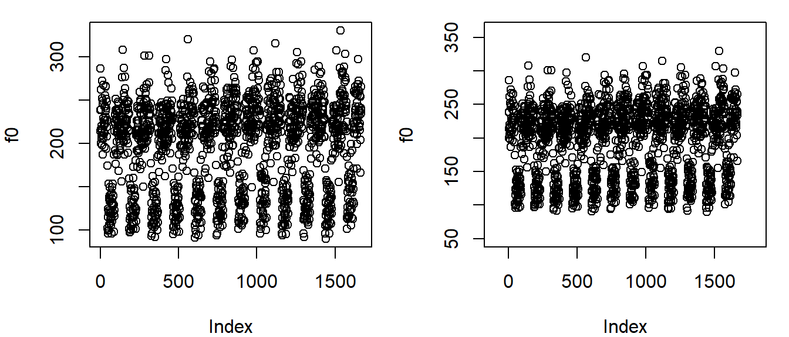
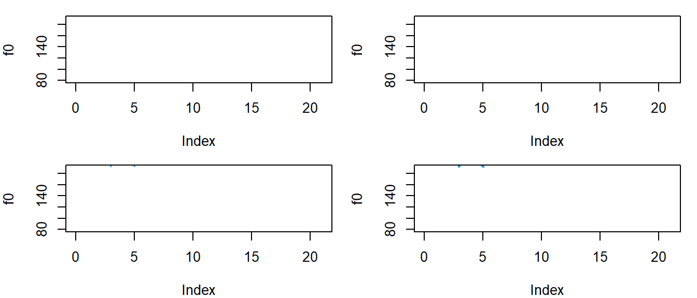
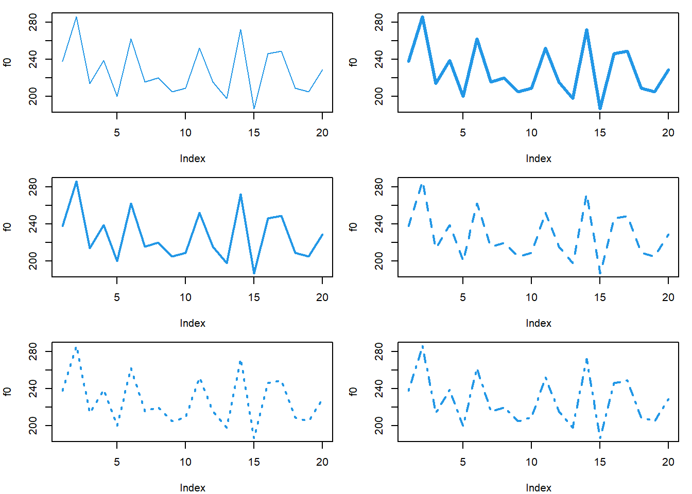
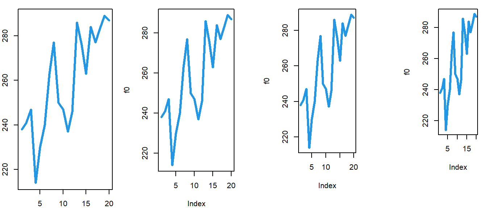
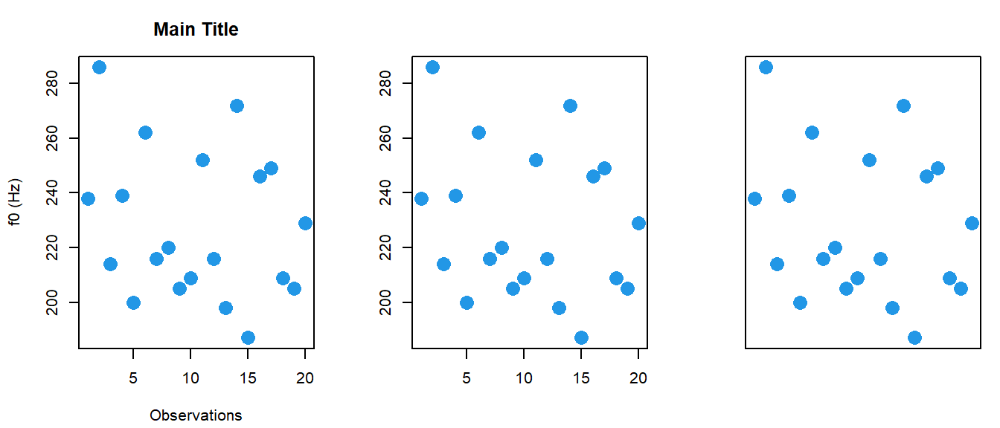
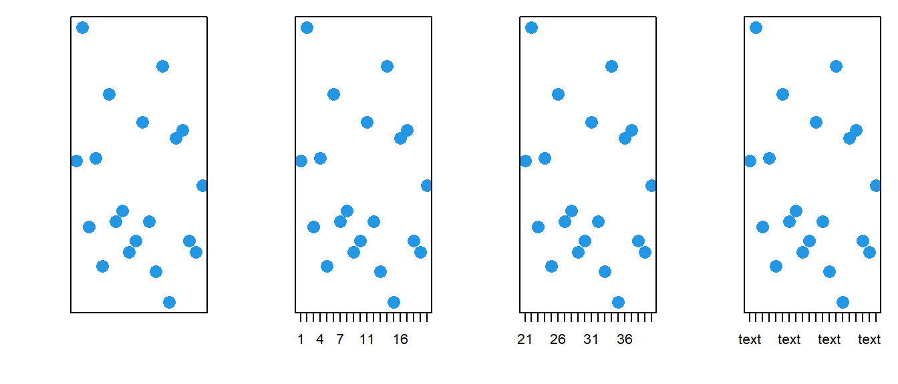
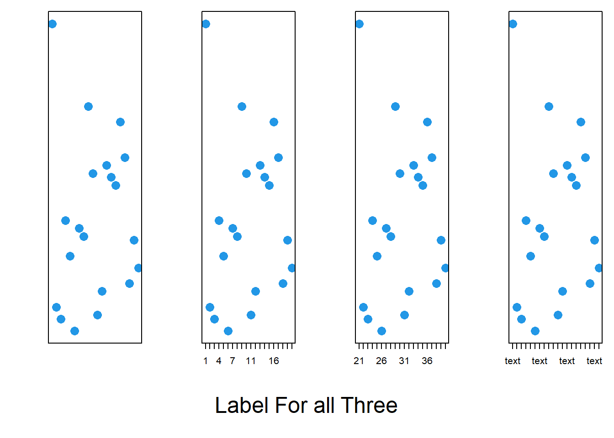
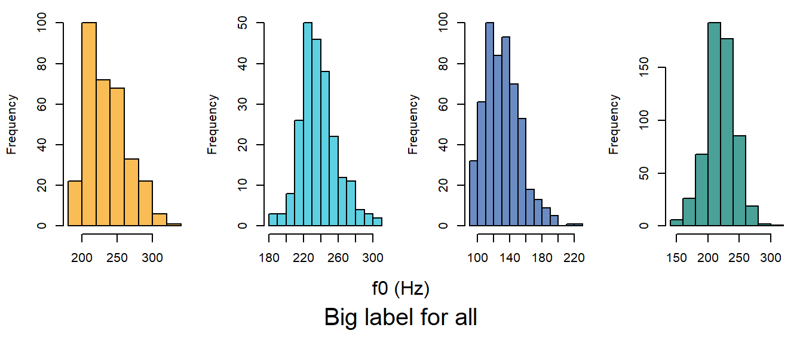

# Appendix{-}

I am going to go over some code for makinf simple plots using base R graphics. 


```r
options (contrasts = c("contr.sum","cont.sum"))
url1 = "https://raw.githubusercontent.com/santiagobarreda"
url2 = "/stats-class/master/data/h95_vowel_data.csv"
h95 = read.csv (url(paste0 (url1, url2)))[,c('f0','speaker','group')]
## set up colors for plotting
devtools::source_url (paste0 (url1, "/stats-class/master/data/colors.R"))
## source functions
devtools::source_url (paste0 (url1, "/stats-class/master/data/functions.R"))
```


`xlim` and `ylim` change the plot ranges. 


```r
f0 = h95$f0
par (mfrow = c(1,2), mar = c(4,4,1,1))
plot (f0)
plot (f0, xlim = c(-100, 1800), ylim = c(50,360))
```



`col` sets colors, `cex` determines point (or text) size, `pch` is a number determining point type, and `lwd` determines line thickness. I use the `mfrow` parameter inside the `par` function to set a grid for drawing. I tell R I want 2 rows and 2 columns.  


```r
f0 = h95$f0[1:20]
par (mfrow = c(2,2), mar = c(4,4,1,1))
plot (f0, ylim=c(80,190),xlim=c(0,21))
plot (f0, pch = 1:20, col = 1:20, ylim=c(80,190),xlim=c(0,21))
plot (f0, pch = 1:20, col = 1:20, cex = 4, ylim=c(80,190),xlim=c(0,21))
plot (f0, pch = 1:20, col = 1:20, cex = 4, lwd = 2, ylim=c(80,190),xlim=c(0,21))
```



Below I use the type parameter to draw points (`p`), lines (`l`), or both (`b`). 


```r
f0 = h95$f0[1:20]
par (mfrow = c(1,3), mar = c(4,4,1,1))
plot (f0, col = 4,cex=2,pch=16, type = 'p')
plot (f0, col = 4,cex=2,pch=16, type = 'b')
plot (f0, col = 4,cex=2,pch=16, type = 'l')
```


Below I use the `lty` parameter to draw the different line types. 


```r
f0 = h95$f0[1:20]
par (mfrow = c(3,2), mar = c(4,4,1,1))
plot (f0, col = 4,cex=2,pch=16, type = 'l')
plot (f0, col = 4,cex=2,pch=16, type = 'l', lwd = 3)
plot (f0, col = 4,cex=2,pch=16, type = 'l', lwd = 2, lty = 1)
plot (f0, col = 4,cex=2,pch=16, type = 'l', lwd = 2, lty = 2)
plot (f0, col = 4,cex=2,pch=16, type = 'l', lwd = 2, lty = 3)
plot (f0, col = 4,cex=2,pch=16, type = 'l', lwd = 2, lty = 4)
```


`mar` sets the interior figure margins around each little plot. The numbers are the amount of space around the bottom, left, top, and right of the plot. 


```r
f0 = h95$f0[1:20]
par (mfrow = c(1,4), mar = c(2,2,1,1))
plot (f0, col = 4,cex=2,pch=16, type = 'l', lwd = 3)
par (mar = c(4,4,1,1))
plot (f0, col = 4,cex=2,pch=16, type = 'l', lwd = 3)
par (mar = c(6,6,1,1))
plot (f0, col = 4,cex=2,pch=16, type = 'l', lwd = 3)
par (mar = c(8,8,1,1))
plot (f0, col = 4,cex=2,pch=16, type = 'l', lwd = 3)
```



`xlab` and `ylab` let you specify axis labels, and `main` let's you specify a main title. Setting xaxt and/or yaxt to 'n' lets you omit automatic axis tick marks. 


```r
f0 = h95$f0[1:20]
par (mfrow = c(1,3), mar = c(4.2,4.2,3,1))
plot (f0, col = 4,cex=2,pch=16, xlab = "Observations", ylab = "f0 (Hz)",
      main = "Main Title")
plot (f0, col = 4,cex=2,pch=16, xlab = "", ylab = "")
plot (f0, col = 4,cex=2,pch=16, xlab = "", ylab = "",xaxt='n',yaxt='n')
```



When you omit tick marks, you can add your own with the axis function. You can make the labels be any number or text you want. 


```r
f0 = h95$f0[1:20]
par (mfrow = c(1,4), mar = c(4.2,4.2,1,1))
plot (f0, col = 4,cex=2,pch=16, xlab = "", ylab = "",xaxt='n',yaxt='n')
plot (f0, col = 4,cex=2,pch=16, xlab = "", ylab = "",xaxt='n',yaxt='n')
axis (side = 1, at = 1:20)
plot (f0, col = 4,cex=2,pch=16, xlab = "", ylab = "",xaxt='n',yaxt='n')
axis (side = 1, at = 1:20, labels = (1:20)+20)
plot (f0, col = 4,cex=2,pch=16, xlab = "", ylab = "",xaxt='n',yaxt='n')
axis (side = 1, at = 1:20, labels = rep('text',20))
```



Most base R graphics functions have the same or similar parameter names and work will with each other. Below I draw four histograms, setting a color for each one. 


```r
f0 = h95$f0[1:20]
par (mfrow = c(1,4), mar = c(4.2,4.2,1,1))
hist (h95[['f0']][h95$group == 'b'], col = yellow)
hist (h95[['f0']][h95$group == 'g'], col = teal)
hist (h95[['f0']][h95$group == 'm'], col = skyblue)
hist (h95[['f0']][h95$group == 'w'], col = deepgreen)
```



This plot can be improved in several ways. Below I make the x-axis and main labels blank. I set outer margins using the `oma` parameter in the `par` function to make extra space along the bottom of the plot. then I use the `mtext` function to add text to the margin of the figure. I use the `outer` parameter to add the text to the 'outer' margin (instead of the last plot), and the `line` parameter to determine how far the text is from the figure. 


```r
f0 = h95$f0[1:20]
par (mfrow = c(1,4), mar = c(4.2,4.2,1,1), oma = c(3,0,0,0))
hist (h95[['f0']][h95$group == 'b'], col = yellow, main="",xlab="")
hist (h95[['f0']][h95$group == 'g'], col = teal, main="",xlab="")
hist (h95[['f0']][h95$group == 'm'], col = skyblue, main="",xlab="")
hist (h95[['f0']][h95$group == 'w'], col = deepgreen, main="",xlab="")

mtext (side = 1, outer = TRUE, "f0 (Hz)", cex = 1, line = -1)
mtext (side = 1, outer = TRUE, "Big label for all", cex = 1.25, line = 1)
```




