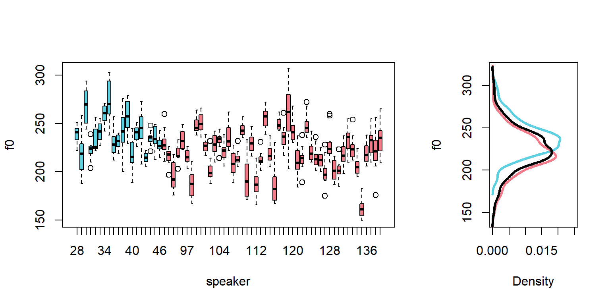
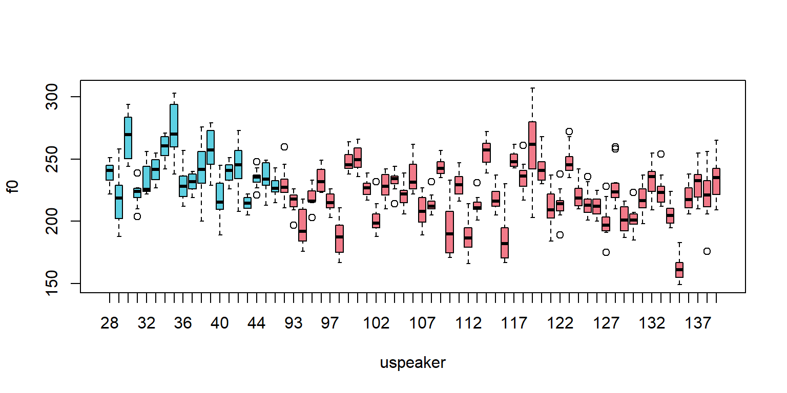
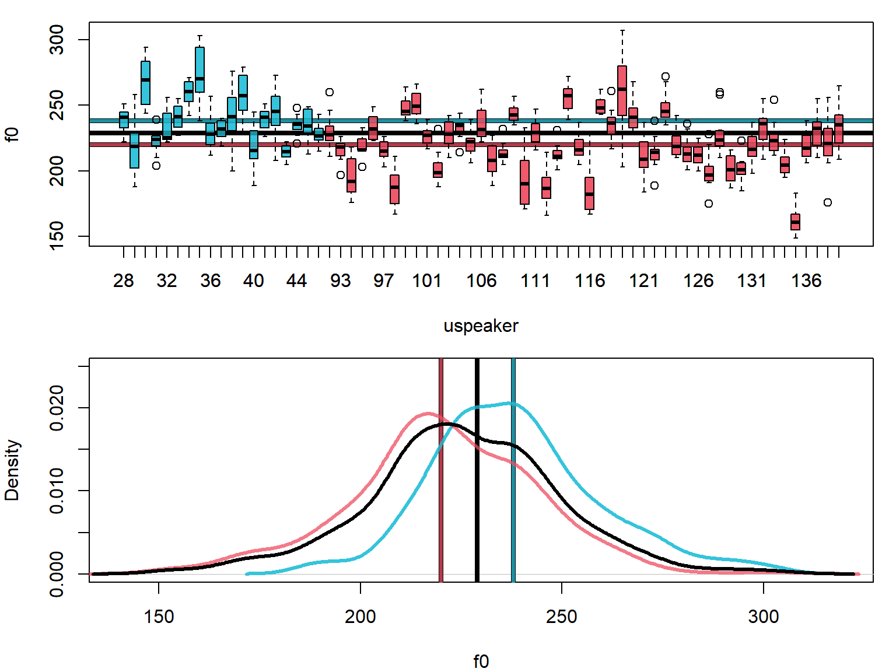

# Comparing two groups of observations

In the previous chapter, I focused on investigating values from a single group, which is the simplest data you can deal with. In this chapter we are going to compare data from two groups to see how similar/different they really are. The models we will discuss are similar to two-sample t-tests (and some ANOVA designs) in the types of research questions they can help investigate. 

## Data and research questions 

We are going to be using the same Hillenbrand et al. f0 data we used in the other chapters, but this time we are going to compare the f0 measurements for adult females to those of girls between 10-12 years of age. 

Below I load in the Hillenbrand et al. data, and include a new variable that indicates whether the talker is an adult or a child. I also split the data up by gender. The variable `speaker` is a speaker number that is unique across all speaker groups, and `group` indicates speaker group from among `b` (boys), `g` (girls), `m` (men), and `w` (women).


```r
url1 = "https://raw.githubusercontent.com/santiagobarreda"
url2 = "/stats-class/master/data/h95_vowel_data.csv"
h95 = read.csv (url(paste0 (url1, url2)))
## make variable that indicates if the talker is an adult
h95$adult = ""
h95$adult[h95$group %in% c('w','m')] = "adult"
h95$adult[h95$group %in% c('g','b')] = "child"

## split up data by into male and female groups, only some columns
males = h95[h95$group %in% c('m','b'),c('f0', 'adult', 'group', 'speaker')]
females = h95[h95$group %in% c('w','g'),c('f0', 'adult', 'group', 'speaker')]
f0 = females[['f0']]

# re-factor to remove excluded subjects
males$speaker = factor (males$speaker)  
# re-factor to remove excluded subjects
females$speaker = factor (females$speaker)  
```


One of the simplest questions a researcher can ask (from a modeling perspective) is: Are two groups of observations different or are they the same? For example in phonetics, researchers ask questions like, have these vowels merged in this dialect (are these two things different)?  Does visual information speed up speech perception or not (are two sets of reaction times the same)?

A good way to isolate a single difference is to create groups that differ primarily according to the characteristic you are interested in testing, but are otherwise the same 'on average'. For the reaction-time example above, I might present the same listeners with very similar words in the same conditions, but half with and half without visual information. The difference in reaction times between the groups should reflect the advantage provided by visual information. The question would then be, are reaction times with visual information *the same thing* as reaction times without visual information? Are these two sets of observations samples from the same population? Or is the set of observations "reaction times for speech recognized *with* visual information" a different set of things than "reaction times for speech recognized *without* visual information"?

In our data we have male and female talkers of the same dialect, who differ primarily in terms of age. Basically, these groups differ mostly in terms of 'adultness', and so we can use the characteristics of these groups to investigate the effect of 'adultness' on average f0. Below I present boxplots of the effect of adultness on f0, first overall and then divided by speaker gender. 


```r
par (mfrow = c(1,3))
boxplot (f0 ~ adult, data = h95, main = "Overall", ylim = c(90,330), 
         col = c(teal, yellow))
boxplot (f0 ~ adult, data = females, main = "Females", ylim = c(90,330), 
         col = c(deepgreen,skyblue))
boxplot (f0 ~ adult, data = males, main = "Males", ylim = c(90,330), 
         col = c(maroon,lightpink))
```


Clearly there is a difference in f0 between children and adults, but the difference also seems to be gender-dependent: there is more of a difference between men and boys than between women and girls. We are going to focus on the female data for now, and I leave the male data so that the reader can modify the analysis presented here to analyze that data. 

Below, the figure on the left highlights both between- and within-speaker variation in f0 by women (cyan) and girls (red). On the right, we see the overall distributions of f0 for women (cyan) and girls (red). Obviously the distributions seem a *bit* different, but they are also not *that* different. We can also clearly see that there is substantial overlap between individual girls and women (in the figure on the left). As a result, a cautious analysis of this data would recognize this overlap even if somehow 'differentess' were found. We are going to fit a model that can help us quantify all of the variability shown in the figures below. 


```r
colors = 
  c(coral,teal)[ apply (table(females$speaker, females$adult),1,which.max) ]

par (mfrow = c(1,2)); layout (mat = t(c(1,2)), widths = c(.7,.3))
boxplot (f0 ~ speaker, data=females, col = colors)

## I rotate the density figures so that you can see how these correspond to
## the boxplots on the left. 
tmp = density (females$f0[females$adult=="child"])
plot (tmp$y, tmp$x, lwd = 3, col = teal, ylab = "f0",xlab="Density", 
      ylim = c(140,320), xlim = c(0,0.025), type = 'l')
tmp = density (females$f0[females$adult=="adult"])
lines (tmp$y, tmp$x, lwd = 3, col = coral)
```



## Estimating the difference two means with 'brms'

In chapter 2 the model we fit had the simplest possible formula, just an intercept. Here, we need to extend this to include an actual predictor: a vector indicating 'adultness'. Remember that formulas look like this `variable ~ predictor`. So, if we want to predict f0 based on whether the talker is an adult or not, our model is going to have a formula that looks basically like this `f0 ~ adult + (1|speaker)`. You can think of this meaning something like 'We expect the distribution to vary based on whether the talker is an adult or not, in addition to speaker-specific adjustments to the intercept'. 

Note that the model calculates an intercept (mean value) for each speaker, but does **not** include an effect for `adult` for each speaker (i.e., the model does *not* include a term like `(adult|speaker)`). This is because we are estimating a mean for each speaker, but not the effect for 'adultness' for each speaker. Each speaker is only either an adult or a child, and so we cannot estimate the effect for 'adultness' for each speaker. Doing things that don't 'make sense' from the model's perspective will cause it to crash or return strange values. 

I'm not going to go into so much detail about the structure of the regression model right now because an explanation involves some of the less intuitive concepts relating to regression. We are going to to fit the model first and discuss its structure, and then get to the details of the model later.

### Fitting the model

First we find the mean and the standard deviation of our data to use in the priors. As before, I intend to use the data mean for the intercept, and use a standard deviation twice as wide as the data standard deviation. 


```r
## establish data statistics for priors
mean (f0)
```

```
## [1] 225.4913
```

```r
sd (f0)
```

```
## [1] 23.98959
```

We load the `brms` package and fit the model. Notice that I now include a prior for `class = "b"`, which is the class for all predictors that are not the intercept. Our model now includes a non-intercept term, and so I need to include this prior:


```r
library (brms)
```

```r
set.seed (1)
model =  
  brms::brm (f0 ~ adult + (1|speaker), data = females, chains = 4, cores = 4,
       warmup = 1000, iter = 11000, thin = 10,
       prior = c(set_prior("student_t(3, 225.5, 48)", class = "Intercept"),
                 set_prior("student_t(3, 0, 48)", class = "b"),
                 set_prior("student_t(3, 0, 48)", class = "sd")))
```

```r
## load and inspect pre-fit model
model = readRDS ('3_model.RDS')
model
```

```
##  Family: gaussian 
##   Links: mu = identity; sigma = identity 
## Formula: f0 ~ adult + (1 | uspeaker) 
##    Data: females (Number of observations: 804) 
## Samples: 4 chains, each with iter = 11000; warmup = 1000; thin = 10;
##          total post-warmup samples = 4000
## 
## Group-Level Effects: 
## ~uspeaker (Number of levels: 67) 
##               Estimate Est.Error l-95% CI u-95% CI Rhat Bulk_ESS Tail_ESS
## sd(Intercept)    19.10      1.77    16.00    22.88 1.00     2781     3089
## 
## Population-Level Effects: 
##            Estimate Est.Error l-95% CI u-95% CI Rhat Bulk_ESS Tail_ESS
## Intercept    220.47      2.80   215.10   226.16 1.00     1827     2813
## adultchild    17.63      5.22     7.34    27.88 1.00     1987     2068
## 
## Family Specific Parameters: 
##       Estimate Est.Error l-95% CI u-95% CI Rhat Bulk_ESS Tail_ESS
## sigma    12.93      0.34    12.28    13.59 1.00     3537     3773
## 
## Samples were drawn using sampling(NUTS). For each parameter, Bulk_ESS
## and Tail_ESS are effective sample size measures, and Rhat is the potential
## scale reduction factor on split chains (at convergence, Rhat = 1).
```

The output is mostly familiar, but there is a new predictor in the section on `Population-Level Effects`:

``` 
           Estimate Est.Error l-95% CI u-95% CI Rhat Bulk_ESS Tail_ESS
Intercept    220.47      2.80   215.10   226.16 1.00     1827     2813
adultchild    17.63      5.22     7.34    27.88 1.00     1987     2068
```

In addition to the 'Intercept' term, we now get estimates for a term called `adultchild`. Admittedly, this is a strange name, but its how R handles predictors that are words (called 'factors' in R). In general, r names predictors like these `factornameFactorlevel`. For example, a factor called `colors` with levels `red`, `green` and `blue` might have a level represented like `colorsred`. So, the `adultchild` name tells us is that this is the estimate for the `child` level of the `adult` factor. 

A couple of questions arise. First, the 'Intercept' term in the model above seems to correspond to the mean f0 for adult females. We can confirm this: 


```r
## calculate means of f0 based on values of adult vector
tapply (females$f0, females$adult, mean)
```

```
##    adult    child 
## 220.4010 238.3509
```

However, the estimate for children is 17.6 Hz, which is odd. This is obviously not the mean f0 for the girls in our sample. Why not? To understand model coefficients we are going to have to talk about contrasts

## Contrasts

Contrasts are the numerical implementation of factors in your model. Factors are variables like adult vs. child that are not inherently numerical. You may initially think that we can separately estimate the women's average, the girl's average, and the overall mean. However, our models can't actually do this. The general problem is this: if you have two groups you can't independently calculate:

1) group 1 mean.
2) group 2 mean.
3) the overall mean.

Why not? Because once you know 2 of those things you know the 3rd. For example, if the group 1 mean is 5 and the overall mean is 6, obviously the group 2 mean **must** be 7. Why does this matter? Because when things are entirely predictable based on each other, they are not actually separate things, even though they may seem that way to us. When things are entirely predictable in this way we say they are linearly dependent, and regression models don't like this. Here's three perspectives on why this is a problem:

  1) Imagine you were trying to predict a person's weight from their height. You want to include height in centimeters *and* height in meters in your model, and you want to independently estimate effects for both predictors. Since height in centimeters = height in meters / 100, that is obviously not going to be possible. The effect of one must be 100 times the effect of the other! Even though it may be less transparent, this is the same reason why we can't estimate all the group means *and* the overall mean. 

  2) With two groups, or any two points in a space, you can estimate one distance, not two. If each group could really be a different distance from the mean, you would need to estimate *two* distances. Instead, we are really only in a position to estimate *one* difference, that between our two group averages. 

  3) When we had one group we obviously couldn't get the overall mean independently from the sample mean. All we had was the sample mean, and that was our best estimate of the population mean too. Adding 1 more group allows us to calculate 1 more mean. Why would it let us calculate 2 more means? That would mean adding a second group (with 1 mean) somehow contributed twice as much information as the first group did. Instead, adding a second mean changes our best guess for the population mean: it is now between the two groups. However, this information is in no way independent from the two group means in our design. 

### Treatment coding

The coding scheme you use determines how your model represents the differences it encodes. In the model above we used 'treatment' coding (the default in R). In treatment coding, a 'reference' level is chosen to be the intercept, and all group effects reflect the difference between the group mean and the mean for the reference level. 

By default, R chooses the alphabetically-lowest level to be the reference level. That is why the Intercept in our model is equal to the mean of the 'adult' group, the average for adult females. The effect for 'child' (`adultchild`) represents the difference between the child mean and the adult mean. This means that our credible intervals also represent the *difference* in the means and not the means themselves. So, we expect the *difference* between girls and women in this sample to be about 17 Hz, and we think there is a 95% chance that the *difference* between the means is between 7.3 and 27.9 Hz in magnitude.

We can see how the effects estimates in our model resemble the means, or differences between means, in our sample.


```r
# calculate group means
tapply (females$f0, females$adult, mean)
```

```
##    adult    child 
## 220.4010 238.3509
```

```r
# find the difference between them
diff (tapply (females$f0, females$adult, mean))
```

```
##    child 
## 17.94984
```

To interpret treatment coded coefficients remember:

* The reference category mean is the 'Intercept' in the model. 

* The value of the coefficients of any other group mean will be equal to `group mean - reference group mean`.

* To recover the mean estimate for any other group, we add `group mean + reference group mean`.

### Sum coding

There are multiple options for coding schemes, and the best one for you depends on what you want to get out of the model. The only other alternative to treatment coding that we will talk about is what is called 'sum coding'. It is a very useful coding scheme for many of the designs most commonly-used by linguists, and it is the coding shceme we will be using going forward.   

In sum coding, there is no reference level. Instead, the model Intercept represents the overall mean of all your groups, and group differences are represented with respect to the mean of your data. Just like for treatment coding, you can't estimate all of your group means. For treatment coding, R selects the *alphabetically last* level of your factor, and does not estimate it. Under sum coding, the missing factor level will always be equal to the **negative sum** of the other factors. This means you add up the values of the levels that *are* present, and flip the sign. The outcome is the value of your missing level.  

As discussed earlier, with only two groups if you know the overall mean and the distance of one group to the mean, you also know the distance of the other group to the mean. This can be seen quite clearly below where the difference of each group to the overall mean is exactly -8.97. So, if our model tells us that the mean is 229.4 and the adult group is -8.97 Hz below this, then the child group must be the negative sum of the other coefficients. In this case there is only one so we just flip the sign on it (i.e., - (-8.97)). 


```r
# calculate group means
means = tapply (females$f0, females$adult, mean)
mean (means)
```

```
## [1] 229.376
```

```r
# find the distances to the overall mean
means - mean (means)
```

```
##     adult     child 
## -8.974918  8.974918
```

To interpret treatment coded coefficients remember:

* The overall mean of all your groups is the 'Intercept' in the model. 

* The value of the coefficients of any other group mean will be equal to `group mean - overall mean`.

* To recover the mean estimate for any other group, we add `group mean + overall mean`.

### Comparison of sum and treatment coding

The image below shows a comparison of the way the two coding schemes treat our data. In each case they estimate 1 intercept and one effect, letting you recreate 1 other mean (i.e., they each omit one parameter). In treatment coding this is the overall mean, which in the 2-group case will always be `Intercept + Effect/2`. In the case of sum coding this is the effect for the second group, which will always be the same magnitude but have the opposite sign as the effect for the first group. 


## Refitting the model with sum coding

We are going to re-fit the model we fit above using sum coding, and see how the coefficients change.

### Fitting the model

To fit a model with sum coding, we change the global contrast options in R. These options will be in effect until we restart R or change the contrasts to something else. 


```r
## to change to sum coding
options (contrasts = c('contr.sum','contr.sum'))
## to change back to treatment coding
#options (contrasts = c('contr.treatment','contr.treatment'))
```

We can fit the model with sum coding using the exact same code since the options have changed. Please keep in mind you will need to set this every time you start R, as it will reset to treatment coding each time it restarts.


```r
set.seed (1)
model_sum_coding =  
  brms::brm (f0 ~ adult + (1|speaker), data = females, chains = 4, cores = 4,
       warmup = 1000, iter = 11000, thin = 10,
       prior = c(set_prior("student_t(3, 225.5, 48)", class = "Intercept"),
                 set_prior("student_t(3, 0, 48)", class = "b"),
                 set_prior("student_t(3, 0, 48)", class = "sd")))
```

```r
## load and inspect pre-fit model
model_sum_coding = readRDS ('3_model_sum_coding.RDS')
model_sum_coding
```

```
##  Family: gaussian 
##   Links: mu = identity; sigma = identity 
## Formula: f0 ~ adult + (1 | uspeaker) 
##    Data: females (Number of observations: 804) 
## Samples: 4 chains, each with iter = 11000; warmup = 1000; thin = 10;
##          total post-warmup samples = 4000
## 
## Group-Level Effects: 
## ~uspeaker (Number of levels: 67) 
##               Estimate Est.Error l-95% CI u-95% CI Rhat Bulk_ESS Tail_ESS
## sd(Intercept)    19.13      1.80    16.01    22.96 1.00     2892     3144
## 
## Population-Level Effects: 
##           Estimate Est.Error l-95% CI u-95% CI Rhat Bulk_ESS Tail_ESS
## Intercept   229.33      2.71   224.07   234.81 1.00     2169     2758
## adult1       -8.89      2.65   -14.19    -3.55 1.00     2085     2825
## 
## Family Specific Parameters: 
##       Estimate Est.Error l-95% CI u-95% CI Rhat Bulk_ESS Tail_ESS
## sigma    12.95      0.34    12.30    13.62 1.00     3922     3710
## 
## Samples were drawn using sampling(NUTS). For each parameter, Bulk_ESS
## and Tail_ESS are effective sample size measures, and Rhat is the potential
## scale reduction factor on split chains (at convergence, Rhat = 1).
```

A comparison of these results to that of our first model shows that the main difference is that, as expected, the Intercept now reflects the overall mean and the single parameter reflects the distance of the adult mean to the overall mean. 

Note that the parameter is now called `adult1`. This is just how `brm` handles factors. Predictors representing factors will be named `factornameN`, where `factorname` is the predictor name and `N` is the level number. Levels are ordered alphabetically starting at one, and the alphabetically-last level will not be estimated. 


```r
sort ( unique (females$adult))
```

```
## [1] "adult" "child"
```

So, `adult1` in our model corresponds to the "adult" level of our predictor, and `adult2` *would* be "child", but it is not separately estimated by our model (since `adult2 = -adult12`).

### The model

Regression models try to break up values into their components. This is why effects are expressed in terms of differences to some reference value. For example, if we say that that a person's average f0 is usually 220 Hz and under some condition their average f0 is also 220 Hz, then we could say that this condition has no *effect* on their f0. To say that this condition has no effect on mean f0 is to say that it causes no difference in mean f0. 

On the other hand something that *does* cause a difference in mean f0 *does* have an effect on mean f0. We can express the effect of something in terms of the difference it causes, for example, saying that under so and so conditions a person will tend to raise their f0 by 20 Hz, relative to some reference value (the intercept). 

More generally, we can think of any variable as the sum of a bunch of independent *effects*. This is just a way to think about variables, to break up observed values into their component parts. It should not be confused with the *reality* of these values and the processes that underlie them (whatever that is!). 

So far we have covered the fact that after picking a value to use as a reference point (the model intercept), our models:
  
  * represent group means as deviations from the intercept.
  
  * represent the speaker-specific deviations from the intercept ($\gamma_{speaker}$) as being centered at 0, with a standard deviation of $\sigma_{speaker}$.
  
  * represent the random error ($\varepsilon$) as having a mean of 0 and a standard deviation of $\sigma_{error}$. 
  
In each case, these reflect *deviations* from some reference point. As a result, when the parameters associated with different effects equal 0, this means that no effect is present.

  * when group coefficients are 0 the group lies exactly at the intercept. In sum coding this is the overall mean.  
  
  * when a speaker-effect is 0 this speaker is exactly average with respect to their group. 
  
  * when an error is 0 this production is exactly as expected for a given speaker. 
  
Based on thinking of our predictors as representing deviations from some reference value, We can 'break up' any observed value into its component parts. For example, suppose that the the overall mean is 229 Hz, the adult female mean is 220 Hz, and that a particuar speaker has a mean f0 of 240 Hz. If we observe a value of 256 Hz for this speaker, that suggests the following decomposition:

256 = 229 (Intercept) - 9 (adult female mean) + 20 (speaker effect) + 16 (error)

This reflects the following considerations:

  * the average f0 across the groups is 229 Hz.
  * the average for adult females is 9 Hz below the overall mean.
  * this speaker's average f0 is 20 Hz above the average for adult females.
  * this particular production is 16 Hz higher than expected for this particular speaker. 

Another observation from this talker might be: 

237 = 229 (Intercept) - 9 (adult female mean) + 20 (speaker effect) - 3 (error)

In this case, the error is -3 since the production is now 3 Hz *below* the speaker average. Regressions models basically carry out these decompositions for us, and present information regarding these decompositions in the model summaries. 

The full model specification, including prior probabilities is below. I used the same ordering format for the t-distributions that `brm` uses (nu, mean, sd). 


\begin{equation}
\begin{split}
\textrm{Likelihood:} \\
y_{[i]} \sim \mathcal{N}(\mu_{[i]},\sigma_{error}) \\
\mu_{[i]} = Intercept + adult1 + \alpha_{speaker_{[i]}} \\\\

\textrm{Priors:} \\
\alpha_{speaker} \sim \mathcal{N}(0,\sigma_{speaker}) \\ \\ 

Intercept \sim \mathcal{t}(3, 225.5, 48) \\ 
adult1 \sim \mathcal{t}(3, 225.5, 48) \\ 

\sigma_{error} \sim \mathcal{t}(3, 0, 48) \\
\sigma_{speaker} \sim \mathcal{t}(3, 0, 48) \\ 
\end{split}
\end{equation}

The top chunk is labeled 'likelihood' because this chunk specifies the relationships between our parameters and our data. As a result, the relationships specified in this section determine the likelihood of the model parameters. For example, in the first line we say that our data is normally distributed around some mean parameter. In turn, this specifies the shape of the likelihood function for that parameter given the data (as discussed in Figure \@ref(fig:likelihood1)). What I mean by this is that the shape of the likelihood functions for different model coefficients will be based on the relationships laid out in the section of the model description labeled 'likelihood'. 


### Interpreting the two-group model

The `brms` package has several functions that make getting information from these models simple. The `fixef` function gets you means and 95% credible intervals for all your 'population level' parameters (sometimes called 'fixed' effects).


```r
brms::fixef (model_sum_coding)
```

```
##             Estimate Est.Error      Q2.5      Q97.5
## Intercept 229.327715  2.711261 224.07166 234.810010
## adult1     -8.888301  2.651641 -14.18979  -3.550734
```

To recover the group means for women and girls, we need to combine the Intercept and the group parameters. We're not actually allowed to just add the values you see above (for good, but technical reasons). 

What you actually need to do is add *the individual samples for parameters*, and then inspect the output. You can see the individual samples by calling the `fixef` function and setting `summary` to `FALSE`. Below I plot the individual samples and histograms for the `Intercept` (the overall mean), the `adult1` (the effect for adults) parameter, and the negative of the `adult` parameter (the effect for girls). I also present the combination of `Intercept+adult1`, which yields an estimate of the adult female mean.


```r
samples = brms::fixef (model_sum_coding, summary = FALSE)
head(samples, 10)
```

```
##           parameters
## iterations Intercept     adult1
##       [1,]  226.1704  -8.121943
##       [2,]  234.4365 -10.380060
##       [3,]  228.6168  -7.901476
##       [4,]  226.2287  -8.130842
##       [5,]  225.0607 -10.228533
##       [6,]  227.6880  -6.691685
##       [7,]  227.8307  -8.078614
##       [8,]  230.0513 -10.569158
##       [9,]  228.3428  -8.612124
##      [10,]  228.9045  -5.617644
```

```r
par (mfrow = c(2,4), mar = c(4,4,3,1))
hist (samples[,'Intercept'],freq=FALSE, col = skyblue,main='Intercept')  
hist (samples[,'adult1'], freq=FALSE, col = deeppurple,main='adult1')
hist (-samples[,'adult1'], freq=FALSE, col = teal,main='-adult1')
hist (samples[,'Intercept']+samples[,'adult1'], freq=FALSE, 
      col = yellow,main='Intercept+adult1')
plot (samples[,'Intercept'], col = skyblue,pch=16)  
plot (samples[,'adult1'], col = deeppurple, pch=16)  
plot (-samples[,'adult1'], col = teal, pch=16)  
plot (samples[,'Intercept']+samples[,'adult1'], col = yellow,pch=16)  
```


We can then summarize the sum of the parameters using the `posterior_summary` function, resulting in a mean, standard deviation, and credible interval for the new parameter:


```r
## calculate child mean
adult_mean = samples[,'Intercept'] + samples[,'adult1']
## report mean and spread of samples
brms::posterior_summary (adult_mean)
```

```
##      Estimate Est.Error     Q2.5    Q97.5
## [1,] 220.4394  2.871496 214.8694 226.2171
```

Luckily, there is a function in `brms` called `hypothesis` that helps us add terms very easily, without having to do any of the above steps. You can ask the `hypothesis` function to add terms in your model (spelled just as they are in the print statement), and to compare the result to some number. If you compare the result to 0, it just tells you about the result of the terms you added. 


```r
brms::hypothesis(model_sum_coding, "Intercept + adult1 = 0")
```

```
## Hypothesis Tests for class b:
##               Hypothesis Estimate Est.Error CI.Lower CI.Upper Evid.Ratio
## 1 (Intercept+adult1) = 0   220.44      2.87   214.87   226.22         NA
##   Post.Prob Star
## 1        NA    *
## ---
## 'CI': 90%-CI for one-sided and 95%-CI for two-sided hypotheses.
## '*': For one-sided hypotheses, the posterior probability exceeds 95%;
## for two-sided hypotheses, the value tested against lies outside the 95%-CI.
## Posterior probabilities of point hypotheses assume equal prior probabilities.
```

The output above tells us what our estimate is for `Intercept + adult1`, which we know to be the expected mean f0 for adult females. Whereas the credible interval for the original effect reflected uncertainty in difference between means, the credible interval provided is now for the actual girl's mean, not for the difference between the means.

We can use the hypothesis function to confirm similar results for the model fit using treatment coding. In that model, the reference category was the adult mean. So, if we call the `hypothesis` function on the intercept of the treatment-coding model, we can see that it will present similar values to those seen above.


```r
brms::hypothesis(model, "Intercept = 0")
```

```
## Hypothesis Tests for class b:
##        Hypothesis Estimate Est.Error CI.Lower CI.Upper Evid.Ratio Post.Prob
## 1 (Intercept) = 0   220.47       2.8    215.1   226.16         NA        NA
##   Star
## 1    *
## ---
## 'CI': 90%-CI for one-sided and 95%-CI for two-sided hypotheses.
## '*': For one-sided hypotheses, the posterior probability exceeds 95%;
## for two-sided hypotheses, the value tested against lies outside the 95%-CI.
## Posterior probabilities of point hypotheses assume equal prior probabilities.
```

We can check several parameter combinations simultaneously. Below I recreate all our mean estimates of interest, first for the sum coding model, and then for the treatment coding model. Notice that these models contain the same information, just represented in different ways.  


```r
brms::hypothesis(model_sum_coding, 
                 c("Intercept = 0",   # overall mean
                   "Intercept + adult1 = 0",  # adult mean
                   "Intercept - adult1 = 0")) # child mean
```

```
## Hypothesis Tests for class b:
##               Hypothesis Estimate Est.Error CI.Lower CI.Upper Evid.Ratio
## 1        (Intercept) = 0   229.33      2.71   224.07   234.81         NA
## 2 (Intercept+adult1) = 0   220.44      2.87   214.87   226.22         NA
## 3 (Intercept-adult1) = 0   238.22      4.53   229.34   247.13         NA
##   Post.Prob Star
## 1        NA    *
## 2        NA    *
## 3        NA    *
## ---
## 'CI': 90%-CI for one-sided and 95%-CI for two-sided hypotheses.
## '*': For one-sided hypotheses, the posterior probability exceeds 95%;
## for two-sided hypotheses, the value tested against lies outside the 95%-CI.
## Posterior probabilities of point hypotheses assume equal prior probabilities.
```

```r
brms::hypothesis(model, 
                 c("Intercept + adultchild/2 = 0",   # overall mean
                   "Intercept = 0",  # adult mean
                   "Intercept + adultchild = 0")) # child mean
```

```
## Hypothesis Tests for class b:
##                 Hypothesis Estimate Est.Error CI.Lower CI.Upper Evid.Ratio
## 1 (Intercept+adultc... = 0   229.28      2.69   224.19   234.74         NA
## 2          (Intercept) = 0   220.47      2.80   215.10   226.16         NA
## 3 (Intercept+adultc... = 0   238.10      4.51   229.41   247.26         NA
##   Post.Prob Star
## 1        NA    *
## 2        NA    *
## 3        NA    *
## ---
## 'CI': 90%-CI for one-sided and 95%-CI for two-sided hypotheses.
## '*': For one-sided hypotheses, the posterior probability exceeds 95%;
## for two-sided hypotheses, the value tested against lies outside the 95%-CI.
## Posterior probabilities of point hypotheses assume equal prior probabilities.
```

If I were writing this is in a paper, at this point I could present this information in a paragraph. Based on the sum coded model, I would say something like:

"The overall mean f0 across all speakers was 229 Hz (sd = 2.7, 95% CI = 224, 234). Adult female mean f0 was 220 Hz (sd = 2.9, 95% CI = [215, 226]), while the mean f0 for girls was 228 Hz (sd = 4.28, 95% CI = [230, 246]). The difference between the group means was 18 Hz on average (sd = 5.3, 95% CI = [7,  28]), suggesting a small but noisy difference between groups, on average." 

## 'Random' Effects

Below I present the speaker boxplot, with different colors for each group. So far we have discussed the speaker-dependent deviations from averages, but we haven't actually done anything with them. One of the nice things about multilevel models is that we can actually estimate these parameters, and use them to answer our research questions. 



Multilevel models are sometimes also called 'random effects' or 'mixed effects' models. What is 'mixed' about them? Researchers often talk about whether effects are 'fixed' or 'random'. The general idea is that 'fixed' effects are specifically chosen from a small set of possibilities, and we are not necessarily interested in the 'other' levels. 

For example, in this experiment we include children 10-12 and adults. Speaker age-groups don't really come from an infinite set of independent age-groups, not ones that will meaningfully affect our research questions anyways. Instead, categories like 'adult' and 'child' are chosen from a finite set of meaningful categories, and we are *specifically* interested in the categories we've chosen. In this case, I really do care about mean f0 for adults and not some other category I didn't sample.

In contrast, 'random' effects are not chosen arbitrarily but at random. The speakers in our sample *do* form part of a practically infinite sample. I am actually *not* interested in the speakers I have but in what this says about the categories I did not include. In fact, most researchers would gladly trade perfect knowledge about any one speaker for even a small amount knowledge about a large set of speakers from the population. 

Despite this primarily philosophical definition, in practice the terms 'fixed' and 'random' effects have [several inconsistent and sometimes contradictory definitions](https://statmodeling.stat.columbia.edu/2005/01/25/why_i_dont_use/). 

Luckily, when thinking about these concepts in terms of multilevel models we can be very specific: 'random' effects are those for which we estimate a standard deviation term. So, we treat differences in speaker average f0 ($\gamma_{speaker}$) as a variable, and estimate $\sigma_{speaker}$ for the distribution of variable. 

### Random effects, priors and pooling

Look at the list of priors in our latest model definition. If you look at our latest `brm` model fit, you will see where most of these are specifically defined in the function call. However, you will notice that the standard deviation of the prior ($\sigma_{speakers}$) for the speaker-specific intercept deviations ($\alpha_{speaker}$) is actually not specifically defined in the model. 

\begin{equation}
\begin{split}

\textrm{Priors:} \\
\alpha_{speaker} \sim \mathcal{N}(0,\sigma_{speaker}) \\ \\ 

Intercept \sim \mathcal{t}(3, 225.5, 48) \\ 
adult1 \sim \mathcal{t}(3, 225.5, 48) \\ 
\sigma_{error} \sim \mathcal{t}(3, 0, 48) \\
\sigma_{speaker} \sim \mathcal{t}(3, 0, 48) \\ 

\end{split}
\end{equation}

It turns out that the $\sigma_{speaker}$ parameter is estimated from the data! For this reason, the prior you set on $\sigma_{speaker}$ is sometimes called a 'hyperprior', because it is the prior for your prior! 

By definition, the speaker effects are centered around 0 (the average). The only question is, how widely are they distributed? Well, what better way to answer this question than using the distribution evident in the data itself? This means that the amount of variation you expect between speakers is based on the amount of between-speaker variation you observe. The idea is basically: is it believable that this one person be this far away from the 'average'? Well, it depends on what everyone else looks like!

By estimating the prior for some parameters from the data itself, multilevel models can help [protect against problems that naturally arise when researchers compare many things](http://www.stat.columbia.edu/~gelman/research/published/multiple2f.pdf). This is because in a Bayesian analysis, the prior influences the estimates of your individual parameters. As a result, the variation in the *other* parameters in your sample can influence any given parameter.

This process is sometimes referred to as 'partial pooling', since it refers to the partial pooling of information across subjects. Using partial pooling means the subject estimates are neither completely independent nor totally merged. They actually end up influencing each other in a logical manner. Broadly speaking, individual observations that deviate from 'typical' values of the population are maintained when there is good enough evidence for them. When there is wak evidence for them relative to the other observations in the sample, estimates may be brought closer to the group averages. As a result, partial pooling results in what is sometimes called 'shrinkage', because extreme values get 'shrunk' towards the overall mean. 

In the context of a Bayesian multilevel model 'random effects' are those you estimate with partial pooling, where the prior is estimated from the data (e.g., $\sigma_{speaker}$). In contrast, 'fixed effects' are those predictors for which you set arbitrary priors before fitting the model.

Although the terms terms 'fixed' and 'random' effects are useful (and I continue to use them to describe my models), it is important to keep in mind that the philosophical distinction between 'fixed' and 'random' variables is not relevant for the models we are discussing here. The real distinction is: do I want to fit every level totally independently as if there were all unrelated? Or do I want to use partial pooling in my estimates, thereby using all of the information present in my sample to protect against spurious findings? 

In general, when you have many levels of a factor, it may be a good idea to include these as 'random' effects. There is not much downside to it, you get more information from the model (e.g., information about $\sigma_{predictor}$), and you can always fit multiple models to see what, if any differences, result form the different approaches. 

Some useful things to consider are also: Do you believe that treating a predictor as a 'random' effect offers a modeling advantage? Does it better reflect the process/relationships you are trying to understand? Does it provide you with information you find useful? Is it realistic to fit this kind of model given the amount of data you have, and the nature of the relationships in the data? Right now the last point is not something we have talked about very much, but it is something we will need to worry about more as our models become more complicated. 

### Inspecting the random effects

The `brms` package has several functions to help understand our 'random' effects. There is a function called `ranef` which returns random effects estimates in the same way that `fixef` provides fixed effects estimates. The leftmost column of the output below represents the estimated effects associated with each speaker average value. 


```r
## I am telling it to give me the 'speaker' Intercepts, but only the first 
## 10 rows. This is just so it doesn't take up the whole page.
brms::ranef (model_sum_coding)$speaker[1:10,,"Intercept"]
```

```
## NULL
```

Notice that the speaker averages vary around 0, and some are even negative. That is because the speaker effects (and all random effects) are coded using sum-coding. So, what the speaker-specific mean terms tell us is: what is the average value for this speaker, relative to the overall average, and the group specific adjustment? Keep in mind, since our model encodes both the overall average *and* the group means, the speaker-effects encode differences to the group means and not to the overall means. 

For example, we see that the mean for the second speaker above is -19.8 Hz. This means that they have a lower f0 than 'expected', and their mean f0 is 19.8 Hz lower than their group mean f0. In contrast, the first speaker has a speaker mean effect that is nearly zero (1.1). That tells you that this speaker's mean f0 was nearly the same as that of the average for their group 

We can use a simple plotting function I wrote to look at the distribution of speaker effects terms. The function takes in the summaries made by brms and plots a point for each parameter mean, and lines indicating the credible intervals calculated by `brm` (usually 95% credible intervals).


```r
par (mfrow = c(1,1), mar = c(4,4,1,1))
brmplot( brms::ranef (model_sum_coding)[["uspeaker"]][,,"Intercept"], col = colors)
abline (h=0)
```


We can compare the estimates of by-speaker intercepts to the distribution of actual data arranged by subject. There is clearly a close correspondence! 


```r
## plot comparison of estimates of speaker means to actual data
par (mfrow = c(1,2), mar = c(4,4,1,1))
brmplot( brms::ranef (model_sum_coding)[["uspeaker"]][,,"Intercept"], 
         col = colors)
boxplot (f0 ~ speaker, data=females, col = colors, ylim = c(150,310))
```


## But what does it all mean?

Ok, so are the f0s produced by women and girls different? Consider the distribution of productions between and within speakers and groups, as shown in the figure below (lines represent the group means). An unbiased look at our results (and figures) so far suggests that: 




* the magnitude of between speaker variation is **larger** than the difference between girls and women (19 Hz vs 18/17 Hz). This means that random people drawn from the two groups largely overlap. 

* the magnitude of within-speaker variation (12 Hz) is almost as large as the group difference and the between-speaker difference! This means that two random productions from two different people might be the same, even when the speakers average f0s are quite different. 

And yet:

* the mean f0 **is** reliably different between women and girls, and there are well-known anatomical reasons for this that are expected a priori (i.e., adult females are larger than younger women, larger speakers often produce lower f0s). 

* the between-speaker differences are 'random' from person to person, but systematic for a given person. 

* even the within-speaker variation may be systematic given a more-complicated model. 

So are they different yes or no? Statistics aside, a fair assessment of our data suggests that neither binary conclusion is fully supported: they are distinguishable but overlap substantially. If you want to use this model to highlight the differences between girls and women, I think it is valid. I also think it would be valid to use this data to talk about between and within-speaker variation, highlighting the overlap that exists between speakers. Both are true! To a large extent, the meaning is as much in our heads as it is in the model, and we are free to interpret the results as we see fit, as long as reviewers (and readers in general) will believe us. The model is simply a reflection of the relationships in our data, and the interpretation is up to us. 

Keep in mind that the "as long as reviewers (and readers in general) will believe us" component is crucial. The results of the model will need to be interpreted in the larger context of the work it is presented in, and in terms of scientific and general knowledge that readers have. The results of any model will need to 'make sense' given this, and a statistical result on its own will not be enough to make people (including us) believe outlandish, or even weakly supported claims. 

The model is not reality and should not be confused with reality. This is a very important point! A statistical finding does not *prove* that something is *true*. This kind of thinking has [caused many problems for researchers in the social sciences recently](https://slate.com/health-and-science/2017/06/daryl-bem-proved-esp-is-real-showed-science-is-broken.html). In general, we can imagine that 10 people might approach any given research question in 10 different ways, a concept known as [researcher degrees of freedom](https://en.wikipedia.org/wiki/Researcher_degrees_of_freedom). This would cause slight differences in their results, resulting in a sort of 'distribution' for any given result. How can a fixed underlying reality result in a distribution or results? When they are all slightly wrong! 

For example, we know for a fact that f0 varies, weakly but systematically, across vowel categories, a concept known as [intrinsic f0](https://www.sciencedirect.com/science/article/abs/pii/S0095447095801650). A model that included vowel category as a within-speaker predictor would reduce the apparent error in our model (making $sigma_{error}$ smaller), and might affect the precision of our other estimates. Would this new model invalidate our current model? Answering yes to this question is generally problematic because there is *always* a better model out there, and so every model is automatically invalid.  

The solution is to think of your model not as a mathematical implementation of *reality* but instead as a mathematical implementation of your research questions. Your model should include the information and structure that you think are necessary to represent and investigate your questions. 

Using a different model can result in different results given the same data, but asking a different question can also lead to different results given then same data! One of my favorite phrases to use is "given our data and model structure". This phrase is helpful because it highlights the fact that your results are contingent on:

  1) the data you collected. Given other data you may have come to other conclusions.
  
  2) the model you chose. Given another model you may have come to other conclusions.


